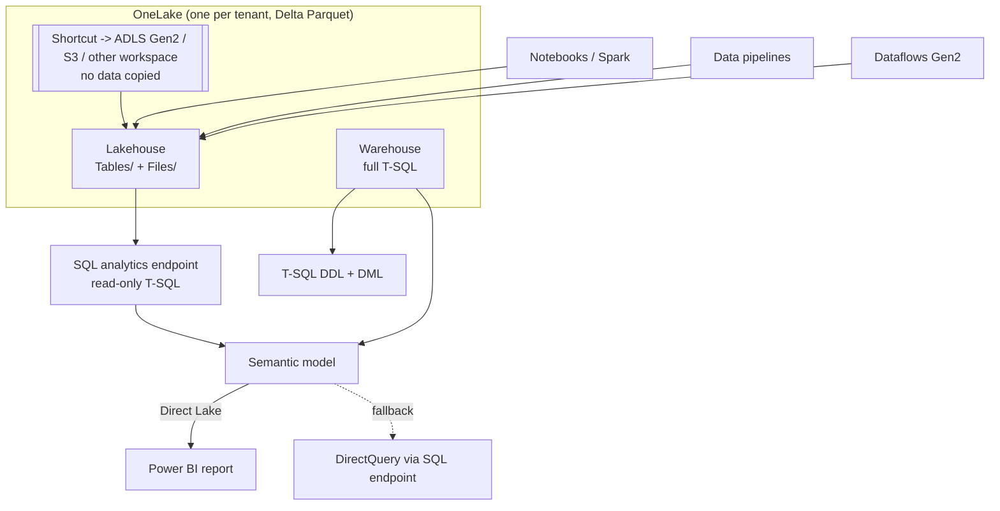

# Fabric Lakehouse Coach

Fabric is a **SaaS lakehouse**: one lake, many engines, one capacity paying for all of them. Teach it as
those three ideas plus their consequences, the way [`AGENTS.md`](../../../AGENTS.md) prescribes. The
vendor-neutral design lesson lives in [`lakehouse-designer`](../lakehouse-designer/SKILL.md); the format
mechanics in [`delta-lake-lab`](../delta-lake-lab/SKILL.md).

## When to use

- The learner must pick **Lakehouse or Warehouse** and cannot yet say what they actually lose either way.
- A Direct Lake report is slow or inconsistent and nobody has checked whether it fell back to DirectQuery.
- They are copying data between workspaces when a **shortcut** would have done, or vice versa.
- Capacity is throttling and the team is guessing at the SKU instead of reading the metrics app.

## First principles: one lake, many engines, one meter

Every Fabric item stores its data in **OneLake** — one logical data lake per tenant — in **Delta Parquet**.
Because the storage format is shared, an engine choice is *not* a storage choice: Spark, T-SQL, KQL, and the
Power BI engine read the same files. That is the whole architectural bet, and it is why "copy it into the
warehouse first" is usually the wrong instinct here.



| Decision | Lakehouse | Warehouse |
| --- | --- | --- |
| T-SQL surface | Full DQL, **no DML**, limited DDL (views, TVFs) on the SQL analytics endpoint | Full DQL, DML and DDL |
| Writes | Spark, pipelines, dataflows, shortcuts | T-SQL (`INSERT`/`UPDATE`/`MERGE`, stored procedures) |
| Transactions | Delta table-level ACID | Multi-table transactions in T-SQL |
| Delta tables | Reads and writes | Reads and writes |
| Who it suits | Data engineers, mixed/unstructured data, medallion bronze–silver | SQL developers, governed gold layer and BI |
| Files besides Delta | `Files/` holds anything; only Delta appears in the SQL endpoint | Delta only |

(Microsoft Learn, *Fabric decision guide: choose between Warehouse and Lakehouse*, and *What is a lakehouse
in Microsoft Fabric?*.) Many teams run both: Lakehouse to ingest and transform, Warehouse to serve.

| Semantic model mode | Data movement | Freshness | Cost / risk |
| --- | --- | --- | --- |
| **Import** | copies into VertiPaq memory | as of last refresh | refresh window + duplicate storage |
| **DirectQuery** | none | live | every visual is a SQL query; slowest |
| **Direct Lake** | none — reads the Delta files into memory on demand | as of the last **framing** (refresh) | best of both, but bound by capacity guardrails |

**Direct Lake fallback** is the concept that catches everyone. *Direct Lake on SQL endpoints* can silently
fall back to DirectQuery when a table isn't framed, is built on an unmaterialized SQL view, has SQL-side RLS
/ dynamic data masking / OLS, or when the table exceeds the SKU's guardrails (Parquet file count, row-group
count, row count). *Direct Lake on OneLake* runs `DirectLakeOnly` and does **not** fall back — it errors
instead. The `DirectLakeBehavior` property (`Automatic`, `DirectLakeOnly`, `DirectQueryOnly`) lets you make
fallback loud in development and forgiving in production (Microsoft Learn, *How Direct Lake works —
DirectQuery fallback*).

## Procedure

1. **Establish the goal**: workload (ingest / transform / serve), data shapes, freshness SLA, who writes
   SQL, and who pays for the capacity. Everything below is downstream of these four answers.
2. **Place the data in OneLake once.** Land raw into a Lakehouse `Files/`, promote curated Delta into
   `Tables/`. Fabric auto-registers Delta tables placed under `Tables/` — no manual `CREATE TABLE`.
3. **Ask "shortcut or copy?" before every movement.** A **shortcut** references data in another workspace,
   ADLS Gen2, or S3 with **no copy**, so there is one version of the truth and no sync job. Copy only when
   you need a different layout, a different retention policy, or isolation from an upstream owner.
4. **Choose Lakehouse vs Warehouse from the table above** — decide on *who writes* and *whether you need
   T-SQL DML and multi-table transactions*, not on which word sounds more enterprise.
5. **Design the medallion layers** (bronze raw → silver conformed → gold modelled). Model gold with
   [`data-warehouse-modeling`](../data-warehouse-modeling/SKILL.md); star schemas are what Direct Lake and
   DAX are built for.
6. **Pick the ingestion tool honestly**: **Data pipelines** for orchestration and large copy activities,
   **Dataflows Gen2** for low-code Power Query transforms, **notebooks/Spark** for scale and complex logic,
   **mirroring** for near-real-time replicas of an operational database. Don't build the same hop twice.
7. **Choose the semantic model mode** and then *defend* it. If Direct Lake: run `EVALUATE TABLETRAITS()`,
   read `[DirectLakeFallbackInfo]` per table, and fix every non-`None` value before declaring success.
8. **Optimize the Delta tables for Direct Lake**: `OPTIMIZE` and `VACUUM` to cut Parquet-file and row-group
   counts, keep V-Order on, prefer integer keys over strings, and reduce cardinality. This is the cheapest
   alternative to buying a bigger SKU (Microsoft Learn, *Understand Direct Lake query performance*).
9. **Size the capacity from evidence.** F SKUs sell capacity units that are shared by *every* workload in
   the tenant's capacity; use the **Fabric Capacity Metrics** app to see consumption, smoothing, and
   throttling before resizing. Pause dev capacities when idle — that is real money.
10. **Govern it**: workspace roles + item permissions, sensitivity labels, and domains. For the Databricks
    equivalent of catalog-level governance, contrast with
    [`unity-catalog-coach`](../unity-catalog-coach/SKILL.md).
11. **Close with the trade-offs** the learner must be able to restate unprompted: shortcut vs copy, engine
    freedom vs T-SQL DML, Direct Lake speed vs guardrails, shared capacity vs isolated cost.

## Output shape

```
Fabric design — <workload> · freshness SLA: <x> · authors: <SQL | Spark | both>

OneLake layout:  ws/<workspace>/<lakehouse>.Lakehouse/{Files,Tables}
Shortcuts:       <target> -> <ADLS Gen2 | S3 | workspace X>  (no copy; single source of truth)
Store choice:    Lakehouse | Warehouse | both — because <T-SQL DML? multi-table txn? Spark?>
Medallion:       bronze <...> -> silver <...> -> gold <star schema>
Ingestion:       pipelines <copy/orchestrate> · dataflows gen2 <low-code> · notebooks <scale> · mirroring <CDC>

Semantic model:  Direct Lake (on OneLake | on SQL) | Import | DirectQuery — why: <...>
  Fallback check: EVALUATE TABLETRAITS() -> DirectLakeFallbackInfo = <None | reason per table>
  Fixes applied:  frame after load · materialize views · move RLS to model · OPTIMIZE/VACUUM
Capacity:        F<SKU> · metrics app: CU <n>% · throttling <y/n> · pause dev when idle

Trade-offs: shortcut vs copy · engine freedom vs T-SQL DML · Direct Lake speed vs guardrails
Next: lakehouse-designer | data-warehouse-modeling | unity-catalog-coach
```

## Tips

- Only **Delta** tables appear in the SQL analytics endpoint — a CSV or plain Parquet dropped in `Files/`
  will never show up in T-SQL. Convert to Delta first.
- The lakehouse SQL analytics endpoint is **read-only**: no `INSERT`/`UPDATE`/`MERGE`. If a stakeholder
  needs T-SQL writes, they need a Warehouse, and finding that out at UAT is expensive.
- A single table over guardrails drops the **whole model** out of Direct Lake mode — always diagnose
  per-table, not per-report.
- Set `DirectLakeBehavior = DirectLakeOnly` in development so fallback fails loudly, and `Automatic` in
  production so users keep working. Measuring fallback cost is what `DirectQueryOnly` is for.
- **Frame after every load.** A semantic model that was not refreshed after the Delta write shows stale data
  or falls back — this is the single most common Direct Lake support ticket.
- Capacity is shared and smoothed across workloads; one runaway Spark notebook throttles everyone's reports.
  Watch the metrics app before adding an SKU.
- Cross-link onward: [`delta-lake-lab`](../delta-lake-lab/SKILL.md) for the file format under OneLake,
  [`spark-job-coach`](../spark-job-coach/SKILL.md) for notebook performance,
  [`dbt-model-coach`](../dbt-model-coach/SKILL.md) for the transformation layer, and
  [`data-contract-designer`](../data-contract-designer/SKILL.md) for upstream guarantees.
- End with the **Learning Footer** (`AGENTS.md`) — one fallback cause the learner must diagnose unaided, and
  one shortcut-vs-copy call for them to justify.
