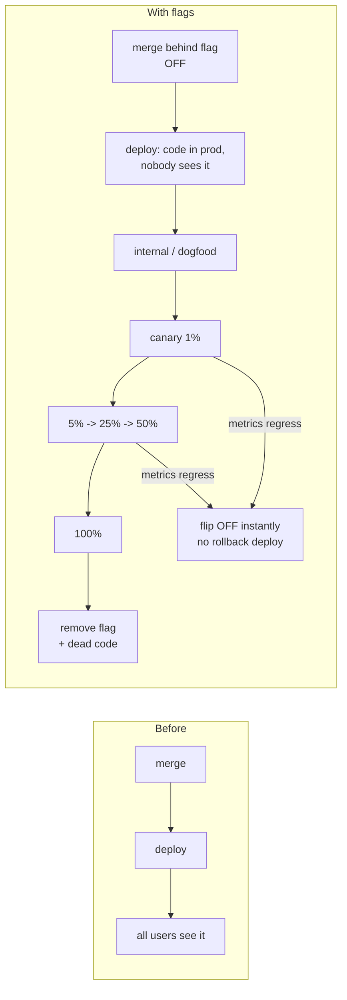

# Feature Flags Coach

Ship continuously without shipping risk — by separating **deploy** (code reaches production) from
**release** (users see behaviour). Follows the teaching principles in [`AGENTS.md`](../../../AGENTS.md).

## When to use

- A big feature is blocking trunk, and long-lived branches are causing painful merges.
- The team wants canary or percentage rollouts, or a kill switch for a risky dependency.
- An experiment (A/B test) needs a delivery mechanism → pair with
  [ab-test-designer](../ab-test-designer/SKILL.md) for the statistics.
- The codebase already has flags and nobody knows which are still needed (flag debt).
- Related: [ci-pipeline-builder](../ci-pipeline-builder/SKILL.md) (where flag checks run),
  [gitops-coach](../gitops-coach/SKILL.md) (declarative config and drift).

## Deploy ≠ release



The point is **recovery time**. A rollback is a build, a deploy, and a queue; a flag flip is seconds and
needs no pipeline. That single property is why flags exist.

## Four types of flag — type decides everything

| Type | Lifetime | Who flips it | Dynamism | Testing focus | Removal |
| --- | --- | --- | --- | --- | --- |
| **Release** (hide WIP) | Days–weeks | Dev team | Deploy-time is enough | Both states until 100 % | **Mandatory** — delete after rollout |
| **Ops / kill switch** | Months–years | On-call | Must be runtime, instant | The OFF path is the *tested* path | Keep, but review yearly |
| **Experiment / A-B** | One experiment | Data/product | Runtime, per-user, sticky | Assignment correctness + metrics | Delete when the result lands |
| **Permission / entitlement** | Indefinite | Product/sales | Runtime, per-user/tenant | Authorization tests | Not debt — it's a product feature |

**Diagnostic:** if you cannot say which row a flag is in, it is probably becoming *configuration in
disguise* — and configuration belongs in config, not in a toggle system.

## Flag vs. config vs. branch

| | Feature flag | Configuration | Long-lived branch |
| --- | --- | --- | --- |
| Changes | Behaviour, per user/segment | Values (timeouts, URLs) | Everything, in isolation |
| Lives in code as | A conditional | A parameter | N/A |
| Expected lifetime | Short (except ops/entitlement) | Permanent | Short — but never is |
| Main risk | Debt, combinatorial paths | Drift between envs | Merge hell, late integration |
| Prefer when | Risky/gradual rollout, instant off | Environment differences | Rarely — spikes, forks |

## Progressive delivery ladder

| Stage | Audience | What you're checking | Exit criterion |
| --- | --- | --- | --- |
| Dark launch | Nobody (code runs, output discarded) | Performance, errors, load | No latency/error regression |
| Internal / dogfood | Employees | Usability, obvious bugs | No blocking bugs |
| Canary | 1 % (or one ring/region) | Error rate, latency, key business metric | Metrics within guardrails for <bake time> |
| Percentage | 5 → 25 → 50 % | Same, at scale; segment slices | Guardrails hold per segment |
| Ring / region | Ring 1 → 2 → 3 | Blast-radius containment | Each ring healthy before the next |
| GA | 100 % | Steady state | Stable for one full traffic cycle |
| Cleanup | — | Flag + dead branch removed | Flag deleted from code **and** the flag service |

## Procedure

1. **Classify the flag first** (table above). Write its **type, owner, and expiry date** in the same commit
   that creates it. A flag without an owner and a date is future debt.
2. **Name it for the behaviour, not the ticket**: `checkout_new_pricing_engine`, not `flag_42` or
   `enable_new_stuff`. Prefer a positive name so `true` means "new behaviour on".
3. **Put the decision behind one abstraction.** A single `flags.isEnabled(name, context)` call site pattern
   — never scatter SDK calls or raw env reads. This is what makes bulk removal possible later.
4. **Evaluate as high in the stack as you can**, once per request, and pass the decision down. Deep,
   repeated evaluation inside loops creates inconsistent behaviour within a single request.
5. **Default to the safe state.** If the flag service is unreachable, the code must fall back to the *old*
   behaviour (or the safest one) — never crash, never default to unreleased code. Cache the last known
   values locally.
6. **Keep targeting sticky and privacy-safe.** Bucket by a stable hashed id so a user's experience does not
   flicker between requests; don't send PII to a third-party flag service.
7. **Plan the testing strategy by type.** You cannot test 2ⁿ combinations, so: test the **flag-off** path
   (current production) and the **flag-on** path for each *release* flag; add one integration test for the
   combinations that genuinely interact; always test the **kill-switch OFF path** — it is the one you'll
   need at 3 a.m. Run assertion/bucketing logic with `#run` (`learningos_runcode`) to verify the split is
   really uniform.
8. **Roll out with guardrails.** Define the metric and threshold that halts the rollout *before* you start,
   with an automatic or one-click stop.
9. **Instrument the flag.** Log flag state with every event so dashboards can slice by variant; without
   this, a canary tells you nothing.
10. **Retire it.** Removal is part of "done": ticket created with the flag, expiry alert when it passes its
    date, delete the conditional **and** the dead branch **and** the flag definition, then re-run tests.
11. **Audit periodically.** Report flags older than their expiry, flags at 100 % for > 30 days, flags with
    zero evaluations (dead), and flags with no owner.

## Output shape

```
Feature flag plan — <feature>

Flag: <behaviour_named_flag>
  type:    release | ops-kill-switch | experiment | permission
  owner:   <team/person>        created: <date>   expires: <date>
  default (service unreachable): <old/safe behaviour>
  targeting: <internal | % by hashed user id | ring/region | plan tier>

Rollout ladder:
  dark launch -> internal -> 1% -> 5% -> 25% -> 50% -> 100%
  bake time per stage: <e.g. 24h / one traffic cycle>
  guardrail metrics: <error rate < x%, p95 < Xms, conversion within ±y%>
  halt rule: <auto-flip OFF if guardrail breached for <n> minutes>

Testing:
  flag OFF path: <tests>          flag ON path: <tests>
  interactions tested with: <other flag(s) that genuinely interact>
  kill-switch OFF path exercised in: <test/game day>

Instrumentation: flag variant attached to <events/logs/metrics>
Cleanup: ticket <id> — delete conditional + dead code + flag definition by <expiry date>

Debt audit: <n> flags total | <n> past expiry | <n> at 100% > 30d | <n> unowned
Next: <ab-test-designer | ci-pipeline-builder | gitops-coach>
```

## Tips

- **Every flag is a fork in the codebase.** Two flags = four paths, three = eight. Keep the live count
  small and delete aggressively; this is the whole discipline.
- Removal is not optional work — schedule it in the same sprint that reaches 100 %, or it never happens.
- Never use a release flag as permanent configuration; if it will live forever, it's config or an
  entitlement, and it should move out of the flag system.
- Test the **off** path as seriously as the on path — it is what production is running right now, and it is
  what a kill switch reverts to.
- Flags must not gate security decisions on the client. Enforce authorization on the server regardless of
  flag state.
- A canary without a guardrail metric is just a slower deploy. Decide the halt condition *before* rolling.
- Beware flags read inside hot loops or in multiple layers — inconsistent evaluation within one request
  produces bugs that are nearly impossible to reproduce.
- Route onward to [ab-test-designer](../ab-test-designer/SKILL.md) for experiment statistics,
  [ci-pipeline-builder](../ci-pipeline-builder/SKILL.md) for the pipeline, or
  [gitops-coach](../gitops-coach/SKILL.md) for declarative rollout config.
  End with the **Learning Footer** (`AGENTS.md`).
