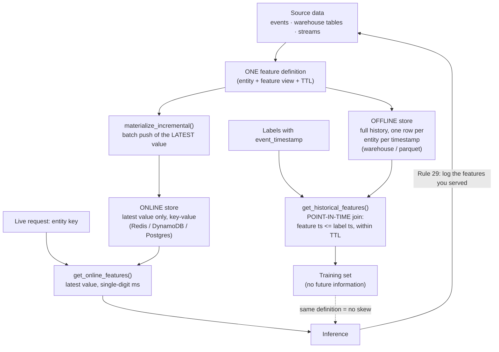

# Feature Store Coach

Most "the model works offline but not in production" incidents are not model problems. They are **two
problems with names**: a leaky join that let future information into training, and a skew between the code
that computed features for training and the code that computes them at serving time. A feature store is one
way to solve both — and often not the cheapest one. This skill teaches the diagnosis before the tool, in the
first-principles spirit of [`AGENTS.md`](../../../AGENTS.md).

## When to use

- Offline evaluation looks excellent and production performance is materially worse, with no obvious drift.
- The same feature (`customer_7d_spend`) is implemented twice — once in a training notebook, once in the
  serving service — and the two definitions have quietly diverged.
- Several teams or models need the same features and each is rebuilding them.
- You need sub-100 ms feature lookup at request time from data that is computed in batch.
- You are writing training data and are not certain your join is point-in-time correct.
- **Don't use it for** a single model with a single team where one SQL view feeds both training and serving —
  that is a table, and a table is a perfectly good answer. **Don't use it** to fix data quality (that is
  [data-quality-checker](../data-quality-checker/SKILL.md)), to replace a warehouse, or to make bad features
  good. And don't adopt one before you can name at least two of: multiple consumers, online/offline split,
  point-in-time complexity.

## First principles: two failure modes, one shared cause

**Primary sources.** The term and the pattern come from Uber's **Michelangelo** platform ("Meet
Michelangelo: Uber's Machine Learning Platform", Uber Engineering blog, **September 2017**), which introduced
a shared offline/online feature store to eliminate skew. **Feast** (`docs.feast.dev`,
`github.com/feast-dev/feast`, Apache 2.0) is the reference open-source implementation, with the core API
`FeatureStore.get_historical_features()` (point-in-time correct, for training) and
`FeatureStore.get_online_features()` (latest values, for inference), bridged by
`materialize_incremental()`. Google's **"Rules of Machine Learning"** (Martin Zinkevich, Google Developers
ML Guide) states the operational rule directly — Rule #29: *"the best way to make sure that you train like
you serve is to save the set of features used at serving time, and then pipe those features to a log to use
them at training time."* The data-validation view is Breck et al., *"Data Validation for Machine Learning"*
(**MLSys 2019**). ⚠ Feast's provider set, storage backends, and CLI evolve — **verify on `docs.feast.dev`
before pinning a design to a specific backend.**

**Failure mode 1 — label leakage from a non-point-in-time join.** Your feature table has one row per entity
per update. Your label has a timestamp. If you join on the entity key alone, you attach *today's* feature
value to *last month's* label. The model learns from the future, evaluation is spectacular, production is
random. The fix is an **as-of join**: for each label at time $t$, take the most recent feature value with
timestamp $\le t$.

$$f_i(t) \;=\; f\bigl(e_i,\; \max\{\,\tau : \tau \le t\,\}\bigr) \qquad \text{never } \max\{\tau\} \text{ overall}$$

**Failure mode 2 — training/serving skew.** Training features come from a SQL/Spark job over history;
serving features come from application code over a live request. Two implementations, two languages, two
authors, one silent divergence. The store's real contribution is that **one definition serves both paths**.



*Figure — the point of a feature store is the dotted line: one definition feeding both the point-in-time
training join and the low-latency serving lookup.*

| | Offline store | Online store |
| --- | --- | --- |
| Contains | full history, every version of every feature | **latest value only**, per entity |
| Read pattern | large scans, joined as-of a label timestamp | single-key lookup by entity ID |
| Latency budget | minutes | **single-digit milliseconds** |
| Typical backing | warehouse, Parquet/Delta on object storage | Redis, DynamoDB, Cassandra, Postgres |
| Consistency need | point-in-time correctness | freshness (bounded by materialisation cadence + TTL) |
| Serves | training, batch scoring, backfills | real-time inference |

| Symptom | Diagnosis | Cheapest real fix |
| --- | --- | --- |
| Great offline, poor online, no drift | leaky join or skew | as-of join + log served features (Rule #29) |
| Two definitions of one feature | skew | one definition, both paths — a shared view may suffice |
| Batch features needed at request time in ms | offline/online gap | a materialised cache; a store if there are many |
| Five teams recomputing the same feature | discovery/reuse | a registry and shared definitions — this is the real feature-store case |
| Features are stale at inference | materialisation cadence or TTL | shorten cadence, or compute on-demand at request time |

**When you genuinely need one:** two or more of {multiple models/teams consuming shared features, an
online/offline split with a real latency budget, non-trivial point-in-time semantics, a need for
discoverability and lineage}. **When you don't:** one model, one team, batch scoring, and a SQL view both
paths already share. The store is not free — it adds a registry, a materialisation job, an online datastore,
and a new class of staleness incident.

## Procedure

1. **Diagnose before you procure.** Which failure are you actually having — leakage, skew, latency, or
   reuse? Each has a different cheapest fix, and only "reuse + online/offline" really argues for a store.
2. **Audit your current training join for leakage.** Take one feature and one label row; hand-check that the
   attached feature value existed *before* the label timestamp. This ten-minute check finds more real bugs
   than any tool.
3. **Define entities and event timestamps explicitly.** Every feature row needs an entity key and the
   timestamp at which that value **became true** (not when it was written — record both if they differ).
4. **Write the point-in-time join.** In pandas, `merge_asof` with `direction="backward"`, a `by=` entity key,
   and — critically — a `tolerance` that encodes the feature's TTL:
   ```python
   pd.merge_asof(labels.sort_values("event_timestamp"),
                 features.sort_values("event_timestamp"),
                 on="event_timestamp", by="entity_id",
                 direction="backward", tolerance=pd.Timedelta("7D"))
   ```
   Both frames must be sorted by the `on` key or the result is silently wrong.
5. **Decide the freshness contract per feature**: how stale may this value be at inference? That single
   number determines materialisation cadence, TTL, and whether the feature can be batch at all.
6. **If a store is justified, model it in Feast** — entity, data source, feature view with a TTL, feature
   service:
   ```powershell
   pip install "feast"
   feast init my_store; cd my_store\feature_repo
   feast apply                       # registers entities + feature views
   feast materialize-incremental $(Get-Date -AsUTC -Format "yyyy-MM-ddTHH:mm:ss")
   ```
   ```python
   from feast import FeatureStore
   store = FeatureStore(repo_path=".")
   training_df = store.get_historical_features(          # POINT-IN-TIME correct
       entity_df=labels, features=["driver_stats:conv_rate", "driver_stats:acc_rate"]).to_df()
   online = store.get_online_features(                    # latest value, ms latency
       features=["driver_stats:conv_rate"], entity_rows=[{"driver_id": 1001}]).to_dict()
   ```
7. **Prove no skew with a parity test.** For a sample of entities, compute the feature both ways and assert
   equality within tolerance. Run it in CI — this is the test that keeps the promise.
8. **Log the features actually served** (Rule #29) and train on those logs where you can. It is the only
   approach that makes skew structurally impossible rather than merely discouraged.
9. **Monitor the store like a service**: materialisation lag, online-store hit rate, null rate at serving,
   and per-feature freshness. Stale features degrade a model exactly like drift and look identical on a
   metrics chart — [model-monitoring-coach](../model-monitoring-coach/SKILL.md).
10. **Document each feature's owner, definition, TTL, and consumers.** Then close with the **Learning
    Footer**.

## Output shape

```
Diagnosis: <leakage | skew | online latency | reuse>   Evidence: <offline metric vs online metric, gap=<..>>
Verdict: <feature store justified because <2+ reasons> | NOT justified — use <shared view / cache> because ...>
Entities: <name: key columns>        Event timestamp column: <name> (became-true, not write time)
Feature views:
  <view> · source=<table/stream> · features=<...> · TTL=<..> · freshness contract=<max staleness>
  · offline=<warehouse/parquet> · online=<redis/dynamo/postgres> · materialisation cadence=<..>
Point-in-time join: <merge_asof / get_historical_features> · direction=backward · tolerance=<TTL>
  Leakage check: <label ts> vs <feature ts> on <n> sampled rows -> <all feature_ts <= label_ts: yes/no>
Skew parity test: <n> entities · max abs diff=<..> · location=<tests/test_feature_parity.py>  [pass|FAIL]
Serving: p99 online lookup=<..> ms · hit rate=<..%> · null rate=<..%> · materialisation lag=<..>
Rule #29 logging: <enabled? where the served features are written>
Owners: <feature -> owner/team>      Consumers: <model -> features>
Next: <data-contract-designer | model-monitoring-coach | ml-pipeline-designer>
Learning Footer
```

## Worked example — the join that leaks, side by side with the one that doesn't

No feature store, no infrastructure: pandas is enough to show the bug that costs the most model-months.
Driver `1001` has a conversion rate that climbs 0.10 → 0.55 → 0.90 over January. A label event happened on
6 January, when the true feature value was **0.55**.

```python
# pip install pandas
import pandas as pd

features = pd.DataFrame({
    "driver_id": [1001, 1001, 1001, 1002, 1002],
    "event_timestamp": pd.to_datetime([
        "2026-01-01 00:00", "2026-01-05 00:00", "2026-01-09 00:00",
        "2026-01-02 00:00", "2026-01-08 00:00"]),
    "conv_rate": [0.10, 0.55, 0.90, 0.20, 0.80],
}).sort_values("event_timestamp")            # merge_asof REQUIRES this sort

labels = pd.DataFrame({
    "driver_id": [1001, 1002],
    "event_timestamp": pd.to_datetime(["2026-01-06 12:00", "2026-01-03 09:00"]),
    "y": [1, 0],
}).sort_values("event_timestamp")

# CORRECT — as-of join: newest feature value at or before the label's timestamp, within a 7-day TTL
pit = pd.merge_asof(labels, features, on="event_timestamp", by="driver_id",
                    direction="backward", tolerance=pd.Timedelta("7D"))
print("point-in-time correct:\n", pit.to_string(index=False))

# WRONG — "just grab the latest value", the single most common ML data bug
leaky = labels.merge(features.groupby("driver_id", as_index=False).conv_rate.last(), on="driver_id")
print("leaky (latest value):\n", leaky.to_string(index=False))
```

Traced output (verified by running it):

```
point-in-time correct:
 driver_id     event_timestamp  y  conv_rate
      1002 2026-01-03 09:00:00  0       0.20
      1001 2026-01-06 12:00:00  1       0.55

leaky (latest value):
 driver_id     event_timestamp  y  conv_rate
      1002 2026-01-03 09:00:00  0        0.8
      1001 2026-01-06 12:00:00  1        0.9
```

Walk through what the leaky join did, because the damage is subtler than "wrong number":

- Driver `1001`'s label is on **6 January**. The point-in-time join correctly picks the 5 January value,
  **0.55** — the last thing that was true when the label event happened. The leaky join picks **0.90**,
  recorded on **9 January, three days after the outcome.**
- The same happens for `1002`: 0.20 (correct, 2 Jan) versus 0.80 (from 8 Jan, five days late).
- Notice the *direction* of the corruption. In both rows the future value is closer to the eventual outcome
  than the past value was — because the feature and the label are driven by the same underlying process.
  **The leak is correlated with the label**, so the model does not merely get noisier: it learns a
  near-oracle feature and reports a spectacular offline AUC. At serving time that value does not exist yet,
  so the model degrades to something near chance and nobody can find a distribution shift to blame.
- The `tolerance=7D` argument is the TTL doing real work: if `1001`'s only prior observation had been from
  1 December, `merge_asof` would emit `NaN` rather than silently attaching a five-week-old value. A `NaN`
  you can see is infinitely better than a stale number you can't — and it maps directly to Feast's feature
  view TTL.

The Feast equivalent of the correct block is one call — `store.get_historical_features(entity_df=labels,
features=[...])` — which performs exactly this as-of join against the offline store using the feature view's
TTL. That is precisely the value proposition: *the correct join, by default, for every consumer.* If you have
one model and one team, the six lines of `merge_asof` above are also a completely legitimate answer.

## Tips

- **The leak is always "correlated with the label", never random.** That is why leaky training produces
  *better*-looking offline metrics — treat an unexpectedly good AUC as a bug report, not a result.
- **Sort before `merge_asof` and always pass `tolerance`.** Unsorted input produces silently wrong rows, and
  no tolerance means an arbitrarily old value gets attached with no signal that it happened.
- **Record when a value *became true*, not when the row was written.** Late-arriving data with a write
  timestamp reintroduces the leak through the back door; keep both columns if the pipeline can be late.
- **The online store holds the latest value, so it is stale by construction.** Materialisation cadence plus
  TTL *is* your freshness contract — write it down per feature and alert on materialisation lag.
- **Log the features you served (Rule #29).** Training on served-feature logs makes skew structurally
  impossible; every other approach relies on two implementations staying in agreement forever.
- **Streaming features need push, not batch materialisation.** If the freshness contract is seconds, a
  nightly job cannot satisfy it — see [streaming-pipeline-designer](../streaming-pipeline-designer/SKILL.md)
  and [stream-windowing-coach](../stream-windowing-coach/SKILL.md).
- **A shared SQL view plus Redis is a legitimate feature store** for one team. Adopt the platform when
  reuse and discovery are the pain, not before.
- Related: [feature-engineering-coach](../feature-engineering-coach/SKILL.md),
  [ml-pipeline-designer](../ml-pipeline-designer/SKILL.md),
  [data-contract-designer](../data-contract-designer/SKILL.md),
  [data-warehouse-modeling](../data-warehouse-modeling/SKILL.md),
  [redis-local-lab](../redis-local-lab/SKILL.md),
  [model-monitoring-coach](../model-monitoring-coach/SKILL.md), and
  [model-serving-lab](../model-serving-lab/SKILL.md) for the request-time budget.
  End with the **Learning Footer** (`AGENTS.md`).
