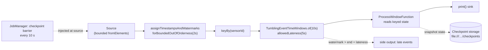

# Flink Local Lab

Stream processing learned by running it: this lab boots Flink **inside your JVM** (the MiniCluster), so
every concept — event time, watermarks, keyed state, checkpoints — is observable offline in seconds.
Follows the hands-on, verify-before-you-teach rule in [`AGENTS.md`](../../../AGENTS.md).

## When to use

- You want real Flink experience without provisioning a cluster, a broker, or a cloud account.
- Watermarks and "why did my window not fire?" need to be *seen*, not read about.
- You are about to write production Flink and want the state/checkpoint model in your fingers first.
- **Don't use it for** SQL-only exploration — that's [flink-sql-lab](../flink-sql-lab/SKILL.md); or for
  choosing window semantics in the abstract — that's
  [stream-windowing-coach](../stream-windowing-coach/SKILL.md).

## First principles: time, state, and a snapshot that makes them exactly-once

The Flink documentation ("Timely Stream Processing", "Working with State", "Checkpointing") defines three
independent ideas. **Event time** is the timestamp in the record; **watermarks** are the runtime's assertion
that no event with timestamp ≤ *W* should still arrive; **keyed state** is per-key memory that Flink
snapshots. Checkpointing uses *asynchronous barrier snapshotting* (Carbone et al., "Lightweight
Asynchronous Snapshots for Distributed Dataflows", 2015), a Chandy–Lamport descendant: barriers flow with
the data, and each operator snapshots when barriers from all inputs have arrived.



| State primitive (keyed) | Shape | Typical use |
| --- | --- | --- |
| `ValueState<T>` | one value per key | running total, last-seen reading, dedup flag |
| `ListState<T>` | append-only list per key | buffer events until a timer fires |
| `MapState<K,V>` | map per key | per-sub-key counters without exploding the key space |
| `ReducingState<T>` / `AggregatingState<IN,OUT>` | incrementally folded value | memory-cheap aggregates |

| State backend | Where state lives | Choose when |
| --- | --- | --- |
| `HashMapStateBackend` (default) | JVM heap of the TaskManager | state fits in memory; lowest latency — right for this lab |
| `EmbeddedRocksDBStateBackend` | local RocksDB on disk, spillable | state larger than heap; supports incremental checkpoints |

Checkpoint storage is configured **separately** from the backend (`setCheckpointStorage(...)`), a split
that trips up nearly everyone the first time.

## Procedure

1. **Check the JDK** (Flink 1.20 targets Java 11/17; Flink 2.x raised the floor — confirm on the release's
   documentation page before pinning): `java -version && mvn -v`.
2. **Scaffold from the official archetype**, then pre-seed the local repo so later runs are fully offline:
   ```bash
   mvn -q archetype:generate -DinteractiveMode=false \
     -DarchetypeGroupId=org.apache.flink -DarchetypeArtifactId=flink-quickstart-java \
     -DarchetypeVersion=1.20.1 -DgroupId=dev.lab -DartifactId=flink-lab -Dversion=0.1
   cd flink-lab && mvn -q dependency:go-offline
   ```
3. **Make `flink-clients` compile-scoped** in `pom.xml` (the archetype marks it `provided`, which is right
   for cluster submission but prevents local execution), and add `flink-runtime-web` for a local dashboard.
4. **Write the job** (see the worked example) and run it with the embedded MiniCluster — offline:
   ```bash
   mvn -o -q clean package
   mvn -o exec:java -Dexec.mainClass=dev.lab.WindowedSum
   ```
   Swap `getExecutionEnvironment()` for `createLocalEnvironmentWithWebUI(new Configuration())` and browse
   **http://localhost:8081** to watch watermarks, backpressure and checkpoints while the job runs.
5. **Prove event time ≠ processing time**: reorder the input list. The result must not change, because
   windows are assigned from the record timestamp, not arrival order.
6. **Prove watermarks gate the firing**: raise `forBoundedOutOfOrderness` to 30 s and observe windows
   closing later. On a *bounded* source Flink emits a final `Long.MAX_VALUE` watermark at end-of-input, so
   everything fires eventually — to observe genuinely dropped late data, pace the input instead:
   `nc -lk 9999` (WSL/Linux/macOS) feeding `env.socketTextStream("localhost", 9999)`.
7. **Exercise keyed state** with a `KeyedProcessFunction` holding `ValueState<Long>`; register an event-time
   timer with `ctx.timerService().registerEventTimeTimer(...)` and clear state in `onTimer`.
8. **Recover from a checkpoint**: for a standalone cluster, take a savepoint and restart from it —
   ```bash
   ./bin/flink savepoint <jobId> file:///opt/flink-lab/savepoints
   ./bin/flink run -s file:///opt/flink-lab/savepoints/savepoint-xxxx -c dev.lab.WindowedSum target/flink-lab-0.1.jar
   ```
   Flink's launcher scripts are Unix-only (the Windows `.bat` launchers were removed long ago) — on Windows
   use WSL2, or stay with the MiniCluster, which is sufficient for everything in this lab.
9. **Record the observed output** against your prediction, then close with the **Learning Footer**.

## Output shape

```
Goal: <windows | watermarks | keyed state | checkpoints>   Flink: <version>   JDK: <version>
Run mode: <MiniCluster via mvn exec | LocalEnvironmentWithWebUI :8081 | standalone ./bin/start-cluster.sh>
Time semantics: event time from <field> · WatermarkStrategy = forBoundedOutOfOrderness(<d>) [+ withIdleness(<d>)]
Pipeline: source → assignTimestampsAndWatermarks → keyBy(<key>) → <window> → <function> → sink
State: <ValueState|ListState|MapState|Aggregating> · backend = <HashMap|EmbeddedRocksDB>
Checkpointing: interval=<ms> · mode=EXACTLY_ONCE · storage=<file:///…>
Predicted output:
  <key> [<winStart>,<winEnd>) = <value>
Observed output:
  <paste>
Delta explained by: <watermark lag | allowed lateness | out-of-order input | none>
Next: <stream-windowing-coach | flink-sql-lab | kafka-streams-lab>
Learning Footer
```

## Worked example — tumbling event-time sums, traced by hand first

Six readings; tumbling windows of 10 s; 2 s out-of-orderness. Windows are `[start, start+size)`, so
`ts = 13000` lands in `[10000, 20000)`.

| Reading | ts (ms) | key | window | contributes |
| --- | --- | --- | --- | --- |
| 1 | 1 000 | s1 | [0, 10 000) | 1 |
| 2 | 4 000 | s1 | [0, 10 000) | 2 |
| 3 | 13 000 | s1 | [10 000, 20 000) | 3 |
| 4 | 7 000 | s1 | [0, 10 000) | 4 — arrives *after* ts 13 000, still lands in the earlier window |
| 5 | 2 000 | s2 | [0, 10 000) | 9 |
| 6 | 18 000 | s1 | [10 000, 20 000) | 5 |

**Predicted:** `s1 [0,10000) = 7`, `s2 [0,10000) = 9`, `s1 [10000,20000) = 8`.

```java
package dev.lab;

import org.apache.flink.api.common.eventtime.WatermarkStrategy;
import org.apache.flink.api.java.tuple.Tuple3;
import org.apache.flink.runtime.state.hashmap.HashMapStateBackend;
import org.apache.flink.streaming.api.datastream.*;
import org.apache.flink.streaming.api.environment.StreamExecutionEnvironment;
import org.apache.flink.streaming.api.functions.windowing.ProcessWindowFunction;
import org.apache.flink.streaming.api.windowing.assigners.TumblingEventTimeWindows;
import org.apache.flink.streaming.api.windowing.windows.TimeWindow;
import org.apache.flink.util.Collector;
import org.apache.flink.util.OutputTag;
import java.time.Duration;

public class WindowedSum {
  static final OutputTag<Tuple3<String, Integer, Long>> LATE =
      new OutputTag<Tuple3<String, Integer, Long>>("late") {};   // anonymous subclass keeps the generic type

  public static void main(String[] args) throws Exception {
    var env = StreamExecutionEnvironment.getExecutionEnvironment();   // MiniCluster when run from mvn/IDE
    env.setParallelism(1);                                            // deterministic output for the lab
    env.setStateBackend(new HashMapStateBackend());
    env.enableCheckpointing(10_000);                                  // EXACTLY_ONCE is the default mode
    env.getCheckpointConfig().setCheckpointStorage("file:///opt/flink-lab/checkpoints");

    // fromElements is core (no connector jars). Flink >= 1.20 also exposes fromData(...) — check your javadoc.
    DataStream<Tuple3<String, Integer, Long>> src = env.fromElements(
        Tuple3.of("s1", 1, 1_000L),  Tuple3.of("s1", 2, 4_000L),  Tuple3.of("s1", 3, 13_000L),
        Tuple3.of("s1", 4, 7_000L),  Tuple3.of("s2", 9, 2_000L),  Tuple3.of("s1", 5, 18_000L));

    var timed = src.assignTimestampsAndWatermarks(
        WatermarkStrategy.<Tuple3<String, Integer, Long>>forBoundedOutOfOrderness(Duration.ofSeconds(2))
            .withTimestampAssigner((e, recordTs) -> e.f2)
            .withIdleness(Duration.ofSeconds(30)));

    SingleOutputStreamOperator<String> out = timed
        .keyBy(e -> e.f0)
        .window(TumblingEventTimeWindows.of(Duration.ofSeconds(10)))  // pre-1.19: Time.seconds(10)
        .allowedLateness(Duration.ofSeconds(5))
        .sideOutputLateData(LATE)
        .process(new ProcessWindowFunction<>() {
          @Override public void process(String key, Context ctx,
                                        Iterable<Tuple3<String, Integer, Long>> in, Collector<String> o) {
            int sum = 0;
            for (var e : in) sum += e.f1;
            TimeWindow w = ctx.window();
            o.collect(key + " [" + w.getStart() + "," + w.getEnd() + ") = " + sum);
          }
        });

    out.print();
    out.getSideOutput(LATE).print("DROPPED-LATE");
    env.execute("windowed-sum-lab");
  }
}
```

Observed (parallelism 1): `s1 [0,10000) = 7` · `s2 [0,10000) = 9` · `s1 [10000,20000) = 8` — matching the
hand trace. Nothing hits `DROPPED-LATE`, because a bounded source ends with a maximum watermark; that
absence is the lesson, not a bug.

## Tips

- `TaskManagerRunner`/MiniCluster start-up noise is normal; if the job exits instantly with
  `NoClassDefFoundError: ...LocalStreamEnvironment`, `flink-clients` is still `provided` in your `pom.xml`.
- A window that never fires almost always means the watermark never advanced — an idle or single-record
  partition. `withIdleness(...)` is the fix for idle sources; check the watermark in the :8081 UI.
- Keyed state is only available *after* `keyBy(...)`; calling `getRuntimeContext().getState(...)` in a
  non-keyed operator fails at runtime. Flink 2.x also changed `open(Configuration)` to
  `open(OpenContext)` — verify against your version's javadoc rather than copying blindly.
- Checkpoints are for automatic recovery; **savepoints** are for deliberate upgrades. Assign stable
  operator UIDs (`.uid("window-sum")`) or a savepoint will not restore after you edit the job graph.
- Prefer `reduce`/`aggregate` over `ProcessWindowFunction` for large windows — the former folds
  incrementally instead of buffering every element.
- Continue with [stream-windowing-coach](../stream-windowing-coach/SKILL.md),
  [flink-sql-lab](../flink-sql-lab/SKILL.md), [kafka-streams-lab](../kafka-streams-lab/SKILL.md),
  [spark-streaming-lab](../spark-streaming-lab/SKILL.md),
  [streaming-pipeline-designer](../streaming-pipeline-designer/SKILL.md) and
  [schema-evolution-coach](../schema-evolution-coach/SKILL.md). Close with the **Learning Footer**
  (`AGENTS.md`).
