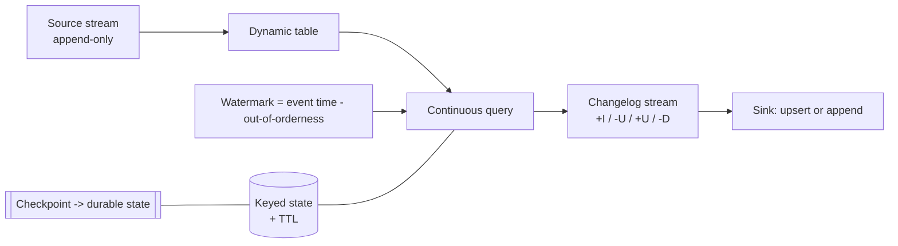

# Flink SQL Lab

Learn stateful stream processing by running it — one SQL Client, a generated stream, and the moment a
watermark fires — following the teach-by-doing principles in [`AGENTS.md`](../../../AGENTS.md). The design
layer above it is [`streaming-pipeline-designer`](../streaming-pipeline-designer/SKILL.md); the batch
counterpart is [`spark-job-coach`](../spark-job-coach/SKILL.md).

## When to use

- The learner can write batch SQL but a *continuous* query with no end still feels like magic.
- Results arrive late, arrive twice, or never arrive — and the cause is watermarks, state, or checkpoints.
- They must choose a join flavour (regular / interval / temporal / lookup) and cannot articulate the cost.
- They are about to run a streaming job in production and have never seen a savepoint or a restore.

## First principles: stream ⇄ table duality

Flink SQL treats a stream as a **dynamic table** — a table that changes over time — and a query over it as a
**continuous query** producing a **changelog stream** (`+I` insert, `-U` update-before, `+U` update-after,
`-D` delete). Everything else follows: an append-only query emits only `+I`; an aggregation without a window
must remember every group forever and emits retractions (Apache Flink docs, *Dynamic Tables*, flink.apache.org).



**Event time vs watermarks** is the concept that pays for the whole lab. Event time is *when it happened*;
the watermark is Flink's assertion that *nothing older than T will arrive*. A window fires when the
watermark passes its end — so a watermark is a deliberate trade of **latency for completeness**. Records
behind the watermark are **late** and dropped unless you allow lateness.

| Construct | SQL shape | State cost | Emits |
| --- | --- | --- | --- |
| Windowed aggregation | `GROUP BY window_start, window_end` over `TABLE(TUMBLE(...))` | bounded — freed when the window fires | `+I` per window, once |
| Unwindowed aggregation | `GROUP BY user_id` | **unbounded** without TTL | retractions (`-U`/`+U`) |
| Regular join | `a JOIN b ON a.k = b.k` | both sides kept **forever** | retractions |
| Interval join | `... AND b.ts BETWEEN a.ts - INTERVAL '1' HOUR AND a.ts` | bounded by the interval + watermark | append |
| Temporal join | `FOR SYSTEM_TIME AS OF a.ts` on a versioned table | versioned dimension only | append |
| Lookup join | `FOR SYSTEM_TIME AS OF a.proc_time` on a JDBC/HTTP table | none (external call, cacheable) | append |

Window TVFs are the modern form: `TUMBLE` (fixed, non-overlapping), `HOP` (sliding, overlapping — cost
multiplies by `size/slide`), and `CUMULATE` (expanding windows for running daily totals).

## Procedure

1. **Start Flink locally, free.** Run the official `flink` Docker image as a jobmanager + taskmanager (or
   unpack the release and `./bin/start-cluster.sh`), then open the SQL Client with `./bin/sql-client.sh`.
   Set `SET 'sql-client.execution.result-mode' = 'tableau';` so results stream to your terminal. Execute
   every statement for real via **`#run` (`learningos_runcode`)** and quote the observed output.
2. **Create a source with no external system.** Use the built-in **`datagen`** connector to fabricate a
   click stream with a timestamp column and a bounded rows-per-second — the whole lab runs offline.
   Add Kafka later using [`kafka-topics-partitions-lab`](../kafka-topics-partitions-lab/SKILL.md).
3. **Declare event time.** Add `WATERMARK FOR event_time AS event_time - INTERVAL '5' SECOND` in the DDL.
   Explain the 5 seconds as the out-of-orderness budget you are buying with latency.
4. **See the duality.** Run `SELECT * FROM clicks` (append-only, `+I` only), then
   `SELECT user_id, COUNT(*) FROM clicks GROUP BY user_id` and watch rows get **retracted and re-emitted**.
   That contrast is the lesson.
5. **Window it.** Rewrite as a tumbling window with the TVF:
   `SELECT window_start, window_end, COUNT(*) FROM TABLE(TUMBLE(TABLE clicks, DESCRIPTOR(event_time), INTERVAL '10' SECONDS)) GROUP BY window_start, window_end;`
   Note each window emits exactly once and its state is then released.
6. **Break it on purpose.** Feed a record whose timestamp is far behind the watermark and confirm it is
   dropped. Then widen the watermark delay and show the same record counted — latency bought completeness.
7. **Swap window types.** Re-run with `HOP` and `CUMULATE`; record how many output rows each produces per
   input row and connect that number to state and sink cost.
8. **Join four ways.** Do a regular join, then convert it to an **interval join**, then a **temporal join**
   against a versioned table, then a **lookup join**. For each one, state what is retained in state and for
   how long. This is the most common production mistake in streaming SQL.
9. **Bound the state you cannot window.** Set `SET 'table.exec.state.ttl' = '1 h';` and explain the trade:
   TTL caps memory but can produce incorrect results when a key returns after expiry.
10. **Make it recoverable.** Enable checkpointing (`SET 'execution.checkpointing.interval' = '10 s';`),
    watch checkpoints complete in the Flink Web UI at `localhost:8081`, then kill the taskmanager and
    restart. Explain that exactly-once end-to-end additionally needs a **transactional or idempotent sink**
    (Apache Flink docs, *Checkpointing* / *Fault Tolerance Guarantees*).
11. **Stop cleanly with a savepoint** and restore from it — the difference between checkpoint (automatic,
    for failure recovery) and savepoint (manual, for upgrades) is the operational takeaway.
12. **Tear down** (`docker compose down`) and summarize the latency/completeness/cost triangle.

## Output shape

```
Flink SQL lab — <stream question> · runtime: docker flink (local, free) · UI: localhost:8081

DDL:      CREATE TABLE clicks (... , WATERMARK FOR event_time AS event_time - INTERVAL '5' SECOND)
          WITH ('connector' = 'datagen', 'rows-per-second' = '<n>')

Duality:  SELECT *              -> +I only
          GROUP BY user_id      -> -U/+U retractions, state UNBOUNDED
Window:   TUMBLE 10s            -> window_start/window_end, 1 emit per window, state released
Late data:record at wm-<n>s     -> DROPPED | after widening watermark -> COUNTED
Window mix: TUMBLE <rows> · HOP(size/slide=<k>) <rows> · CUMULATE <rows>

Joins:    regular  -> state both sides FOREVER
          interval -> bounded by INTERVAL '<x>' + watermark
          temporal -> FOR SYSTEM_TIME AS OF <ts>, versioned dim only
          lookup   -> FOR SYSTEM_TIME AS OF proc_time, external call (+cache)
State TTL: table.exec.state.ttl = <d>  (risk: returning key sees empty state)

Checkpoints: interval=<s>s · completed=<n> · restore after kill -> resumed at <ts>
Savepoint:   <path> -> restored job <id>

#run checks: <statement -> real output -> PASS/FAIL>
Trade-off:   latency <-> completeness <-> state cost
Next: streaming-pipeline-designer | schema-registry-lab | kafka-streams-lab
```

## Tips

- If you cannot say what is in state and when it is released, the query is not production-ready. Every
  streaming bug budget goes to unbounded state.
- Watermarks are per-partition and the operator takes the **minimum**: one idle source partition stalls
  every downstream window. Configure source idleness before blaming Flink.
- `HOP` multiplies output rows by `size / slide`. A 1-hour window sliding every minute is 60× the writes.
- Prefer an interval or temporal join over a regular join whenever the business question has a time bound —
  which is nearly always.
- Checkpoints alone give exactly-once **state**; end-to-end exactly-once also requires a sink that supports
  transactions or idempotent upserts.
- Cross-link onward: [`streaming-pipeline-designer`](../streaming-pipeline-designer/SKILL.md) for topology
  design, [`schema-registry-lab`](../schema-registry-lab/SKILL.md) for the payload contract,
  [`lakehouse-designer`](../lakehouse-designer/SKILL.md) for the sink table, and
  [`data-contract-designer`](../data-contract-designer/SKILL.md) for producer guarantees.
- End with the **Learning Footer** (`AGENTS.md`) — one watermark setting the learner must justify unaided,
  and one join to re-implement with a bounded interval.
