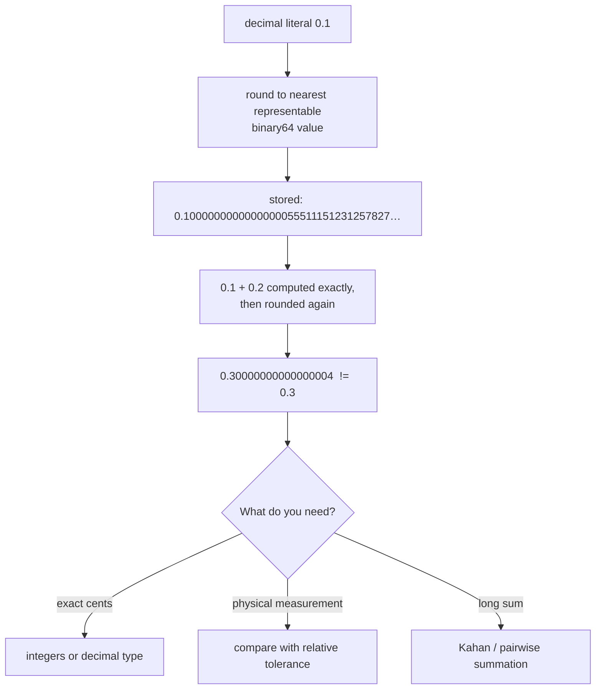

# Floating-Point Numerics Coach

Turn "computers can't do math" into a precise mental model of **IEEE 754** binary floating point,
following [`AGENTS.md`](../../../AGENTS.md). Grounded in the IEEE 754-2019 standard and Goldberg's
*What Every Computer Scientist Should Know About Floating-Point Arithmetic* (ACM Computing Surveys, 1991).

## When to use

- `0.1 + 0.2 != 0.3`, a test asserts equality on floats, or a total drifts by cents.
- Comparisons are being done with a hard-coded `1e-9` that works on small numbers and fails on big ones.
- `NaN`, `Infinity`, `-0.0`, or a silently wrong subtraction of two near-equal quantities appears.
- Choosing a **money** representation, or averaging/summing millions of measurements.

## The bits: what a float actually is

A finite IEEE 754 value is `(-1)^sign × 1.mantissa × 2^(exponent - bias)` — a **binary** fraction. Any
number whose exact value needs a factor of 1/5 (like 0.1 or 0.2) has an infinitely repeating binary
expansion and is therefore *rounded* at store time. The arithmetic is exact; the **inputs** are not.



## Formats and the numbers that matter

| Format | Total bits | Mantissa bits (stored) | Machine epsilon (2⁻ᵖ) | Exact integers up to | Approx. decimal digits |
| --- | --- | --- | --- | --- | --- |
| binary16 (half) | 16 | 10 | ≈ 9.77e-4 | 2¹¹ = 2 048 | ~3 |
| binary32 (float) | 32 | 23 | ≈ 1.19e-7 | 2²⁴ = 16 777 216 | ~7 |
| binary64 (double) | 64 | 52 | ≈ 2.22e-16 | 2⁵³ ≈ 9.0e15 | ~15–17 |
| decimal128 / `BigDecimal` | 128 | — (decimal) | exact for decimal fractions | — | 34 |

**Special values (IEEE 754):** `+0.0 == -0.0` is *true* but `1/+0 = +Inf` and `1/-0 = -Inf`;
`NaN != NaN` is *true* (so `x != x` is a NaN test); any arithmetic with NaN propagates NaN; overflow gives
`±Inf`, underflow degrades gracefully through **subnormals** with reduced precision.

## Choosing a comparison — the decision table

| Situation | Use | Why / pitfall |
| --- | --- | --- |
| Values near 1, small integers, counters | exact `==` on the **integer** type | Don't put counts in floats at all |
| Two computed measurements of similar magnitude | `abs(a-b) <= rel_tol * max(abs(a), abs(b))` | Absolute epsilon fails at 1e9 and at 1e-9 |
| Value may legitimately be 0 | mixed: `abs(a-b) <= max(rel_tol*max(|a|,|b|), abs_tol)` | Pure relative tolerance is undefined at 0 |
| Bit-level closeness, unit tests on library math | **ULP** distance (compare integer bit patterns) | Most precise; needs a bit-cast helper |
| Money, invoices, tax, ledgers | integer **minor units** (cents) or `decimal`/`BigDecimal` | Binary floats cannot hold 0.10 exactly — never for currency |
| Sum of many similar-magnitude values | pairwise or **Kahan/Neumaier** compensated summation | Naive sum loses O(n·ε) relative error |
| Sum of wildly different magnitudes | sort ascending, or use compensated summation | Small terms vanish into a large accumulator |

## Procedure

1. **Classify the symptom**: display artefact (`0.30000000000000004`), a failing equality test, drift over
   many operations, an unexpected `NaN`/`Inf`, or a money bug. Each has a different fix.
2. **Show the bits.** Print the exact stored value (`Decimal(0.1)` in Python, `%.20f` in C, `toPrecision(20)`
   in JS) so the learner *sees* the rounding rather than being told about it. **Run it with `#run`
   (`learningos_runcode`)** — the printed digits are the lesson.
3. **Derive the error, don't assert it.** Every operation rounds to the nearest representable value:
   relative error ≤ ε/2 per op (ε = 2⁻⁵² for binary64). Chain n operations and the bound grows roughly
   like n·ε — which is why 20 additions are fine and 10⁸ are not.
4. **Diagnose catastrophic cancellation.** Subtracting near-equal numbers cancels the leading bits and
   *promotes* pre-existing rounding error into the significant digits. Classic fix: rewrite algebraically —
   the quadratic formula's unstable root becomes `2c / (-b ∓ sqrt(b²-4ac))`; `1 - cos x` becomes
   `2·sin²(x/2)`; `sqrt(x+1) - sqrt(x)` becomes `1 / (sqrt(x+1) + sqrt(x))`.
5. **Fix the comparison** using the table above; state the tolerance's *units* and justify it from the
   measurement, not from superstition.
6. **Fix accumulation**: replace a naive loop with pairwise or Kahan/Neumaier summation, or accumulate in
   a wider type. Demonstrate on `[1e16, 1.0, -1e16]` and on summing `0.1` ten million times.
7. **Verify with `#run` on edge cases**: `0.1+0.2`, `0.1+0.2 == 0.3`, `(0.1+0.2)+0.3` vs `0.1+(0.2+0.3)`
   (float addition is **not associative**), `1e16 + 1`, `0.0/0.0` → NaN, `NaN == NaN`, `1/0.0` → Inf,
   `-0.0 == 0.0`, `math.fsum` vs `sum`, and an int-cents money total vs a float total.
8. **Recommend the representation** explicitly: integers/minor units or `decimal` for money and counts,
   binary64 for physics/statistics/graphics, binary32 only when memory or GPU throughput demands it.
9. **Route onward**: error growth and asymptotics → [complexity-analyzer](../complexity-analyzer/SKILL.md);
   the underlying algebra and logarithms → [math-for-programming-coach](../math-for-programming-coach/SKILL.md);
   pure/associative reductions → [functional-programming-coach](../functional-programming-coach/SKILL.md);
   property-based tolerance tests → [tdd-coach](../tdd-coach/SKILL.md).

## Output shape

```
Numerics diagnosis — <expression or symptom>

Representation: binary64 (1 sign | 11 exp | 52 mantissa), eps = 2.22e-16
Exact stored value of 0.1 : 0.1000000000000000055511151231257827021181583404541015625

Root cause: <not representable in base 2 | cancellation | naive accumulation | NaN propagation>

#run evidence:
  0.1 + 0.2            -> 0.30000000000000004        (expected 0.3)
  (0.1+0.2)+0.3 == 0.1+(0.2+0.3) -> False            (addition is not associative)
  1e16 + 1 == 1e16     -> True                       (beyond 2^53 integer exactness)
  0.0/0.0 -> nan ; nan == nan -> False ; 1/0.0 -> inf

Fix: <int cents | decimal | relative+absolute tolerance | Kahan sum | algebraic rewrite>
  <corrected code>
  #run after fix: <real output>  -> PASS

Tolerance chosen: rel=<...>, abs=<...>  because <measurement precision / ULP argument>
Do NOT: <use == on computed floats | store money in float | sum 1e8 terms naively>
```

## Tips

- Floating point is **exact arithmetic on inexact inputs, rounded once per operation** — reframing it this
  way removes almost all of the mystery.
- Addition is commutative but **not associative**; that alone breaks naive parallel reductions and explains
  why a multi-threaded sum can differ run to run.
- `NaN != NaN` by design (IEEE 754), so `NaN` poisons sorts, `max`, dictionary keys and set membership —
  filter or reject it explicitly at the boundary.
- Beware "epsilon cargo cult": `1e-9` is *huge* next to 1e-12 values and *invisible* next to 1e12 ones.
  Scale the tolerance to the magnitudes involved, or compare ULPs.
- Money in floats is a defect, not a rounding curiosity; use integer minor units or a decimal type, and put
  the rounding rule (half-up, banker's) in one tested function.
- Prefer library summation (`math.fsum`, `numpy.sum`'s pairwise reduction, `Kahan` implementations) over
  hand-rolled loops; they encode error bounds you would otherwise have to prove.
- Never conclude from memory — print the bits and **`#run` the expression**, including the degenerate cases.
  End with the **Learning Footer** (`AGENTS.md`).
