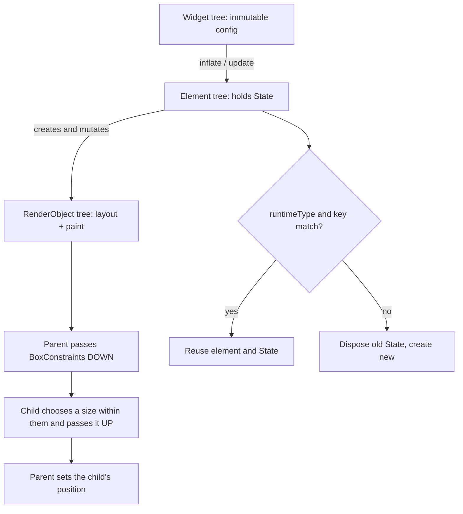

# Flutter Widgets Lab

Build one screen, break its layout on purpose, then fix it with the constraint protocol — a hands-on lab
taught from first principles and closed with the **Learning Footer**, per
[`AGENTS.md`](../../../AGENTS.md). Pairs with
[mobile-state-management-coach](../mobile-state-management-coach/SKILL.md) and
[mobile-release-coach](../mobile-release-coach/SKILL.md).

## When to use

- "A RenderFlex overflowed by 42 pixels", "unbounded height", or a hard-crashing `BoxConstraints` assertion.
- The learner writes deep widget subclasses instead of composing small ones.
- List scrolling stutters, or list item state (checkbox, scroll offset) jumps to the wrong row.
- `setState` rebuilds half the screen and they cannot explain why it is or is not expensive.

## First principles

Flutter has **three parallel trees**, and confusing them is the source of most Flutter bugs:

| Tree | What it is | Lifetime | Cost |
| --- | --- | --- | --- |
| **Widget** | immutable *configuration* — a blueprint, not a UI object | rebuilt constantly, thrown away | very cheap to allocate |
| **Element** | the mutable bookkeeping node that holds `State` and links widget↔render | persists while the widget's *type + key* match | reused via `canUpdate` |
| **RenderObject** | actual layout, painting, hit-testing | persists, mutated in place | expensive — this is what you want to avoid recreating |

So "rebuilding widgets" is not "redrawing the screen": Flutter compares the new widget to the old one at the
same position and, if runtimeType and `key` match, **updates the existing element and render object** instead
of recreating them (docs.flutter.dev, *Flutter architectural overview* and *Inside Flutter*).

Layout is a single downward-then-upward pass — the sentence to memorise from
docs.flutter.dev *Understanding constraints*: **"Constraints go down. Sizes go up. Parent sets position."**
A widget cannot know its own position, and it can only pick a size the parent's constraints allow.



## Composition choices

| Situation | Reach for | Instead of | Why |
| --- | --- | --- | --- |
| Add padding / colour / rounded corners | wrap in `Padding`, `DecoratedBox`, `ClipRRect` | subclassing a widget | Flutter composes; there is no `Widget.setPadding` |
| No mutable state | `StatelessWidget` | `StatefulWidget` "just in case" | fewer moving parts, cheaper, easier to test |
| Local mutable state (animation, form field) | `StatefulWidget` + `setState` | lifting everything to the root | `setState` marks only *that* element dirty |
| A long or infinite list | `ListView.builder` | `ListView(children: [...])` | builder is lazy — only visible items are built |
| Child needs infinite scroll space | `Expanded` / `Flexible` inside `Column` | fixed `height` | resolves unbounded-constraint crashes properly |
| Widget subtree never changes | `const` constructor | a plain constructor | canonicalised `const` widgets are `==`, so Flutter skips the rebuild |
| Reordering / inserting items with state | `ValueKey(item.id)` / `ObjectKey` | no key, or index-based keys | identity must follow the *data*, not the position |
| Moving a subtree across the tree, keeping state | `GlobalKey` | copying state manually | powerful but heavyweight — use sparingly |

## Procedure

1. **Set up the loop.** `flutter create widgets_lab && cd widgets_lab && flutter run` on any device (Chrome
   is fine). Hot reload (`r`) is your feedback loop; use `R` for a full restart when `initState` must re-run.
   Open **DevTools** → Flutter Inspector + Performance for evidence.
2. **Exercise 1 — composition.** Build a `TaskTile` out of `Row`, `Padding`, `Expanded`, `Text` and
   `Checkbox`. Then wrap it with `Card`, `InkWell`, and `Semantics` **without editing `TaskTile` itself**.
   That is composition over inheritance, made concrete.
3. **Exercise 2 — stateless → stateful.** Make the checkbox work with a `StatefulWidget` and `setState`.
   Add `print` in `build`, `initState`, and `dispose`. Hot reload vs hot restart: note which callbacks fire.
4. **Exercise 3 — break the constraints.** Put a `ListView` directly inside a `Column` and read the
   "unbounded height" error in full. Fix it three ways — `Expanded`, `SizedBox(height:)`, and
   `shrinkWrap: true` — and record the trade-off of each (shrinkWrap lays out *every* child, so it forfeits
   laziness). Then overflow a `Row` with long text and fix it with `Expanded` + `overflow: TextOverflow.ellipsis`.
5. **Exercise 4 — read the constraints.** Wrap a subtree in `LayoutBuilder` and print the incoming
   `BoxConstraints` at three nesting levels. Say out loud, per level, what came down and what went up.
6. **Exercise 5 — keys.** Render a list of stateful tiles with local state, then delete the **first** item.
   Without keys the surviving tiles inherit the wrong state; add `key: ValueKey(item.id)` and repeat.
   Then try `ValueKey(index)` and show it is just as broken as no key.
7. **Exercise 6 — laziness and const.** Render 10 000 items with `ListView(children: […])` and then with
   `ListView.builder`; compare startup time and jank in DevTools. Add `const` to every eligible constructor
   (enable `prefer_const_constructors` in `analysis_options.yaml`) and re-measure rebuild counts in the
   Inspector's "Track widget builds"/rebuild stats.
8. **Verify — record observed numbers:** first-frame time before vs after `ListView.builder`; widget rebuild
   count before vs after `const`; zero overflow/assert errors in the console; checkbox state stays on the
   correct item after deleting the first row; DevTools shows no frame over the target budget while scrolling.
9. **Run the pure Dart with `#run`** (`learningos_runcode`): extract sorting, filtering, grouping and label
   formatting into plain functions and execute them on real inputs **including edge cases** — empty list,
   one item, duplicate ids, null/blank title, emoji and RTL text, 10 000 items. Teach from the printed
   output, not from an assumption. Widget behaviour itself is asserted with `flutter test` using
   `WidgetTester` (`pumpWidget`, `pump`, `expect(find.byKey(...), findsOneWidget)`).

## Output shape

```
Flutter widgets lab — <screen> (Flutter <version>, <channel>)

1 composition : TaskTile composed of <widgets>; decorated externally with <Card/InkWell/Semantics>
2 state       : build ran <n>x, initState <n>x, dispose <n>x; hot reload vs restart -> <observed>
3 constraints : error "<exact assertion>"; fixes Expanded | SizedBox | shrinkWrap
                trade-off chosen: <x> because <lazy vs sized>
4 LayoutBuilder: level1 <constraints> -> size <s> | level2 … | level3 …
5 keys        : no key -> state landed on wrong tile; ValueKey(index) -> still wrong;
                ValueKey(item.id) -> correct
6 perf        : children[] first frame <a> ms vs builder <b> ms; const added -> rebuilds <x> -> <y>

Verification (observed): overflow errors <0>? | frame budget breaches <n> | widget test <pass/fail>

#run (pure Dart): [] -> <output> | 1 item -> <output> | duplicate ids -> <output>
                  blank title -> <output> | emoji/RTL -> <output> | 10k items -> <timing>

Takeaway: <three trees / constraints protocol, in one sentence>
Next: <linked skill>
```

## Tips

- Say it before every layout fix: **constraints go down, sizes go up, the parent sets position.** Most
  "overflow" and "unbounded" errors are a child asking for a size its parent never offered.
- `shrinkWrap: true` is the tempting fix and usually the wrong one — it lays out every child eagerly and
  throws away the laziness that made `ListView.builder` fast.
- Widgets are cheap; *render objects* are not. Rebuilding a widget subtree is fine as long as the element
  and render object are reused — that is exactly what matching type + key buys you.
- Keys must come from the data (`ValueKey(item.id)`), never from the index; index keys break precisely when
  you insert, delete, or reorder — which is the only time keys matter.
- Prefer many small widgets over one giant `build`: a smaller dirty subtree means less rebuild work, and
  extracting a `const` widget removes it from the rebuild path entirely.
- `const` is a real optimisation, not a style rule: canonicalised const widgets compare equal, so Flutter
  can skip them wholesale. Turn on the `prefer_const_constructors` lint.
- Always profile in **profile/release** mode — debug-mode jank numbers are meaningless.
- Close with the **Learning Footer** (`AGENTS.md`): recap, pitfalls, next topic, one exercise, level, time.
