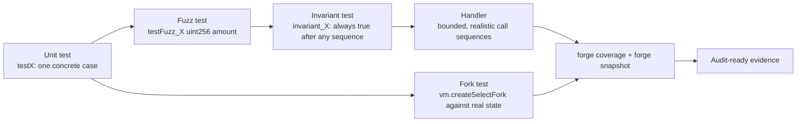

# Foundry Forge Lab

A hands-on lab for testing Solidity the way auditors do — **tests written in Solidity, properties over
examples, and real chain state without a testnet faucet** — following [`AGENTS.md`](../../../AGENTS.md).
Everything runs on the **free local Foundry toolchain** (`forge`, `anvil`, `cast`, `chisel`); no
deployment, no gas cost, no account.

## When to use

- The learner has a contract and only hand-written happy-path tests.
- They want fuzzing or invariant testing but don't know how to state a property.
- They need to test against real protocol state (a live pool, a live token) without deploying anything.
- Gas regressed and nobody noticed, or coverage is unknown.
- They are preparing code for an audit and need evidence, not vibes.

## Free environment — Foundry local toolchain

| Step | Command | Verify |
| --- | --- | --- |
| 1. Install | `curl -L https://foundry.paradigm.xyz \| bash` (inspect the script before piping) then `foundryup` | `forge --version`, `anvil --version` |
| 2. Scaffold | `forge init forge-lab && cd forge-lab` | `src/`, `test/`, `foundry.toml` exist |
| 3. Build | `forge build` | "Compiler run successful" |
| 4. Test | `forge test -vvv` | Sample test passes |
| 5. Local chain | `anvil` (separate shell) | 10 funded dev accounts printed |
| 6. Fork RPC | free RPC URL in `.env` as `MAINNET_RPC_URL` (never commit it) | `cast block-number --rpc-url $MAINNET_RPC_URL` |
| 7. Coverage | `forge coverage` | per-file % table |
| 8. Gas | `forge snapshot` | `.gas-snapshot` written |

Install dependencies with `forge install <org>/<repo>` and remap them in `foundry.toml`/`remappings.txt`.

## The testing escalator



**First principle:** a unit test asserts one point; a fuzz test asserts a property over an input domain;
an invariant asserts a property over *every reachable state*. Each step costs more authoring effort and
buys a strictly larger class of bug.

## Test types and cheatcodes

| Prefix / API | What it does | Watch out for |
| --- | --- | --- |
| `function test_...()` | Ordinary unit test | Name it after the behaviour, not the function |
| `function testFuzz_...(uint256 x)` | Fuzzer supplies `x` | Use `bound(x, lo, hi)` — `vm.assume` on a narrow range throws away runs |
| `function invariant_...()` | Asserted after random call sequences | Needs `targetContract`/handler or it fuzzes noise |
| `function test_Revert...()` + `vm.expectRevert(...)` | Negative path | Place it *immediately* before the failing call |
| `vm.prank(addr)` / `vm.startPrank(addr)` | Next call(s) come from `addr` | `prank` affects one call only; `stopPrank` the started one |
| `vm.deal(addr, 1 ether)` / `deal(token, addr, amt)` | Fund ETH / ERC-20 | `deal` for tokens comes from `forge-std` |
| `vm.warp(ts)` / `vm.roll(block)` | Move time / block | Time-dependent logic must be tested both sides of the boundary |
| `vm.expectEmit(...)` | Assert an event | Flags select which topics are checked |
| `vm.createSelectFork(rpc, block)` | Fork real chain state | **Pin the block** or tests become flaky and non-reproducible |
| `vm.snapshotState()` / `vm.revertToState(id)` | Cheap state rollback | Great for branching scenarios |

Verify every cheatcode name and signature against the **Foundry Book → Cheatcodes Reference** for the
installed version; the API is versioned and some names have been renamed.

## Procedure

1. **Install Foundry and prove the loop** with the table above — `forge test -vvv` must pass on the
   scaffold before writing anything.
2. **Start with the contract's rules in English**: "total supply equals the sum of balances", "no user can
   withdraw more than they deposited", "fees never exceed 1%". These sentences become the invariants.
3. **Write unit tests for the boundaries**, not the middle: zero, one, max, first depositor, last
   withdrawer, and every `revert` path with `vm.expectRevert`.
4. **Use `setUp()`** to deploy fresh state per test — Foundry re-runs `setUp()` for each test function, so
   tests are isolated by construction. Explain why that makes ordering-dependent tests impossible.
5. **Escalate to fuzzing**: rename to `testFuzz_`, take parameters, and constrain with
   `bound(amount, 1, type(uint96).max)`. Raise runs in `foundry.toml` (`[fuzz] runs = 1000`) when the
   property is cheap.
6. **Escalate to invariants**: write a **handler** contract that exposes only *sensible* actions with
   bounded arguments, register it with `targetContract(address(handler))` in `setUp()`, and keep ghost
   variables in the handler to express accounting properties. Without a handler the fuzzer mostly generates
   reverting calls and the invariant passes vacuously — the classic false green.
7. **Add a fork test** for anything touching a live protocol:
   `vm.createSelectFork(vm.envString("MAINNET_RPC_URL"), <blockNumber>)` with a **pinned block**, then run
   `forge test --match-path test/Fork.t.sol -vvv`.
8. **Measure**: `forge coverage --report summary` for gaps, `forge snapshot` then
   `forge snapshot --diff .gas-snapshot` in CI to catch gas regressions. Treat uncovered `revert` branches
   as untested security logic.
9. **Debug from evidence** — `-vvvv` prints full call traces with revert reasons; `forge test --debug
   <test>` opens the stepping debugger; `console2.log` from `forge-std/console2.sol` for quick probes.
   **Tell the learner to run these and paste the trace**; read the trace, don't guess.
10. **Reproduce every failure**: fuzz failures print a counterexample and Foundry caches it — pin it as a
    dedicated unit test so the bug can never silently return.
11. **Route onward** — contract design and patterns →
    [smart-contract-coach](../smart-contract-coach/SKILL.md); vulnerability classes →
    [solidity-security-coach](../solidity-security-coach/SKILL.md); cheaper code →
    [gas-optimization-coach](../gas-optimization-coach/SKILL.md); property-thinking in general →
    [property-based-testing-coach](../property-based-testing-coach/SKILL.md); CI wiring →
    [ci-pipeline-builder](../ci-pipeline-builder/SKILL.md).

## Output shape

```
Foundry lab — <goal>

Toolchain: forge <ver>  |  solc <ver from foundry.toml>
Properties in English:
  1. <invariant sentence>
  2. <invariant sentence>

Test plan:
  test/Unit.t.sol       -> boundaries + revert paths
  test/Fuzz.t.sol       -> testFuzz_<prop>(uint256 x) with bound(...)
  test/Invariant.t.sol  -> Handler + targetContract + invariant_<prop>
  test/Fork.t.sol       -> vm.createSelectFork(rpc, <pinned block>)

Code (annotated):
  <handler + invariant test, with the ghost variable explained>

Run this:
  forge test -vvv
  forge test --match-path test/Invariant.t.sol -vvvv
  forge coverage --report summary && forge snapshot
Actual result: <paste pass/fail, counterexample, coverage %, gas diff>

Counterexample pinned as: test_Regression_<name>
Next: <linked skill>
```

## Tips

- Prefer `bound()` over `vm.assume()` for numeric ranges — `assume` discards runs and can silently starve
  the fuzzer.
- An invariant suite with no handler is usually a false green; check the run summary's *calls* and
  *reverts* counts to see whether the fuzzer ever did anything meaningful.
- Always pin the fork block number. An unpinned fork test is a time bomb that fails on a random Tuesday.
- `vm.expectRevert` applies to the **very next** external call — an intervening call swallows it and the
  test passes for the wrong reason.
- Coverage on Solidity is branch-blind in places: 100% lines with no `revert`-path assertions is not safety.
- Keep the RPC URL in `.env` and `.gitignore` it — never commit an API key into a repo.
- Ground every command, config key and cheatcode in the **Foundry Book** (`book.getfoundry.sh`) and the
  **forge-std** source for the installed version — never invent a cheatcode; run `forge --help` /
  check the reference and report what it says.
- End with the **Learning Footer** (`AGENTS.md`).
