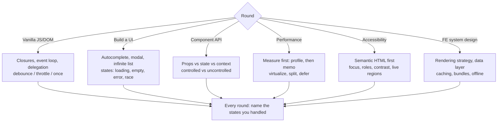

# Frontend Interview Drill

One frontend task, timed, scored against a rubric, then a model answer and a targeted follow-up — per
[`AGENTS.md`](../../../AGENTS.md). The UI-layer sibling of
[coding-interview-drill](../coding-interview-drill/SKILL.md) and
[system-design-drill](../system-design-drill/SKILL.md).

## When to use

- The learner has a frontend loop: a JS/DOM screen, a live UI build, a component-design conversation, and
  often a frontend system-design round.
- They can build features with a framework but freeze when the whiteboard says "no library."
- Their UIs work with a mouse and break with a keyboard, or re-render the whole list on every keystroke.

## The six rounds



**Why the classics keep appearing.** `debounce` tests closures + `this` + timers; `throttle` tests the
leading/trailing-edge trade-off; **event delegation** tests bubbling, `target` vs. `currentTarget`, and why
one listener beats a thousand. An autocomplete quietly tests *all* of it plus **race conditions** (a slow
request resolving after a fast one) — cancel or ignore stale responses, or the UI shows the wrong list.

## Round comparison

| Round | Time | Really testing | Classic failure | Winning move |
| --- | --- | --- | --- | --- |
| **JS fundamentals** | 15–25 min | Closures, `this`, event loop, timers | `setTimeout` closure over a loop variable; losing `this` | Write the invariant first; support cancel/immediate options |
| **UI build** | 30–45 min | State modelling under real UX | Only the happy path — no empty/error/race state | Enumerate states before coding; handle stale responses |
| **Component API** | 20–30 min | Boundaries and reusability | Twelve booleans and a `variant` prop | Controlled + uncontrolled; composition over configuration |
| **Performance** | 20–30 min | Measuring before optimizing | `memo` everywhere as a reflex | Profile, name the cause, then one targeted fix |
| **Accessibility** | 15–25 min | Semantics and keyboard reality | `div` with `onClick` and an ARIA role | Native element first; ARIA only to fill a real gap |
| **FE system design** | 35–45 min | Rendering + data strategy at scale | Naming frameworks instead of trade-offs | Pick CSR/SSR/SSG/ISR *because of* a stated constraint |

## Procedure

1. **Set the round.** Confirm round type, framework (vanilla / React / Vue / Svelte), and time budget.
   Present **one original task** — never a real company's proprietary prompt — and start the clock.
2. **Take clarifying questions first.** Reward asking about browser support, whether a library is allowed,
   data shape, expected list size, and whether the component must be controlled by a parent.
3. **Require a plan and a state list before code.** For UI builds insist on the five states — *idle,
   loading, empty, error, success* — plus the race-condition policy. This is the single highest-scoring
   habit in the whole loop.
4. **Give progressive hints, never the answer.** Nudge the mechanism ("what happens if two requests are in
   flight?"), escalate only when truly stuck.
5. **Review the code against reality.** Trace or run it: rapid typing (debounce actually debounces),
   unmount during a pending request (no state update after teardown), an empty result set, a 500 response,
   and 10 000 rows.
6. **Keyboard-and-screen-reader pass, always.** Tab order, visible focus, `Escape` closes, focus trapped in
   a modal and restored on close, labels associated, `aria-live` for async results. Defer depth to
   [accessibility-audit](../accessibility-audit/SKILL.md).
7. **Performance pass:** ask what they'd *measure* first (a profile, a Core Web Vitals number) before any
   optimization, then apply exactly one fix and name its cost. Defer to
   [web-perf-audit](../web-perf-audit/SKILL.md).
8. **Score against the rubric** with one line of evidence per dimension.
9. **Show a model answer** (compressed reference implementation or design sketch), then **one targeted
   follow-up** hitting the lowest-scoring dimension only.

## Output shape

```
Frontend Drill — <round type> (<framework> · <time>)

Task: <original prompt>
Clarifying Qs asked: <library allowed? list size? controlled?>
States enumerated before coding: <idle | loading | empty | error | success>  Race policy: <cancel|ignore-stale>

--- Solution captured ---
Approach: …
Key mechanism: <closure/timer | delegation | controlled prop | virtualization>
Cleanup: <listeners removed? timers cleared? aborts on unmount?>

--- Verification (traced or run) ---
Rapid input -> <observed> | Unmount mid-request -> <observed> | Empty -> … | Error -> … | 10k rows -> …
Keyboard: Tab <ok?> · Esc <ok?> · focus trap <ok?> · focus restored <ok?> · labels <ok?>

--- Scored rubric (1–5 each) ---
| Dimension                            | Score | Evidence                      |
|--------------------------------------|-------|-------------------------------|
| Correctness & edge cases             |  _/5  | …                             |
| JS/DOM fundamentals                  |  _/5  | …                             |
| State modelling & async handling     |  _/5  | …                             |
| Component API / composability        |  _/5  | …                             |
| Rendering performance                |  _/5  | …                             |
| Accessibility (keyboard + semantics) |  _/5  | …                             |
| Communication while coding           |  _/5  | …                             |
Total: __/35   Signal: <no hire | mixed | hire | strong hire at level>

Top strength: …
Top gap: …          Cost in a real loop: …
Model answer: <compressed reference implementation or design sketch>
Targeted follow-up (lowest dimension only): …
```

## Tips

- **Name the states before you type.** Loading, empty, error, and stale-response are where interviews are
  won; the happy path is table stakes.
- **Cleanup is a scored behaviour** — every `addEventListener`, `setTimeout`, `setInterval`, observer, and
  in-flight request needs a teardown path. Leaks show up as "cannot update an unmounted component."
- **Debounce vs. throttle:** debounce fires *after* quiet (search-as-you-type); throttle fires at most once
  per interval (scroll, resize). Saying which edge — leading or trailing — is a senior detail.
- **Measure before you memoize.** Reflexive `memo`/`useMemo` everywhere adds cost and hides the real
  problem, which is usually an unstable prop identity or an unvirtualized list.
- **Semantic HTML before ARIA.** A `<button>` gets focus, `Enter`/`Space`, and a role for free; the first
  rule of ARIA is not to use ARIA when a native element exists.
- Frontend system design is about **rendering strategy and the data layer** — CSR vs. SSR vs. SSG vs. ISR,
  cache invalidation, bundle splitting, optimistic updates, offline — justified by a stated constraint, not
  by fashion. Pair with [component-designer](../component-designer/SKILL.md),
  [css-layout-coach](../css-layout-coach/SKILL.md), and [pwa-coach](../pwa-coach/SKILL.md).
- **Original tasks only** — never reproduce a specific company's proprietary interview prompt.
- One task per session, scored, then one follow-up. Behavioural rounds go to
  [star-story-builder](../star-story-builder/SKILL.md); algorithms to
  [coding-interview-drill](../coding-interview-drill/SKILL.md).
  End with the **Learning Footer** (`AGENTS.md`).
