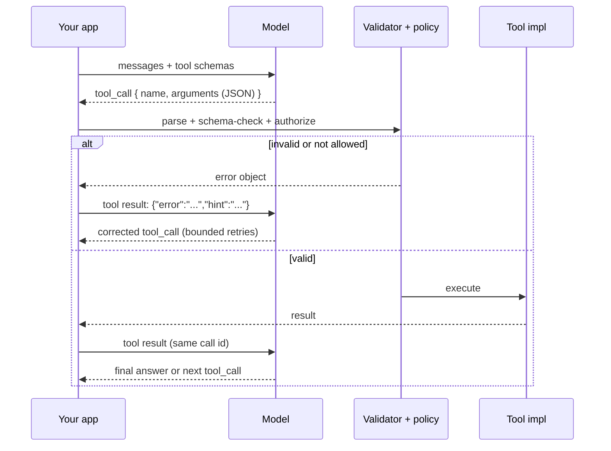

# Function Calling Coach

The contract between a model and your code — designed so the model picks the right tool with valid
arguments and failures stay recoverable — per [`AGENTS.md`](../../../AGENTS.md).

## When to use

- The learner is giving an LLM its first tools, or their tool calls "work in the demo, fail in prod".
- Symptoms: wrong tool chosen, invented parameters, arguments of the wrong type, the same tool called
  forever, or a tool that silently returns nothing.
- They want the model to emit **structured data** as well as call tools and are unsure which mechanism to
  use → contrast with [structured-output-coach](../structured-output-coach/SKILL.md).
- Related: [agent-designer](../agent-designer/SKILL.md) (the loop around the calls),
  [mcp-server-builder](../mcp-server-builder/SKILL.md) (exposing tools over MCP),
  [multi-agent-orchestration-coach](../multi-agent-orchestration-coach/SKILL.md) (many agents, many tools).

## First principles: the model never calls anything

The model emits **a structured request** — a tool name plus a JSON argument object. **Your code** decides
whether to execute it. That gap is the entire security and reliability story: it is where you validate,
authorize, rate-limit, and refuse.



The model's *only* inputs when choosing are the **tool names, descriptions, and parameter descriptions**.
Those three strings are your control surface — treat them as prompt engineering, not documentation.

## Schema design rules

| Rule | Bad | Good | Why |
| --- | --- | --- | --- |
| Verb-first, unambiguous name | `data`, `handler2` | `search_orders`, `cancel_order` | Name is the strongest routing signal |
| Say when **not** to call | "Gets orders." | "Search a customer's orders by email. Do NOT use for refunds — use `create_refund`." | Prevents near-neighbour misfires |
| Close the set with enums | `status: string` | `status: "open"\|"shipped"\|"cancelled"` | Eliminates a whole class of invalid args |
| Minimal required set | 9 required params | 2 required + sensible defaults | Every required field is a chance to hallucinate |
| Concrete formats | `date: string` | `date: string, "ISO 8601 date, e.g. 2026-08-09"` | Models copy the example |
| Never expose ids the model can't know | `internal_row_id` | `order_number` (user-visible) | Unknown ids get invented |
| One job per tool | `manage_order(action=...)` | `cancel_order`, `refund_order` | Action-string dispatch hides intent from the router |
| No secrets in parameters | `api_key: string` | key injected server-side | Prompt/logs leak; see supply-chain and injection skills |

## Call topologies

| Topology | When | Cost/latency | Risk |
| --- | --- | --- | --- |
| **Single** | One lookup answers it | 1 round trip | — |
| **Parallel** | Independent calls (3 cities' weather) | 1 round trip, n executions | Non-determinism; partial failure handling |
| **Sequential** | Output of A is input of B | n round trips | Error compounding, latency |
| **None (forced answer)** | Question needs no tool | 0 | Model over-calls if tools are too tempting |
| **Forced tool choice** | You *know* a tool is needed | 1 | Removes the model's judgment — use sparingly |

## Procedure

1. **Decide if you need tools at all.** If you only want typed JSON *back*, that's structured output, not
   function calling → [structured-output-coach](../structured-output-coach/SKILL.md). Tools are for
   *actions* and *fresh data*.
2. **Write the tool list like an API surface for a junior engineer with no docs**: few tools, sharp names,
   descriptions that include trigger + anti-trigger conditions and one example invocation.
3. **Type the parameters tightly**: enums for closed sets, numeric ranges, string formats with examples,
   required vs. optional, and defaults documented in the description (the model reads it).
4. **Validate at the boundary — always.** Parse the JSON, check it against the schema, coerce only what is
   safe (trimmed strings, numeric strings → numbers), and **reject** anything ambiguous. Never pass model
   text into SQL, shell, `eval`, or a file path unescaped.
5. **Authorize separately from validation.** Schema-valid ≠ allowed. Check the caller's permission for
   *this* record, this recipient, this amount — and gate destructive or irreversible actions behind a
   human ([prompt-injection-defense](../prompt-injection-defense/SKILL.md)).
6. **Return results the model can use.** Compact, structured, and small — summarize large payloads rather
   than dumping 50 KB of JSON into context. Always echo the tool call id the provider gave you.
7. **Make errors teachable.** Return `{"error": "...", "hint": "..."}` naming the offending field and the
   allowed values, and let the model retry **at most 1–2 times** for the same tool. Distinguish *retryable*
   (timeout, rate limit → exponential backoff with jitter, see
   [circuit-breaker-coach](../circuit-breaker-coach/SKILL.md)) from *terminal* (not found, forbidden →
   stop and explain).
8. **Bound the loop.** Cap total tool calls per turn, cap wall-clock time and spend, and detect repeats
   (same tool + same arguments twice ⇒ break the loop and ask the user or answer with what you have).
9. **Test like software.** Golden set of user utterances → expected tool + expected arguments; score
   tool-selection accuracy and argument validity separately. Run schema/validator code with `#run`
   (`learningos_runcode`) so behaviour is observed, not assumed.
10. **Log the full trajectory** — every call, arguments, latency, result, retry — because tool bugs are
    invisible in the final answer.

## Failure modes → fixes

| Failure | Real cause | Fix |
| --- | --- | --- |
| Wrong tool chosen | Two descriptions overlap | Add anti-trigger sentences; merge or rename the tools |
| Hallucinated argument | You asked for an id the model can't know | Take a user-visible key, or add a lookup tool first |
| Invalid types | Loose schema (`string` everywhere) | Enums, formats, examples, strict validation |
| Calls a tool when it shouldn't | Tool list is too tempting / no "answer directly" path | Say in the system prompt when to answer without tools |
| Never calls the tool | Description doesn't match user vocabulary | Mirror real user phrasing in the description |
| Infinite loop | No progress detection | Cap calls; detect duplicate (tool, args); return "no new information" |
| Silent wrong answer | Tool returned empty and the model improvised | Return explicit `"no results"` text, and instruct: don't invent |
| Slow | Sequential calls that were independent | Enable parallel calls; batch |

## Output shape

```
Function-calling design — <use case>

Tools (<n>, kept deliberately small):
  <verb_noun>(
     <param>: <type|enum>            # required — "<description the model reads>"
     <param?>: <type> = <default>    # optional
  ) -> <compact result shape>
  when to call: <trigger>   when NOT to call: <anti-trigger, name the other tool>
  side effects: <none | writes X>   authorization: <who may, gated how>

Topology: single | parallel | sequential — because <dependency structure>
Validation: <schema lib> -> reject on <cases>; coercions allowed: <list>
Errors: retryable <timeout, 429 -> backoff+jitter, max 2> | terminal <404, 403 -> explain>
Loop guards: max <n> calls/turn · max <s>s · duplicate (tool,args) => stop
Result to model: <shape, size cap, summarization rule>

Eval: <n> utterances -> tool accuracy <x%> · argument validity <x%> · avg calls <n>
Observed failures: <top 2> -> fix: <schema/description change>
Next: <agent-designer | structured-output-coach | mcp-server-builder>
```

## Tips

- **Descriptions are prompts.** Most "the model is dumb" bugs are fixed by one sentence naming the tool
  that *should* have been used instead.
- Prefer **fewer tools**. Ten well-separated tools beat forty overlapping ones; the router degrades as the
  list grows.
- Never let an unvalidated argument reach SQL, a shell, a file path, or a URL — a tool call is user input
  laundered through a model.
- Fail *loudly to the model, gracefully to the user*: structured error objects for the model, a plain
  explanation for the human.
- Cap everything — calls, time, spend. An unbounded tool loop is an unbounded bill.
- Return small results. Context spent on a raw payload is context unavailable for reasoning.
- Version tool schemas and keep old names alive; renaming a tool is a breaking change to model behaviour
  you can't hotfix in the model.
- Route onward to [agent-designer](../agent-designer/SKILL.md),
  [structured-output-coach](../structured-output-coach/SKILL.md), or
  [mcp-server-builder](../mcp-server-builder/SKILL.md).
  End with the **Learning Footer** (`AGENTS.md`).
