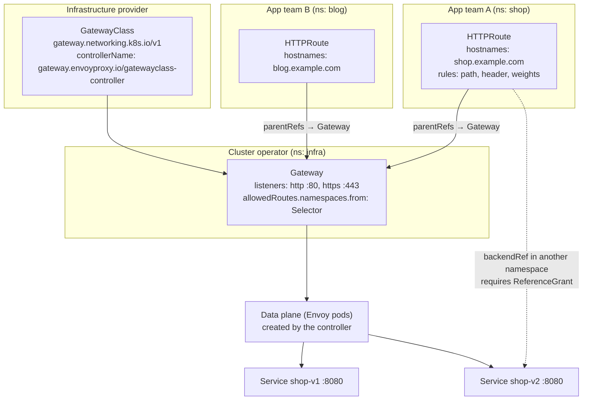

# Gateway API Lab

Ingress squeezed every vendor's feature set into annotations owned by one team. The **Gateway API** splits
the same job into typed, role-oriented resources: infrastructure owns the `GatewayClass`, a cluster
operator owns the `Gateway`, and application teams own their `HTTPRoute`s. Learn it by running one on a
**free local kind/k3d cluster** and reading the status conditions yourself, per
[`AGENTS.md`](../../../AGENTS.md).

## When to use

- You are about to add the fifth `nginx.ingress.kubernetes.io/*` annotation to express something the
  Ingress spec cannot: header matching, weighted splits, mirroring, or per-route timeouts.
- Two teams share one entry point and you need namespace-scoped delegation with a real permission model
  rather than "don't edit that Ingress".
- You want portable canary routing that does not depend on one controller's annotation dialect.
- **Don't use it for** east–west, service-to-service policy — that is a mesh
  ([service-mesh-lab](../service-mesh-lab/SKILL.md)), although Gateway API's GAMMA initiative is bringing
  mesh traffic under the same route types. Also don't reach for it if a single hostname and path prefix on
  a working Ingress is genuinely all you need; Ingress is not deprecated.

## First principles: one API, three roles, explicit permission

Gateway API is a Kubernetes SIG-Network project shipped as CRDs, not as built-in cluster APIs — you
install them yourself and a controller (Envoy Gateway, NGINX Gateway Fabric, Istio, Cilium, and cloud
implementations) reconciles them. **`GatewayClass`, `Gateway` and `HTTPRoute` reached GA at
`gateway.networking.k8s.io/v1` in Gateway API v1.0** (Kubernetes blog, *Gateway API v1.0: GA Release*,
kubernetes.io, 31 October 2023); **`GRPCRoute` reached `v1` in Gateway API v1.1** (May 2024). The project
ships two channels: **standard** (GA + beta resources) and **experimental** (everything else, e.g.
`TCPRoute`, `UDPRoute`, `TLSRoute`, and newer policy attachments).

⚠ Volatile: the release train moves fast (v1.4 landed in late 2025 per the Kubernetes blog *Gateway API
1.4: New Features*). Which resources sit in the standard vs experimental channel, and which fields are
GA, changes per release — **verify on the current gateway-api.sigs.k8s.io page** and against
`kubectl get crd | grep gateway.networking.k8s.io` on your own cluster.



*Figure: the role split. Routes **attach upward** to a Gateway via `parentRefs`, and the Gateway decides
which namespaces may attach via `allowedRoutes` — so delegation is explicit in both directions.*

| Concern | Ingress (`networking.k8s.io/v1`) | Gateway API (`gateway.networking.k8s.io/v1`) |
| --- | --- | --- |
| Ownership | one object, one team | `GatewayClass` / `Gateway` / `*Route` split by role |
| Header, query, method matching | vendor annotations | first-class `matches` in `HTTPRoute` rules |
| Traffic splitting / canary | vendor annotations | `backendRefs[].weight`, portable |
| Mirroring, redirect, rewrite, header mutation | vendor annotations | `filters` (`RequestMirror`, `RequestRedirect`, `URLRewrite`, `RequestHeaderModifier`) |
| Cross-namespace backends | implicit / disallowed | explicit `ReferenceGrant` (`v1beta1`) |
| Protocols beyond HTTP | none | `GRPCRoute` (v1); `TCPRoute`/`UDPRoute`/`TLSRoute` in the experimental channel |
| Timeouts per route | annotations | `rules[].timeouts.request` / `backendRequest` |
| Portability | poor — annotations differ per controller | good — conformance-tested by the project |

| Field | Meaning | Trap |
| --- | --- | --- |
| `parentRefs` | which Gateway (and optionally which listener via `sectionName`) the route attaches to | wrong `namespace` on the ref → route silently never attaches |
| `allowedRoutes.namespaces.from` | `Same` (default), `All`, or `Selector` | default `Same` means routes in other namespaces are ignored, with no error on the route |
| `hostnames` | route-level hostnames, intersected with the listener's | empty intersection = no traffic, status still looks healthy at a glance |
| `matches` | path / header / method / query; **most specific rule wins**, not first-listed | assuming file-order precedence |
| `backendRefs[].weight` | relative, not a percentage; splits are `weight / Σweights` | writing `weight: 100` + `weight: 100` and expecting 100%/0% |
| `ReferenceGrant` | grants a namespace permission to be referenced across a namespace boundary | missing it → `ResolvedRefs: False`, `RefNotPermitted` |

## Procedure

1. **Cluster**: `kind create cluster --name gwapi` (or `k3d cluster create gwapi`); `kubectl get nodes`.
2. **Install the standard-channel CRDs** — Gateway API is *not* built in:
   ```bash
   GWAPI=v1.4.0   # ← verify the current release at github.com/kubernetes-sigs/gateway-api/releases
   kubectl apply -f "https://github.com/kubernetes-sigs/gateway-api/releases/download/${GWAPI}/standard-install.yaml"
   kubectl get crd | grep gateway.networking.k8s.io
   kubectl explain httproute.spec.rules.backendRefs --api-version=gateway.networking.k8s.io/v1
   ```
   Use `experimental-install.yaml` only if you need `TCPRoute`/`UDPRoute`/`TLSRoute` and accept the
   stability caveat.
3. **Install an implementation.** The CRDs do nothing on their own; a controller must claim a
   `GatewayClass`. Envoy Gateway is a straightforward local choice (Envoy Gateway documentation,
   *Quickstart*, gateway.envoyproxy.io — pin and verify the chart version):
   ```bash
   helm install eg oci://docker.io/envoyproxy/gateway-helm \
     --version v1.2.6 -n envoy-gateway-system --create-namespace   # ← verify current version
   kubectl -n envoy-gateway-system rollout status deploy/envoy-gateway
   kubectl get gatewayclass          # expect an "eg" class with ACCEPTED=True
   ```
   NGINX Gateway Fabric or Istio work equally well; the `HTTPRoute`s below are unchanged, which is the
   portability argument in action.
4. **Deploy two backend versions** (`shop-v1`, `shop-v2`) plus Services, so you have something to split.
5. **Create the `Gateway`** in an infra namespace with an HTTP listener and an explicit `allowedRoutes`
   policy. Then **read its status**, which is where the API tells you the truth:
   `kubectl get gateway shop-gw -n infra -o jsonpath='{.status.conditions}' | jq` — expect
   `Accepted: True` and `Programmed: True`, and check `.status.addresses`.
6. **Create the first `HTTPRoute`** with a hostname and a path match; confirm attachment:
   `kubectl get httproute shop -n shop -o jsonpath='{.status.parents}' | jq` — expect
   `Accepted: True` and `ResolvedRefs: True` for your `parentRef`. **This status block is the debugger.**
7. **Reach it**: `kubectl -n envoy-gateway-system port-forward svc/<envoy-service> 8080:80` (find the
   Service the controller created with `kubectl get svc -n envoy-gateway-system`), then
   `curl -H 'Host: shop.example.com' http://localhost:8080/`.
8. **Add header-based routing** — send `x-canary: always` to v2 and everything else to v1. Verify by
   flipping only the header on otherwise identical curls.
9. **Add a weighted split** (`weight: 90` / `weight: 10`) and prove the ratio empirically with a loop of
   100 requests, counting the responses. Weights are relative, so check the arithmetic against what you
   observe.
10. **Add a `RequestMirror` filter** to shadow live traffic to v2 without serving its responses — the
    safest way to test a new version under production traffic.
11. **Do the cross-namespace exercise**: point a `backendRef` at a Service in another namespace, watch it
    fail with `ResolvedRefs: False` / `RefNotPermitted`, then create a `ReferenceGrant`
    (`gateway.networking.k8s.io/v1beta1`) in the *target* namespace and watch it resolve. That failure is
    the security model working.
12. **Migrate the legacy Ingress**: translate host/path rules to `HTTPRoute`, translate each annotation to
    a `filter` or `timeouts` field (or record that it has no portable equivalent), run both in parallel,
    cut over DNS, then delete the Ingress.
13. **Clean up**: `kind delete cluster --name gwapi`. Close with the **Learning Footer**.

## Output shape

```
Gateway API setup — <app>     Cluster: <kind/k3d>     Gateway API: <vX.Y.Z, standard channel>
Implementation: <Envoy Gateway | NGINX Gateway Fabric | Istio | cloud>  controllerName: <...>

GatewayClass: <name>            Accepted=<True/False>
Gateway: <ns>/<name>            listeners: <http:80, https:443>
  allowedRoutes.namespaces.from: <Same|All|Selector: {...}>
  status: Accepted=<True> Programmed=<True> address=<...>  attachedRoutes=<N>

HTTPRoute(s):
  <ns>/<name>  hostnames=[<...>]  parentRefs=<ns/name[#sectionName]>
    rule 1: match <path/header/method>  →  backendRefs: <svc:port weight=W>, <svc:port weight=W>
    filters: <RequestMirror | RequestHeaderModifier | URLRewrite | RequestRedirect>
    timeouts: request=<..> backendRequest=<..>
    status: Accepted=<True> ResolvedRefs=<True>

Cross-namespace: ReferenceGrant <ns>/<name> from=<HTTPRoute in ns X> to=<Service in ns Y>
Verification:
  curl -H 'Host: <...>' <addr>/<path>                       → <expected backend>   ✔
  curl -H 'x-canary: always' ...                            → v2                   ✔
  100-request loop                                          → ~<90>/<10> split     ✔
Migrated from Ingress: <name>  · annotations with no portable equivalent: <list>
Next: <service-mesh-lab | progressive-delivery-lab | k8s-network-policy-lab>
Learning Footer
```

## Worked example — canary by header, then by weight (local, free)

**The Gateway** (cluster operator's object). Note `allowedRoutes`: without it the default is `Same`, and
routes in the `shop` namespace would be silently ignored.

```yaml
apiVersion: v1
kind: Namespace
metadata:
  name: infra
---
apiVersion: v1
kind: Namespace
metadata:
  name: shop
  labels:
    gateway-access: "true"        # matched by the Gateway's namespace selector below
---
apiVersion: gateway.networking.k8s.io/v1
kind: Gateway
metadata:
  name: shop-gw
  namespace: infra
spec:
  gatewayClassName: eg            # the GatewayClass the controller claims
  listeners:
    - name: http
      protocol: HTTP
      port: 80
      allowedRoutes:
        namespaces:
          from: Selector
          selector:
            matchLabels:
              gateway-access: "true"
        kinds:
          - kind: HTTPRoute
```

**The backends**, `restricted`-compliant so they run in a hardened namespace unchanged:

```yaml
apiVersion: apps/v1
kind: Deployment
metadata: {name: shop-v1, namespace: shop}
spec:
  replicas: 2
  selector: {matchLabels: {app: shop, version: v1}}
  template:
    metadata: {labels: {app: shop, version: v1}}
    spec:
      securityContext:
        runAsNonRoot: true
        runAsUser: 65532
        seccompProfile: {type: RuntimeDefault}
      containers:
        - name: app
          image: registry.k8s.io/e2e-test-images/agnhost:2.53   # ← verify current tag
          args: ["netexec", "--http-port=8080"]                 # echoes host/path, ideal for routing tests
          ports: [{containerPort: 8080}]
          resources:
            requests: {cpu: "20m", memory: "32Mi"}
            limits:   {cpu: "100m", memory: "64Mi"}
          securityContext:
            allowPrivilegeEscalation: false
            readOnlyRootFilesystem: true
            capabilities: {drop: ["ALL"]}
---
apiVersion: v1
kind: Service
metadata: {name: shop-v1, namespace: shop}
spec:
  selector: {app: shop, version: v1}
  ports: [{port: 8080, targetPort: 8080}]
```

(Duplicate the Deployment/Service as `shop-v2` with `version: v2`.)

**The route — header match first, then the weighted default.**

```yaml
apiVersion: gateway.networking.k8s.io/v1
kind: HTTPRoute
metadata:
  name: shop
  namespace: shop
spec:
  parentRefs:
    - name: shop-gw
      namespace: infra          # REQUIRED: the Gateway lives in another namespace
      sectionName: http         # attach to the named listener, not just the Gateway
  hostnames:
    - shop.example.com
  rules:
    # Rule A — opt-in canary: an exact header match is more specific, so it wins.
    - matches:
        - path: {type: PathPrefix, value: /}
          headers:
            - {name: x-canary, value: "always", type: Exact}
      backendRefs:
        - {name: shop-v2, port: 8080}

    # Rule B — everyone else: 90/10 weighted split. Weights are RELATIVE (90/(90+10) = 90%).
    - matches:
        - path: {type: PathPrefix, value: /}
      backendRefs:
        - {name: shop-v1, port: 8080, weight: 90}
        - {name: shop-v2, port: 8080, weight: 10}
      filters:
        - type: RequestHeaderModifier
          requestHeaderModifier:
            set:
              - {name: x-route, value: shop-weighted}   # makes the decision observable downstream
      timeouts:
        request: 5s                                     # per-route timeout, no annotation needed
```

**Tracing it before running it.** `parentRefs[0].namespace: infra` is mandatory because the route lives in
`shop`; omit it and the ref defaults to the route's own namespace, the Gateway is never found, and the
route's status shows no accepted parent — the single most common Gateway API mistake. The Gateway's
`allowedRoutes` selector matches the `gateway-access: "true"` label on the `shop` namespace, so attachment
is permitted from the other side too; **both** directions must agree. Rule A wins for canary traffic
because Gateway API rule precedence prefers the most specific match (a path *plus* an exact header beats a
path alone), not document order.

**Verify empirically rather than trusting the YAML:**

```bash
kubectl get httproute shop -n shop -o jsonpath='{.status.parents[0].conditions}' | jq
# expect Accepted=True and ResolvedRefs=True — if not, the reason field names the exact problem

kubectl get svc -n envoy-gateway-system            # find the Service the controller created
kubectl -n envoy-gateway-system port-forward svc/<envoy-shop-gw-...> 8080:80 &

curl -s -H 'Host: shop.example.com' -H 'x-canary: always' localhost:8080/hostname   # → a v2 pod
for i in $(seq 1 100); do curl -s -H 'Host: shop.example.com' localhost:8080/hostname; echo; done \
  | sed 's/-[a-z0-9]*-[a-z0-9]*$//' | sort | uniq -c        # → roughly 90 × v1, 10 × v2
```

**Now break it deliberately.** Point a `backendRef` at a Service in a *different* namespace:

```yaml
      backendRefs:
        - {name: payments, namespace: billing, port: 8080}
```

The route's status flips to `ResolvedRefs: False` with reason `RefNotPermitted`, and traffic gets a 500.
The fix lives in the **target** namespace, where the owner of that Service grants the permission:

```yaml
apiVersion: gateway.networking.k8s.io/v1beta1
kind: ReferenceGrant
metadata: {name: allow-shop-routes, namespace: billing}
spec:
  from:
    - {group: gateway.networking.k8s.io, kind: HTTPRoute, namespace: shop}
  to:
    - {group: "", kind: Service, name: payments}
```

That is the design point worth internalising: cross-namespace references are **granted by the resource
being referenced**, never claimed by the referrer.

## Tips

- **`status` is the whole debugging story.** `Accepted`, `Programmed` (Gateway) and `Accepted` +
  `ResolvedRefs` (Route) name the exact failure in their `reason`/`message`; read them before guessing.
- The two most common silent failures are a missing `parentRefs[].namespace` and an `allowedRoutes`
  default of `Same`. Both look like "route ignored" with no error on the object you were editing.
- Weights are **relative**, not percentages — `90` and `10` happen to be 90%/10%, but `3` and `1` is
  75%/25%. Verify with a request loop, never by reading the manifest.
- Prefer `RequestMirror` before a weighted rollout: shadowed traffic exercises v2 with real requests while
  users still get v1's responses. Pair with [progressive-delivery-lab](../progressive-delivery-lab/SKILL.md).
- Ingress is not deprecated and does not vanish; run both side by side during migration and cut over by
  DNS. Keep an explicit list of annotations that had *no* portable equivalent — that list is the real cost
  of the migration.
- Keep `Gateway` in an infra namespace under GitOps ([argocd-local-lab](../argocd-local-lab/SKILL.md),
  [gitops-coach](../gitops-coach/SKILL.md)) and let app teams own their own `HTTPRoute`s — that is the
  role split the API was designed for.
- Gateway API controls **north–south** traffic; for east–west mTLS and policy see
  [service-mesh-lab](../service-mesh-lab/SKILL.md), and restrict pod-to-pod reachability with
  [k8s-network-policy-lab](../k8s-network-policy-lab/SKILL.md).
- Related: [k8s-service-networking-lab](../k8s-service-networking-lab/SKILL.md),
  [envoy-local-lab](../envoy-local-lab/SKILL.md),
  [kubernetes-manifest-coach](../kubernetes-manifest-coach/SKILL.md),
  [kustomize-lab](../kustomize-lab/SKILL.md) for per-environment hostnames, and
  [tls-ssl-explainer](../tls-ssl-explainer/SKILL.md) before adding the HTTPS listener.
  End with the **Learning Footer** (`AGENTS.md`).
