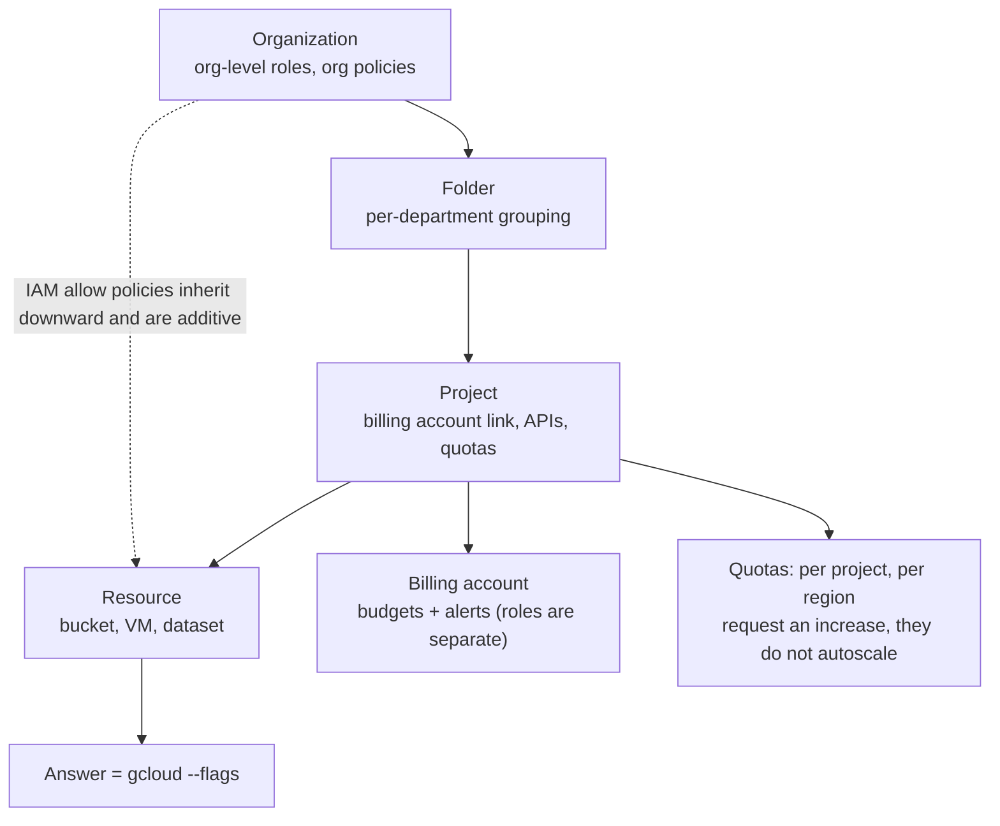

# GCP ACE Exam Drill

Reps for the Associate Cloud Engineer that build the two things the exam really scores: **`gcloud` recall**
and **resource-hierarchy reasoning** — taught and marked per [`AGENTS.md`](../../../AGENTS.md). ACE is a
practitioner exam, so every answer here must include the command you would actually run.

> ⚠ **Confirm the live exam guide before planning study time.** Google revises the ACE guide and its section
> weights periodically. Open *Associate Cloud Engineer certification exam guide* on cloud.google.com, check
> the section list and the "~x % of the exam" markers, and note the guide's revision date. The weights below
> reflect the guide current at the time of writing — if the live guide differs, the live guide wins.

## When to use

- The learner can navigate the console but cannot write the equivalent `gcloud` command from memory.
- They confuse project, folder, and organization scope when reasoning about IAM inheritance.
- They need a readiness signal before booking the 2-hour, 50–60 question exam.
- **Don't** use it as first exposure — run the service labs first, then drill for recall and speed.

## First principles: hierarchy first, command second

Almost every ACE question resolves to two questions: *at which node of the resource hierarchy does this
policy or quota apply?* and *which command changes it?* IAM policies are inherited downward and are
**additive** — a binding at the organization level cannot be removed by a project-level policy (Google Cloud
IAM documentation, *Resource hierarchy* and *Policy inheritance*); deny policies are the explicit exception.



| Exam guide section | Approx. weight | Sampling per 10 | Highest-yield anchors |
| --- | --- | --- | --- |
| 1 · Setting up a cloud solution environment | ~17.5 % | 2 | projects, billing accounts, budgets, enabling APIs, `gcloud config` / `init`, service accounts |
| 2 · Planning and configuring a cloud solution | ~17.5 % | 2 | pricing calculator, choosing compute (GCE/GKE/Run/Functions), storage classes, network planning |
| 3 · Deploying and implementing a cloud solution | ~25 % | 2–3 | `gcloud compute instances create`, GKE clusters/node pools, Cloud Run deploys, Cloud SQL, Pub/Sub, IaC |
| 4 · Ensuring successful operation of a cloud solution | ~20 % | 2 | snapshots and images, node pools, traffic splitting, lifecycle rules, Cloud Monitoring alerts, Cloud Logging sinks |
| 5 · Configuring access and security | ~20 % | 2 | IAM roles (basic/predefined/custom), service accounts, key management, audit logs |

| Trigger phrase in the stem | Points at | Distractor it kills |
| --- | --- | --- |
| "least privilege for a service" | a **predefined** role bound to a **service account** | basic roles (Owner/Editor/Viewer) |
| "should apply to every current and future project" | binding at the **folder or org** node | per-project binding repeated by script |
| "must not be deleted even by a project owner" | **organization policy** constraint / deny policy | IAM role removal |
| "objects older than 30 days, cheaper" | Cloud Storage **lifecycle rule** → Nearline/Coldline/Archive | manual `gsutil` copy job |
| "no external IP, must reach Google APIs" | **Private Google Access** on the subnet | Cloud NAT (that is egress to the internet) |
| "gradual rollout, split traffic" | Cloud Run / GKE **traffic splitting** | blue-green with a second load balancer |
| "hit a limit, need more" | **quota increase request** (per project, per region) | billing budget increase |
| "who did what, when" | **Cloud Audit Logs** (Admin Activity is always on) | Cloud Monitoring metrics |
| "cheapest for a fault-tolerant batch job" | **Spot VMs** | committed-use discounts |

## Procedure

1. **Set the mix** from the live guide — default 10 questions as 2/2/3/2/1 across sections 1–5, or a full
   mock of 50 questions in 120 minutes to rehearse pacing.
2. **Ask one question at a time** in exam form: a short scenario, four options, at least two plausible.
3. **Require hierarchy-then-command reasoning:** "org policy at the folder node → `gcloud resource-manager
   org-policies set-policy --folder=…`". A letter alone scores zero here.
4. **Then demand the command from memory** — flags included. Verify it exists rather than trusting recall:

   ```bash
   gcloud projects add-iam-policy-binding my-proj \
     --member="serviceAccount:app@my-proj.iam.gserviceaccount.com" \
     --role="roles/storage.objectViewer"
   gcloud projects add-iam-policy-binding --help   # confirm any flag you are unsure about
   ```

5. **Mark strictly:** a correct letter with a wrong or invented command counts as a miss. Inventing flags is
   the single most common self-deception in ACE prep.
6. **Explain every distractor** against a named documentation page so the learner can verify independently.
7. **Score per section** and name the weakest after each block of 10.
8. **Convert misses to labs** — IAM → [gcp-iam-lab](../gcp-iam-lab/SKILL.md), networking →
   [gcp-vpc-networking-lab](../gcp-vpc-networking-lab/SKILL.md), storage →
   [gcp-cloud-storage-lab](../gcp-cloud-storage-lab/SKILL.md).
9. **Practise free.** Cloud Shell includes `gcloud` at no cost and most read-only commands consume nothing;
   emulator labs let you rehearse without a billing account at all.
10. **Call readiness honestly:** ≥ 80 % on a timed full mock *and* the ability to write each winning command
    unaided. Google does not publish a numeric pass mark for ACE — treat 80 % as your own bar.

## Output shape

```
Drill: GCP ACE | Guide checked: <sections + weights confirmed on cloud.google.com on <date>>
Mix: setup <n> · plan <n> · deploy <n> · operate <n> · security <n> | Mode: <timed 120 min | untimed>

Q<n> [Section <1-5>] <scenario>
> Your answer + reasoning: <hierarchy node → mechanism → command>
Verdict: <correct | correct-but-command-wrong | incorrect>
Key: <letter> — <why>  (docs: <Google Cloud doc title>)
Command: gcloud <exact command with flags>
Distractors: <option> ✗ <constraint violated> …

Scoreboard: setup <x/y> · plan <x/y> · deploy <x/y> · operate <x/y> · security <x/y> → <z%>
Command recall: <x/y> written unaided
Weakest section: <n> — <concept>
Readiness: <ready | not yet — <gap>>   Next lab: <gcp-iam-lab | gcp-vpc-networking-lab | gcp-gke-lab>
Learning Footer
```

## Worked example — one question, marked with the command

> A batch application runs on Compute Engine instances that have **no external IP addresses**. It must write
> results to a Cloud Storage bucket in the same region. The security team forbids any route to the public
> internet. What is the correct configuration?
>
> A. Attach external IPs to the instances and restrict egress with a firewall rule.
> B. Deploy Cloud NAT in the region so the instances can reach `storage.googleapis.com`.
> C. Enable **Private Google Access** on the subnet and grant the instances' service account
>    `roles/storage.objectCreator` on the bucket.
> D. Grant the instances' service account `roles/owner` on the project.

**Elimination trace.** Constraints: no external IP, no internet route, must write objects. **A** contradicts
the first constraint outright. **D** is a privilege question dressed as a networking question — Owner is
never the least-privilege answer and it does not create a network path anyway. Two survivors: **B** and **C**,
and this pair is the whole lesson. Cloud NAT provides *egress to the internet* for instances without external
IPs — it satisfies reachability but violates "no route to the public internet". **Private Google Access**
lets instances with only internal IPs reach Google APIs over Google's network, which is exactly the stated
requirement. **C** is correct, and it is the cheaper answer too: Private Google Access is a free subnet flag
while Cloud NAT bills per gateway-hour and per GB.

```bash
gcloud compute networks subnets update snet-batch --region=europe-west1 \
  --enable-private-ip-google-access
gcloud storage buckets add-iam-policy-binding gs://batch-results \
  --member="serviceAccount:batch@my-proj.iam.gserviceaccount.com" \
  --role="roles/storage.objectCreator"
```

## Tips

- IAM allow policies are **additive and inherited**; you cannot subtract a role at a lower node — use IAM
  deny policies or organization policy constraints for that.
- Basic roles (Owner/Editor/Viewer) are almost never the exam answer; look for a predefined role first, and
  a custom role only when the stem says no predefined role fits.
- Quotas are per project **and** per region — a "we ran out" scenario is a quota question, never a billing one.
- Private Google Access ≠ Cloud NAT ≠ Private Service Connect. Read which one the constraint requires —
  see [cloud-private-connectivity-coach](../cloud-private-connectivity-coach/SKILL.md).
- Never invent a flag. If you cannot recall it, the honest move is `gcloud <group> <verb> --help`, and that
  habit is what the exam is really rewarding.
- Pair with [exam-blueprint](../exam-blueprint/SKILL.md),
  [mock-exam](../mock-exam/SKILL.md),
  [exam-strategy-coach](../exam-strategy-coach/SKILL.md),
  [gcp-project-structure-coach](../gcp-project-structure-coach/SKILL.md),
  [gcp-iam-lab](../gcp-iam-lab/SKILL.md), and
  [cloud-cert-roadmap-coach](../cloud-cert-roadmap-coach/SKILL.md).
  End with the **Learning Footer** (`AGENTS.md`): weakest section + one command to write from memory tomorrow.
