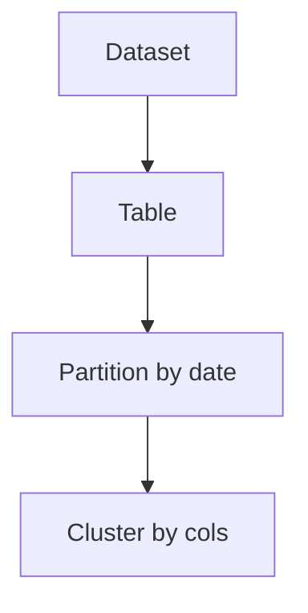

# GCP BigQuery Lab

Learn BigQuery by building one — create a dataset, load a table, query it, then tune for scan cost — per
[`AGENTS.md`](../../../AGENTS.md). Pairs with [data-warehouse-modeling](../data-warehouse-modeling/SKILL.md) and [cloud-cost-optimizer](../cloud-cost-optimizer/SKILL.md).

## When to use

- The learner wants a guided, queryable warehouse table with cost guardrails, not just theory.
- Reinforcing serverless columnar analytics for a **data/analytics** role-agent.

## Anatomy



BigQuery bills by **bytes scanned**, so partitioning and clustering cut both cost and query time.

## Procedure

1. **Create a dataset:** the container for tables; set a location (region) and a default table expiration
   (BigQuery docs, cloud.google.com, 2026).
2. **Create/load a table:** define a schema or autodetect on load from Cloud Storage/CSV/JSON.
3. **Query in GoogleSQL:** select only needed columns — `SELECT *` scans every column and costs more.
4. **Partition + cluster:** `PARTITION BY` a date/timestamp (or ingestion time); `CLUSTER BY`
   high-cardinality filter columns to prune scans.
5. **Verify:** run a `--dry_run` to see bytes-to-be-billed, then compare before/after partitioning.
6. ⚠ **Cap cost:** set `maximum_bytes_billed` per query and budgets/quotas per project so one bad query
   can't scan a fortune.

## Output shape

```
Query: <analytics goal> | Dataset: <name>@<region>
Table: <schema> | Load: autodetect|explicit from GCS/CSV
Tune: PARTITION BY <date> | CLUSTER BY <cols>
Cost: dry_run bytes → maximum_bytes_billed <N> | project quota
SQL: SELECT <needed cols> (avoid SELECT *)
Verify: dry_run before/after tune → fewer bytes scanned
```

## Tips

- Partition pruning only helps when the WHERE filters the partition column — confirm with a dry run.
- Prefer scheduled queries/materialized views over re-scanning raw data repeatedly.
- End with the **Learning Footer** (`AGENTS.md`) — one column to drop from `SELECT *` + one partition to justify yourself.
