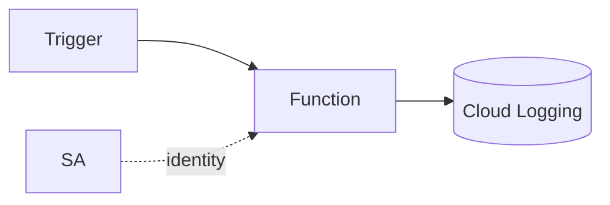

# GCP Cloud Functions Lab

Learn Cloud Functions by building one — write it, wire a trigger, configure it, then observe — per
[`AGENTS.md`](../../../AGENTS.md). Pairs with [serverless-designer](../serverless-designer/SKILL.md) and [gcp-pubsub-lab](../gcp-pubsub-lab/SKILL.md).

## When to use

- The learner wants a guided, deployable Cloud Function from scratch, not just theory.
- Reinforcing event-driven, pay-per-use compute for a **cloud/backend** role-agent.

## Anatomy



A function = source + a runtime service account + a trigger; 2nd-gen runs on Cloud Run and scales to zero.

## Procedure

1. **Write the entry point:** one HTTP handler `(req, res)` or a CloudEvent handler; keep it stateless
   (Cloud Functions docs, cloud.google.com, 2026).
2. **Deploy 2nd gen:** `gcloud functions deploy --gen2 --runtime --trigger-http --region`; prefer gen2 for
   concurrency and Cloud Run parity.
3. **Add a trigger:** HTTP for sync, or Eventarc/Pub/Sub/Cloud Storage events for async — let the event shape input.
4. **Config safely:** pass `--set-env-vars` for settings and `--set-secrets` from Secret Manager — never
   hard-code keys ([gcp-iam-lab](../gcp-iam-lab/SKILL.md)).
5. **Verify:** curl the URL (or publish a test event), then read logs with `gcloud functions logs read`.
6. ⚠ **Secure & clean up:** require auth (no unauthenticated invoker unless public), scope the service
   account, and `gcloud functions delete` to stop idle cost.

## Output shape

```
Goal: <what the function does> | Runtime: <e.g., nodejs20> | Gen: 2
Trigger: <HTTP|Pub/Sub|Storage|Eventarc>
Identity: runtime service account + least-privilege roles
Config: --set-env-vars <…> | secrets via --set-secrets (Secret Manager)
Verify: curl/test event → gcloud functions logs read
Cleanup: gcloud functions delete  [⚠ avoids idle cost]
```

## Tips

- Set `--min-instances` only if cold starts hurt latency — it bills for idle warm instances.
- Make handlers idempotent: Pub/Sub and Eventarc deliver at-least-once, so events can repeat.
- End with the **Learning Footer** (`AGENTS.md`) — one IAM role to scope + one cold start to measure yourself.
