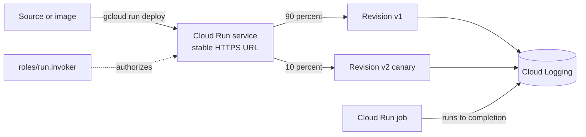

# GCP Cloud Run Lab

Learn Cloud Run by shipping a container — deploy, shift traffic, tune scaling, then lock it down — per
[`AGENTS.md`](../../../AGENTS.md). Pairs with
[gcp-cloud-functions-lab](../gcp-cloud-functions-lab/SKILL.md) and [gcp-gke-lab](../gcp-gke-lab/SKILL.md).

## When to use

- The learner wants a real, deployable HTTPS container endpoint today — not a slide about serverless.
- They need the **service vs. job** decision, or they are debugging cold starts, concurrency, or 403s.
- Reinforcing pay-per-use container compute for a **cloud / backend / platform** role-agent.

## Mental model

Cloud Run runs a **stateless container that listens on `$PORT`** (Cloud Run docs, *Container runtime
contract*, cloud.google.com). Each deploy creates an **immutable revision**; the *service* is a stable URL
plus a **traffic split** across revisions. That one fact explains blue/green, canary, and rollback.



## Service vs. job vs. neighbours

| Need | Use | Why | Watch out for |
| --- | --- | --- | --- |
| Handle HTTP/gRPC requests, scale on traffic | **Cloud Run service** | Request-driven, scales to zero, stable URL | Cold start on the first request after idle |
| Run to completion (batch, migration, nightly ETL) | **Cloud Run job** | No listener needed; retries and task arrays | Jobs have no URL — trigger via Scheduler or API |
| One small handler, source-only deploy | [Cloud Functions](../gcp-cloud-functions-lab/SKILL.md) (gen2) | Same Cloud Run engine, simpler surface | Less control over the container image |
| Long-lived stateful pods, DaemonSets, custom networking | [GKE](../gcp-gke-lab/SKILL.md) | Full Kubernetes control | You now own the cluster and its bill |

**Scaling dials.** `--concurrency` = how many requests *one* container handles at once (services default to
**80**); `--min-instances` keeps warm copies (kills cold starts, **bills while idle**); `--max-instances`
caps blast radius and cost. For I/O-bound apps, raising concurrency usually beats adding instances.

## Procedure

1. **Set context.** Free-tier note: Cloud Run includes a monthly free allotment, but Artifact Registry
   storage and any `--min-instances` are billable — confirm on the official Cloud Run pricing page before
   leaving anything running.
   ```bash
   gcloud config set project <PROJECT_ID>
   gcloud config set run/region <REGION>          # e.g. us-central1
   gcloud services enable run.googleapis.com artifactregistry.googleapis.com cloudbuild.googleapis.com
   ```
2. **Deploy v1, private by default** — do not start with `--allow-unauthenticated`:
   ```bash
   gcloud run deploy hello-lab --source . \
     --no-allow-unauthenticated --port 8080 --concurrency 80 --max-instances 3
   ```
   Your container **must** listen on `$PORT`; hard-coding `3000` is the number-one first-deploy failure.
3. **Verify with an identity token** — invoker-only auth in action:
   ```bash
   URL=$(gcloud run services describe hello-lab --format='value(status.url)')
   curl -H "Authorization: Bearer $(gcloud auth print-identity-token)" "$URL"   # expect 200
   curl "$URL"                                                                 # expect 403
   ```
4. **Grant invoker to one caller** — the least-privilege alternative to going public:
   ```bash
   gcloud run services add-iam-policy-binding hello-lab \
     --member="serviceAccount:caller@<PROJECT_ID>.iam.gserviceaccount.com" --role="roles/run.invoker"
   ```
5. **Ship v2 with no traffic, then canary** — the whole point of revisions:
   ```bash
   gcloud run deploy hello-lab --source . --no-traffic --tag v2
   gcloud run services update-traffic hello-lab --to-tags v2=10             # 10% canary
   gcloud run services update-traffic hello-lab --to-revisions <v1-rev>=100 # instant rollback
   ```
6. **Feel scale-to-zero.** Wait past idle, then time a cold request against a warm one:
   ```bash
   curl -o /dev/null -s -w '%{time_total}\n' \
     -H "Authorization: Bearer $(gcloud auth print-identity-token)" "$URL"
   ```
   Now set `--min-instances 1`, re-measure, and write both numbers down — that delta is what warm costs.
7. **Run a job** for work that finishes instead of serving:
   ```bash
   gcloud run jobs create nightly-lab --image <IMAGE> --tasks 3 --max-retries 2
   gcloud run jobs execute nightly-lab --wait
   ```
8. **Observe:** `gcloud run services logs read hello-lab --limit 50`, then check request count, latency, and
   instance count in Cloud Monitoring.
9. ⚠ **Clean up** so it stops billing:
   ```bash
   gcloud run services delete hello-lab --quiet
   gcloud run jobs delete nightly-lab --quiet
   gcloud artifacts repositories delete cloud-run-source-deploy --location <REGION> --quiet
   ```

## Output shape

```
Workload: <what runs> | Region: <REGION> | Kind: service | job
Image/source: <source deploy | Artifact Registry image>   Port: $PORT (8080)
Auth: --no-allow-unauthenticated + roles/run.invoker -> <caller SA>
Scaling: concurrency=<80> min=<0> max=<3>
Traffic: v1=90% | v2(tag)=10%    Rollback: update-traffic --to-revisions <rev>=100
Verify: token GET -> 200 | anonymous GET -> 403 | cold=<x.xx s> warm=<0.0x s>
Job run: <tasks/retries> -> execution <SUCCEEDED|FAILED>
Cleanup: services delete + jobs delete + repo delete  [⚠ stops billing]
```

## Tips

- **Cold start is not the same as slow code.** Measure cold *and* warm before reaching for `--min-instances`;
  the real fix is often a smaller image or lazy-loading a heavy SDK, not paying for idle containers.
- **Concurrency is the cheapest dial.** `--concurrency 1` turns Cloud Run into an expensive
  function-per-request; only go that low for genuinely non-thread-safe code.
- `--allow-unauthenticated` is a *decision*, not a default. Prefer `roles/run.invoker` for service-to-service
  calls — same least-privilege habit as [gcp-iam-lab](../gcp-iam-lab/SKILL.md).
- **Deploy with `--no-traffic` first**, then shift. A deploy that instantly takes 100% has no canary and no
  cheap rollback.
- Revisions are immutable, so **rollback is a traffic change, not a redeploy** — seconds, not minutes.
- Containers can be evicted at any time: keep handlers **stateless and idempotent** and put state in
  Cloud SQL, Firestore, or Cloud Storage.
- End with the **Learning Footer** (`AGENTS.md`) — one scaling dial to tune + one canary to roll back yourself.
