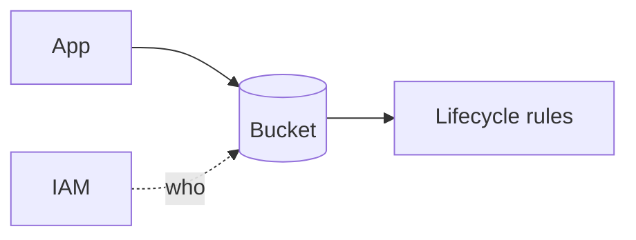

# GCP Cloud Storage Lab

Learn Cloud Storage by building one — create a bucket, class it, lock access, then automate lifecycle — per
[`AGENTS.md`](../../../AGENTS.md). Pairs with [gcp-iam-lab](../gcp-iam-lab/SKILL.md) and [cloud-cost-optimizer](../cloud-cost-optimizer/SKILL.md).

## When to use

- The learner wants a guided, real bucket with access and cost controls, not just theory.
- Reinforcing durable object storage and least-privilege access for a **cloud/data** role-agent.

## Anatomy



A bucket = a global-namespace name + a default storage class + an IAM policy + optional lifecycle rules.

## Procedure

1. **Create the bucket:** pick a globally-unique name, a location (region for latency/cost), and uniform
   bucket-level access (Cloud Storage docs, cloud.google.com, 2026).
2. **Choose a class:** Standard for hot data; Nearline/Coldline/Archive as access drops — cheaper storage,
   higher retrieval cost.
3. **Grant least privilege:** IAM roles (e.g., `objectViewer`) on the bucket for apps; do not make it
   public ([gcp-iam-lab](../gcp-iam-lab/SKILL.md)).
4. **Share time-boxed:** issue a **signed URL** for temporary object access instead of loosening IAM.
5. **Verify:** `gcloud storage ls` / upload an object, then confirm access works and public access is blocked.
6. ⚠ **Automate & save cost:** add lifecycle rules (delete old versions, downgrade class) and enable
   Public Access Prevention so data can't leak.

## Output shape

```
Need: <what you store> | Bucket: <unique-name> | Location: <region>
Class: Standard|Nearline|Coldline|Archive (by access frequency)
Access: IAM roles on bucket + signed URLs for temp share
Guardrail: uniform bucket-level access + Public Access Prevention
Lifecycle: <delete@Nd | class-downgrade@Nd>
Verify: gcloud storage ls/upload → access ok, public blocked
```

## Tips

- Cold classes have minimum storage durations — early delete still bills the remainder.
- Prefer IAM + signed URLs over ACLs; ACLs are legacy and easy to misconfigure.
- End with the **Learning Footer** (`AGENTS.md`) — one lifecycle rule to add + one public path to close yourself.
