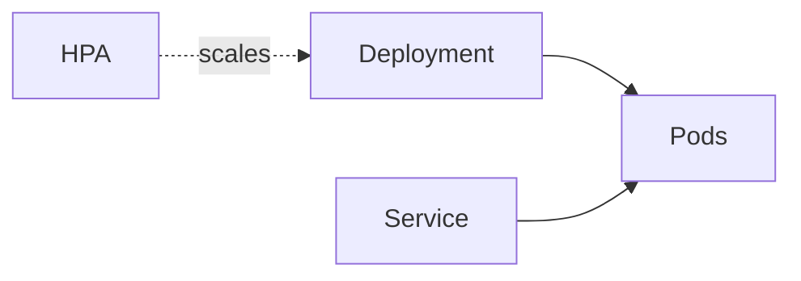

# GCP GKE Lab

Learn GKE by building one — create a cluster, deploy a workload, expose it, then let it autoscale — per
[`AGENTS.md`](../../../AGENTS.md). Pairs with [k8s-deployment-lab](../k8s-deployment-lab/SKILL.md) and [k8s-autoscaling-lab](../k8s-autoscaling-lab/SKILL.md).

## When to use

- The learner wants a running, scalable app on managed Kubernetes, not just theory.
- Reinforcing container orchestration and elasticity for a **cloud/platform** role-agent.

## Anatomy



GKE runs Kubernetes for you; you declare a Deployment + Service and controllers keep them healthy.

## Procedure

1. **Create the cluster:** prefer **Autopilot** (Google manages nodes, you pay per pod) over Standard
   unless you need node control (GKE docs, cloud.google.com, 2026).
2. **Deploy the workload:** apply a Deployment with an image from Artifact Registry; set resource
   requests/limits so scheduling and autoscaling work.
3. **Expose it:** a `Service` (ClusterIP internal, LoadBalancer external) or an Ingress/Gateway for HTTP
   routing ([k8s-service-networking-lab](../k8s-service-networking-lab/SKILL.md)).
4. **Autoscale:** add a HorizontalPodAutoscaler on CPU/metrics; Autopilot (or the cluster autoscaler) adds
   nodes as pods need them.
5. **Verify:** `kubectl get pods,svc,hpa`, hit the external IP, then load-test and watch replicas grow.
6. ⚠ **Secure & control cost:** use Workload Identity (no node keys), private nodes, and right-sized
   requests; `gcloud container clusters delete` to stop node cost.

## Output shape

```
Workload: <app> | Cluster: Autopilot|Standard @<region>
Deploy: image from Artifact Registry + requests/limits
Expose: Service ClusterIP|LoadBalancer | Ingress/Gateway
Scale: HPA on <CPU/metric> + node autoscaling
Verify: kubectl get pods,svc,hpa → external IP → load test
Cleanup: gcloud container clusters delete  [⚠ stops node cost]
```

## Tips

- Autopilot removes node ops and bills per running pod — often cheaper and safer for learners.
- Set requests/limits: without them the HPA has no signal and pods get evicted under pressure.
- End with the **Learning Footer** (`AGENTS.md`) — one Service type to justify + one HPA target to tune yourself.
