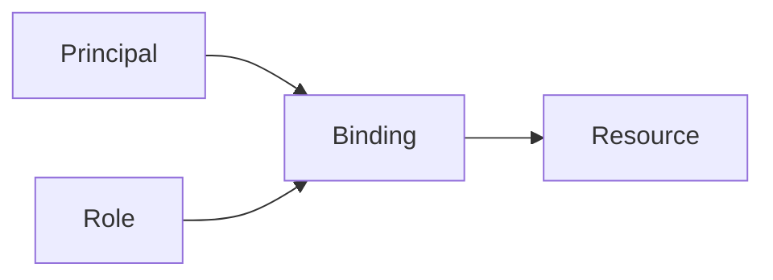

# GCP IAM Lab

Learn IAM by building one — pick principals, bind the smallest role, then read and audit the policy — per
[`AGENTS.md`](../../../AGENTS.md). Pairs with [gcp-project-structure-coach](../gcp-project-structure-coach/SKILL.md) and [aws-iam-lab](../aws-iam-lab/SKILL.md).

## When to use

- The learner wants to grant real, least-privilege access without over-permissioning, not just theory.
- Reinforcing authorization and policy design for a **cloud/security** role-agent.

## Anatomy



An allow policy = a set of **bindings**, each tying a **role** (a bundle of permissions) to **principals**.

## Procedure

1. **Identify principals:** users, groups, or service accounts; bind to **groups**, not individuals, so
   access stays manageable (IAM docs, cloud.google.com, 2026).
2. **Pick the role type:** avoid **basic** (Owner/Editor/Viewer — too broad); prefer **predefined** roles;
   craft a **custom** role only when none fit.
3. **Grant at the right scope:** set the binding on the smallest node (project < folder < org) that covers
   the need ([gcp-project-structure-coach](../gcp-project-structure-coach/SKILL.md)).
4. **Use service accounts for apps:** give workloads their own identity; never share user credentials.
5. **Verify:** `gcloud projects get-iam-policy` plus Policy Analyzer/troubleshooter to confirm who can do what.
6. ⚠ **Least privilege & hygiene:** use IAM Recommender to strip unused permissions; disable static keys
   and prefer short-lived credentials/Workload Identity.

## Output shape

```
Need: <who needs what> | Principals: groups/service accounts
Role: basic❌ | predefined✅ <role> | custom (only if needed)
Scope: org|folder|project (smallest that fits)
Apps: dedicated service account (no shared user creds)
Verify: get-iam-policy + Policy Analyzer → who-can-do-what
Hygiene: IAM Recommender trims unused; short-lived creds
```

## Tips

- Use deny policies sparingly; start allow-least and widen only with evidence from access logs.
- Custom roles need upkeep — Google adds permissions over time, and predefined roles track them for you.
- End with the **Learning Footer** (`AGENTS.md`) — one basic role to replace + one unused permission to remove yourself.
