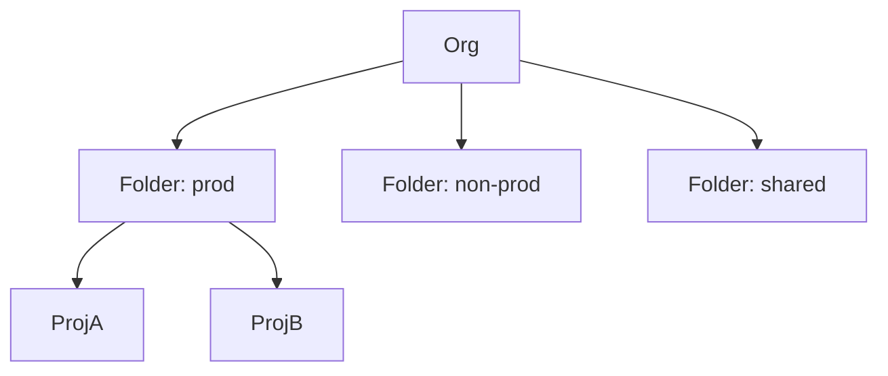

# GCP Project Structure Coach

Lay out GCP the way Google's Architecture Framework does — hierarchy and IAM before workloads — per
[`AGENTS.md`](../../../AGENTS.md). Pairs with [terraform-module-coach](../terraform-module-coach/SKILL.md) and [architecture-diagram](../architecture-diagram/SKILL.md).

## When to use

- The learner is onboarding an org to GCP and needs isolation, security, and cost clarity.
- Reinforcing resource-hierarchy design for a **cloud/platform** role-agent.

## Resource hierarchy



IAM set high (org/folder) inherits down to every child project.

## Procedure

1. **Organization node:** the root tied to Cloud Identity/Workspace; set org policy constraints here
   (Google Cloud Architecture Framework).
2. **Folders by boundary:** group by environment or team (prod / non-prod / shared) so IAM and policy
   inherit cleanly.
3. **Projects as the trust + billing unit:** one app-environment per project; projects isolate resources,
   quotas, and cost.
4. **IAM least privilege:** grant roles to groups (not users) at the highest sensible node; prefer
   predefined/custom roles over primitive Owner/Editor.
5. **Networking:** Shared VPC from a host project so spokes share network yet stay isolated; add VPC-SC
   for data-exfiltration control.
6. ⚠ **Billing/cost:** link projects to a billing account, set budgets + alerts, and label resources
   before spend scales.

## Output shape

```
Org: … | Identity: Cloud Identity/Workspace
Folders: prod | non-prod | shared
Projects: <app>-<env> (isolation + billing unit)
IAM: groups + least privilege at folder scope (no primitive Owner)
Network: Shared VPC (host) + VPC-SC | Billing: budgets + labels
```

## Tips

- Bind IAM to groups at folder level — per-user grants on projects rot fast.
- Avoid primitive roles (Owner/Editor); they over-grant and undermine least privilege.
- End with the **Learning Footer** (`AGENTS.md`) — one role to tighten + one folder boundary to justify yourself.
