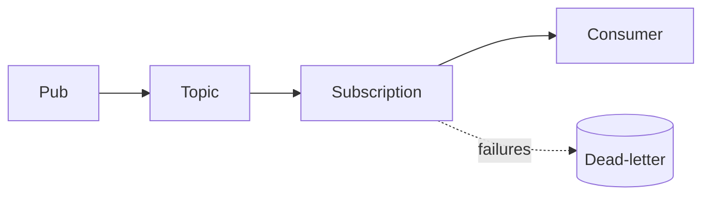

# GCP Pub/Sub Lab

Learn Pub/Sub by building one — create a topic, subscribe, deliver, then make it reliable — per
[`AGENTS.md`](../../../AGENTS.md). Pairs with [message-queue-coach](../message-queue-coach/SKILL.md) and [gcp-cloud-functions-lab](../gcp-cloud-functions-lab/SKILL.md).

## When to use

- The learner wants a guided, working publish/subscribe flow with retries, not just theory.
- Reinforcing decoupled, asynchronous messaging for a **cloud/backend** role-agent.

## Anatomy



Publishers write to a **topic**; each **subscription** gets its own copy — fan-out with independent acks.

## Procedure

1. **Create a topic:** the named channel publishers send to; one topic can feed many subscriptions
   (Pub/Sub docs, cloud.google.com, 2026).
2. **Add a subscription:** choose **pull** (consumer polls, best for throughput) or **push** (Pub/Sub POSTs
   to an HTTPS/Cloud Run endpoint).
3. **Order when needed:** enable message ordering and publish with an ordering key — trades some throughput
   for per-key order.
4. **Ack + retry:** tune the ack deadline; unacked messages redeliver, so consumers must be idempotent
   ([gcp-cloud-functions-lab](../gcp-cloud-functions-lab/SKILL.md)).
5. **Verify:** publish a test message, pull it, ack it; watch backlog/oldest-unacked metrics.
6. ⚠ **Dead-letter poison messages:** attach a dead-letter topic with max delivery attempts so bad
   payloads stop redelivering forever.

## Output shape

```
Need: <event flow> | Topic: <name>
Subscription: pull|push (endpoint: <url if push>)
Ordering: on/off (key: <field>) | Ack deadline: <Ns>
Reliability: dead-letter topic + max delivery attempts <N>
Consumer: idempotent (at-least-once delivery)
Verify: publish → pull → ack; backlog metric drains
```

## Tips

- Delivery is at-least-once by default — dedupe by message ID or enable exactly-once delivery on the subscription.
- Push needs a verified endpoint and auth; pull is simpler to secure behind IAM.
- End with the **Learning Footer** (`AGENTS.md`) — one retry setting to tune + one idempotency key to pick yourself.
