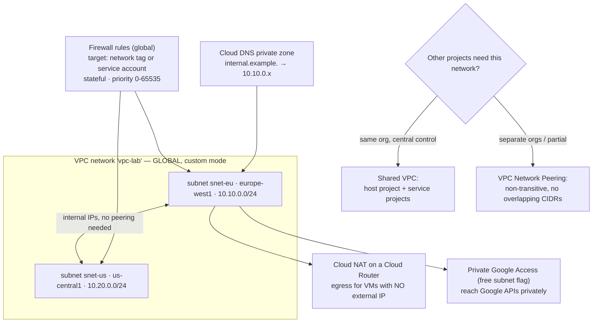

# GCP VPC Networking Lab

Build a Google Cloud network and prove each control by breaking it: **global VPC → regional subnets →
firewall rules → Cloud NAT → private DNS → sharing model**, per [`AGENTS.md`](../../../AGENTS.md). Google's
VPC differs from AWS and Azure in ways that matter, so unlearn first.

## When to use

- The learner is coming from AWS/Azure and assumes networks are regional and firewalls are per-subnet.
- Instances need outbound access without external IPs, or private DNS inside the VPC.
- Several projects must share one network and the team is debating Shared VPC versus peering.
- **Don't** use it for a single Cloud Run service with no VPC requirement — serverless may need no VPC at all.

## First principles: the VPC is global, subnets are regional

A Google Cloud VPC network is a **global** resource; subnets are **regional** and instances in different
regions of the same VPC communicate over internal IPs with no peering or gateway (Google Cloud VPC
documentation, *VPC networks* and *Subnets*). Firewall rules are also VPC-global objects evaluated per
instance, selected by **network tags** or **service accounts** — not attached to subnets.



| Concept | Google Cloud | Contrast with AWS/Azure | Consequence |
| --- | --- | --- | --- |
| Network scope | VPC is **global** | AWS VPC and Azure VNet are regional | cross-region internal traffic needs no peering |
| Subnet scope | regional, expandable in place | AWS subnet is per-AZ, fixed size | fewer subnets; `gcloud … subnets expand-ip-range` works |
| Firewall | global rules, **stateful**, targeted by tag/SA | AWS SG per ENI, Azure NSG per subnet/NIC | one rule can protect instances in every region |
| Default rules | implied **allow all egress**, **deny all ingress** (priority 65535) | similar defaults, different mechanics | your allow rules must have priority < 65535 |
| Egress without public IP | **Cloud NAT** (regional, on a Cloud Router) | NAT gateway per AZ / Azure NAT Gateway | one NAT config covers a whole region |
| Private access to provider APIs | **Private Google Access** (free flag) | VPC endpoint / private endpoint (billed) | prefer the free flag when it satisfies the rule |
| Sharing a network | **Shared VPC** (host + service projects) | AWS RAM sharing / Azure peering | central network team, decentralised workloads |
| Connecting two networks | **VPC Peering** — non-transitive, no CIDR overlap | same non-transitivity in both others | hub-and-spoke needs an NVA or Network Connectivity Center |

| | Shared VPC | VPC Network Peering |
| --- | --- | --- |
| Boundary | one network, many **projects** in one org | two independent **networks** |
| Admin model | central network admins, delegated subnet users | each side administers its own |
| IAM | `roles/compute.networkUser` on subnet or host project | per-project, independent |
| Transitive | n/a — it is one network | **no** — A↔hub, B↔hub does not give A↔B |
| CIDR overlap | impossible (single network) | forbidden |
| Use when | one org wants central control of IPs and firewalls | separate orgs, partners, or M&A |

## Procedure

1. **Create a custom-mode VPC.** Never use auto mode outside a sandbox — it pre-creates a subnet in every
   region with fixed ranges you will collide with later:

   ```bash
   gcloud compute networks create vpc-lab --subnet-mode=custom
   gcloud compute networks subnets create snet-eu --network=vpc-lab \
     --region=europe-west1 --range=10.10.0.0/24 --enable-private-ip-google-access
   ```

2. **Understand the implied rules before writing any.** Every VPC has an implied allow-egress and an implied
   deny-ingress at priority 65535 — your rules exist to carve holes below that:
   `gcloud compute firewall-rules list --filter="network=vpc-lab" --format="table(name,direction,priority,sourceRanges.list(),allowed[].map().firewall_rule().list())"`.
3. **Target rules by service account, not tag, for anything sensitive.** A network tag is self-service —
   any instance admin can add one — whereas binding a service account requires IAM permission:

   ```bash
   gcloud compute firewall-rules create allow-web-to-db --network=vpc-lab --direction=INGRESS \
     --action=allow --rules=tcp:5432 --priority=1000 \
     --source-service-accounts=web@my-proj.iam.gserviceaccount.com \
     --target-service-accounts=db@my-proj.iam.gserviceaccount.com
   ```

4. **Allow SSH the safe way** — via Identity-Aware Proxy's range `35.235.240.0/20` rather than `0.0.0.0/0`,
   so no instance needs an external IP: `gcloud compute firewall-rules create allow-iap-ssh --network=vpc-lab
   --allow=tcp:22 --source-ranges=35.235.240.0/20`.
5. **Add Cloud NAT for egress** from instances with no external IP. NAT lives on a Cloud Router and is
   regional:

   ```bash
   gcloud compute routers create rtr-eu --network=vpc-lab --region=europe-west1
   gcloud compute routers nats create nat-eu --router=rtr-eu --region=europe-west1 \
     --auto-allocate-nat-external-ips --nat-all-subnet-ip-ranges --enable-logging
   ```

   ⚠ Cloud NAT bills per gateway-hour plus per GB processed — delete it at the end of the lab.
6. **Distinguish NAT from Private Google Access.** NAT is egress to the *internet*; PGA reaches *Google APIs*
   privately and is free. Many designs need only PGA.
7. **Create a private DNS zone** so internal names resolve without touching public DNS:

   ```bash
   gcloud dns managed-zones create zone-internal --dns-name=internal.example. \
     --description="lab private zone" --visibility=private --networks=vpc-lab
   gcloud dns record-sets create app.internal.example. --zone=zone-internal --type=A --ttl=60 \
     --rrdatas=10.10.0.11
   ```

8. **Choose the sharing model** using the table above, then enable it. Shared VPC needs the host project
   enabled and the service project attached:
   `gcloud compute shared-vpc enable HOST_PROJECT` then
   `gcloud compute shared-vpc associated-projects add SERVICE_PROJECT --host-project HOST_PROJECT`,
   and grant `roles/compute.networkUser` on the specific subnet, not the whole host project.
9. **Verify rather than assume.** Connectivity Tests simulate the data plane without sending packets:
   `gcloud network-management connectivity-tests create t1 --source-instance=… --destination-instance=…
   --protocol=TCP --destination-port=5432`, then read which rule allowed or denied the flow.
10. **Clean up in dependency order:** NAT → router → firewall rules → DNS zone → subnets → network. Networks,
    subnets, firewall rules, and private DNS zones are cheap or free; **Cloud NAT, external IPs, and
    load balancers are the billable objects**.

## Output shape

```
VPC: <name> (custom mode, GLOBAL) | Subnets: <name/region/CIDR> … (regional, non-overlapping)
Private Google Access: <on/off per subnet>   Flow logs: <on/off>
Firewall (global, stateful): implied deny-ingress/allow-egress @65535
  <priority> <name>: <direction> <proto:port> from <SA|tag|range> to <SA|tag> — intent <...>
SSH path: IAP 35.235.240.0/20 → no external IPs
Egress: Cloud NAT <name> on router <name> in <region> ⚠ hourly + per-GB | or PGA only (free)
DNS: private zone <name> attached to <vpc> | records <...>
Sharing model: <Shared VPC host=<proj> service=<projs>, networkUser on subnet <...> | Peering <a↔b>, non-transitive>
Verified: connectivity test <source→dest:port> → <allowed by rule <name> | dropped by <reason>>
Cleanup order: NAT → router → rules → zone → subnets → network
Next: <gcp-iam-lab | cloud-private-connectivity-coach | gcp-gke-lab>
Learning Footer
```

## Worked example — least-privilege ingress plus verified egress

```bash
# 1. Custom VPC + one regional subnet with free private access to Google APIs.
gcloud compute networks create vpc-lab --subnet-mode=custom
gcloud compute networks subnets create snet-eu --network=vpc-lab --region=europe-west1 \
  --range=10.10.0.0/24 --enable-private-ip-google-access --enable-flow-logs

# 2. A VM with NO external IP — this is the point of the exercise.
gcloud compute instances create vm-app --zone=europe-west1-b --subnet=snet-eu --no-address \
  --service-account=web@my-proj.iam.gserviceaccount.com \
  --scopes=https://www.googleapis.com/auth/cloud-platform --machine-type=e2-micro

# 3. Reach it without opening 22 to the world.
gcloud compute firewall-rules create allow-iap-ssh --network=vpc-lab --direction=INGRESS \
  --action=allow --rules=tcp:22 --source-ranges=35.235.240.0/20 --priority=1000
gcloud compute ssh vm-app --zone=europe-west1-b --tunnel-through-iap

# 4. Give it internet egress only if it truly needs it.
gcloud compute routers create rtr-eu --network=vpc-lab --region=europe-west1
gcloud compute routers nats create nat-eu --router=rtr-eu --region=europe-west1 \
  --auto-allocate-nat-external-ips --nat-all-subnet-ip-ranges
```

Test the difference from inside the VM: `curl https://storage.googleapis.com` succeeds via **Private Google
Access** even before NAT exists, while `curl https://pypi.org` needs **Cloud NAT**. That contrast is the
whole lesson — and deleting the NAT afterwards is how you keep the lab free.

## Tips

- The VPC is global and subnets are regional: cross-region internal traffic needs no peering, which surprises
  every AWS and Azure practitioner exactly once.
- Firewall rules are global and stateful, and target instances by **tag or service account** — prefer service
  accounts, because network tags are self-assignable by anyone who can edit an instance.
- Implied rules sit at priority 65535; any rule you write must have a lower number to take effect.
- `e2-micro` in eligible US regions falls under Google Cloud's Free Tier, but **Cloud NAT, external IPs, and
  load balancers always bill** — delete them first.
- Peering is non-transitive and forbids overlapping CIDRs; if you need hub-and-spoke, plan for an appliance
  or Network Connectivity Center from the start.
- Pair with [gcp-iam-lab](../gcp-iam-lab/SKILL.md),
  [gcp-project-structure-coach](../gcp-project-structure-coach/SKILL.md),
  [cloud-private-connectivity-coach](../cloud-private-connectivity-coach/SKILL.md),
  [gcp-gke-lab](../gcp-gke-lab/SKILL.md),
  [gcp-well-architected-review](../gcp-well-architected-review/SKILL.md), and
  [aws-vpc-lab](../aws-vpc-lab/SKILL.md).
  Close with the **Learning Footer** (`AGENTS.md`): one firewall rule to re-target, one NAT to delete.
