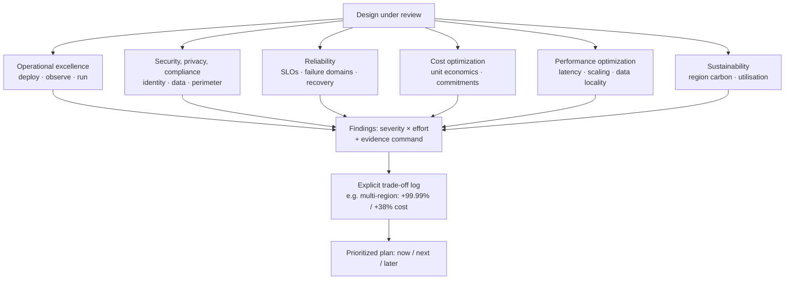

# GCP Well-Architected Review

A structured, evidence-based review of a Google Cloud design against all six framework pillars, producing
findings a team can act on this sprint — per [`AGENTS.md`](../../../AGENTS.md). A review without severity,
evidence, and an owner is just an opinion.

## When to use

- Before a production launch, after an incident, or at a quarterly architecture checkpoint.
- The learner has a working design and needs to know where it will fail *first* — and what it costs.
- A team wants an artefact for a design-review meeting, not a checklist they will never re-run.
- **Don't** use it to pick a service for a greenfield idea; that is a design task, not a review.

## First principles: six pillars, one trade-off surface

Google structures its guidance as **pillars** (non-functional focus areas) plus cross-pillar **perspectives**
such as AI/ML and financial services (Google Cloud Well-Architected Framework, cloud.google.com/architecture/framework).
Pillars conflict by design — multi-region raises reliability *and* cost — so a review's real output is a set
of explicit, recorded trade-offs, not a stack of "best practices".



| Pillar | Core question | Signals of a weak design | Evidence to run |
| --- | --- | --- | --- |
| Operational excellence | Can we deploy and diagnose this at 3 a.m.? | manual deploys, no dashboards, no runbook | `gcloud logging sinks list`, check Cloud Monitoring alert policies |
| Security, privacy, compliance | Who can reach the data, and how would we know? | basic roles, keys in code, public buckets, no audit sink | `gcloud projects get-iam-policy` · `gcloud storage buckets list` |
| Reliability | What is the SLO and which single failure breaks it? | one zone, no health checks, no tested restore | check zonal vs regional resources, backup schedules |
| Cost optimization | What does one unit of work cost? | idle IPs, no lifecycle rules, on-demand for steady load | `gcloud compute addresses list --filter="status=RESERVED"` |
| Performance optimization | Where is the latency and does it scale? | cross-region chatter, no caching, undersized quotas | Cloud Monitoring latency metrics, quota usage |
| Sustainability | Are we wasting carbon and capacity? | low utilisation, high-carbon region, no autoscaling | Carbon Footprint export, utilisation metrics |

| Severity | Meaning | Action window |
| --- | --- | --- |
| **Critical** | data exposure, or a single failure that breaches the SLO today | fix before launch / this week |
| **High** | material risk or >20 % avoidable spend | this sprint |
| **Medium** | operational friction, recoverable failure modes | next quarter |
| **Low** | polish, naming, documentation | backlog, batched |

## Procedure

1. **Capture the design as facts,** not intentions: services, regions/zones, data classes, the SLO, the RTO
   and RPO, monthly budget, and team size. Anything unstated is a finding in its own right.
2. **Inventory what actually exists** if you have project access — reviews of the diagram alone miss drift:

   ```bash
   gcloud projects describe "$PROJECT" --format="value(projectId,lifecycleState)"
   gcloud services list --enabled --project "$PROJECT"
   gcloud asset search-all-resources --scope="projects/$PROJECT" \
     --format="table(assetType,displayName,location)"
   ```

3. **Pillar 2 — security first**, because its findings are the ones that cannot wait. Look for basic roles
   and public data:

   ```bash
   gcloud projects get-iam-policy "$PROJECT" --flatten="bindings[].members" \
     --filter="bindings.role:(roles/owner OR roles/editor)" --format="table(bindings.role,bindings.members)"
   gcloud storage buckets list --format="table(name,iamConfiguration.publicAccessPrevention,location)"
   ```

4. **Pillar 3 — reliability:** identify every zonal resource and ask what happens when that zone fails.
   Require an SLO with an error budget, health checks on every load balancer backend, and a *tested* restore
   (an untested backup is not a backup).
5. **Pillar 1 — operational excellence:** confirm IaC (Terraform or Config Connector), a CI/CD path, an audit
   log sink to a separate destination, alert policies tied to SLOs, and a runbook per alert.
6. **Pillar 4 — cost:** hunt idle reserved IPs, unattached disks, missing Cloud Storage lifecycle rules,
   and steady-state workloads on on-demand pricing. Then quote committed-use discounts or Spot for the
   fault-tolerant parts, and state the assumption behind every estimate.
7. **Pillar 5 — performance:** check data locality (compute in the region holding the data), caching, quota
   headroom, and autoscaling limits. Cross-region chatter is the most common silent latency tax.
8. **Pillar 6 — sustainability:** prefer lower-carbon regions where latency allows (Google publishes
   per-region carbon data), raise utilisation via autoscaling and right-sizing, and export Carbon Footprint
   data for a baseline.
9. **Record the trade-offs explicitly** — "regional Cloud SQL: +availability, ~2× instance cost, chosen
   because RTO is 15 min". This log is the most valuable artefact of the whole review.
10. **Prioritize by severity × effort** into now / next / later, assign an owner and a date to each Critical
    and High, and schedule the next review. Cross-check with the Recommender API
    (`gcloud recommender recommendations list --project="$PROJECT" --location=global --recommender=google.iam.policy.Recommender`,
    repeating per recommender/location) so machine findings and human findings agree.

## Output shape

```
Review: <system> | Project(s): <ids> | Regions: <...> | SLO: <99.9% / RTO <n> / RPO <n>> | Budget: $<x>/mo
Framework: Google Cloud Well-Architected — 6 pillars (verified on cloud.google.com/architecture/framework, <date>)

Scores (1-5): OpsExcellence <n> · Security <n> · Reliability <n> · Cost <n> · Performance <n> · Sustainability <n>

Findings
  [CRITICAL] <pillar> <title>
     Evidence: <command run + output summary>
     Impact: <what breaks / what is exposed / $ per month>
     Fix: <specific change>   Effort: <S/M/L>   Owner: <who>   By: <date>
  [HIGH] …
  [MEDIUM] …

Trade-off log
  <decision> → gains <...> · costs <...> · accepted because <...>

Plan
  Now (this week): <critical items>
  Next (this sprint): <high items>
  Later (backlog): <medium/low>
Cross-check: gcloud recommender recommendations list → <n> agreeing / <n> extra
Next review: <date>   Next skill: <gcp-vpc-networking-lab | cloud-cost-optimizer | gcp-iam-lab>
Learning Footer
```

## Worked example — one finding, fully evidenced

> **Design:** a Cloud Run API in `us-central1` reads a **zonal** Cloud SQL for PostgreSQL instance in
> `us-central1-a`; the team states an SLO of 99.9 % monthly and an RTO of 15 minutes. Nightly exports go to a
> Cloud Storage bucket in the same region, and no restore has ever been performed.

```bash
gcloud sql instances describe api-db \
  --format="table(name,region,gceZone,settings.availabilityType,settings.backupConfiguration.enabled)"
# availabilityType: ZONAL  → a single-zone outage takes the API down
gcloud storage buckets describe gs://api-db-backups --format="value(location,lifecycle)"
```

**[CRITICAL] Reliability — zonal database cannot meet a 99.9 % SLO with a 15-minute RTO.** A zonal Cloud SQL
instance has no automatic failover; recovery means restoring from backup, which for a database of this size
takes well over 15 minutes and has never been rehearsed. Two honest options, with the trade-off stated:
switch `--availability-type=REGIONAL` (synchronous standby in a second zone, automatic failover, roughly
double the instance cost), or accept a lower SLO and publish it. If regional is chosen:

```bash
gcloud sql instances patch api-db --availability-type=REGIONAL   # ⚠ causes a brief restart
gcloud sql backups list --instance=api-db     # then actually restore into a scratch instance and time it
```

**Trade-off logged:** regional HA → availability improves to the documented Cloud SQL HA SLA, instance cost
roughly doubles, accepted because the stated RTO is 15 minutes. Pair it with a **tested** quarterly restore
drill — the finding is only closed when a restore has been timed, not when the flag is flipped.

## Tips

- A review with no severities is a wish list. Force every finding into Critical/High/Medium/Low with an owner.
- Attach the **command and its output** to each finding; evidence is what makes a review re-runnable next
  quarter instead of re-argued.
- Pillars conflict on purpose — write the trade-off down rather than pretending the design optimises all six.
- Cross-check human findings against `gcloud recommender recommendations list`; disagreements are usually
  where the interesting context lives.
- Framework content is revised — confirm today's pillar list and guidance on
  cloud.google.com/architecture/framework before quoting it in a design document.
- Pair with [gcp-vpc-networking-lab](../gcp-vpc-networking-lab/SKILL.md),
  [gcp-project-structure-coach](../gcp-project-structure-coach/SKILL.md),
  [gcp-iam-lab](../gcp-iam-lab/SKILL.md),
  [cloud-cost-optimizer](../cloud-cost-optimizer/SKILL.md),
  [aws-well-architected-review](../aws-well-architected-review/SKILL.md), and
  [observability-plan](../observability-plan/SKILL.md).
  End with the **Learning Footer** (`AGENTS.md`): the single Critical finding to close first.
