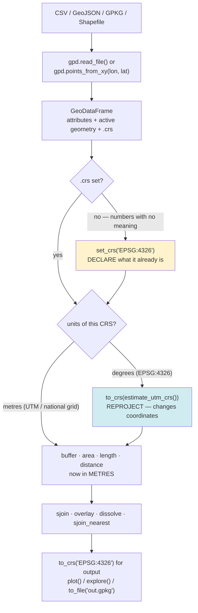

# GeoPandas Lab

Geospatial analysis taught as **pandas plus one column that knows where it is** — and one property, the CRS,
that decides whether every number you compute is meaningful. Built on the first-principles, run-it-yourself
approach of [`AGENTS.md`](../../../AGENTS.md), and grounded in the **GeoPandas documentation**
(`geopandas.org`; **GeoPandas 1.0** released June 2024), the **Shapely 2.x** docs, **pyproj/PROJ**, and the
authoritative **EPSG Geodetic Parameter Dataset** (`epsg.org`). Everything runs locally and free — no API
keys, no cloud, no basemap downloads.

## When to use

- The learner has a CSV of latitudes and longitudes and needs real spatial answers: what's inside what,
  what's within 1 km, how much per district.
- Their distances or areas are absurd (a "1000-unit" buffer that covers a continent, or an area 4× too
  large) — the CRS is almost always the culprit.
- They need points-in-polygon, nearest-feature, overlay or dissolve and are currently doing it with nested
  Python loops.
- **Don't use it for** spatial SQL at database scale — see
  [postgis-spatial-lab](../postgis-spatial-lab/SKILL.md) — for non-spatial dataframe work
  ([pandas-lab](../pandas-lab/SKILL.md)), or for cartographic design choices
  ([data-viz-coach](../data-viz-coach/SKILL.md)).

## First principles: a GeoDataFrame is a DataFrame with an active geometry column

`GeoDataFrame` **is** a pandas `DataFrame`; every groupby, merge and filter you know still works. The
addition is a `GeoSeries` of Shapely geometries designated as the *active geometry*, plus a **CRS**
(coordinate reference system) attached to it.

The CRS is the whole ballgame. A geometry is just numbers; the CRS is what turns `(77.57, 12.98)` into a
place on Earth and decides what `.area`, `.length`, `.distance()` and `.buffer()` *mean*. GeoPandas will
happily compute a buffer in degrees and hand you a nonsense polygon without complaint — the units come from
the CRS, and the CRS is your responsibility.



*Fig. 2 — the only workflow that gives correct measurements. `set_crs` **declares** what the coordinates
already are (it never moves a point); `to_crs` **reprojects** (it moves every point). Confusing the two is
the single most common GeoPandas bug.*

| CRS | EPSG | Units | Good for | Fails at |
| --- | --- | --- | --- | --- |
| WGS 84 (GPS lat/lon) | `4326` | **degrees** | storage, exchange, web APIs | any measurement — buffers, area, distance |
| Web Mercator | `3857` | metres (nominal) | web tiles, slippy maps | **areas and distances away from the equator** |
| UTM zone *n* N/S | `326nn` / `327nn` | metres | accurate local measurement (zone ≈ 6° wide) | crossing zones, global extents |
| Equal-area (e.g. `6933`, `3035` for Europe) | varies | metres | comparing **areas** across a wide region | shape/angle fidelity |

### Why Web Mercator lies about area

Mercator's scale factor grows as $1/\cos\varphi$ with latitude, so **area** is inflated by:

$$ \text{area distortion} = \frac{1}{\cos^{2}\varphi} $$

At $\varphi = 60°$, $\cos 60° = 0.5$, so areas come out $1/0.25 = 4\times$ too large. Use EPSG:3857 to *draw*
maps, never to *measure* them.

### Why a degree is not a distance

One degree of **latitude** is ≈ 110.6 km almost everywhere. One degree of **longitude** is
$111.32\ \text{km} \times \cos\varphi$:

| Latitude | 0.01° of longitude | 0.01° of latitude | A "circle" of radius 0.01° is… |
| --- | --- | --- | --- |
| 0° (equator) | ≈ 1113 m | ≈ 1106 m | nearly circular |
| 13° (Bengaluru) | ≈ 1085 m | ≈ 1106 m | slightly squashed (98 %) |
| 60° (Oslo) | ≈ 557 m | ≈ 1112 m | an ellipse **2× wider than tall** |

That is why `gdf.buffer(1000)` on an EPSG:4326 GeoDataFrame is not a 1 km buffer — it is a **1000-degree**
buffer, which is meaningless. Reproject first.

⚠ **Axis order.** The EPSG definition of 4326 formally orders axes latitude-then-longitude, but Shapely and
GeoPandas are `x, y` — i.e. **longitude first**: `points_from_xy(df.lon, df.lat)`. Swapping them silently
puts your Indian cities in the Indian Ocean off Somalia.

## Procedure

1. **Set up a clean, free environment** (see [python-venv-lab](../python-venv-lab/SKILL.md)):
   ```bash
   python -m venv .venv && . .venv/bin/activate     # Windows: .venv\Scripts\Activate.ps1
   python -m pip install "geopandas>=1.0" matplotlib folium mapclassify
   python -c "import geopandas; print(geopandas.__version__)"
   ```
   GeoPandas 1.0 uses **pyogrio** for file IO and **Shapely 2.x** for geometry by default. ⚠ The bundled
   sample datasets (`geopandas.datasets`) were **removed in 1.0** — old tutorials calling
   `gpd.datasets.get_path("naturalearth_lowres")` will fail. Use your own files or the separate
   `geodatasets` package.
2. **Load and inspect immediately**: `gdf.head()`, `gdf.geometry.name`, `gdf.crs`, `gdf.geom_type.value_counts()`,
   `gdf.total_bounds`. Never analyse before you have printed `.crs`.
3. **If `.crs` is `None`, declare it** — `gdf = gdf.set_crs("EPSG:4326")` — and be sure that is what the
   coordinates *are*. `set_crs` on wrong data mislabels; it does not fix.
4. **Reproject before measuring**: `utm = gdf.estimate_utm_crs()` then `gdf_m = gdf.to_crs(utm)`. Now
   `.buffer(1000)` is 1000 **metres**, `.area` is m², `.distance()` is metres.
5. **Do the geometry work** in the projected frame:
   - `gdf_m.buffer(d)` — catchments, service areas
   - `gpd.sjoin(left, right, how="inner", predicate="within"|"intersects"|"contains")` — points in polygons
   - `gpd.sjoin_nearest(left, right, distance_col="dist_m")` — nearest feature *and* how far
   - `gpd.overlay(a, b, how="intersection"|"union"|"difference")` — polygon-on-polygon algebra
   - `gdf.dissolve(by="region", aggfunc={"pop": "sum"})` — spatial groupby
6. **Check the CRS of both sides of every join.** GeoPandas warns on a mismatch and then returns a result
   that is silently, completely wrong. Assert it: `assert left.crs == right.crs`.
7. **Validate geometries** before overlay: `gdf.geometry.is_valid.all()`; repair with
   `gdf.geometry.make_valid()` (Shapely 2.x) rather than the old `buffer(0)` trick.
8. **Reproject back for output/plotting** (`to_crs("EPSG:4326")` for GeoJSON and web, `EPSG:3857` for tiled
   basemaps), then `gdf.plot()` for a static figure or `gdf.explore()` for an interactive Folium map.
9. **Write to GeoPackage, not Shapefile**: `gdf.to_file("out.gpkg", layer="cities", driver="GPKG")`.
   Shapefiles truncate column names to 10 characters, cannot store the CRS reliably, and are actually
   several files.
10. **Sanity-check one number by hand** (a known distance, a known area) before trusting the whole table.
    Close with the **Learning Footer**.

## Output shape

```
Question: <points-in-polygon | buffer catchment | aggregate by area | nearest>
Data: <n features> · geometry type <Point|LineString|Polygon> · source <file/inline>
CRS in: <EPSG:...> (units: <degrees|metres>)   declared with <set_crs|from file>  -> valid: <y>
CRS for analysis: <EPSG:...> via <estimate_utm_crs()|explicit>   units: metres   why: <measurement needed>
Geometry validity: is_valid <n/n>   repaired with make_valid: <n>
Operation(s): <buffer(1000) | sjoin(predicate=within) | overlay(intersection) | dissolve(by=..)>
  CRS match asserted on both sides of every join: <y>
Result: <n rows>   key aggregates: <...>
Hand check: <one distance/area verified by independent arithmetic> -> <expected> vs <computed>
Distortion note: <why not EPSG:3857/4326 for these numbers>
Output: <out.gpkg layer=... | map.png | map.html>   output CRS: <EPSG:4326|3857>
Pitfalls checked: lon/lat order · set_crs vs to_crs · degree-buffer · CRS mismatch on join · shapefile avoided
Next: <postgis-spatial-lab | pandas-lab | data-viz-coach>
Learning Footer
```

## Worked example — 1 km catchments and points-in-ward, entirely offline

No downloads: the data is inline, so this runs anywhere.

```python
import geopandas as gpd
import pandas as pd
import matplotlib
matplotlib.use("Agg")                      # headless-safe: write a PNG, don't open a window
import matplotlib.pyplot as plt
from shapely.geometry import box

# ---- 1. Build a GeoDataFrame. NOTE THE ORDER: x = lon, y = lat. --------------------
cities = pd.DataFrame({
    "name":  ["Majestic", "Indiranagar", "Whitefield", "Jayanagar", "Hebbal"],
    "lon":   [ 77.5730,    77.6408,       77.7500,      77.5830,     77.5970],
    "lat":   [ 12.9770,    12.9784,       12.9698,      12.9250,     13.0358],
    "pop_k": [   120,         95,            210,         140,          80 ],
})
gdf = gpd.GeoDataFrame(
    cities,
    geometry=gpd.points_from_xy(cities.lon, cities.lat),   # lon FIRST
    crs="EPSG:4326",                                       # declare: these ARE WGS84 degrees
)
print(gdf.crs)                       # EPSG:4326
print(gdf.geometry.name)             # geometry

# ---- 2. The trap, shown on purpose -------------------------------------------------
deg_buf = gdf.buffer(0.01)           # 0.01 DEGREES, not metres. GeoPandas does not object.
print(round(deg_buf.iloc[0].area, 6))
# ~0.000314 "square degrees" — a unit that does not exist as an area. Meaningless.

# ---- 3. Reproject, then measure ----------------------------------------------------
utm = gdf.estimate_utm_crs()         # Bengaluru lon 77.57 -> UTM zone 43N
print(utm.to_epsg())                 # 32643
gdf_m = gdf.to_crs(utm)              # coordinates MOVE; every point now in metres
buf_m = gdf_m.buffer(1000)           # a genuine 1 km catchment
print(round(buf_m.iloc[0].area, 1))  # 3136548.7  (m^2)

# ---- 4. Spatial join: which cities fall inside the central ward? -------------------
ward = gpd.GeoDataFrame(
    {"ward": ["Central"]},
    geometry=[box(77.55, 12.90, 77.66, 13.00)],   # minx, miny, maxx, maxy in degrees
    crs="EPSG:4326",
).to_crs(utm)                                     # <- reproject BOTH sides

assert gdf_m.crs == ward.crs, "CRS mismatch: a join here would be silently wrong"
inside = gpd.sjoin(gdf_m, ward, how="inner", predicate="within")
print(sorted(inside["name"]))        # ['Indiranagar', 'Jayanagar', 'Majestic']

# ---- 5. Spatial groupby -----------------------------------------------------------
by_ward = inside.dissolve(by="ward", aggfunc={"pop_k": "sum"})
print(by_ward["pop_k"].to_dict())    # {'Central': 355}

# ---- 6. Nearest feature, with the distance in metres -------------------------------
near = gpd.sjoin_nearest(gdf_m[["name", "geometry"]], ward, distance_col="dist_m")
print(near.loc[near["name"] == "Whitefield", "dist_m"].round(0).item())  # ~9760 m (0 for points inside)

# ---- 7. Plot (projected CRS, so the map is not distorted) --------------------------
ax = ward.plot(facecolor="none", edgecolor="black", linewidth=1.2, figsize=(7, 7))
gpd.GeoDataFrame(geometry=buf_m, crs=utm).plot(ax=ax, alpha=0.25, edgecolor="steelblue")
gdf_m.plot(ax=ax, color="crimson", markersize=25)
for _, r in gdf_m.iterrows():
    ax.annotate(r["name"], (r.geometry.x, r.geometry.y), xytext=(4, 4),
                textcoords="offset points", fontsize=8)
ax.set_title("1 km catchments, UTM 43N (EPSG:32643) — axes in metres")
plt.savefig("catchments.png", dpi=120, bbox_inches="tight")

# ---- 8. Persist in a modern format -------------------------------------------------
gdf_m.to_crs("EPSG:4326").to_file("cities.gpkg", layer="cities", driver="GPKG")
```

**Trace every printed number — that is the lesson.**

- **UTM zone.** $\lfloor (77.573 + 180)/6 \rfloor + 1 = \lfloor 42.93 \rfloor + 1 = 43$, northern hemisphere
  ⇒ **EPSG:32643**. `estimate_utm_crs()` agrees, but now you know why.
- **Buffer area.** A Shapely buffer is a polygon approximation of a circle. GeoPandas' `buffer` defaults to
  `resolution=16` — 16 segments per quarter turn, so a **64-gon**. The area of a regular *n*-gon inscribed in
  a circle of radius *r* is $A = \tfrac{1}{2} n r^{2} \sin(2\pi/n)$, so
  $A = \tfrac{1}{2}(64)(1000^2)\sin(5.625°) = 32\times10^{6} \times 0.0980171 = 3{,}136{,}548.7\ \text{m}^2$.
  That is **0.16 % below** $\pi r^{2} = 3{,}141{,}592.7$ — exactly the polygonal-approximation error, and a
  reassuring sign the reprojection was right. Raise `resolution` if you need a closer circle.
- **The join result.** The ward box spans lon 77.55–77.66 and lat 12.90–13.00. Whitefield (lon 77.75) is east
  of it and Hebbal (lat 13.036) is north of it, so exactly three cities remain: Majestic, Indiranagar,
  Jayanagar. Their populations sum to $120 + 95 + 140 = \mathbf{355}$ — which is what `dissolve` prints. ✓
- **The nearest distance.** Whitefield's latitude (12.9698°) is inside the ward's latitude span, so the
  closest point on the box is due west at the same latitude: $\Delta\text{lon} = 77.75 - 77.66 = 0.09°$, and
  $0.09 \times 111{,}320\ \text{m} \times \cos(12.97°) = 0.09 \times 111{,}320 \times 0.9745 \approx
  9{,}763\ \text{m}$. Matching that by hand is how you confirm the reprojection, not just the code.
- **The degree buffer.** $\pi (0.01)^2 = 0.000314$ "square degrees". The number is arithmetically fine and
  geographically meaningless; at 13 °N that shape is ~1085 m wide and ~1106 m tall, and at 60 °N it would be
  twice as wide as tall.

Now break it on purpose — the fastest way to learn the failure mode:

```python
gpd.sjoin(gdf, ward)   # gdf is EPSG:4326, ward is EPSG:32643
# UserWarning: CRS mismatch between the CRS of left geometries and the CRS of right geometries.
# -> returns an EMPTY / wrong result, because degrees and metres never intersect.
```

That is a **warning, not an error**. In a pipeline it becomes a silently empty report. Hence the `assert` in
step 4.

## Tips

- **Print `.crs` before every analysis step.** Nine out of ten "GeoPandas gave me a weird number" bugs are a
  CRS that is `None`, in degrees, or mismatched between two frames.
- `set_crs` **labels**, `to_crs` **reprojects**. If your coordinates changed when you expected a label, or
  didn't change when you expected a move, you used the wrong one.
- Longitude is **x**: `points_from_xy(lon, lat)`. The classic symptom of getting it backwards is data that
  lands in the Gulf of Guinea (0, 0) or the wrong hemisphere entirely.
- Never measure in EPSG:3857. Area error is $1/\cos^{2}\varphi$ — 4× at 60° latitude — and distance error is
  $1/\cos\varphi$. Use UTM for local work, an equal-area CRS for continental comparisons.
- Vectorise: `gdf.geometry.distance(other)`, `sjoin`, `sjoin_nearest` and `overlay` are Shapely-2-backed and
  orders of magnitude faster than a Python loop, exactly as in [pandas-lab](../pandas-lab/SKILL.md).
- Prefer **GeoPackage** (`.gpkg`) to Shapefile for output: one file, no 10-character column truncation, no
  `.prj`/`.dbf`/`.shx` sidecars to lose.
- `gdf.explore()` gives you a zoomable Folium map in a notebook for free — a superb debugging tool when a
  join returns a surprising row count. See [jupyter-notebook-lab](../jupyter-notebook-lab/SKILL.md).
- Version-volatile: GeoPandas 1.0 removed `geopandas.datasets`, switched the default IO engine to pyogrio,
  and requires Shapely 2.x — verify signatures and defaults (including `buffer`'s `resolution`) on the
  current GeoPandas API reference rather than a pre-1.0 tutorial, and state the version you tested with.
- Pair with [postgis-spatial-lab](../postgis-spatial-lab/SKILL.md) when the data outgrows memory,
  [pandas-lab](../pandas-lab/SKILL.md) for the non-spatial half of every pipeline,
  [numpy-lab](../numpy-lab/SKILL.md) for the array maths underneath,
  [matplotlib-lab](../matplotlib-lab/SKILL.md) and [data-viz-coach](../data-viz-coach/SKILL.md) for maps
  that tell the truth, [python-venv-lab](../python-venv-lab/SKILL.md) for the environment, and
  [data-pipeline-designer](../data-pipeline-designer/SKILL.md) when this becomes a scheduled job.
  End with the **Learning Footer** (`AGENTS.md`).
