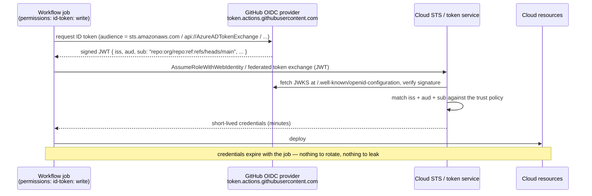

# GitHub Actions OIDC Lab

Stop storing cloud credentials in GitHub. In OIDC federation the workflow asks GitHub for a **short-lived,
cryptographically signed JWT describing itself**, and the cloud decides whether that description is allowed
in — no secret ever exists to leak. Taught with real trust policies you can verify, per
[`AGENTS.md`](../../../AGENTS.md).

## When to use

- The repo has `AWS_ACCESS_KEY_ID` / a service-principal password / a GCP JSON key sitting in Actions
  secrets, and nobody has rotated them since they were created.
- A trust policy exists but is scoped to `repo:org/*:*`, so any repo or any branch in the org can assume
  the deploy role.
- The learner needs to grant *different* permissions to `main` versus a pull request, using the environment
  and ref claims.
- **Don't use it for** secrets an application needs at runtime (database passwords, API keys) — that is
  [secrets-management-coach](../secrets-management-coach/SKILL.md) and
  [vault-local-lab](../vault-local-lab/SKILL.md).

## First principles: the token *is* the identity

Every workflow run can request an OIDC ID token from GitHub's provider at
`https://token.actions.githubusercontent.com`. The token's claims describe the run — which repository,
which ref, which environment, which workflow — and the cloud's trust configuration pins the `iss`, `aud`,
and `sub` it will accept. The exchanged credentials are short-lived and expire when the job finishes
(GitHub Docs, *About security hardening with OpenID Connect*, docs.github.com, 2025).



| Claim | Example value | What you pin it for |
| --- | --- | --- |
| `iss` | `https://token.actions.githubusercontent.com` | proves GitHub issued it |
| `aud` | `sts.amazonaws.com` \| `api://AzureADTokenExchange` | stops token replay at another cloud |
| `sub` | `repo:acme/api:ref:refs/heads/main` | **the authorisation decision** — repo + ref |
| `sub` (env form) | `repo:acme/api:environment:prod` | gate on a protected environment + reviewers |
| `sub` (PR form) | `repo:acme/api:pull_request` | give PRs read-only, never deploy |
| `repository`, `repository_owner` | `acme/api`, `acme` | defence in depth alongside `sub` |
| `job_workflow_ref` | `acme/api/.github/workflows/deploy.yml@refs/heads/main` | pin reusable-workflow callers |

| Cloud | What you create | Audience | Action to use |
| --- | --- | --- | --- |
| AWS | IAM OIDC identity provider + role trust policy (`sts:AssumeRoleWithWebIdentity`) | `sts.amazonaws.com` | `aws-actions/configure-aws-credentials@v4` |
| Azure | App registration + **federated identity credential** (issuer/subject/audience) | `api://AzureADTokenExchange` | `azure/login@v2` |
| GCP | Workload Identity **Pool + Provider** with attribute mapping/condition | provider-defined | `google-github-actions/auth@v2` |

Only `client-id`/`role-arn`/`workload_identity_provider` are stored — those are **identifiers, not
secrets**, though keeping them in Actions variables or secrets is still tidy.

## Procedure

1. **Inventory the blast radius first**: list every long-lived cloud credential in the repo —
   `gh secret list` and `gh variable list`. That list is what this lab deletes.
2. **Grant the token permission** in the workflow. `permissions: id-token: write` plus
   `contents: read`; setting any `permissions:` block resets all others to none, which is what you want.
3. **See the claims before trusting them.** In a scratch job, fetch and decode the raw token:
   `curl -sH "Authorization: bearer $ACTIONS_ID_TOKEN_REQUEST_TOKEN" "$ACTIONS_ID_TOKEN_REQUEST_URL&audience=api://test" | jq -r .value | cut -d. -f2 | base64 -d | jq`.
   Read your actual `sub` — never guess its format.
4. **Register the provider once per cloud account** — AWS IAM identity provider for
   `token.actions.githubusercontent.com`, or the Azure federated credential, or the GCP pool/provider.
5. **Write the trust policy scoped tight**: exact `aud`, and a `sub` fixed to one repo *and* one ref or
   environment. Reject `repo:org/*` and a bare `*` on `sub` — the whole point is the narrowing.
6. **Run the deploy job** and verify identity from inside the job: `aws sts get-caller-identity`,
   `az account show`, or `gcloud auth list`. The assumed-role ARN/principal is your proof.
7. **Prove the negative**: run the same workflow from a feature branch and confirm the exchange is
   *denied*. A federation you have never seen fail is a federation you have not verified.
8. **Delete the old secrets**: `gh secret delete AWS_ACCESS_KEY_ID` (and friends), then deactivate the
   keys in the cloud console.
9. **Lint and gate** — `actionlint .github/workflows/*.yml` locally; note that
   [act-github-actions-lab](../act-github-actions-lab/SKILL.md) can run workflows offline but **cannot**
   mint OIDC tokens, so federation must be verified on a real run. Close with the **Learning Footer**.

## Output shape

```
Repo: <owner/repo>   Cloud: <AWS|Azure|GCP>   Environment(s): <prod|staging>
Long-lived creds removed: <list>            Remaining secrets: <role ARN / client-id = identifiers only>
Workflow permissions: id-token: write · contents: read · <others: none>
Observed sub claim (decoded, not guessed): "<repo:owner/repo:ref:refs/heads/main>"
Audience: <sts.amazonaws.com | api://AzureADTokenExchange | <provider>>
Trust policy scope: iss=<..> aud=StringEquals · sub=<StringEquals|StringLike, no bare wildcard>
Credential lifetime: <minutes>  Session name: <..>
Positive test: <sts get-caller-identity output>    Negative test: feature branch → <denied ✔>
Least privilege: role permissions = <what deploy actually needs>
Next: <secrets-management-coach | supply-chain-security-coach | ci-pipeline-builder>
Learning Footer
```

## Worked example — AWS, `main` only, zero stored keys

Workflow `.github/workflows/deploy.yml`:

```yaml
name: deploy
on:
  push:
    branches: [main]

permissions:
  contents: read
  id-token: write            # without this, no OIDC token is issued at all

jobs:
  deploy:
    runs-on: ubuntu-latest
    environment: prod        # makes sub "...:environment:prod" and adds reviewer gates
    steps:
      - uses: actions/checkout@v4

      - name: Federate into AWS (no access keys anywhere)
        uses: aws-actions/configure-aws-credentials@v4
        with:
          role-to-assume: arn:aws:iam::123456789012:role/gha-deploy
          role-session-name: gha-${{ github.run_id }}
          aws-region: eu-west-1

      - name: Prove who we are
        run: aws sts get-caller-identity
```

IAM role trust policy — the authorisation lives here, not in the workflow:

```json
{
  "Version": "2012-10-17",
  "Statement": [{
    "Effect": "Allow",
    "Principal": {
      "Federated": "arn:aws:iam::123456789012:oidc-provider/token.actions.githubusercontent.com"
    },
    "Action": "sts:AssumeRoleWithWebIdentity",
    "Condition": {
      "StringEquals": {
        "token.actions.githubusercontent.com:aud": "sts.amazonaws.com",
        "token.actions.githubusercontent.com:sub": "repo:acme/api:environment:prod"
      }
    }
  }]
}
```

Reasoning: because the job declares `environment: prod`, the `sub` claim takes the `environment` form, so a
`StringEquals` on the ref form (`...:ref:refs/heads/main`) would **deny every run** — a genuinely common
first-attempt failure, and exactly why step 3 decodes the real token first. `aud` must be `StringEquals`
(never `StringLike`), because a loose audience lets a token minted for another service be replayed here.

For Azure the equivalent is a federated identity credential with
`subject = repo:acme/api:environment:prod`, `issuer = https://token.actions.githubusercontent.com`,
`audience = api://AzureADTokenExchange`, consumed by `azure/login@v2` with `client-id`, `tenant-id`,
`subscription-id`. For GCP it is a Workload Identity Pool provider with an **attribute condition** such as
`assertion.repository == 'acme/api'`, consumed by `google-github-actions/auth@v2`.

## Tips

- The `sub` format changes with *how the job is triggered* (`ref`, `environment`, `pull_request`) — decode a
  real token before writing any condition.
- Never use `StringLike` with a bare `*` on `sub`, and never wildcard `aud`; that turns federation into
  "any repository in the world that knows the role ARN".
- Adding a `permissions:` block zeroes out every permission you don't list — that is the secure default,
  but it will break steps that quietly relied on write access.
- OIDC removes *stored* credentials, not *authorisation* mistakes: the assumed role still needs least
  privilege, so review it with [threat-model](../threat-model/SKILL.md).
- Pin third-party actions by commit SHA and pair with
  [supply-chain-security-coach](../supply-chain-security-coach/SKILL.md) and
  [cosign-signing-lab](../cosign-signing-lab/SKILL.md) — a compromised action runs *inside* the job that
  holds the token.
- Protected environments add human approval to the `sub` claim itself — the cheapest deploy gate you will
  ever configure.
- Related: [ci-pipeline-builder](../ci-pipeline-builder/SKILL.md),
  [act-github-actions-lab](../act-github-actions-lab/SKILL.md), [aws-iam-lab](../aws-iam-lab/SKILL.md),
  [gcp-iam-lab](../gcp-iam-lab/SKILL.md), [azure-entra-id-lab](../azure-entra-id-lab/SKILL.md), and
  [dora-metrics-coach](../dora-metrics-coach/SKILL.md).
  End with the **Learning Footer** (`AGENTS.md`).
