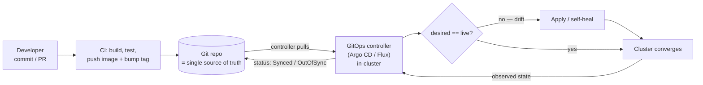

# GitOps Coach

GitOps is one idea taken seriously: **the desired state lives in Git, and a controller inside the cluster
continuously makes reality match it.** Teach the reconciliation loop, not the YAML — per
[`AGENTS.md`](../../../AGENTS.md). Pairs with
[kubernetes-manifest-coach](../kubernetes-manifest-coach/SKILL.md) and
[ci-pipeline-builder](../ci-pipeline-builder/SKILL.md).

## When to use

- Deploys happen via `kubectl apply` from laptops or a CI job holding cluster admin credentials.
- Nobody can answer "what is actually running in prod, and who changed it?" — or drift keeps reappearing.
- Setting up Argo CD or Flux, designing environment promotion, or planning safe rollbacks.

## The reconciliation loop

CI builds and *publishes* an artifact; the cluster **pulls** its desired state. The controller never stops
comparing desired vs. live, which is what makes drift self-heal.



## Push CD vs. GitOps pull

| Aspect | Traditional push CD | GitOps (pull) |
|---|---|---|
| Who applies changes | CI runner, from outside the cluster | A controller **inside** the cluster |
| Credentials | CI holds cluster admin creds (a broad blast radius) | Cluster pulls; no inbound cluster creds in CI |
| Source of truth | The last pipeline that ran | The Git repo, always |
| Drift (manual `kubectl edit`) | Undetected until the next deploy | Detected continuously; optionally auto-healed |
| Audit trail | Pipeline logs | Git history — signed, reviewed, permanent |
| Rollback | Re-run an older pipeline (may not be reproducible) | `git revert` — the controller converges back |
| Onboarding a new cluster | Re-run every pipeline | Point the controller at the repo |
| Weakness | Coupled to CI availability and credentials | Needs manifest discipline; secrets need encryption |

## Procedure

1. **Anchor on the four GitOps principles** (as published by the OpenGitOps project under the CNCF —
   verify wording and version at opengitops.dev): the system is **declarative**; desired state is
   **versioned and immutable** in Git; agents **pull** the state automatically; agents **continuously
   reconcile** and correct drift. Every later decision should trace back to one of these.
2. **Split the repos.** Keep **application source** separate from the **config/manifests** repo the
   controller watches. This stops "CI commits to its own trigger" loops, keeps environment history clean,
   and lets platform and app teams own different review rules.
3. **Make the desired state declarative and rendered.** Plain manifests, Kustomize overlays, or a Helm
   chart with values — no imperative scripts, no hand-run `kubectl`. Pin image **digests or immutable
   tags**; `:latest` destroys reproducibility and makes drift undetectable. See
   [kubernetes-manifest-coach](../kubernetes-manifest-coach/SKILL.md).
4. **Install the controller and pick your tool** (both CNCF projects; cite their official docs with a date):
   **Argo CD** — an `Application` CR per workload, a strong UI showing `Synced` / `OutOfSync` / `Healthy`,
   sync waves and hooks; **Flux** — composable controllers (`GitRepository` + `Kustomization` / `HelmRelease`),
   Kubernetes-native and CLI-first, with built-in image automation. Choose on team workflow, not hype.
5. **Scale with app-of-apps.** One root application declares the child applications, so onboarding a service
   is a PR to the root repo instead of a manual `argocd app create`. (Argo CD also offers `ApplicationSet`
   for generated apps; Flux composes `Kustomization` resources the same way.) Bootstrapping a brand-new
   cluster becomes: install the controller, point it at the root, wait.
6. **Design environment promotion.** Pick one shape and be consistent — **directories** (`envs/dev`,
   `envs/staging`, `envs/prod`) with Kustomize overlays over a shared base is the most common and easiest to
   diff; **branches per environment** are intuitive but invite merge drift; **separate repos** give the
   hardest isolation and the most overhead. Promotion is then a reviewed PR that moves the *same* image
   digest into the next overlay — the artifact is built once and promoted, never rebuilt.
7. **Turn on drift detection, then decide on self-healing.** The controller reports `OutOfSync` when someone
   hand-edits the cluster. Auto-sync with **prune** and **self-heal** reverts that automatically — powerful,
   and dangerous if the repo is wrong, so start in manual-sync/notify mode in prod until the team trusts the
   diffs. Prune deletes resources removed from Git: confirm ownership boundaries before enabling it.
8. **Handle secrets without ever committing plaintext.** Two conceptual options: **Sealed Secrets** — encrypt
   with the cluster controller's public key so only that cluster can decrypt the committed `SealedSecret`;
   or **SOPS** (often with age/KMS) — encrypt values in-place so the file stays reviewable and diffable.
   A third path is an external store (Vault, cloud key vaults) synced in via an operator. **Never commit a
   plaintext secret** — Git history is permanent; if it happens, rotate the credential, don't just delete the file.
9. **Roll back by reverting the commit.** `git revert` the offending change; the controller converges the
   cluster back. This keeps history append-only and auditable — unlike force-pushing or a manual hotfix,
   which reintroduces drift. Add health checks/sync waves so ordering is respected, and alert on
   `OutOfSync` or degraded health.
10. **Close the loop with observability.** Track sync status, reconciliation errors, and time-to-converge;
    review who merged what in Git for your audit trail.

## Output shape

```
Principles check: declarative ✓ | versioned in Git ✓ | pulled automatically ✓ | continuously reconciled ✓
Repos: app source = <repo>  |  config/manifests = <repo>  (why separated)
Rendering: <plain manifests | Kustomize overlays | Helm+values> | images pinned by <digest|immutable tag>
Controller: <Argo CD | Flux> — why: <team workflow / UI vs CLI / image automation>
Structure: root app-of-apps → <child apps…>   (bootstrap = install controller + point at root)
Environments: <dirs envs/dev|staging|prod with overlays | branches | repos> → promotion = PR moving digest <sha>
Sync policy: <manual | auto-sync> | prune: <on/off> | self-heal: <on/off>  (rationale per environment)
Drift: detected via <OutOfSync status> → alert to <channel> → <auto-heal | human review>
Secrets: <Sealed Secrets | SOPS+age/KMS | external store operator> — plaintext in Git: never
Rollback: git revert <sha> → controller reconciles → verify <health check>
Observability: sync status, reconcile errors, time-to-converge, Git audit trail
Verify in docs: <Argo CD / Flux / OpenGitOps doc page + date>
```

## Tips

- If a human can change the cluster and Git never notices, it isn't GitOps — reconciliation is the whole point.
- Separate the app-source repo from the config repo; a single repo turns CI into an accidental deploy loop.
- Pin image digests: `:latest` makes "desired state" meaningless and hides drift from the controller.
- Build the artifact once and promote the same digest across overlays — rebuilding per environment reintroduces
  the drift GitOps exists to remove ([ci-pipeline-builder](../ci-pipeline-builder/SKILL.md)).
- Enable auto-prune and self-heal only after the team trusts the diffs; in prod, start with notify-only.
- Never commit a plaintext secret — if one lands in history, **rotate it**; deleting the file is not a fix.
- Roll back with `git revert`, not a manual `kubectl` fix, so history stays the source of truth.
- Cite Argo CD, Flux, and OpenGitOps official docs with dates; features and CRD fields change across versions.
- End with the **Learning Footer** (`AGENTS.md`).
