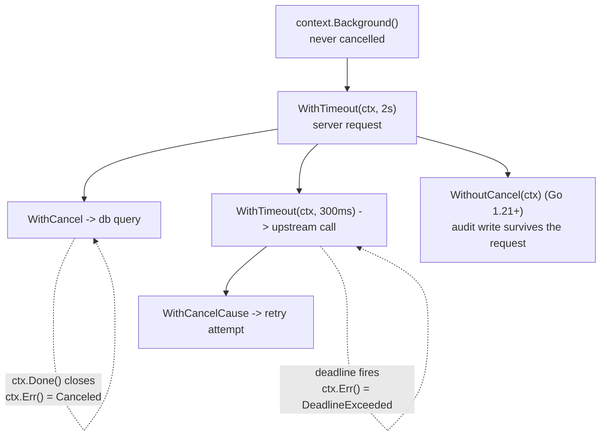

# Go Context Lab

`context.Context` is a **tree of cancellation signals with deadlines**, threaded explicitly through call
stacks. Teaching it as "the thing you put first in the signature" hides the model; we build it from the tree
outward, in the first-principles style of [`AGENTS.md`](../../../AGENTS.md).

## When to use

- A handler or worker keeps running after the client disconnected, or a test hangs until the suite times out.
- The learner needs bounded fan-out (N parallel calls, first error wins, everything else cancelled).
- They are stuffing dependencies into `context.WithValue` or storing a `Context` in a struct.
- Don't use it for channel *mechanics* — pick that up in
  [go-channels-lab](../go-channels-lab/SKILL.md) and [go-goroutines-lab](../go-goroutines-lab/SKILL.md).

## First principles: cancellation flows down, never up

Each derived context is a **child**; cancelling a parent cancels every descendant, and `cancel()` releases
the parent's reference to the child (the `context` package docs state that failing to call `cancel` leaks
the child until the parent is cancelled — `go vet`'s `lostcancel` analyser flags it).



| Constructor | Cancels when | `ctx.Err()` | Typical use |
| --- | --- | --- | --- |
| `Background()` / `TODO()` | never | `nil` | root of `main`/tests; `TODO` = "not wired yet" |
| `WithCancel(p)` | you call `cancel()` or `p` ends | `Canceled` | stop workers on shutdown |
| `WithTimeout(p, d)` / `WithDeadline(p, t)` | `d` elapses, or `p` ends | `DeadlineExceeded` | outbound calls, whole-request budget |
| `WithCancelCause(p)` (1.20+) | `cancel(err)`; read via `context.Cause(ctx)` | `Canceled` | keep *why* it stopped |
| `WithoutCancel(p)` (1.21+) | never (values kept) | `nil` | cleanup/audit that must outlive the request |
| `AfterFunc(ctx, f)` (1.21+) | runs `f` in a goroutine on done | — | releasing a resource on cancellation |

**Rules straight from the package documentation:** pass `Context` as the first parameter, named `ctx`; do not
store it in a struct; never pass a `nil` Context (use `TODO()`); use `WithValue` only for *request-scoped*
data crossing API boundaries, never for optional parameters or dependencies; and always define the key as an
unexported named type so packages cannot collide.

## Procedure

1. **Find the root** — an HTTP handler already has `r.Context()`; `main` starts with
   `signal.NotifyContext(context.Background(), os.Interrupt)` so Ctrl-C becomes a cancellation.
2. **Thread `ctx` explicitly** to every call that blocks: I/O, locks with timeouts, channel receives, sleeps
   (`select { case <-ctx.Done(): ...; case <-timer.C: ... }`).
3. **Give every blocking select a `case <-ctx.Done()`** and return `ctx.Err()` wrapped:
   `fmt.Errorf("fetch %d: %w", id, ctx.Err())`, so callers can use `errors.Is(err, context.DeadlineExceeded)`.
4. **Always `defer cancel()`**, even for `WithTimeout` — it frees the timer and unlinks the child. Verify with
   `go vet ./...`.
5. **Fan out with `errgroup`**: `g, gctx := errgroup.WithContext(ctx)`; use `gctx` (not `ctx`) inside the
   goroutines so the first non-nil error cancels the siblings; bound concurrency with `g.SetLimit(n)`;
   `g.Wait()` returns the first error.
6. **Keep values tiny and typed**: request ID, trace span, auth subject — nothing a function *needs* to work.
7. **Prove there is no leak.** Add `goleak` (`go.uber.org/goleak`) and run the race detector:
   `go test -race -count=1 ./...` with `defer goleak.VerifyNone(t)` or a `TestMain` calling
   `goleak.VerifyTestMain(m)`.
8. **Run it, then break it**: shrink the deadline below the fastest worker and predict the output before
   re-running. Close with the **Learning Footer**.

## Output shape

```
Root ctx:     <r.Context() | signal.NotifyContext | Background in main>
Tree:         <parent> -> <child(kind, budget)> -> <grandchild(...)>
Budget:       total <d> · per-call <d> · retries <n> (does the budget include them?)
Cancel path:  <select case> returns <wrapped error>   Detected with: errors.Is(err, context.<Canceled|DeadlineExceeded>)
Cause:        <context.Cause(ctx) value | n/a>
Fan-out:      errgroup.WithContext · SetLimit(<n>) · first error wins: <yes|no>
Leak check:   goleak.VerifyNone + `go test -race -count=1 ./...`   Result: <clean|leaked <goroutine>>
Anti-patterns found: <ctx in struct | nil ctx | missing defer cancel | ctx.Value for deps>
Expected output: <traced lines>
Next: <go-channels-lab | go-error-handling-lab | memory-model-lockfree-coach>
Learning Footer
```

## Worked example — a deadline that actually cancels in-flight work

```go
// main.go — go mod init ctxlab && go get golang.org/x/sync/errgroup && go run -race .
package main

import (
	"context"
	"errors"
	"fmt"
	"time"

	"golang.org/x/sync/errgroup"
)

// fetch simulates a network call that honours cancellation instead of sleeping blindly.
func fetch(ctx context.Context, id int, d time.Duration) (string, error) {
	t := time.NewTimer(d)
	defer t.Stop() // release the timer on the cancellation path
	select {
	case <-t.C:
		return fmt.Sprintf("item-%d", id), nil
	case <-ctx.Done():
		return "", fmt.Errorf("fetch %d: %w", id, ctx.Err())
	}
}

func main() {
	ctx, cancel := context.WithTimeout(context.Background(), 50*time.Millisecond)
	defer cancel() // go vet's lostcancel check enforces this

	g, gctx := errgroup.WithContext(ctx)
	g.SetLimit(4)

	delays := []time.Duration{10 * time.Millisecond, 20 * time.Millisecond, 200 * time.Millisecond}
	out := make([]string, len(delays)) // distinct indices => no data race
	for i, d := range delays {
		i, d := i, d // redundant from Go 1.22 (per-iteration loop vars); harmless and portable
		g.Go(func() error {
			s, err := fetch(gctx, i, d)
			if err != nil {
				return err
			}
			out[i] = s
			return nil
		})
	}

	err := g.Wait()
	fmt.Println("results:", out)
	fmt.Println("deadline exceeded:", errors.Is(err, context.DeadlineExceeded))
	fmt.Println("err:", err)
}
```

Traced output:

```
results: [item-0 item-1 ]
deadline exceeded: true
err: fetch 2: context deadline exceeded
```

Why: workers 0 and 1 finish at 10 ms and 20 ms, inside the 50 ms budget, so `out[0]`/`out[1]` are filled and
the third slot stays the zero value `""` — hence the trailing space in the slice print. Worker 2 would need
200 ms, so at 50 ms `gctx.Done()` closes first and it returns a wrapped `context.DeadlineExceeded`, which
`g.Wait()` surfaces. Edge cases: writing to *distinct* slice indices is race-free and `-race` stays quiet
(sharing one variable would not be); and if the deadline were 5 ms, all three would fail and `g.Wait()` would
return whichever error arrived first — errors from siblings are discarded, so log inside the goroutine when
you need them all. Add the leak guard in `main_test.go`:

```go
func TestMain(m *testing.M) { goleak.VerifyTestMain(m) } // go.uber.org/goleak
```

## Tips

- A goroutine that cannot observe `ctx.Done()` cannot be cancelled — cancellation is cooperative, always.
- `context.WithValue` is not dependency injection: hidden, untyped, and unsearchable. Pass real parameters.
- Storing a `Context` in a struct pins one request's deadline to a long-lived object; pass it per call.
- `errgroup.WithContext` returns a *derived* ctx — using the outer `ctx` inside `g.Go` silently disables
  sibling cancellation.
- Retries must fit inside the parent budget; re-deriving from `Background()` is how a "2 s timeout" becomes
  30 s in production — see [retry-backoff-coach](../retry-backoff-coach/SKILL.md).
- Go 1.23 reworked timers so an unreferenced `time.After` can be collected before firing; on older versions
  prefer `time.NewTimer` + `Stop()` in a `select`, as above.
- Pair with [go-goroutines-lab](../go-goroutines-lab/SKILL.md),
  [go-error-handling-lab](../go-error-handling-lab/SKILL.md),
  [circuit-breaker-coach](../circuit-breaker-coach/SKILL.md) and
  [memory-model-lockfree-coach](../memory-model-lockfree-coach/SKILL.md); cite pkg.go.dev with the Go version
  (`AGENTS.md` §2) and end with the **Learning Footer** (`AGENTS.md`).
