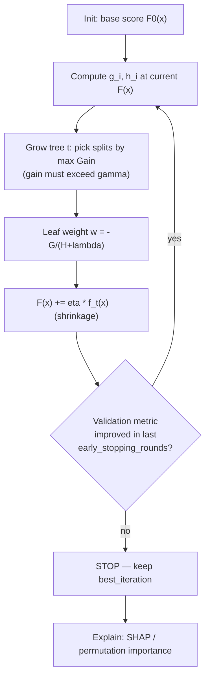

# Gradient Boosting Lab

Tabular's default winner, taught from the objective upward: **residual → gradient + Hessian → regularised
split → shrinkage → early stopping**, with runnable code and verified output, per
[`AGENTS.md`](../../../AGENTS.md). Tune the three parameters that matter before touching the other thirty.

## When to use

- You have tabular data (rows × mixed numeric/categorical features) and need a strong, fast baseline that
  beats linear models and usually beats a neural net.
- Your boosted model overfits, trains for hours, or its `feature_importances_` disagree with the domain.
- You need to explain *why* the learning rate and `n_estimators` trade off against each other.
- **Don't use it for** images, audio, or free text (use pretrained deep models), and don't use it for the
  causal question "what happens if I change X" — importance is not effect.

## First principles: boosting is gradient descent in function space

Boosting fits an additive model $\hat{y}_i = \sum_{k=1}^{K} f_k(x_i)$, adding one tree at a time. XGBoost
(Chen & Guestrin, KDD 2016) minimises a **regularised** objective and expands the loss to second order:

$$\mathcal{L}^{(t)} \simeq \sum_i \left[g_i f_t(x_i) + \tfrac{1}{2} h_i f_t(x_i)^2\right] + \Omega(f_t),
\qquad \Omega(f) = \gamma T + \tfrac{1}{2}\lambda \lVert w \rVert^2$$

with $g_i,h_i$ the first and second derivatives of the loss at the current prediction. Solving for a leaf
gives the optimal weight $w_j^\* = -G_j/(H_j+\lambda)$ and the **split gain**

$$\text{Gain} = \tfrac{1}{2}\left[\frac{G_L^2}{H_L+\lambda} + \frac{G_R^2}{H_R+\lambda}
- \frac{(G_L+G_R)^2}{H_L+H_R+\lambda}\right] - \gamma$$

so `lambda` shrinks leaf weights and `gamma` is a *minimum gain* toll: a split that does not buy at least
$\gamma$ is refused. That is the whole regularisation story, and it is why boosting can be deep and still
generalise. LightGBM (Ke et al., NeurIPS 2017) keeps the same objective but changes the *search*:
histogram binning, leaf-wise growth, GOSS sampling, and exclusive feature bundling.



| Knob | XGBoost | LightGBM | What it controls | Practical guidance |
| --- | --- | --- | --- | --- |
| Shrinkage | `eta` / `learning_rate` | `learning_rate` | how much of each tree is kept | 0.05 with early stopping; lower = more trees, better generalisation |
| Rounds | `num_boost_round` | `num_boost_round` | model capacity | set high (2000+) and let early stopping choose |
| Tree size | `max_depth` (depth-wise) | `num_leaves` (leaf-wise) | complexity per tree | LightGBM: keep `num_leaves` < 2^`max_depth`, else it overfits fast |
| Leaf minimum | `min_child_weight` (sum of Hessians) | `min_data_in_leaf` (row count) | leaf reliability | raise it first when overfitting on small data |
| Split toll | `gamma` | `min_gain_to_split` | minimum gain to split | 0 by default; raise for noisy features |
| L2 / L1 | `lambda`, `alpha` | `lambda_l2`, `lambda_l1` | leaf-weight penalty | `lambda`≈1–10 is a cheap, safe win |
| Row/col sampling | `subsample`, `colsample_bytree` | `bagging_fraction`+`bagging_freq`, `feature_fraction` | decorrelation | 0.8 / 0.8 is a solid default |
| Imbalance | `scale_pos_weight` | `scale_pos_weight` / `is_unbalance` | positive-class weight | ≈ neg/pos ratio; do **not** also oversample |

**Depth-wise vs leaf-wise.** XGBoost grows all nodes at a level; LightGBM always splits the leaf with the
largest gain, so it reaches lower loss per tree but overfits small datasets unless `num_leaves` and
`min_data_in_leaf` are constrained — this is stated in the LightGBM parameter-tuning documentation.

## Procedure

1. **Split before you touch anything**: train / validation / test, grouped or time-ordered where the data
   demands it. Early stopping consumes the validation set, so the *test* set must stay untouched.
2. **Encode honestly.** Both libraries handle missing values natively (default direction learned per
   split). LightGBM accepts pandas `category` dtype directly; XGBoost needs `enable_categorical=True`
   with `category` dtype. Avoid one-hot for high-cardinality features — it starves split gain.
3. **Baseline first**: `learning_rate=0.05`, big `num_boost_round`, early stopping on the validation
   metric. Record the metric and `best_iteration` — that pair is your reference.
4. **Fix overfitting in this order**: `min_child_weight` / `min_data_in_leaf` → `lambda` → reduce
   `num_leaves` / `max_depth` → `subsample` + `colsample` → lower `learning_rate`.
5. **Tune with a random or Bayesian search over a log-spaced grid**, refitting early stopping inside every
   fold — see [sklearn-model-selection-lab](../sklearn-model-selection-lab/SKILL.md). Grid search over
   eight parameters is wasted compute.
6. **Retrain on train+validation** at `best_iteration` (scaled up by the fold ratio) before scoring test.
7. **Never trust default importance.** `gain` is biased toward high-cardinality and continuous features;
   `split`/`weight` counts are worse. Use permutation importance or SHAP — see
   [model-explainability-lab](../model-explainability-lab/SKILL.md).
8. **Report the metric with an interval** and the confusion behaviour at the deployed threshold, then close
   with the **Learning Footer**.

## Output shape

```
Task: <binary|multiclass|regression|ranking> · rows=<n> × features=<p> · pos rate=<%>
Split: <random|grouped|time> · train/valid/test = <n>/<n>/<n>
Library: <xgboost x.y | lightgbm x.y>   Objective: <binary:logistic|reg:squarederror|...>  Metric: <auc|logloss|rmse>
Baseline: lr=0.05 · best_iteration=<n> · valid <metric>=<...>
Tuned: <param=value ...>   valid <metric>=<...> (Δ vs baseline <...>)
Overfit check: train <metric>=<...> vs valid <metric>=<...>  gap=<...>
Test: <metric>=<...>  [95% CI <...>]   threshold=<...> -> precision=<...> recall=<...>
Importance: <permutation | SHAP> top-5 = <...>   (default gain importance NOT used because <...>)
Failure modes: <leakage checked? drift? small-group performance?>
Next: <model-explainability-lab | sklearn-model-selection-lab | model-monitoring-coach>
Learning Footer
```

## Worked example — early stopping, honestly evaluated

```python
# pip install xgboost lightgbm scikit-learn pandas
import numpy as np, xgboost as xgb, lightgbm as lgb
from sklearn.datasets import make_classification
from sklearn.model_selection import train_test_split
from sklearn.metrics import roc_auc_score
from sklearn.inspection import permutation_importance

X, y = make_classification(n_samples=20_000, n_features=30, n_informative=8,
                           weights=[0.9, 0.1], random_state=0)
X_tr, X_tmp, y_tr, y_tmp = train_test_split(X, y, test_size=0.4, stratify=y, random_state=0)
X_va, X_te, y_va, y_te = train_test_split(X_tmp, y_tmp, test_size=0.5, stratify=y_tmp, random_state=0)

pos_weight = (y_tr == 0).sum() / (y_tr == 1).sum()

# --- XGBoost: native API, early stopping on the validation set -----------------
dtr, dva, dte = xgb.DMatrix(X_tr, y_tr), xgb.DMatrix(X_va, y_va), xgb.DMatrix(X_te, y_te)
params = dict(objective="binary:logistic", eval_metric="auc", eta=0.05,
              max_depth=6, min_child_weight=5, reg_lambda=2.0, gamma=0.0,
              subsample=0.8, colsample_bytree=0.8, scale_pos_weight=pos_weight,
              tree_method="hist", seed=0)
bst = xgb.train(params, dtr, num_boost_round=3000,
                evals=[(dtr, "train"), (dva, "valid")],
                early_stopping_rounds=100, verbose_eval=False)
print(f"xgb best_iteration={bst.best_iteration}  valid AUC={bst.best_score:.4f}")
te_auc = roc_auc_score(y_te, bst.predict(dte, iteration_range=(0, bst.best_iteration + 1)))
print(f"xgb test AUC={te_auc:.4f}")

# --- LightGBM: same objective, leaf-wise growth, callback-based early stopping --
ltr = lgb.Dataset(X_tr, y_tr)
lva = lgb.Dataset(X_va, y_va, reference=ltr)
lparams = dict(objective="binary", metric="auc", learning_rate=0.05,
               num_leaves=31, min_data_in_leaf=50, lambda_l2=2.0,
               feature_fraction=0.8, bagging_fraction=0.8, bagging_freq=1,
               scale_pos_weight=pos_weight, verbosity=-1, seed=0)
gbm = lgb.train(lparams, ltr, num_boost_round=3000, valid_sets=[lva],
                callbacks=[lgb.early_stopping(100, verbose=False)])
print(f"lgb best_iteration={gbm.best_iteration}  "
      f"test AUC={roc_auc_score(y_te, gbm.predict(X_te, num_iteration=gbm.best_iteration)):.4f}")

# --- Importance you can defend: permutation on held-out data -------------------
sk = xgb.XGBClassifier(**{k: v for k, v in params.items() if k != "eval_metric"},
                       n_estimators=bst.best_iteration + 1, eval_metric="auc").fit(X_tr, y_tr)
perm = permutation_importance(sk, X_te, y_te, scoring="roc_auc", n_repeats=10, random_state=0)
top = np.argsort(perm.importances_mean)[::-1][:5]
for i in top:
    print(f"f{i}: {perm.importances_mean[i]:.4f} ± {perm.importances_std[i]:.4f}")
```

Expect `best_iteration` in the hundreds rather than 3000 — the run stops when validation AUC has not
improved for 100 rounds, which is exactly the point: capacity is chosen by data, not by a guess.

## Tips

- Lower `learning_rate` + early stopping beats hand-picking `n_estimators` almost every time; the cost is
  training minutes, not accuracy.
- Early stopping *uses* the validation set, so reporting the validation metric as your headline number is
  optimistic. Keep a sealed test set.
- LightGBM's leaf-wise growth is the reason it is fast *and* the reason it overfits small data — constrain
  `num_leaves` and `min_data_in_leaf` together.
- Do not one-hot high-cardinality categoricals for trees; use native categorical support and check for
  target leakage in any encoding you compute from the label.
- `scale_pos_weight` *or* resampling — never both; doubling the correction distorts calibration.
- Default `gain` importance is biased and unstable across seeds. If a stakeholder will act on it, compute
  permutation importance or SHAP instead.
- Pair with [model-explainability-lab](../model-explainability-lab/SKILL.md),
  [sklearn-model-selection-lab](../sklearn-model-selection-lab/SKILL.md),
  [sklearn-classification-lab](../sklearn-classification-lab/SKILL.md),
  [feature-engineering-coach](../feature-engineering-coach/SKILL.md),
  [model-selection-advisor](../model-selection-advisor/SKILL.md),
  [ml-experiment-tracker](../ml-experiment-tracker/SKILL.md), and
  [model-monitoring-coach](../model-monitoring-coach/SKILL.md).
  End with the **Learning Footer** (`AGENTS.md`).
