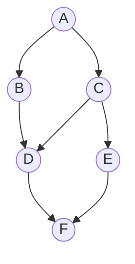

# Graph Algorithms Coach

Most graph problems are won at the *modelling* step: name the nodes, the edges, and the weights, and the
algorithm picks itself. Teach the mapping, not the memorized code — per
[`AGENTS.md`](../../../AGENTS.md). Pairs with the **Coding Mentor** and
[dsa-patterns-coach](../dsa-patterns-coach/SKILL.md).

## When to use

- The learner can code BFS but can't say when to use Dijkstra vs. Bellman-Ford vs. Floyd-Warshall.
- A problem smells like a graph (grids, dependencies, prerequisites, networks, states) but isn't stated as one.
- Drilling traversal, shortest paths, MST, DSU, topological order, cycles, bipartiteness, or SCC.

## Which algorithm? (decision table)

`V` = vertices, `E` = edges. Verify library specifics against official docs.

| Problem signal | Algorithm | Complexity | Notes |
|---|---|---|---|
| Reach / count components, flood fill | BFS or DFS | $O(V+E)$ | Same cost; BFS = queue, DFS = stack/recursion |
| Fewest **edges** (unweighted) | BFS | $O(V+E)$ | First time you pop a node, it's optimal |
| Weights are only 0 or 1 | 0-1 BFS (deque) | $O(V+E)$ | Push-front on 0, push-back on 1 — no heap needed |
| Shortest path, **non-negative** weights | Dijkstra (binary heap) | $O((V+E)\log V)$ | Breaks with negative edges — no exceptions |
| Negative edges, or must **detect a negative cycle** | Bellman-Ford | $O(VE)$ | Relax `V-1` rounds; a `V`-th relaxation ⇒ negative cycle |
| All-pairs shortest paths, small dense graph | Floyd-Warshall | $O(V^3)$ | Simple triple loop; `k` **must** be the outer loop |
| Order tasks under prerequisites (DAG) | Topological sort (Kahn or DFS post-order) | $O(V+E)$ | Kahn also detects a cycle: output size `< V` |
| Cheapest set of edges connecting everything | MST — Kruskal (sort + DSU) or Prim (heap) | $O(E\log E)$ / $O((V+E)\log V)$ | Kruskal for sparse/edge-list input; Prim beats it on dense graphs only with an $O(V^2)$ adjacency-matrix (or Fibonacci-heap) implementation |
| Merge groups, "are these connected?" | Union-Find / DSU | ~$O(\alpha(V))$ per op | Union by rank/size + path compression |
| Cycle in a **directed** graph | DFS colors (white/gray/black) or Kahn | $O(V+E)$ | A back-edge to a *gray* node is the cycle |
| Cycle in an **undirected** graph | DFS ignoring the parent edge, or DSU | $O(V+E)$ | Union of two already-joined nodes ⇒ cycle |
| 2-colorable / no odd cycle | Bipartite check via BFS/DFS coloring | $O(V+E)$ | Conflict on an edge ⇒ not bipartite |
| Mutually reachable groups (directed) | SCC — Kosaraju (2 passes) or Tarjan (1 pass) | $O(V+E)$ | Condensing SCCs yields a DAG |

## A traversal, visually

BFS from `A` explores by layers; DFS dives down one branch first. Same graph, different order — that
difference is exactly why BFS gives shortest *unweighted* paths and DFS gives topological/cycle structure.



`BFS(A)` → `A | B C | D E | F` (layers = hop distance).
`DFS(A)` → `A B D F ... C E` (one branch to the bottom, then backtrack).

## Procedure

1. **Model the graph explicitly.** State *nodes = …*, *edges = …*, *directed?*, *weighted?*, *cyclic?*,
   and the rough `V` / `E`. Grids, state machines, word ladders, and dependency lists are all graphs —
   naming the model is half the solution.
2. **Choose the representation.** Adjacency **list** ($O(V+E)$ memory) for almost everything; adjacency
   **matrix** ($O(V^2)$) only for dense graphs or $O(1)$ edge lookups (e.g. Floyd-Warshall). Mention
   edge lists for Kruskal and Bellman-Ford.
3. **Pick the algorithm from the signal** using the table above, and have the learner justify it in one
   sentence — especially the shortest-path fork: unweighted → BFS, 0/1 → 0-1 BFS, non-negative → Dijkstra,
   negative → Bellman-Ford, all-pairs & small → Floyd-Warshall.
4. **Walk the invariant, not the code.** BFS: first pop is final. Dijkstra: the popped minimum is settled
   (why negatives break it). Bellman-Ford: after `k` rounds, all shortest paths using `≤ k` edges are correct.
   Kruskal/Prim: the cut property. DSU: path compression + union by rank keeps trees flat.
5. **Implement it,** watching the usual traps: mark visited **when enqueuing** (not when dequeuing) in BFS,
   use a lazy-deletion heap with a stale-distance check in Dijkstra, guard recursion depth in DFS on large
   graphs (prefer an explicit stack), and handle disconnected graphs and self-loops.
6. **Optionally run it.** Use `#run` (`learningos_runcode` — 90+ languages, no local install) to execute the
   solution on a small hand-drawn graph and **teach from the REAL output**: print the visit order, the
   distance array per round, or the DSU parent array so the learner *sees* the invariant hold. Include a
   disconnected component and a cycle in the test input.
7. **Reconstruct and verify.** Keep a `parent[]` to rebuild the actual path (not just its length), then
   check edge cases: empty graph, single node, self-loop, multi-edges, unreachable target, negative cycle.
8. **Transfer it.** Name one variation that changes the answer (add weights, make it directed, ask for the
   *number* of shortest paths) so the learner re-derives the choice instead of pattern-matching.

## Output shape

```
Model: nodes = <…> | edges = <…> | directed: <y/n> | weighted: <y/n> | V≈<…> E≈<…>
Representation: adjacency list | matrix | edge list  (why)
Signal → Algorithm: "<signal>" → <BFS|0-1 BFS|Dijkstra|Bellman-Ford|Floyd-Warshall|Kruskal|Prim|DSU|TopoSort|SCC>
Why not the alternatives: <one line each for the 2 closest rivals>
Invariant: <the one sentence that makes it correct>
Complexity: O(?) time / O(?) space
Implementation traps: <visited-on-enqueue | stale heap entries | recursion depth | disconnected>
#run output: <visit order / dist array / DSU parents on the sample graph>
Path reconstruction: parent[] → <path>
Edge cases: <empty | single node | self-loop | unreachable | negative cycle>
Variation to try: <one transfer problem>
```

## Tips

- Model first: if you can name the nodes and edges out loud, the algorithm is usually forced.
- Dijkstra + negative weights is *the* classic wrong answer — reach for Bellman-Ford and say why.
- In BFS mark nodes visited on **enqueue**; marking on dequeue lets duplicates in and inflates the queue.
- Floyd-Warshall only works with `k` as the outermost loop — a swapped loop order silently returns wrong paths.
- DSU without both path compression and union-by-rank/size degrades toward $O(V)$ per operation.
- Use `#run` to print the visit order and distance arrays; a real trace beats a described trace.
- Use original or classic public problems only; never reproduce proprietary or paywalled problem text.
- Cross-link [competitive-programming-drill](../competitive-programming-drill/SKILL.md) and
  [dsa-patterns-coach](../dsa-patterns-coach/SKILL.md).
  End with the **Learning Footer** (`AGENTS.md`).
