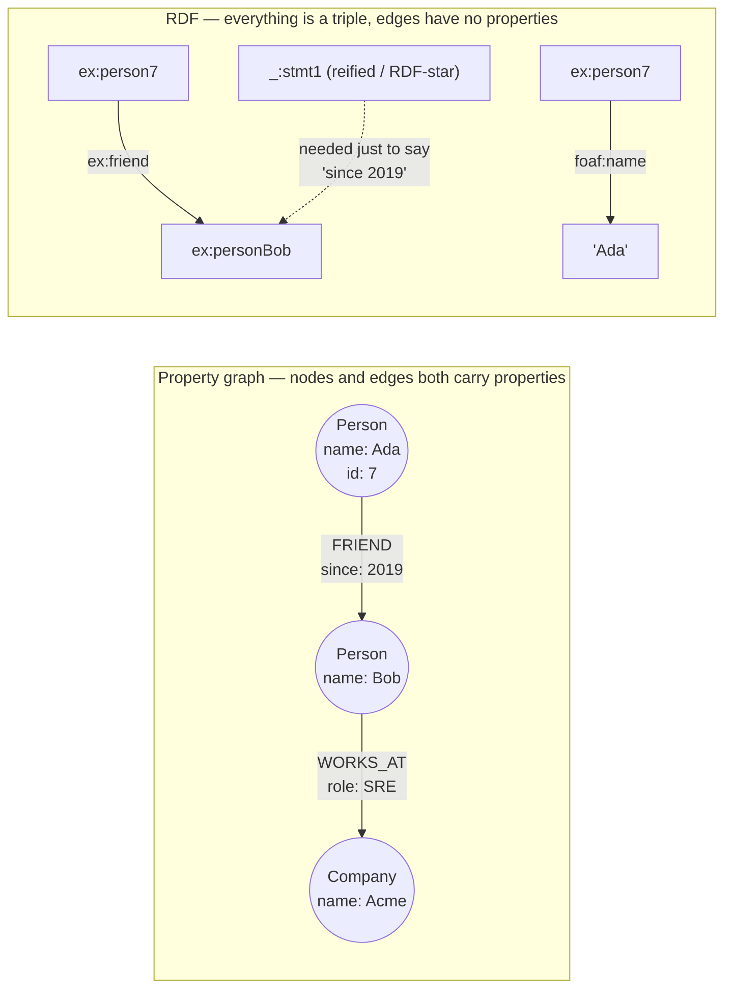

# Graph Data Modeling Coach

A graph database is worth its operational cost only when your questions are about **paths**, not about rows.
This skill derives that boundary from the storage mechanism, then teaches the modelling decisions that make a
graph fast or ruin it — first principles before tooling, as [`AGENTS.md`](../../../AGENTS.md) requires.

## When to use

- Recursive CTEs are timing out, or the hop depth in your queries is variable/unknown.
- Fraud rings, recommendations, access-control reachability, bills of materials, org hierarchies, lineage.
- You are building a knowledge graph and must choose between a property graph and RDF/SPARQL.
- Your Cypher looks fine but one query touches millions of relationships (a supernode).
- **Don't use it for** the algorithms themselves (Dijkstra, PageRank, community detection) — that's
  [graph-algorithms-coach](../graph-algorithms-coach/SKILL.md); or for a general store-selection decision —
  [database-selection-advisor](../database-selection-advisor/SKILL.md).

## First principles: index-free adjacency

In a relational store, "follow a relationship" means **look up an index**: a B-tree probe costing
$O(\log N)$ over the whole join table, repeated for every intermediate row. In a native property graph, each
node holds direct references to its incident relationships, so following one costs a pointer dereference —
$O(1)$ per edge, **independent of graph size**. That is the entire performance argument, and it only pays off
when you traverse repeatedly.

$$\text{cost}_{\text{relational}} \approx \sum_{i=1}^{k} b^{i}\cdot O(\log N)
\qquad
\text{cost}_{\text{graph}} \approx \sum_{i=1}^{k} b^{i}\cdot O(1)$$

with branching factor $b$ and hop depth $k$. Two consequences follow immediately: the advantage grows with
**depth**, and it grows with **dataset size** — but for $k = 1$ with aggregation over many rows, the relational
engine's set-based, sequential-scan machinery still wins outright.



*The single biggest practical difference: a property graph puts attributes **on the edge**; RDF must reify the
statement (or use RDF-star) to say anything about a relationship.*

| | **Property graph** (Neo4j, Memgraph, Neptune PG, TigerGraph) | **RDF triple store** (Jena, GraphDB, Neptune RDF) |
| --- | --- | --- |
| Unit | node / typed directed relationship, both with properties | triple `(subject, predicate, object)` |
| Identity | internal ids + your business keys | global IRIs — merges data across organisations for free |
| Edge properties | native | requires reification or RDF-star |
| Query language | **Cypher** (openCypher), **GQL** — ISO/IEC 39075:2024, the first new ISO database language since SQL | **SPARQL 1.1** (W3C Recommendation, 21 March 2013), over **RDF 1.1** (W3C, 25 February 2014) |
| Schema/inference | schema-optional, constraints/indexes | RDFS/OWL entailment, formal semantics |
| Best fit | operational app queries, traversals, recommendations | data integration, vocabularies, published/linked open data |

⚠ RDF 1.2 / RDF-star and the GQL conformance landscape are moving — **verify status on the W3C and ISO pages
before quoting a version in a design document.**

### Node, property, or relationship? The three-question test

| Ask | If yes | Example |
| --- | --- | --- |
| Do I ever traverse *to* it, or share it between entities? | make it a **node** | `city`, `skill`, `product category` |
| Do I only ever read it as an attribute of one entity? | make it a **property** | `name`, `created_at`, `price` |
| Does the fact connect two entities and need its own attributes? | typed **relationship** with properties, or an **intermediate node** if it connects three or more | `:RATED {stars, at}`; `(Actor)-[:PLAYED]->(Role)-[:IN]->(Film)` |

Prefer many **specific relationship types** (`:FOLLOWS`, `:BLOCKS`) over one generic type with a `type`
property (`:REL {type:'follows'}`): type filtering is applied while walking the adjacency list, whereas a
property filter forces you to load and inspect every relationship record.

### Anti-patterns that cost the most

| Anti-pattern | Why it hurts | Fix |
| --- | --- | --- |
| **Supernode / dense node** (a `:Country` node with 40 M `:LIVES_IN` edges) | every traversal through it degrades to a scan of its adjacency list | split by relationship type/direction, insert time-bucket nodes, or invert the query to start elsewhere |
| No index on the anchor | traversal is fast, but *finding the starting node* is a full label scan | `CREATE CONSTRAINT`/`CREATE INDEX` on the lookup property — always |
| Unbounded variable-length pattern (`[:REL*]`) | combinatorial blow-up, memory exhaustion | always bound it: `[:REL*1..4]` |
| "Everything is a node" | billions of tiny nodes, huge degree, no locality | properties stay properties unless the test above says otherwise |
| Duplicating a fact as both property and relationship | the two drift apart | pick one source of truth |
| Using the graph as a document store / bulk-analytics engine | poor scan and aggregation performance | keep the tabular workload in [postgres-local-lab](../postgres-local-lab/SKILL.md) or an OLAP engine |

## Procedure

1. **Write the questions down as sentences**, each with its hop depth: "which accounts are within 4 hops of a
   known fraudulent account?" ($k = 4$, variable) versus "total revenue per region last month" ($k = 1$,
   aggregate). Count how many are genuinely path-shaped — if it is zero, stop; you need better SQL indexes.
2. **Choose the model**: property graph for operational traversals with edge attributes; RDF when global
   identifiers, third-party vocabularies, or formal inference matter.
3. **Sketch the model as a whiteboard graph** (one concrete instance, real names, real property values), then
   apply the node/property/relationship test to every attribute.
4. **Estimate degree distribution before loading.** Find the maximum out-degree per relationship type; anything
   over ~100 k is a supernode and must be designed around now, not later.
5. **Run it locally, free:**
   ```bash
   docker run --rm -d --name neo -p 7474:7474 -p 7687:7687 -e NEO4J_AUTH=neo4j/password neo4j:5
   # RDF alternative:
   docker run --rm -d --name fuseki -p 3030:3030 stain/jena-fuseki
   ```
6. **Constrain and index the anchors first** — this is not optional tuning, it is the entry point of every query:
   ```cypher
   CREATE CONSTRAINT person_id IF NOT EXISTS FOR (p:Person) REQUIRE p.id IS UNIQUE;
   CREATE INDEX company_name IF NOT EXISTS FOR (c:Company) ON (c.name);
   ```
7. **Load idempotently with `MERGE`** — and note that `MERGE` is only safe against concurrent writers when a
   uniqueness constraint backs the matched pattern:
   ```cypher
   MERGE (a:Person {id: 7})  ON CREATE SET a.name = 'Ada'
   MERGE (b:Person {id: 12}) ON CREATE SET b.name = 'Bob'
   MERGE (a)-[r:FRIEND]->(b) ON CREATE SET r.since = date('2019-04-01');
   ```
8. **Write the traversal with a bounded depth, and `PROFILE` it**:
   ```cypher
   PROFILE
   MATCH (a:Person {id: 7})-[:FRIEND*1..3]-(b:Person)
   WHERE b.id <> 7
   RETURN DISTINCT b.id, b.name LIMIT 100;
   ```
   Read `db hits` per operator: a `NodeIndexSeek` at the anchor followed by `Expand(All)` steps is the shape
   you want; a `NodeByLabelScan` at the anchor means step 6 was skipped.
9. **Benchmark against the relational version honestly** (same data, warm cache, same result set) before
   adopting a second database — the operational cost of a new store is real.
10. **Record the model, the degree assumptions and the benchmark**, then close with the **Learning Footer**.

## Output shape

```
Domain: <...>   Questions: <q1 (k=<hops>, <fixed|variable>)>, <q2 ...>   Path-shaped: <n of m>
Model: <property graph | RDF>   because <edge properties | global IRIs | inference | tooling>
Nodes: <Label(key props)> ...        Relationships: <(A)-[:TYPE {props}]->(B)> ...
Node/property/relationship decisions: <attribute → choice → reason> (list the contested ones)
Degree check: max out-degree per type = <n>  supernode risk: <none | Label:TYPE — mitigation: <...>>
Anchors indexed: <constraints/indexes created>   (traversal is O(1)/edge; the ANCHOR is the index lookup)
Query: <cypher>   PROFILE: anchor op=<NodeIndexSeek|NodeByLabelScan ❌> db hits=<n> rows=<n>
Relational baseline: <recursive CTE ms / rows examined>   Graph: <ms / db hits>   Ratio: <x>
Verdict: <adopt a graph store | model it relationally — the questions are not path-shaped>
Next: <graph-algorithms-coach | nosql-data-modeling | knowledge-graph>
Learning Footer
```

## Worked example — three hops, counted both ways

Social graph: **1 000 000 people**, average **50** friendships each ⇒ a `friendship` table of
$1{,}000{,}000 \times 50 = 50{,}000{,}000$ directed rows. Question: *who is within three hops of person 7?*

Relational (PostgreSQL):

```sql
WITH RECURSIVE reach(person_id, depth) AS (
    SELECT friend_id, 1
      FROM friendship WHERE user_id = 7
  UNION
    SELECT f.friend_id, r.depth + 1
      FROM reach r
      JOIN friendship f ON f.user_id = r.person_id
     WHERE r.depth < 3
)
SELECT DISTINCT person_id FROM reach;
```

Cypher:

```cypher
MATCH (a:Person {id: 7})-[:FRIEND*1..3]-(b:Person)
RETURN DISTINCT b.id;
```

Count the work, level by level, with branching factor $b = 50$:

| Hop | Rows/paths expanded | Relational cost | Graph cost |
| --- | --- | --- | --- |
| 1 | 50 | 1 index seek + 50 rows | 1 index seek (anchor) + 50 pointer hops |
| 2 | $50^2 = 2\,500$ | 50 index seeks | 2 500 pointer hops |
| 3 | $50^3 = 125\,000$ | 2 500 index seeks | 125 000 pointer hops |
| **Total** | **127 550 expansions** | **2 551 B-tree probes**, each ≈ $\log_2(5\times10^7) \approx 25.6$ comparisons ⇒ ≈ **65 300 comparisons** *plus* 127 550 rows materialised and de-duplicated through the recursive worktable | **127 550 dereferences**, no probes after the anchor |

Two honest readings of that table. First, the relational plan is **not** catastrophic here — 2 551 index seeks
is small; the real cost is materialising and de-duplicating 127 550 intermediate rows through the recursion
worktable, and it is memory, not CPU, that usually breaks first. Second, extend the query to **five** hops and
the picture changes qualitatively: $50^5 = 312{,}500{,}000$ paths. Neither engine should enumerate that — the
correct answer is not "use a graph database", it is **change the question**: bound the result
(shortest path, `LIMIT`, a filtered relationship type, or a bidirectional search from both endpoints, which
costs $2 \times 50^{2.5}$-ish instead of $50^{5}$).

Where the graph genuinely wins is the *variable* case — "the shortest chain of any length between A and B",
"all paths avoiding blocked users", "reachability under a permission relationship" — which SQL can express
only as an unbounded recursive CTE with hand-written cycle detection, and which the graph engine executes as a
bounded bidirectional search with relationship-uniqueness built in.

One Cypher subtlety that changes results and is routinely missed: in Cypher a variable-length pattern uses
**relationship uniqueness** — no single relationship is traversed twice within one path — rather than node
uniqueness. So a path may legitimately revisit a *node* (A→B→C→B is a valid 3-hop path if the two B-edges
differ), which is why `DISTINCT` on the endpoint is nearly always required, and why path counts can exceed
naive expectations. Trace this on paper for a triangle before you trust a path count.

## Tips

- The traversal is O(1) per edge; **finding the starting node is not**. Every fast graph query begins with an
  index seek — constrain your anchor properties before benchmarking anything.
- Always bound variable-length patterns. `[:REL*]` on a connected social graph is an out-of-memory error with
  extra steps.
- Prefer several specific relationship types over one generic type plus a property; type filtering happens
  during expansion, property filtering after loading the record.
- Supernodes are the dominant production failure mode. Detect them by degree distribution *before* go-live and
  design around them ([graph-algorithms-coach](../graph-algorithms-coach/SKILL.md)).
- Edge properties are the honest deciding factor between property graphs and RDF; if you need them everywhere,
  RDF will make you reify everything.
- A graph store rarely replaces the relational one — it usually sits beside it. Keep the tabular truth in SQL
  and project the connected view ([nosql-data-modeling](../nosql-data-modeling/SKILL.md),
  [er-diagram-generator](../er-diagram-generator/SKILL.md)).
- Try the relational version properly first with [sql-cte-lab](../sql-cte-lab/SKILL.md) and
  [sql-joins-lab](../sql-joins-lab/SKILL.md) plus indexes from
  [database-index-coach](../database-index-coach/SKILL.md); many "we need a graph DB" cases are a missing
  composite index.
- Building a knowledge graph for retrieval? Combine with [knowledge-graph](../knowledge-graph/SKILL.md) and
  [rag-designer](../rag-designer/SKILL.md). Practise the modelling with
  [data-modeling-drill](../data-modeling-drill/SKILL.md), and end with the **Learning Footer** (`AGENTS.md`).
