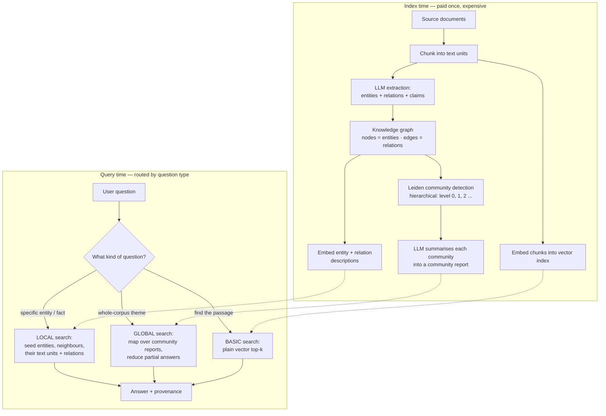

# GraphRAG Coach

Plain vector RAG retrieves the *k* chunks most similar to a question. That is exactly the wrong tool for
"what are the main themes across all 3,000 incident reports?" — because no single chunk contains the answer.
GraphRAG builds a **graph of entities and relations** first, summarises its **communities**, and answers
whole-corpus questions from those summaries. This skill teaches the design and the honest cost, following
the source-discipline rules in [`AGENTS.md`](../../../AGENTS.md).

## When to use

- Your questions are **multi-hop**: the evidence for one answer is spread across documents that never
  mention each other, so no chunk is similar to the question.
- Your questions are **global / query-focused summarisation**: "what are the recurring themes", "how did
  this entity's role change", "who connects A and B" — answers that require reading the *whole* corpus.
- Your corpus is **entity-dense** and the entities recur: incident reports, clinical notes, contracts,
  regulatory filings, security intel, org and supply-chain data.
- You need **provenance you can walk**: an answer traced through named entities and relations, not just a
  bag of chunks.
- **Don't use it for** simple fact lookup, FAQ, or "find me the passage that says X" — vector or hybrid
  BM25 retrieval answers those faster and for a fraction of the indexing cost. **Don't use it** when your
  documents are independent and share no entities (a graph over disconnected nodes is a slower vector
  store). And don't reach for it before you have measured that plain RAG actually fails — start with
  [rag-designer](../rag-designer/SKILL.md) and prove the gap with
  [rag-evaluation-coach](../rag-evaluation-coach/SKILL.md).

## First principles: similarity retrieval vs structure retrieval

**Primary sources.** Microsoft Research introduced GraphRAG in *"GraphRAG: Unlocking LLM discovery on
narrative private data"* (Microsoft Research blog, **13 February 2024**), with the method paper Edge et al.,
*"From Local to Global: A Graph RAG Approach to Query-Focused Summarization"* (**arXiv:2404.16130,
24 April 2024**). The open-source implementation lives at `github.com/microsoft/graphrag`, documented at
`microsoft.github.io/graphrag`. Community detection uses the **Leiden** algorithm (Traag, Waltman & van Eck,
*"From Louvain to Leiden: guaranteeing well-connected communities"*, **Scientific Reports 9:5233, 2019**),
which fixes Louvain's badly-connected-community defect. The retrieval foundation is Lewis et al.,
*"Retrieval-Augmented Generation for Knowledge-Intensive NLP Tasks"* (**arXiv:2005.11401, 22 May 2020**).

The core insight is a change of *index geometry*. Vector RAG indexes **text by meaning** and answers
"what is near this question?". GraphRAG indexes **entities by relation** and answers "what is connected to
this, and what does each cluster of the corpus say?". A question that requires traversal cannot be solved by
nearness, no matter how good the embedding model is.



*Figure — the two halves of GraphRAG. The expensive half runs once at index time; the cheap half routes each
question to the retrieval geometry that can actually answer it.*

| Question type | Example | Best retrieval | Why |
| --- | --- | --- | --- |
| Fact lookup | "What is the refund window?" | vector / BM25 hybrid | the answer sits in one chunk; nearness is enough |
| Entity-centric | "Everything we know about supplier X" | **graph local** | one hop from a seed node beats top-k similarity |
| Multi-hop | "Which customers are exposed to the vendor that shipped the bad firmware?" | **graph local, 2–3 hops** | no chunk contains both ends of the chain |
| Global / thematic | "What are the recurring root causes this year?" | **graph global (community reports)** | needs the whole corpus, not the nearest *k* |
| Aggregation / counting | "How many incidents involved X?" | SQL over the extracted tables | an LLM summarising a graph is a bad counter — use [sql-coach](../sql-coach/SKILL.md) |

**Cost is the honest trade-off.** Indexing runs an LLM over every chunk (extraction) *and* over every
community (summarisation), so index cost scales with corpus size and sits orders of magnitude above "embed
each chunk once". Microsoft published **LazyGraphRAG** (Microsoft Research blog, **25 November 2024**) and a
`--method fast` indexing path precisely because index cost was the adoption blocker.
⚠ Indexing prices, default models, and CLI flags change between releases — **verify on the current
`microsoft.github.io/graphrag` page and with `graphrag index --help` before quoting any number.**

## Procedure

1. **Prove plain RAG fails first.** Build a 30–50 question eval set that deliberately includes multi-hop and
   global questions. Run your existing pipeline. If recall@k is already high, stop — you don't need a graph.
   Record the failing questions; they are your acceptance criteria.
2. **Define the ontology, loosely.** Decide the entity types that matter (`PERSON`, `SYSTEM`, `VENDOR`,
   `ROOT_CAUSE`, …) and the relation types you will actually query. An unconstrained extractor produces a
   hairball; a 6–10 type ontology produces a queryable graph.
3. **Scaffold a project.**
   ```powershell
   python -m venv .venv; .\.venv\Scripts\Activate.ps1   # POSIX: source .venv/bin/activate
   pip install graphrag
   graphrag init --root .\ragtest                        # writes settings.yaml, .env, prompts\
   New-Item -ItemType Directory .\ragtest\input          # drop .txt / .csv sources here
   ```
   Point `settings.yaml` at your model — including a **local** OpenAI-compatible endpoint if you want a
   zero-cost run, see [ollama-local-llm-lab](../ollama-local-llm-lab/SKILL.md) — and put your entity types
   into the entity-extraction prompt under `prompts\`.
4. **Tune the extraction prompt to your domain.** This is the highest-leverage step, because every
   downstream artefact is built from what the extractor found:
   ```powershell
   graphrag prompt-tune --root .\ragtest    # generates domain-specific prompts from your own data
   ```
5. **Index**, starting on a 5% sample so you discover a bad ontology for 5% of the cost:
   ```powershell
   graphrag index --root .\ragtest --method standard --verbose
   # --method fast trades extraction depth for a much cheaper run; --dry-run validates config only
   ```
6. **Inspect the graph before you trust it.** Load the output parquet files and check node count, edge
   count, degree distribution, orphan rate, and duplicate entities (`Acme Corp` / `ACME` / `Acme Inc.`).
   A high orphan rate means the extractor isn't finding your relations; duplicates mean you need entity
   resolution before anything else.
7. **Query with the method that matches the question**, never with only one:
   ```powershell
   graphrag query --root .\ragtest --method local  --query "What is vendor X connected to?"
   graphrag query --root .\ragtest --method global --query "What are the main themes?"
   graphrag query --root .\ragtest --method basic  --query "Find the clause about refunds."
   ```
   `--method drift` blends a global seed with local follow-ups; `--community-level` picks how coarse the
   hierarchy is (lower level = broader themes, fewer reports, cheaper global search).
8. **Build the router.** In production, classify the incoming question (fact / entity / multi-hop / global)
   and dispatch. A hybrid that runs vector *and* graph retrieval and merges by re-rank is the pragmatic
   default; pure GraphRAG on every query is expensive and often worse for lookups.
9. **Evaluate the graph and the answers separately.** Graph quality: entity precision, relation precision,
   orphan rate, duplicate rate, modularity. Answer quality: comprehensiveness, diversity, groundedness, and
   walkable provenance — hand to [rag-evaluation-coach](../rag-evaluation-coach/SKILL.md).
10. **Plan re-indexing.** `graphrag update` handles incremental additions; a changed ontology means a full
    rebuild. Budget it, then close with the **Learning Footer**.

## Output shape

```
Corpus: <what, size, entity density>   Questions plain RAG cannot answer: <n examples>
Ontology: entities=<TYPE, TYPE, ...>  relations=<VERB, VERB, ...>  (why these and not more)
Graph stats: nodes=<n> edges=<m> avg degree=<d> orphans=<x%> duplicate-entity rate=<y%>
Communities: levels=<0..k> · count per level=<...> · modularity Q=<...> · report tokens=<...>
Routing table:
  fact lookup   -> basic/vector        | entity-centric -> local
  multi-hop     -> local (<n> hops)    | global theme   -> global (community-level <k>)
  counting/agg  -> SQL over the extracted entity/relation tables, NOT the LLM
Cost: index=<LLM calls, $ or local GPU-hours> · per query=<local $x / global $y> · re-index trigger=<...>
Eval: recall@k plain=<...> vs graph=<...> · groundedness=<...> · win/loss per question class
Decision: <graph justified because ... | plain hybrid RAG is enough because ...>
Risks: hallucinated relations · stale graph · duplicate entities · index cost · injected instructions
Next: <rag-evaluation-coach | knowledge-graph | vector-db-selector>
Learning Footer
```

## Worked example — why a graph answers what similarity cannot

You need no LLM and no API key to *understand* the mechanism. Build the graph by hand, detect communities
with a NetworkX algorithm, and watch a multi-hop answer appear that no chunk contains. (NetworkX ships
`greedy_modularity_communities`, a Clauset–Newman–Moore method; production GraphRAG uses Leiden via
`graspologic`, but the objective — maximise modularity — is the same.)

```python
# pip install networkx
import networkx as nx

# Each triple is what an LLM extractor would emit from one chunk: (subject, object, relation)
EDGES = [
    ("Ada Lovelace",      "Analytical Engine", "wrote the first algorithm for"),
    ("Charles Babbage",   "Analytical Engine", "designed"),
    ("Ada Lovelace",      "Charles Babbage",   "collaborated with"),
    ("Analytical Engine", "Difference Engine", "successor of"),
    ("Charles Babbage",   "Difference Engine", "designed"),
    ("Alan Turing",       "Turing Machine",    "defined"),
    ("Turing Machine",    "Computability",     "formalises"),
    ("Alan Turing",       "Bletchley Park",    "worked at"),
    ("Bletchley Park",    "Bombe",             "housed"),
    ("Alan Turing",       "Bombe",             "co-designed"),
    ("Turing Machine",    "Analytical Engine", "is Turing-equivalent to"),
    ("Grace Hopper",      "COBOL",             "led the design of"),
    ("Grace Hopper",      "UNIVAC I",          "programmed"),
    ("COBOL",             "Compiler",          "is compiled by"),
    ("Grace Hopper",      "Compiler",          "pioneered"),
]

G = nx.Graph()
for s, o, rel in EDGES:
    G.add_edge(s, o, relation=rel)

print("nodes", G.number_of_nodes(), "edges", G.number_of_edges())

# --- community detection: the input to "global" search ---
comms = sorted(nx.community.greedy_modularity_communities(G), key=len, reverse=True)
for i, c in enumerate(comms):
    print(f"community {i}: {sorted(c)}")
print("modularity Q =", round(nx.community.modularity(G, comms), 4))

# --- the multi-hop question no single chunk can answer ---
print("Ada -> Bombe:", nx.shortest_path(G, "Ada Lovelace", "Bombe"))
```

Traced output (verified by running this exact script on networkx 3.6):

```
nodes 13 edges 15
community 0: ['Alan Turing', 'Bletchley Park', 'Bombe', 'Computability', 'Turing Machine']
community 1: ['Ada Lovelace', 'Analytical Engine', 'Charles Babbage', 'Difference Engine']
community 2: ['COBOL', 'Compiler', 'Grace Hopper', 'UNIVAC I']
modularity Q = 0.5933
Ada -> Bombe: ['Ada Lovelace', 'Analytical Engine', 'Turing Machine', 'Alan Turing', 'Bombe']
```

Read what just happened, because it is the whole argument for GraphRAG:

- **Three communities emerged with no labels and no supervision** — a 19th-century mechanical-computing
  cluster, a Turing/Bletchley cluster, and a Hopper/compilers cluster. Modularity $Q = 0.59$ (roughly 0 to 1;
  above about 0.3 indicates genuine community structure). *Summarising each community once, at index time,
  is exactly what makes "what are the main themes?" answerable in three LLM calls instead of 3,000.*
- **The Ada → Bombe path is four hops long and crosses two communities.** No chunk mentions both Ada Lovelace
  and the Bombe, so cosine similarity against "how is Ada Lovelace connected to the Bombe?" retrieves nothing
  useful at any *k*. The bridge is one edge — `Turing Machine —is Turing-equivalent to→ Analytical Engine` —
  extracted from a single sentence in a single document.
- **That also exposes the failure mode.** If the extractor misses that one edge, the graph splits and the
  answer becomes *unreachable* rather than merely low-ranked. Graph retrieval degrades **discontinuously**
  where vector retrieval degrades gracefully — which is why step 6 (inspect orphans and degree distribution)
  is not optional.

Scale it up by replacing the hand-written `EDGES` list with LLM extraction over your chunks; everything
downstream — communities, reports, local and global search — is the same machinery.

## Tips

- **Extraction quality is the ceiling.** Every community report, traversal, and citation is built on the
  triples; a mediocre extractor cannot be rescued by a better retriever. Spend your effort on `prompt-tune`
  and on a small hand-labelled triple set you can score against.
- **Entity resolution is the silent killer.** `Acme Corp`, `ACME`, and `Acme Inc.` become three nodes and the
  graph quietly fragments. Normalise aggressively and track duplicate rate as a first-class metric.
- **Global search is a map-reduce over community reports**, so its query cost scales with the number of
  communities at the chosen `--community-level`, not with corpus size. That dial is your main cost control.
- **Hybrid beats pure almost always.** Keep the vector index, route lookups to it, and reserve traversal for
  questions that need structure — see [vector-db-selector](../vector-db-selector/SKILL.md) and
  [embeddings-explainer](../embeddings-explainer/SKILL.md).
- **Never ask the LLM to count over a graph.** Push aggregations to a real query engine over the extracted
  entity and relation tables; the parquet outputs load straight into
  [duckdb-lab](../duckdb-lab/SKILL.md).
- **Graphs go stale differently.** One new document can invalidate a community summary written last month.
  Define the re-index trigger explicitly and watch it like a model in production
  ([model-monitoring-coach](../model-monitoring-coach/SKILL.md)).
- **Extracted text is untrusted input.** Documents that reach an LLM extractor can carry injected
  instructions — pair with [prompt-injection-defense](../prompt-injection-defense/SKILL.md).
- Related: [rag-designer](../rag-designer/SKILL.md),
  [rag-evaluation-coach](../rag-evaluation-coach/SKILL.md),
  [knowledge-graph](../knowledge-graph/SKILL.md),
  [graph-algorithms-coach](../graph-algorithms-coach/SKILL.md),
  [pgvector-local-lab](../pgvector-local-lab/SKILL.md),
  [ollama-rag-lab](../ollama-rag-lab/SKILL.md), and
  [llm-cost-optimizer](../llm-cost-optimizer/SKILL.md) for the indexing bill.
  End with the **Learning Footer** (`AGENTS.md`).
