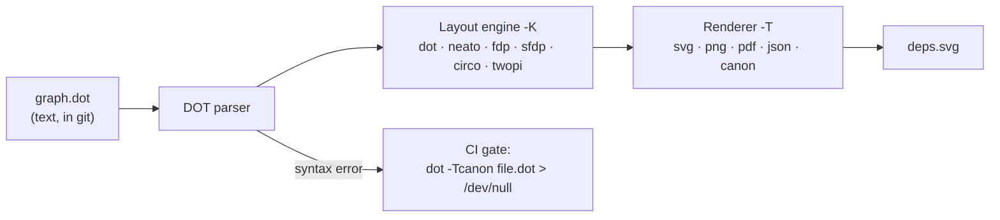
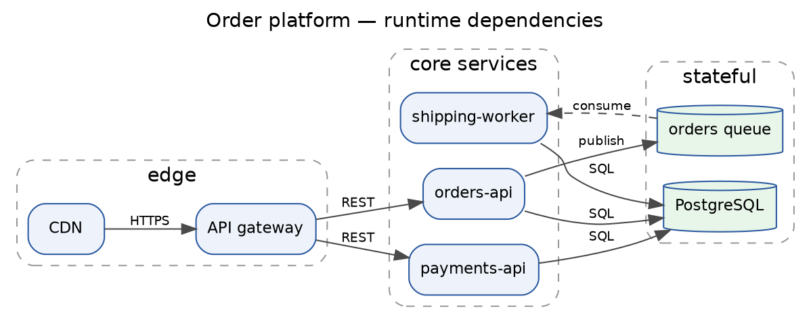

# Graphviz DOT Lab

DOT is the oldest still-winning idea in diagram-as-code: describe a graph as text, let a **layout engine**
place it. This lab teaches the language by writing graphs that actually parse and render, in the
learn-by-doing spirit of [`AGENTS.md`](../../../AGENTS.md).

## When to use

- You have a graph that is **generated** — dependencies, imports, call graphs, state machines, DAGs from a
  build tool — and hand-placing nodes is not an option.
- Your diagram is a hairball and you suspect the **engine**, not the diagram, is wrong.
- You need layout control Mermaid does not expose: ranks, clusters, ports, record labels, edge constraints.
- You need one command in CI that fails the build when a diagram stops parsing.
- **Don't use it for** sequence diagrams, gantt charts or anything that must render *inline on GitHub with
  no build step* — that is [Mermaid's](../diagram-as-code-coach/SKILL.md) home turf. Also don't use it for
  quantitative data; that is a chart ([data-viz-coach](../data-viz-coach/SKILL.md)), not a graph.

## First principles: three things, then everything else is attributes

The **DOT language** has a published grammar (Graphviz project, *The DOT Language* —
`graphviz.org/doc/info/lang.html`; attribute reference at `graphviz.org/doc/info/attrs.html`). Reduced to
essentials:

1. A **graph** is `graph` (undirected, edges `--`) or `digraph` (directed, edges `->`). Mixing the edge
   operator with the wrong graph kind is the #1 beginner parse error.
2. **Statements** are `node [attrs]`, `a -> b [attrs]`, `attr=value`, or a nested `subgraph { ... }`.
   Semicolons are optional but make generated DOT far easier to diff.
3. Bare `node [...]` / `edge [...]` / `graph [...]` lines set **defaults for everything declared after
   them**, in that scope. This ordering rule is why "my style didn't apply" — the node already existed.

The layout is not your job; it is the engine's. `dot` implements the layered/hierarchical approach
(Gansner, Koutsofios, North & Vo, *A Technique for Drawing Directed Graphs*, IEEE TSE, 1993 — itself
building on Sugiyama, Tagawa & Toda, 1981). `neato` uses a spring/stress model in the Kamada–Kawai (1989)
tradition; `fdp` uses Fruchterman–Reingold (1991) force-directed placement.



*Figure 1 — The DOT toolchain. The engine (`-K`) decides readability; the format (`-T`) decides where the picture lands. Only the leftmost box belongs in git.*

### Choose the engine before you edit the diagram

| Engine | Algorithm family | Best for | Symptom that it's the wrong pick |
| --- | --- | --- | --- |
| `dot` (default) | layered / hierarchical | DAGs, dependency & call graphs, flow with a direction | dense undirected graph turns into a spaghetti ladder |
| `neato` | stress majorization (spring model) | small–medium undirected graphs where *distance* means something | slow and tangled above ~1k nodes |
| `fdp` | force-directed (Fruchterman–Reingold) | undirected graphs **with clusters** | node overlap on very large graphs |
| `sfdp` | multiscale force-directed | 10k+ node graphs | over-compressed for small graphs |
| `circo` | circular | cyclic/ring topologies, network rings | hides hierarchy that `dot` would show |
| `twopi` | radial | one obvious root + concentric levels | meaningless without a real centre |

Select with `-K`: `neato -Tsvg g.dot -o g.svg` and `dot -Kneato -Tsvg g.dot -o g.svg` are the same request.
⚠ The engine list and available `-T` formats depend on your build — run `dot -?` on your machine and
**verify on the current Graphviz docs page** rather than trusting a remembered list.

### DOT vs Mermaid — the honest split

| Question | Answer |
| --- | --- |
| Must it render in a GitHub README/comment with zero tooling? | **Mermaid** |
| Is the graph *generated* by a script, with hundreds of nodes? | **DOT** |
| Do you need a non-hierarchical layout (force-directed, radial, circular)? | **DOT** — Mermaid has no equivalent |
| Do you need clusters, `rank=same`, ports, or record labels? | **DOT** |
| Do you need sequence / gantt / pie / journey diagram types? | **Mermaid** (DOT has no such notion) |
| Do you want one text file that stays readable in review? | Either — both diff as text |

## Procedure

1. **Install and prove it works.** `winget install Graphviz.Graphviz` (Windows), `brew install graphviz`,
   or `apt install graphviz`. Confirm with `dot -V` — it prints the version to **stderr**, which is normal.
2. **Write the smallest graph that shows the shape**: pick `digraph` vs `graph`, set `rankdir` if the flow
   is left-to-right, and declare `node [...]` / `edge [...]` defaults *before* any node.
3. **Name nodes with stable IDs, label them for humans**: `orders_api [label="orders-api"]`. IDs containing
   `-`, spaces or reserved words must be quoted — this is the #2 parse error.
4. **Group with `subgraph cluster_<name>`.** The `cluster_` prefix is not a convention, it is the trigger:
   a subgraph whose name does not start with `cluster` draws no box.
5. **Shape the layout with rank controls, not with hand-nudging**: `rankdir=LR|TB|BT|RL`,
   `{ rank=same; a; b; }` to force peers onto one level, `ranksep` / `nodesep` for breathing room,
   `constraint=false` on an edge that should not affect ranking, and `newrank=true` at graph level when a
   rank constraint must cross cluster boundaries.
6. **Render**: `dot -Tsvg deps.dot -o deps.svg` (SVG for docs — selectable text, scales),
   `-Tpng -Gdpi=200` for slides, `-Tpdf` for print. `-O` derives the output name from the input.
7. **Try a second engine before hand-tuning.** Re-run with `-Kfdp` / `-Kneato` / `-Ksfdp`. One flag
   routinely beats an hour of nudging.
8. **Generate rather than write** when the graph has a source of truth — emit DOT from your dependency
   data, and let the diagram go stale loudly (the file changes) instead of silently.
9. **Gate it in CI**: `dot -Tcanon graph.dot > /dev/null` parses and pretty-prints without rendering — a
   cheap, fast syntax check ([ci-pipeline-builder](../ci-pipeline-builder/SKILL.md)).
10. **Add the accessibility layer** — caption, alt text and a node/edge table
    ([diagram-accessibility-coach](../diagram-accessibility-coach/SKILL.md)) — then close with the
    **Learning Footer**.

## Output shape

````
Graph: <what it shows>   ·   Kind: <digraph | graph>   ·   Nodes: <n>  Edges: <m>
Engine: <dot | neato | fdp | sfdp | circo | twopi>   because <graph shape / what layout must mean>
Runner-up engine: <...> — rejected because <...>

Source (<file.dot>):
```dot
<complete, parseable DOT>
```

Layout controls used: rankdir=<..> · rank=same on <..> · clusters=<..> · newrank=<yes|no>
Render:      dot -K<engine> -T<fmt> <file>.dot -o <file>.<fmt>
Parse check: dot -Tcanon <file>.dot > /dev/null        (CI gate — fails on syntax error)
Generated from: <hand-written | script + data source>
Caption: <one line>      Alt text: <prose summary of the structure>
Next: <diagram-as-code-coach | architecture-diagram | diagram-review-coach>
Learning Footer
````

## Worked example — a service dependency graph that parses

Goal: show runtime dependencies for an order platform, grouped by layer, flowing left to right.



**Trace that it parses**, reading it the way the parser does:

| Step | What the parser sees | Result |
| --- | --- | --- |
| 1 | `digraph service_deps {` | directed graph opened → `->` is now the legal edge operator |
| 2 | `rankdir=LR;` + `label=` | graph attributes; ranks run left→right, title drawn at top (`labelloc="t"`) |
| 3 | `node [...]` / `edge [...]` | defaults registered **before** any node exists, so every later node inherits them |
| 4 | `subgraph cluster_edge {` | name starts with `cluster` → a boxed group is drawn; `cdn`, `gw` created inside it |
| 5 | `{ rank=same; orders; payments; }` | anonymous subgraph pins two same-cluster peers to one rank |
| 6 | `queue -> ship [style=dashed]` | async hop encoded as line **style**, not colour alone |
| 7 | final `}` | braces balanced → **7 nodes, 8 edges, 3 clusters, 0 errors** |

This source was run through a DOT parser and produced exactly that: node ids `cdn, gw, orders, payments,
ship, pg, queue` (7), 8 edges, 3 top-level subgraphs, no syntax errors. Render it:

```bash
dot -Tsvg service_deps.dot -o service_deps.svg     # docs: crisp, selectable text
dot -Tpng -Gdpi=200 service_deps.dot -o deps.png   # slides
dot -Tcanon service_deps.dot > /dev/null           # CI: parse only, no rendering
```

Now change **one flag** and watch the meaning change: `-Kcirco` arranges the same nodes as a ring (right
for a token-ring topology, wrong here because the graph is a DAG), and `-Kfdp` clusters by connectivity and
abandons the left→right story entirely. `dot` is correct for this graph *because* the graph has a
direction — which is the whole lesson.

## Tips

- `dot -V` writing to stderr is not an error; scripts that check stdout will wrongly report "Graphviz missing".
- If a style "didn't apply", you almost certainly declared the node **above** the `node [...]` default line.
- `subgraph foo` draws nothing; only `subgraph cluster_foo` draws a box. Rename before you debug.
- Rank constraints don't cross clusters unless you set `newrank=true` at graph level.
- Prefer **generating** DOT from real data; a hand-maintained dependency graph is a lie with a timestamp.
- Commit the `.dot` and decide once whether the `.svg` is committed or built in CI — never both
  ([diagram-as-code-coach](../diagram-as-code-coach/SKILL.md) has the git policy).
- Encode meaning in shape, line style and labels, not colour alone (WCAG 2.2 §1.4.1) —
  [diagram-accessibility-coach](../diagram-accessibility-coach/SKILL.md).
- Related: [architecture-diagram](../architecture-diagram/SKILL.md),
  [er-diagram-generator](../er-diagram-generator/SKILL.md),
  [state-machine-visualizer](../state-machine-visualizer/SKILL.md),
  [graph-algorithms-coach](../graph-algorithms-coach/SKILL.md),
  [prerequisite-graph-generator](../prerequisite-graph-generator/SKILL.md),
  [visual-explainer](../visual-explainer/SKILL.md), and
  [diagram-review-coach](../diagram-review-coach/SKILL.md).
  End with the **Learning Footer** (`AGENTS.md`).
