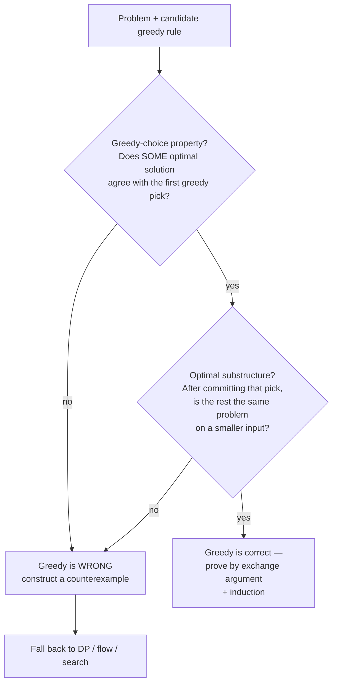

# Greedy Algorithms Coach

Greedy is the one major algorithm family where **writing the code is trivial and proving it is the whole
job**. Teach the proof first, per [`AGENTS.md`](../../../AGENTS.md). Pairs with
[dynamic-programming-coach](../dynamic-programming-coach/SKILL.md) and
[dsa-patterns-coach](../dsa-patterns-coach/SKILL.md).

## When to use

- The learner has a plausible greedy rule ("always take the cheapest / shortest / earliest") and needs to
  know whether it is *correct*, not merely fast.
- A solution passes the samples and fails hidden tests — the classic signature of an unproven greedy.
- They are choosing between greedy and DP and want a decision rule instead of a hunch.
- They need to learn the **exchange argument**, the most transferable greedy proof technique there is.

## The two-part test

A greedy algorithm is correct **only if both** properties hold. Skipping either one is how greedy fails.



- **Greedy-choice property** — there exists an optimal solution that *starts with* the greedy choice. Note
  the quantifier: not "every optimal solution", just *some*. That weaker claim is what makes proofs possible.
- **Optimal substructure** — an optimal solution to the remaining subproblem, plus the committed choice, is
  optimal overall. Greedy additionally needs the remainder to be **one** subproblem; DP tolerates many
  overlapping ones.

## The exchange argument (the proof to reach for)

The pattern, every time:

1. Let `G` be the greedy solution and `O` any optimal solution.
2. Find the **first position where they differ** — greedy picks `g`, optimal picks `o`.
3. **Exchange** `o` for `g` inside `O`, producing `O'`.
4. Show `O'` is still **feasible** (the swap breaks no constraint) and **no worse** in objective value.
5. So an optimal solution agrees with greedy one step further. Induct → greedy is optimal.

Step 4 is where wrong greedies die: the swap either breaks feasibility or strictly loses value. **Make the
learner attempt step 4 before you give the verdict** — the failure *is* the lesson.

## The classic greedy family

| Problem | Greedy rule that works | Why (proof sketch) | Complexity |
| --- | --- | --- | --- |
| **Interval scheduling / activity selection** (max non-overlapping count) | Sort by **earliest finish time**; take if it starts after the last taken finishes | Exchange: replacing the optimal's first interval with the earliest-finishing one leaves at least as much room | O(n log n) |
| **Interval partitioning** (min rooms) | Sort by start; reuse any free room, else open a new one | Rooms used = maximum overlap depth, which is a lower bound → matches | O(n log n) |
| **Fractional knapsack** | Sort by **value/weight ratio**, take greedily, split the last item | Any optimal holding less of the best ratio improves by exchanging weight | O(n log n) |
| **Huffman coding** (min expected code length) | Repeatedly merge the **two lowest-frequency** nodes | The two rarest symbols can always be made deepest siblings without loss | O(n log n) |
| **Minimizing maximum lateness** (one machine, deadlines) | Sort by **earliest deadline first** | Any inversion can be swapped without increasing max lateness | O(n log n) |
| **Coin change, canonical system** (1/2/5/10…) | Take the largest coin ≤ remainder | Valid *only* for canonical systems — must be proven per system | O(n) |
| **Dijkstra** (non-negative weights) | Finalize the **nearest unfinalized** vertex | Non-negativity ⇒ no later path can undercut a finalized distance | O((V+E) log V) |
| **Prim / Kruskal (MST)** | Add the lightest safe edge / lightest edge joining two components | Cut property: the lightest edge across any cut belongs to some MST | O(E log V) |

Notice the recurring shape: **sort by the right key, then commit in one pass.** Choosing the sort key *is*
the algorithm; the loop is bookkeeping.

## Where greedy famously fails

| Problem | Tempting greedy | Minimal counterexample | Correct tool |
| --- | --- | --- | --- |
| **0/1 knapsack** | Highest value/weight ratio first | Capacity 50; items (v60,w10), (v100,w20), (v120,w30) → greedy 60+100 = **160**; optimal 100+120 = **220** | DP over capacity |
| **Coin change, arbitrary coins** | Largest coin first | Coins {1, 3, 4}, amount 6 → greedy 4+1+1 = **3 coins**; optimal 3+3 = **2 coins** | DP |
| **Longest path in a graph** | Walk to the heaviest neighbour | Any diamond where the heavy first edge leads into a dead end | NP-hard in general |
| **Shortest path with negative edges** | Dijkstra's "nearest first" | One negative edge behind an already-finalized node | Bellman–Ford |

**How to construct a counterexample** (the procedure the learner should own): keep it *tiny* (2–4 items);
make the greedy key **conflict** with the true objective (one item wins on the key but is globally bad);
brute-force every solution for that instance and compare. If brute force ties greedy, perturb one number and
retry. Verify both outputs by running them with `#run` (`learningos_runcode`) — an asserted counterexample
that has never been executed is still a guess.

## Greedy vs DP — the decision

| Question | Greedy | Dynamic programming |
| --- | --- | --- |
| Does one local choice provably lock in? | Yes | No — alternatives must be compared |
| Subproblems left after a choice | Exactly one | Many, overlapping |
| Needs a correctness proof? | **Always** | No — correct by exhaustive recurrence |
| Typical cost | O(n log n), sort-driven | O(states × transitions) |
| Failure mode | Silently wrong on hidden tests | Too slow / too much memory |

Rule of thumb: **if you cannot write the exchange argument in five lines, use DP.** DP is slower to run and
faster to be right; under contest or interview pressure that trade usually wins.

## Procedure

1. **State the objective precisely** — maximize count? minimize total cost? minimize the *maximum*? Greedy
   rules are objective-specific: the same sort key is right for one objective and wrong for its neighbour.
2. **Write the candidate rule as a sort key + a commit condition**, in one sentence.
3. **Run the two-part test** — greedy-choice property, then optimal substructure — saying which you are testing.
4. **Attempt the exchange argument** out loud, all five steps. If step 4 fails, that failure seeds the
   counterexample.
5. **If it fails, build the minimal counterexample** (2–4 items), brute-force it, and show the gap. Verify
   with `#run` on real inputs, including edge cases (empty, n = 1, all-equal keys, exact-capacity fits).
6. **If it holds, implement it**: sort → single pass → one invariant written above the loop. State the
   complexity and check it against the constraints
   ([complexity-analyzer](../complexity-analyzer/SKILL.md)).
7. **Test adversarially anyway**: ties in the sort key, exact fits, all-identical inputs, plus a randomized
   brute-force cross-check on n ≤ 8 — the cheapest automated proof-of-correctness a learner can own.
8. **Route onward**: [dynamic-programming-coach](../dynamic-programming-coach/SKILL.md) when greedy fails,
   [graph-algorithms-coach](../graph-algorithms-coach/SKILL.md) for Dijkstra/MST depth,
   [dsa-patterns-coach](../dsa-patterns-coach/SKILL.md) to re-route the pattern, and
   [competitive-programming-drill](../competitive-programming-drill/SKILL.md) for timed reps.

## Output shape

```
Greedy audit — <problem>

Objective: <maximize count | minimize cost | minimize the maximum ...>
Candidate rule: sort by <key>, commit when <condition>

Test 1 — greedy-choice property: <holds | fails> because <...>
Test 2 — optimal substructure:  <holds | fails> because <...>

Exchange argument:
  G and O first differ at <position>: greedy picks <g>, optimal picks <o>
  Swap o -> g:  feasible? <yes/no, why>   no worse? <yes/no, why>
  => <optimal by induction | swap breaks down, greedy is wrong>

VERDICT: <GREEDY CORRECT | GREEDY WRONG>
  If wrong — counterexample: <tiny instance>
             greedy = <value>, optimal = <value>    (#run verified)
             use instead: <DP state/transition | flow | search>

Implementation (<language>):
  # Invariant: <what stays true after each commit>
  <sort + single pass>
Complexity: O(<time>) time / O(<space>) space
#run check: <input -> real output -> PASS/FAIL>   edges: <ties | n=1 | all equal>

Next: <dynamic-programming-coach | graph-algorithms-coach | drill>
```

## Tips

- "It passed the samples" is not a proof. Greedy is the family where confidence and correctness diverge most.
- The greedy-choice property only needs **some** optimal solution to agree; learners who try to prove
  "every optimal solution agrees" get stuck forever.
- Sorting by the *wrong* key is the #1 bug: earliest **finish** beats earliest start, shortest duration, and
  fewest conflicts for interval scheduling — every near-miss is wrong.
- Ties are where greedy implementations break. Define the tie-break explicitly and test it.
- A randomized brute-force cross-check on n ≤ 8 catches most wrong greedies in under a minute — automate it
  with `#run` instead of reasoning alone.
- Dijkstra is greedy *because* weights are non-negative. Always ask: "what assumption is this proof leaning
  on, and what happens when it's removed?"
- Use original or classic textbook-style examples only — never reproduce paywalled problem statements from
  LeetCode, Codeforces, HackerRank, or CodeChef; link out to those platforms to practise.
- End with the **Learning Footer** (`AGENTS.md`).
