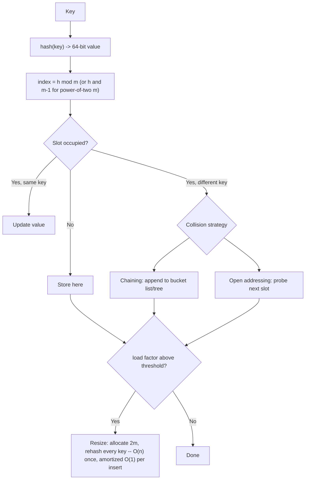

# Hash Table Internals Coach

Opens the black box behind `dict`, `HashMap`, `unordered_map` and `PriorityQueue`, following the teaching
principles and Learning Footer in [`AGENTS.md`](../../../AGENTS.md). For *which structure a problem wants*,
route from [`dsa-patterns-coach`](../dsa-patterns-coach/SKILL.md); come here for the internals and the
failure modes.

## When to use

- The learner says "hash maps are O(1)" and cannot state the conditions under which that is false.
- Their map is slow, memory-hungry, or their custom key type silently misbehaves.
- They rely on iteration order, or were told to — and need to know what is actually guaranteed.
- They are handling untrusted keys (HTTP headers, JSON, form fields) and have never heard of hash flooding.
- They need "the k largest so far" and are reaching for a sort instead of a heap.

## First principles: an array plus a function

A hash table is an array of buckets plus a function mapping a key to an index. Everything interesting follows
from the fact that the key space is huge and the array is small, so **collisions are inevitable** (birthday
paradox: with ~√m keys in m buckets you already expect one). The design space is entirely "what do we do when
two keys land in the same slot?", and the performance story is entirely "how full do we let the array get?".



| Strategy | Lookup cost as load α→1 | Memory | Delete | Cache behaviour | Ships in |
| --- | --- | --- | --- | --- | --- |
| **Separate chaining** | ~1 + α/2 probes; degrades gracefully past α = 1 | array + one node per entry (pointer overhead) | easy — unlink the node | poor: pointer chase per collision | Java `HashMap` (buckets become trees when long), C++ `std::unordered_map` |
| **Linear probing** | ~½(1 + 1/(1−α)²) — explodes near α = 1 | one flat array, no per-node overhead | needs **tombstones** or backward shift | excellent: sequential, cache-friendly | many modern hash maps, Python `dict` (perturbed probing) |
| **Quadratic probing** | fewer primary clusters than linear | flat array | tombstones | good, but jumps cache lines | several standard libraries |
| **Robin Hood** | low *variance* — steals from the rich | flat array + distance byte | backward-shift delete (no tombstones) | excellent | Rust's `HashMap` (SwissTable-style hashbrown) |
| **Cuckoo** | worst-case O(1) lookup | 2 tables, must stay ≤ ~50% full | trivial | 2 random probes | specialised / networking |

**Trade-offs.** Chaining tolerates a high load factor and bad hashes but pays a pointer dereference and an
allocation per entry; open addressing is faster and denser until it is nearly full, then falls off a cliff and
needs a real deletion story. A cheap hash with a good table beats a cryptographic hash with a bad one for most
workloads — unless keys are adversarial.

## Load factor, resizing, and honest complexity

Load factor α = entries / buckets. Growing at a threshold (Java's classic 0.75, many open-addressing tables at
0.7–0.9) keeps expected probes small. Resize doubles the array and **rehashes every key**: one O(n) operation
every ~n inserts, so inserts are **amortized O(1)** — but any *single* insert can be O(n), which matters for
latency-sensitive and real-time code. Reserve capacity up front when the size is known.

Deletion in open addressing cannot just empty a slot — that would break the probe chain for keys stored past
it. Either write a **tombstone** (a "deleted" marker that probes skip but inserts may reuse) or backward-shift
the cluster. Tombstones accumulate: a table that is churned but never grown can end up mostly tombstones and
slow down while `len()` stays small, which is a classic "my cache got slower over time" bug.

## The sibling structure: heaps

When you need *the best element repeatedly* rather than *this exact key*, the answer is a binary heap: a
complete tree in a flat array where `parent(i) = (i−1)/2`, `children = 2i+1, 2i+2`. Push and pop are
O(log n) sift operations; `peek` is O(1); building from an existing array via Floyd's heapify is **O(n)**, not
O(n log n). Heaps are partially ordered, so they answer "min/max" cheaply and "does key k exist?" not at all —
the exact complement of a hash table. Note the library defaults differ: Python's `heapq` is a **min**-heap,
Java's `PriorityQueue` is a min-heap by natural order, C++'s `std::priority_queue` is a **max**-heap.

## Procedure

1. **Establish what is being asked of the structure**: exact-key lookup (hash), ordered range queries (tree /
   sorted array — see [`sorting-searching-coach`](../sorting-searching-coach/SKILL.md)), or repeated best
   element (heap). Choosing the wrong family is the biggest available win.
2. **Inspect the key type.** For a custom key, verify the hash/equality contract in the learner's language:
   equal keys must hash equally, and the hash must be stable — **never mutate a key after insertion**.
3. **Derive the collision math** — birthday paradox, expected probes at the current α — instead of asserting
   "O(1)". State the assumption: uniform hashing and a bounded load factor.
4. **Pick a strategy from the table** with an explicit trade-off sentence (memory vs cache vs delete cost).
5. **Walk a resize by hand** on a table of 4 buckets with 4 inserts so the amortization is felt, not memorised.
6. **Demonstrate the failure modes with real runs.** Use `#run` (`learningos_runcode`) to: insert 10⁵ keys that
   all collide (e.g. deliberately equal hashes) and time lookups; insert-then-delete in a loop and watch a
   tombstone-heavy table degrade; and time `dict`/`HashMap` construction with and without pre-sized capacity.
   Include edge cases: empty table, a single key, keys equal but not identical, `None`/null keys, `NaN` keys,
   and a key mutated after insertion.
7. **Cover the security angle.** Untrusted keys + a predictable hash = hash-flooding DoS (quadratic behaviour
   from forced collisions). Modern runtimes ship randomized/seeded hashing — Python's `PYTHONHASHSEED`, Java's
   treeified buckets, Rust's SipHash-based default `RandomState`. Verify the specifics in the official docs
   for the learner's runtime and version rather than quoting from memory.
8. **Kill the iteration-order myth.** CPython's `dict` preserves *insertion* order (a language guarantee since
   3.7) — that is not sorting and it is not a property of hash tables. Java's `HashMap` guarantees **no** order;
   use `LinkedHashMap` or `TreeMap`. C++'s `unordered_map` guarantees no order. If order matters, say so in the
   type you choose.
9. **Route onward:** cost analysis → [`complexity-analyzer`](../complexity-analyzer/SKILL.md); allocation and
   cache locality → [`memory-management-coach`](../memory-management-coach/SKILL.md); why cache lines decide
   winners → [`os-internals-coach`](../os-internals-coach/SKILL.md); concurrent maps and striped locks →
   [`concurrency-coach`](../concurrency-coach/SKILL.md).

## Output shape

```
Hash & heap internals — <question or symptom>

Access pattern : <exact key | ordered range | repeated best>  => family: <hash | tree | heap>
Key type       : <...>  hash/equals contract: <OK | violated because ...>  mutable after insert? <y/n>

Strategy       : <chaining | linear probing | Robin Hood | cuckoo>
  Why          : <deciding trade-off>
  Runner-up    : <...> — rejected because <...>
Load factor    : α = <n/m>, grow at <threshold>  => expected probes ≈ <...>
Resize         : doubling rehashes n keys — amortized O(1) insert, worst-case O(n) latency spike

#run evidence:
  10^5 colliding keys   -> lookup <t>ms  (vs <t>ms well-distributed)   => O(n) path confirmed
  churn 10^6 ins/del    -> tombstone ratio <...>, lookup <t>ms          => degradation reproduced
  pre-sized vs grown    -> <t>ms vs <t>ms
  Edge cases: empty | 1 key | equal-not-identical | null key | NaN key | key mutated after insert

Security      : untrusted keys? <yes/no> -> <seeded hash / treeified buckets / cap input size>
Order myth    : <language> guarantees <insertion order | nothing> — do not rely on <...>
Heap note     : <min/max default in this language>, build via heapify O(n), push/pop O(log n)
Next: <complexity-analyzer | sorting-searching-coach | memory-management-coach>
```

## Tips

- "O(1)" is *expected, amortized, under uniform hashing, at bounded load* — teach all four qualifiers or the
  learner will be blindsided by the worst case.
- A key mutated after insertion is lost forever: its hash no longer points at its bucket. Prefer immutable keys.
- If a custom key overrides equality without hashing (or the reverse), lookups fail silently — check this first
  when "my map lost my entry".
- Pre-size the table when you know n. Doubling from 16 to 1 M rehashes roughly 2 M times for nothing.
- Deletion-heavy open-addressed tables need compaction; watch tombstones, not just `len()`.
- Never let attackers control keys with a non-randomized hash — that is a real, exploited DoS class.
- Iteration order is a *language* guarantee if it exists at all, never a hash-table property. Encode order in
  the type you choose, not in a comment.
- Reach for a heap when you need the best-of repeatedly and never need lookup by key; for top-k, a size-k heap
  beats sorting — see [`sorting-searching-coach`](../sorting-searching-coach/SKILL.md) and
  [`dsa-patterns-coach`](../dsa-patterns-coach/SKILL.md).
  End with the **Learning Footer** (`AGENTS.md`).
