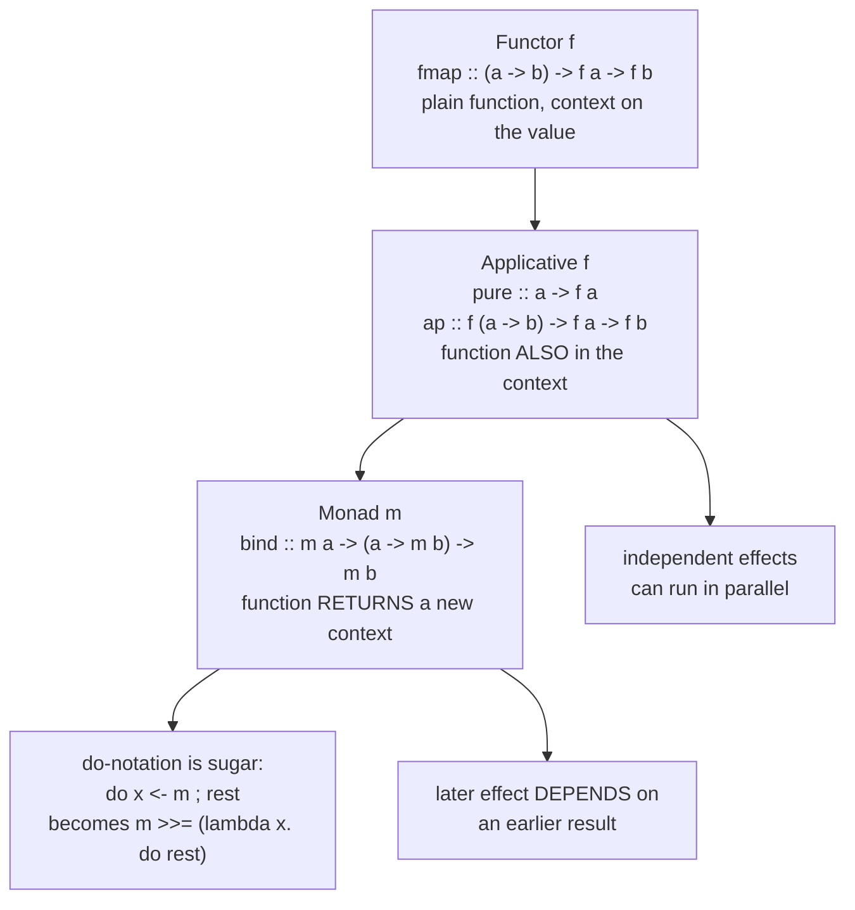

# Haskell Typeclasses & Monads Lab

Monads are not a metaphor; they are a **typeclass with three laws** that lets you sequence values inside a
context. We derive the Functor → Applicative → Monad ladder from the shape of each operator, in the
first-principles, cite-the-source style of [`AGENTS.md`](../../../AGENTS.md).

## When to use

- A learner has read five monad tutorials and still cannot write an instance for their own type.
- They need to understand why `IO` exists in a pure language, or why `do` blocks are not statements.
- Their program leaks memory in a `foldl` or is surprised that `undefined` never blows up.
- Don't use it for general FP concepts across languages — that is
  [functional-programming-coach](../functional-programming-coach/SKILL.md).

## First principles: derive the ladder from the operator shape

Each rung answers a different question about a function and a value in a context `f`. Read the type
signatures side by side and the hierarchy becomes forced, not arbitrary (Haskell 2010 Report; Yorgey,
*Typeclassopedia*, The Monad.Reader 13, 2009).



| Class | Key operator | What it cannot do | Laws you must not break |
| --- | --- | --- | --- |
| `Functor` | `fmap :: (a -> b) -> f a -> f b` | combine two contexts | `fmap id = id`; `fmap (g . h) = fmap g . fmap h` |
| `Applicative` | `(<*>) :: f (a->b) -> f a -> f b` | let effect 2 depend on result 1 | identity, composition, homomorphism, interchange |
| `Monad` | `(>>=) :: m a -> (a -> m b) -> m b` | escape the context (`m a -> a`) | `return a >>= k = k a`; `m >>= return = m`; associativity |
| `Foldable`/`Traversable` | `foldr`, `traverse` | — | `traverse` = `Applicative` walk over a structure |

Since GHC 7.10 (the Applicative-Monad Proposal) `Applicative` **is** a superclass of `Monad`, `return`
defaults to `pure`, and since GHC 8.8 `fail` lives in `MonadFail` — so a partial pattern in a `do` block
requires `MonadFail`, not `Monad`.

**Laziness.** Haskell is non-strict: an expression becomes a *thunk* and is forced only to Weak Head Normal
Form when demanded. That buys infinite structures (`take 5 [1..]`) and costs space when a lazy accumulator
builds a thunk chain — the reason `foldl'` (strict, from `Data.List`) exists next to `foldl`.

## Procedure

1. **Write the type first.** `data Shape = Circle Double | Rect Double Double` — then let exhaustive pattern
   matching over the constructors drive the function body; compile with `-Wall -Wincomplete-patterns`.
2. **Use `newtype` for wrappers** (zero runtime cost, one constructor, one field) and record syntax for the
   unwrapping accessor.
3. **Ask which rung you need**: mapping a pure function → `Functor`; combining *independent* effectful values
   → `Applicative`; the next step *depends* on the previous result → `Monad`.
4. **Implement in order** — `Functor`, then `Applicative`, then `Monad` — because each is a superclass of the
   next. Define `pure` once and let `return = pure`.
5. **Check the laws by equational reasoning** on paper (substitute definitions on both sides) or with
   QuickCheck properties; an instance that breaks associativity will break `do` blocks in ways the type
   checker cannot see.
6. **Desugar every `do` block once by hand** so the learner sees `>>=` and lambdas underneath. `IO` is no
   exception: `IO a` is a *description* of an effect that `main` hands to the runtime.
7. **Build and inspect:**
   `ghc -Wall -Wincomplete-patterns Main.hs -o main && ./main`, iterate with `runghc Main.hs`, and explore in
   `ghci Main.hs` using `:t expr`, `:i Monad`, and `:sprint x` to *see* an unevaluated thunk. Project work:
   `cabal init --simple && cabal run`.
8. **Break it deliberately**: replace `foldl'` with `foldl` over `[1..10^7]` and watch space usage
   (`./main +RTS -s` after linking with `-rtsopts`). Close with the **Learning Footer**.

## Output shape

```
Type:        <data | newtype> <Name> = <constructors>            Kind: <* | * -> *>
Rung needed: Functor | Applicative | Monad     (why: <mapping | independent | dependent>)
Instances:   Functor <defn> ; Applicative pure/<*> <defn> ; Monad >>= <defn>
Laws:        identity <checked how> · composition/associativity <checked how>
do-block:    <source>   desugars to   <m >>= \x -> ...>
Strictness:  lazy by default · forced at <point> · use <foldl' | seq | BangPatterns> because <...>
Build:       ghc -Wall -Wincomplete-patterns Main.hs -o main && ./main
Expected output: <traced lines>
Next: <functional-programming-coach | type-system-explainer | python-pattern-matching-lab>
Learning Footer
```

## Worked example — a Writer-style monad you can trace by hand

```haskell
-- Main.hs — ghc -Wall -Wincomplete-patterns Main.hs -o main && ./main   (GHC 9.6+)
module Main (main) where

import Data.List (foldl')

-- A value paired with an accumulated log. newtype => no runtime overhead.
newtype Logged a = Logged { runLogged :: (a, [String]) }

instance Functor Logged where
  fmap f (Logged (a, w)) = Logged (f a, w)                     -- fmap id = id  (w untouched)

instance Applicative Logged where
  pure a = Logged (a, [])                                      -- pure adds no log
  Logged (f, w1) <*> Logged (a, w2) = Logged (f a, w1 ++ w2)   -- logs concatenate in order

instance Monad Logged where
  Logged (a, w) >>= k = let Logged (b, w') = k a in Logged (b, w ++ w')

say :: String -> Logged ()
say msg = Logged ((), [msg])

safeDiv :: Int -> Int -> Logged (Maybe Int)
safeDiv _ 0 = do
  say "divide by zero"
  pure Nothing
safeDiv x y = do
  say (show x ++ " / " ++ show y)
  pure (Just (x `div` y))

main :: IO ()
main = do
  let (r1, w1) = runLogged (safeDiv 10 2)
  print r1
  mapM_ putStrLn w1
  let (r2, w2) = runLogged (safeDiv 1 0)
  print r2
  mapM_ putStrLn w2
  print (take 5 (map (* 2) [1 ..]) :: [Int])   -- laziness: infinite list, finite work
  print (foldl' (+) 0 [1 .. 100 :: Int])       -- strict fold: no thunk chain
```

Traced output:

```
Just 5
10 / 2
Nothing
divide by zero
[2,4,6,8,10]
5050
```

Trace the first case by hand: `safeDiv 10 2` desugars to `say "10 / 2" >> pure (Just 5)`, and `>>` defaults
to `*>`, so the log is `["10 / 2"] ++ []` and the value is `Just 5` — exactly `(Just 5, ["10 / 2"])`. Edge
cases worth naming: `safeDiv 1 0` never evaluates `div 1 0`, because the first equation matches on the
literal `0`, so no exception is possible; `take 5 (map (*2) [1..])` terminates only because nothing forces
the tail; and swapping `foldl'` for `foldl` still prints `5050` here but builds a 100-deep thunk chain — at
`[1..10^7]` that difference becomes a heap blow-up you can watch with `+RTS -s`.

## Tips

- Never explain a monad with a metaphor — show the type of `>>=` and ask "what has that shape?".
- If the next effect does not depend on the previous *result*, `Applicative` is enough and composes better.
- `undefined`/bottom is only an error when forced; use `:sprint` in GHCi to see what has actually evaluated.
- `foldl` is a space leak generator; reach for `foldl'` or `foldr` with a lazy consumer, and use bang
  patterns on strict accumulators.
- Partial patterns inside `do` require `MonadFail` — compile with `-Wall -Wincomplete-patterns` to see them.
- Compare exhaustiveness with Python's structural matching in
  [python-pattern-matching-lab](../python-pattern-matching-lab/SKILL.md) and typeclasses with Rust traits in
  [rust-traits-lab](../rust-traits-lab/SKILL.md).
- Pair with [functional-programming-coach](../functional-programming-coach/SKILL.md) and
  [type-system-explainer](../type-system-explainer/SKILL.md); cite the GHC User's Guide with its version
  (`AGENTS.md` §2) and end with the **Learning Footer** (`AGENTS.md`).
