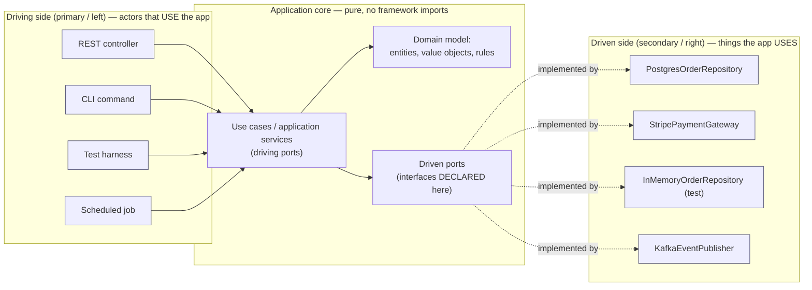

# Hexagonal Architecture Coach

Ports and adapters is one rule applied relentlessly: **the domain owns the interfaces, and everything
technological plugs into them.** This skill turns that rule into a concrete refactor with an automated
guard, in the trade-offs-first style of [`AGENTS.md`](../../../AGENTS.md).

## When to use

- Business logic imports the ORM, the HTTP framework, or an SDK, so nothing can be tested without infra.
- Unit tests need a database, a broker, or network mocks, and the suite takes minutes.
- You must swap a dependency (SQL → document store, Stripe → Adyen) and cannot find the seam.
- **Don't use it for** deciding *what* the domain concepts are — that's
  [domain-driven-design-coach](../domain-driven-design-coach/SKILL.md); or for splitting a monolith into
  services — that's [microservices-decomposer](../microservices-decomposer/SKILL.md).

## First principles: dependencies point inward, always

Cockburn published *Hexagonal Architecture* in 2005 (alistaircockburn.com; expanded in Cockburn & Garrido,
*Hexagonal Architecture Explained*, 2024) with an explicit intent: allow an application to be driven
equally by users, programs, automated tests or batch scripts, **and to be developed and tested in isolation
from its eventual run-time devices and databases**. The mechanism is Robert C. Martin's Dependency
Inversion Principle (C++ Report, 1996; *Clean Architecture*, 2017): high-level policy must not depend on
low-level detail — both depend on an abstraction *declared by the policy*. Palermo's Onion Architecture
(2008) and Clean Architecture are the same idea drawn with different shapes.



The dotted arrows are the whole point: the arrowheads run **into** the core. `PostgresOrderRepository`
imports the port; the port imports nothing.

| | Driving (primary) port | Driven (secondary) port |
| --- | --- | --- |
| Question it answers | "what can be asked of the application?" | "what does the application need from the world?" |
| Who calls whom | adapter → core | core → adapter (through the interface) |
| Named after | a use case: `PlaceOrder`, `CancelBooking` | a capability: `OrderRepository`, `PaymentGateway` |
| Typical adapters | REST controller, CLI, consumer, test | SQL repo, HTTP client, queue publisher, clock |
| Test double | the test *is* the adapter | in-memory fake implementing the port |

| Belongs in the core? | Rule |
| --- | --- |
| `Order`, `Money`, invariants | **yes** — expressed in ubiquitous language (Evans, *DDD*, 2003) |
| `OrderRepository` interface | **yes** — the core declares what it needs |
| SQLAlchemy/JPA entity, `@Entity` annotations | no — mapping is a driven adapter concern |
| `datetime.now()`, `UUID4()`, `random` | no — inject a `Clock` / `IdGenerator` port, or the core is untestable |
| Retry, connection pooling, JSON shape | no — adapter detail |

**Trade-off, stated honestly:** you pay with mapping code (domain object ↔ persistence row ↔ DTO) and more
files. That price buys fast tests and swappable infrastructure. For a CRUD service with no rules, it is a
bad trade — say so instead of applying the pattern reflexively.

## Procedure

1. **Inventory the actors.** List who drives the app (HTTP, CLI, scheduler, tests) and what it drives
   (database, payment API, mailer, clock). Driving on the left, driven on the right.
2. **Find the violations** — the core importing detail:
   ```bash
   grep -rnE "^(from|import) (sqlalchemy|django|fastapi|requests|boto3)" src/shop/domain/
   ```
   Each hit is a port waiting to be extracted.
3. **Extract the driven port** into the core, named in domain language (`OrderRepository`, not
   `OrderDao`), with domain types in the signature — never `Row`, `ResultSet`, or `Session`.
4. **Move the implementation out** to `adapters/`, and have it import the port. Never the reverse.
5. **Inject at the edge.** Wire concrete adapters in one composition root (`main.py`, `Program.cs`,
   `Application.java`) — constructor injection, no service locator, no globals.
6. **Write one fake per driven port** and test the core with it. Target: the core suite runs with no
   Docker, no network, in under a second.
7. **Automate the direction check** so it cannot regress. Python (`import-linter`):
   ```ini
   # .importlinter
   [importlinter]
   root_package = shop

   [importlinter:contract:domain-is-pure]
   name = Domain must not import adapters or frameworks
   type = forbidden
   source_modules = shop.domain
   forbidden_modules = shop.adapters, sqlalchemy, fastapi, requests
   ```
   ```bash
   pip install import-linter && lint-imports          # non-zero exit fails CI
   ```
   Java uses ArchUnit — `noClasses().that().resideInAPackage("..domain..")
   .should().dependOnClassesThat().resideInAPackage("..adapters..")`; .NET uses NetArchTest.
8. **Contract-test each real adapter** against the same suite the fake passes, using
   [testcontainers-lab](../testcontainers-lab/SKILL.md) so "the fake lies" can't hide. Then close with the
   **Learning Footer**.

## Output shape

```
Module: <name>   Language: <...>   Verdict: <apply hexagonal | not worth it because <...>>
Driving ports (use cases): <PlaceOrder, CancelOrder, ...>
Driven ports (needs):      <OrderRepository, PaymentGateway, Clock, EventPublisher>
Adapters — driving: <FastAPI router | CLI | consumer | tests>
Adapters — driven:  <PostgresOrderRepository | StripeGateway | InMemory* (test)>
Violations found: <file:line — core imports <framework>>  → port extracted: <name>
Composition root: <file where wiring happens>
Core test suite: <n tests, <t> s, infra required = none>
Guard in CI: <import-linter contract | ArchUnit rule | NetArchTest>
Cost accepted: <mapping layers, extra files>   Benefit: <swappability, test speed>
Next: <domain-driven-design-coach | test-doubles-coach | testcontainers-lab>
Learning Footer
```

## Worked example — payment logic that needs no database

Core, with zero infrastructure imports:

```python
# shop/domain/model.py
from dataclasses import dataclass, replace
from decimal import Decimal

@dataclass(frozen=True)
class Order:
    id: str
    customer_id: str
    total: Decimal
    paid: bool = False

class InsufficientFunds(Exception): ...

# shop/domain/ports.py — the core DECLARES what it needs (Dependency Inversion)
from typing import Protocol

class OrderRepository(Protocol):                     # driven port
    def get(self, order_id: str) -> Order | None: ...
    def save(self, order: Order) -> None: ...

class PaymentGateway(Protocol):                      # driven port
    def charge(self, customer_id: str, amount: Decimal) -> bool: ...

# shop/domain/service.py — a driving port: the use case
class OrderService:
    def __init__(self, orders: OrderRepository, payments: PaymentGateway) -> None:
        self._orders, self._payments = orders, payments

    def pay(self, order_id: str) -> Order:
        order = self._orders.get(order_id)
        if order is None:
            raise KeyError(order_id)
        if order.paid:
            return order                              # idempotent: no second charge
        if not self._payments.charge(order.customer_id, order.total):
            raise InsufficientFunds(order_id)
        paid = replace(order, paid=True)
        self._orders.save(paid)
        return paid
```

Test adapters live in the test file; the suite touches nothing external:

```python
# tests/test_order_service.py     →  pytest -q   (runs in milliseconds)
from decimal import Decimal
from shop.domain.model import Order
from shop.domain.service import OrderService

class InMemoryOrders:                                # driven adapter (test)
    def __init__(self): self._db: dict[str, Order] = {}
    def get(self, order_id): return self._db.get(order_id)
    def save(self, order): self._db[order.id] = order

class AlwaysApproves:
    def charge(self, customer_id, amount): return True

def test_pay_marks_order_paid_and_is_idempotent():
    orders = InMemoryOrders()
    orders.save(Order("o1", "c1", Decimal("10.00")))
    svc = OrderService(orders, AlwaysApproves())     # the TEST is the driving adapter
    assert svc.pay("o1").paid is True
    assert svc.pay("o1").paid is True                # second call short-circuits, no re-charge
```

`PostgresOrderRepository` and `StripePaymentGateway` are written later, wired only in the composition root,
and must satisfy exactly this `Protocol`. The business rule was tested before either existed — which is
precisely Cockburn's stated intent.

## Tips

- The hexagon has **no significance in the number six**; Cockburn chose it only because it draws several
  facets neatly. Arguing about "six sides" is the classic misreading.
- A repository port returning `Row`, `QuerySet`, or `Session` is not a port — the detail leaked through the
  interface. Domain types in, domain types out.
- Hidden ports are the usual culprits: `now()`, random IDs, and environment lookups make a "pure" core
  untestable. Inject a `Clock`.
- Don't create one adapter per table and call it done; ports are named for *capabilities the domain needs*,
  not for storage structures.
- Keep the fake and the real adapter honest with the same contract suite —
  [test-doubles-coach](../test-doubles-coach/SKILL.md) and
  [contract-testing-coach](../contract-testing-coach/SKILL.md).
- Pair with [domain-driven-design-coach](../domain-driven-design-coach/SKILL.md),
  [design-patterns-coach](../design-patterns-coach/SKILL.md),
  [refactoring-coach](../refactoring-coach/SKILL.md), [cqrs-coach](../cqrs-coach/SKILL.md),
  [event-sourcing-coach](../event-sourcing-coach/SKILL.md) and
  [architecture-diagram](../architecture-diagram/SKILL.md). Close with the **Learning Footer**
  (`AGENTS.md`).
