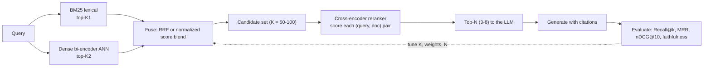

# Hybrid Search & Reranking Coach

Most RAG failures are **retrieval** failures. This skill fixes the retrieval stage on evidence, following
the teaching and source-discipline rules in [`AGENTS.md`](../../../AGENTS.md). Pairs directly with
[rag-designer](../rag-designer/SKILL.md) (pipeline design),
[embeddings-explainer](../embeddings-explainer/SKILL.md) (what the vectors encode), and
[rag-evaluation-coach](../rag-evaluation-coach/SKILL.md) (the measurement harness).

## When to use

- The generator is blamed for hallucinating, but the retrieved chunks never contained the answer.
- Exact identifiers fail: product codes, error numbers, API names, surnames, rare acronyms.
- Semantically-phrased questions fail even though the answer exists under different wording.
- The learner has "added a vector database" and quality did not improve.

## First principle: two different kinds of blindness

A **lexical** index (BM25) scores by term overlap weighted by rarity and document length. It is exact,
cheap, interpretable, needs no training — and is blind to synonyms and paraphrase. A **dense** bi-encoder
embeds query and document independently and compares vectors; it captures meaning — and is blind to exact
rare tokens it never learned, because a serial number carries no semantics. Their failure modes are
*complementary*, which is precisely why fusing them works. Then a **cross-encoder** re-ranker reads the
query and one document **together** in a single forward pass, so it can model term interaction directly —
far more accurate, far too slow to run over a whole corpus. Hence the shape of every good pipeline:
**cheap recall first, expensive precision last.**



## Retriever comparison

| Approach | How it scores | Latency | Strength | Blind spot |
| --- | --- | --- | --- | --- |
| **BM25 / lexical** | Term frequency × inverse document frequency, length-normalized | Very low | Exact terms, rare tokens, IDs, code | Synonyms, paraphrase, cross-lingual |
| **Dense bi-encoder** | Cosine/dot of two independent embeddings, ANN index | Low (index does the work) | Meaning, paraphrase, multilingual models | Rare literals, out-of-domain jargon, no term-level control |
| **Hybrid (RRF)** | Fuse ranks: `Σ 1/(k + rank_i)` over retrievers | Low | Robust; recovers both failure modes; rank-based so no score calibration needed (Cormack et al., SIGIR 2009) | Ignores score magnitude; `k` (commonly ~60) is a knob to test |
| **Hybrid (score blend)** | `α·norm(dense) + (1-α)·norm(bm25)` | Low | Uses score strength when both scorers are calibrated | Normalization is fragile across query types; needs tuning per corpus |
| **ColBERT / late interaction** | Per-token embeddings, MaxSim over token pairs | Medium | Near cross-encoder quality with pre-computable document vectors (Khattab & Zaharia, arXiv:2004.12832, 2020-04-27) | Much larger index; more infrastructure |
| **Cross-encoder reranker** | One transformer pass over `(query, doc)` jointly | High, linear in candidates | Highest precision at the top of the list | Cannot scan a corpus; latency scales with candidate-K |

**Metrics, and what each one is for:** *Recall@k* asks "is the answer anywhere in the candidates?" — that is
the ceiling on everything downstream; if it is low, no re-ranker can save you. *MRR* asks how high the first
relevant item sits. *nDCG@10* rewards graded relevance ranked in the right order, which is what a re-ranker
actually improves. Report **Recall@K before re-ranking** and **nDCG@N after** — they answer different
questions.

## Procedure

1. **Build the golden set first.** 30–100 real queries with the chunk id(s) that should be retrieved,
   labelled by someone who knows the domain. Include the queries that currently fail — a golden set of only
   easy queries measures nothing. Design help: [rag-evaluation-coach](../rag-evaluation-coach/SKILL.md).
2. **Measure the baseline** you already have: Recall@10, Recall@50, MRR, nDCG@10. Write the numbers down.
   Every later claim is a delta against this row.
3. **Diagnose the failures by class.** For each miss, label it: *lexical miss* (rare literal), *semantic
   miss* (paraphrase), *chunking miss* (answer split across chunks), or *not in corpus*. The distribution
   tells you what to fix — chunking misses are not fixed by re-ranking, and "not in corpus" is not a
   retrieval bug at all.
4. **Add the missing retriever.** Dense-only pipelines add BM25; keyword-only pipelines add dense. Keep both
   result lists visible during development so you can see who found what.
5. **Fuse with RRF first.** `score(d) = Σ_i 1/(k + rank_i(d))`, typically `k ≈ 60`. Prefer RRF over score
   blending as the default because it needs no score calibration and survives a retriever swap. Only move
   to weighted score blending if you can show it wins on the golden set.
6. **Add a cross-encoder re-ranker** over the fused candidates. Sweep candidate-K ∈ {20, 50, 100} and record
   both nDCG@10 **and** added latency — this is the central trade-off of the whole skill: re-ranking cost
   grows linearly with K, while quality saturates.
7. **Tune the final N** passed to the LLM. More context is not better: relevant material buried in the
   middle of a long context gets used less reliably (Liu et al., *Lost in the Middle*, arXiv:2307.03172,
   2023-07-06). Put the strongest chunk first.
8. **Verify with `#run` (`learningos_runcode`)**: implement RRF and the metric functions and run them on
   real ranked lists, including edge cases — a document found by only one retriever, an empty result list,
   ties in rank, a query where the gold chunk is absent (Recall must be 0, not crash), and duplicate ids
   across retrievers. Assert the fused ranking by hand for one small case before trusting the harness.
9. **Compare the whole ladder in one table** — BM25 · dense · RRF · RRF + rerank — on the same golden set,
   same day, with latency alongside quality. Ship the simplest row that clears the target.
10. **Route onward:** re-examine chunking and prompt assembly in
    [rag-designer](../rag-designer/SKILL.md), harden the eval loop with
    [rag-evaluation-coach](../rag-evaluation-coach/SKILL.md), and revisit model choice with
    [embeddings-explainer](../embeddings-explainer/SKILL.md).

## Output shape

```
Corpus: <what/size>   Latency budget: <ms p95>   Golden set: <N queries>

Failure diagnosis: lexical <n> | semantic <n> | chunking <n> | not-in-corpus <n>

| pipeline            | Recall@10 | Recall@50 | MRR  | nDCG@10 | p95 latency |
|---------------------|-----------|-----------|------|---------|-------------|
| BM25 only           | <..>      | <..>      | <..> | <..>    | <..>        |
| Dense only          | <..>      | <..>      | <..> | <..>    | <..>        |
| Hybrid RRF (k=60)   | <..>      | <..>      | <..> | <..>    | <..>        |
| RRF + rerank (K=50) | <..>      | <..>      | <..> | <..>    | <..>        |

Candidate-K sweep: K=20 -> nDCG <..> / +<..>ms | K=50 -> <..> | K=100 -> <..> (saturates at <..>)
Final N to the LLM: <..>, strongest chunk placed first

#run evidence: <RRF + metrics executed on real ranked lists -> numbers>
Edge cases run: <single-retriever hit | empty list | ties | gold absent | duplicate ids> -> <results>

Decision: ship <pipeline> — <metric> gain for <latency> cost
Still failing: <query class> -> <fix: chunking | corpus gap | domain embedding>
Next: <rag-evaluation-coach | rag-designer>
```

## Tips

- **Recall is the ceiling.** A re-ranker can only reorder what retrieval already found — if Recall@50 is
  low, fix retrieval or chunking before buying a re-ranker.
- Prefer **RRF as the default fusion**: rank-based, calibration-free, and it does not break when you swap an
  embedding model. Weighted score blending is an optimization, not a starting point.
- Re-ranking cost is linear in candidate-K and quality saturates — find the knee, then stop.
- Do not evaluate on the queries you tuned on. Hold out a slice, or you will ship a pipeline that is expert
  at your ten favourite questions.
- Watch the pitfalls: comparing pipelines on different chunking; reporting nDCG without Recall; letting the
  cross-encoder blow the latency SLO; and blaming the LLM for what retrieval never delivered.
- Ground model and API claims in named official documentation (Hugging Face cross-encoder/sentence-similarity
  model cards, your search engine's hybrid-query docs) and cite papers with dates — never invent a model
  name, a parameter, or a benchmark score.
- Close with the **Learning Footer** (`AGENTS.md`): recap, the pitfall, and the single next experiment.
