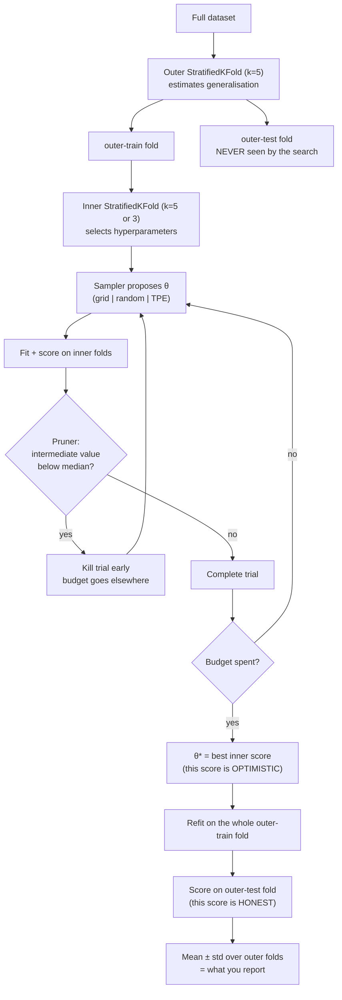

# Hyperparameter Tuning Lab

Search is cheap; *honest* search is the skill — following the teaching and verify-before-you-assert rules in
[`AGENTS.md`](../../../AGENTS.md). Everything here runs on a laptop CPU with bundled datasets: no GPU, no
cloud account, no spend.

## When to use

- The learner is running `GridSearchCV` over five hyperparameters and the job has been going for two hours.
- Cross-validated accuracy is 0.97, the held-out test set says 0.91, and nobody can explain the gap.
- They have heard "Bayesian optimisation" and want to know what TPE actually does with the trial history.
- A search space is written as `[0.001, 0.01, 0.1, 1, 10]` and they cannot say why it is not `range(0, 10)`.
- Training one configuration takes minutes and 90% of that time is spent on obviously-losing trials.
- **Don't use it for** picking a *model family* (that is
  [model-selection-advisor](../model-selection-advisor/SKILL.md)), for feature work (that is
  [feature-engineering-coach](../feature-engineering-coach/SKILL.md)), or as a substitute for more/better
  data — tuning typically buys single-digit percent, features and data buy tens.

## First principles: budget, dimensionality, and the bias you cannot see

**1. Grid search wastes its budget on dimensions that do not matter.** With $d$ hyperparameters and $k$
values each, a grid costs $k^d$ trials, but it only ever tests $k$ *distinct values* of the one
hyperparameter that actually matters — the rest is replication. Random search spends every trial on a new
value of every dimension. Bergstra & Bengio (*Random Search for Hyper-Parameter Optimization*, JMLR 13,
2012-02) formalised this via **low effective dimensionality**: most problems have 1–2 hyperparameters that
dominate. The budget consequence is a one-line calculation — the chance that at least one of $n$ uniform
random draws lands in the best 5% of the important dimension is

$$P = 1-(1-0.05)^{n},\qquad P(n{=}60) = 1-0.95^{60} \approx 0.954$$

so **60 random trials give you ~95% confidence of reaching the top-5% region**, independent of how many
useless dimensions you added. A $5^4$ grid costs 625 trials to do worse.

**2. Bayesian/TPE search reuses the history.** Tree-structured Parzen Estimator (Bergstra et al.,
*Algorithms for Hyper-Parameter Optimization*, NeurIPS 2011) splits observed trials at a quantile into "good"
$\ell(x)$ and "bad" $g(x)$ densities and proposes points maximising $\ell(x)/g(x)$ — sampling where good
results have lived. It is Optuna's default sampler (Akiba et al., *Optuna: A Next-generation Hyperparameter
Optimization Framework*, KDD 2019, arXiv:1907.10902, 2019-07-25).

**3. Selecting on validation data and then reporting that same score is biased upward.** The maximum over
$n$ noisy estimates is greater than the true value of the argmax; the more you search, the worse it gets.
This is the documented *selection bias in performance evaluation* (Cawley & Talbot, JMLR 11, 2010) and the
reason for **nested cross-validation**: the inner loop selects, the outer loop estimates.


*Caption: the inner loop is allowed to be optimistic; only the untouched outer fold may be quoted.*

| Strategy | Trials to cover | Uses history? | Parallel? | Best when |
| --- | --- | --- | --- | --- |
| **Grid** (`GridSearchCV`) | $k^d$ — explodes | no | embarrassingly | $d \le 2$, few discrete values, you must be exhaustive |
| **Random** (`RandomizedSearchCV`) | user-chosen $n$ | no | embarrassingly | the honest default; strong baseline for any TPE claim |
| **TPE / Bayesian** (Optuna default) | ~30–100 to pay off | yes | partly (sequential dependency) | expensive fits, continuous spaces, budget < grid |
| **Successive halving / Hyperband** (`HalvingRandomSearchCV`, `HyperbandPruner`) | many cheap + few expensive | via early stopping | yes | training is iterative (epochs, trees, resamples) |
| **Manual + domain knowledge** | ~5 | your brain | n/a | you know the model; always do this first to bracket the space |

⚠ **Scale matters more than range.** Learning rate, regularisation strength and `alpha` span orders of
magnitude, so they must be sampled **log-uniformly** (`trial.suggest_float("lr", 1e-5, 1e-1, log=True)`,
or `scipy.stats.loguniform` for `RandomizedSearchCV`). Sampling `lr` uniformly in $[10^{-5},10^{-1}]$ puts
~99% of the draws above $10^{-3}$ and you will never see the small-LR regime.

**Budget arithmetic, done once, saves an afternoon.** Four hyperparameters × 5 values = 625 configurations;
× 5-fold CV = **3 125 fits**; at 2 s per fit that is 6 250 s ≈ **1 h 44 min**. Compute this *before*
launching, and compare it to 60 random trials × 5 folds = 300 fits ≈ 10 min.

## Procedure

1. **Set the budget and the metric first.** Wall-clock or trial count, plus one scoring function that
   matches the business objective. On skewed labels use `average_precision` and read
   [imbalanced-data-coach](../imbalanced-data-coach/SKILL.md) before tuning anything.
2. **Install locally (free, CPU):**

   ```bash
   python -m venv .venv && .venv\Scripts\activate     # Windows; use source .venv/bin/activate elsewhere
   pip install -U scikit-learn optuna
   ```
3. **Bracket the space by hand.** Fit 3–5 configurations manually at the extremes. If the best value sits on
   a boundary, widen the range — an optimiser that keeps returning `C=1000` when your max is `1000` is
   telling you the space is wrong, not that it found the answer.
4. **Choose scales explicitly.** Log for anything multiplicative (`lr`, `alpha`, `C`, `gamma`, weight decay);
   linear/int for anything additive (`max_depth`, `n_estimators`, `min_samples_leaf`); categorical for
   genuinely discrete switches. Write the space in one place so it is reviewable.
5. **Run random search as the baseline.** Always. It is the control against which any smarter sampler must
   justify itself:

   ```python
   from sklearn.model_selection import RandomizedSearchCV
   from scipy.stats import loguniform, randint
   space = {"C": loguniform(1e-3, 1e3), "gamma": loguniform(1e-5, 1e1)}
   RandomizedSearchCV(SVC(), space, n_iter=60, cv=5, scoring="accuracy", random_state=0, n_jobs=-1)
   ```
6. **Add TPE with Optuna** and a persistent store so a killed run is resumable:

   ```python
   study = optuna.create_study(direction="maximize",
                               sampler=optuna.samplers.TPESampler(seed=0),
                               pruner=optuna.pruners.MedianPruner(n_startup_trials=5, n_warmup_steps=5),
                               storage="sqlite:///hpo.db", study_name="svc", load_if_exists=True)
   study.optimize(objective, n_trials=60, timeout=900)
   ```
7. **Prune, if and only if training is iterative.** Call `trial.report(value, step)` each epoch/round and
   `raise optuna.TrialPruned()` when `trial.should_prune()`. Pruning a non-monotone metric too early
   discards late bloomers — that is what `n_warmup_steps` guards against.
8. **Wrap it in nested CV before you quote a number.** `cross_val_score(search_object, X, y, cv=outer)`
   refits the entire search inside every outer fold. It costs $k_{\text{outer}}\times$ the search, and it is
   the only way to report a number that survives contact with a test set.
9. **Interrogate the study, do not just take `best_params`.** `study.trials_dataframe()`,
   `optuna.importance.get_param_importances(study)`, and the optimisation-history plot tell you which
   dimensions mattered — usually one or two, exactly as the theory predicts. Drop the rest next time.
10. **Refit once on all training data with $\theta^*$, evaluate once on the held-out test set, and stop.**
    Every extra peek at test spends its independence. Close with the **Learning Footer**.

## Output shape

```
Estimator: <..>   Metric: <..>   Budget: <n trials | wall-clock>   Hardware: <CPU cores>
Space:
  <param>: <low>..<high> <log|linear|int|categorical>   ← scale justified: <why>
Baseline (untuned defaults): <score>

| strategy            | trials | pruned | fits | wall-clock | inner best | NESTED (honest) |
|---------------------|--------|--------|------|------------|------------|-----------------|
| grid                | <..>   | 0      | <..> | <..>       | <..>       | <..>            |
| random (n=60)       | 60     | 0      | <..> | <..>       | <..>       | <..>            |
| TPE + MedianPruner  | <..>   | <..>   | <..> | <..>       | <..>       | <..>            |

Optimism gap: inner best <..> − nested <..> = <..>   ← report the nested number, not the inner one
Param importances: <p1>=<..> · <p2>=<..> · rest ≈ 0  ⇒ drop <params> next run
Boundary check: no best value sits on a range edge ✓ / widened <param> because <..>
θ*: <params>          Refit-on-all + single test-set score: <..>
Reproducibility: seeds=<sampler, cv, estimator> · storage=<sqlite path> · sklearn=<ver> optuna=<ver>
Next: <imbalanced-data-coach | ml-experiment-tracker | training-debug-coach>
Learning Footer
```

## Worked example — TPE with pruning, then the optimism gap made visible

Free, offline, CPU-only. `load_breast_cancer` ships inside scikit-learn: **569 samples, 30 features,
212 malignant / 357 benign** — no download, no account.

```python
# hpo_lab.py
import numpy as np, optuna
from sklearn.datasets import load_breast_cancer
from sklearn.linear_model import SGDClassifier
from sklearn.model_selection import train_test_split
from sklearn.preprocessing import StandardScaler

optuna.logging.set_verbosity(optuna.logging.WARNING)
X, y = load_breast_cancer(return_X_y=True)
X_tr, X_va, y_tr, y_va = train_test_split(X, y, test_size=0.25, stratify=y, random_state=0)
sc = StandardScaler().fit(X_tr)                 # fitted on train only — no leakage into validation
X_tr, X_va = sc.transform(X_tr), sc.transform(X_va)
classes = np.unique(y_tr)

def objective(trial):
    alpha = trial.suggest_float("alpha", 1e-6, 1e-1, log=True)   # regularisation: multiplicative → log
    eta0  = trial.suggest_float("eta0", 1e-4, 1e-1, log=True)    # learning rate: multiplicative → log
    clf = SGDClassifier(loss="log_loss", alpha=alpha, learning_rate="constant",
                        eta0=eta0, random_state=0)
    acc = 0.0
    for epoch in range(30):                     # iterative training → pruning is meaningful
        clf.partial_fit(X_tr, y_tr, classes=classes)   # classes= required on the FIRST call
        acc = clf.score(X_va, y_va)
        trial.report(acc, epoch)                # hand the pruner an intermediate value
        if trial.should_prune():
            raise optuna.TrialPruned()          # budget released for a more promising trial
    return acc

study = optuna.create_study(
    direction="maximize",
    sampler=optuna.samplers.TPESampler(seed=0),
    pruner=optuna.pruners.MedianPruner(n_startup_trials=5, n_warmup_steps=5))
study.optimize(objective, n_trials=40)

done   = [t for t in study.trials if t.state == optuna.trial.TrialState.COMPLETE]
pruned = [t for t in study.trials if t.state == optuna.trial.TrialState.PRUNED]
print(f"completed={len(done)}  pruned={len(pruned)}  best={study.best_value:.4f}  {study.best_params}")
print(optuna.importance.get_param_importances(study))
```

**Trace it.** `MedianPruner(n_startup_trials=5, n_warmup_steps=5)` does nothing for the first 5 trials
(no median exists yet) and never prunes before epoch 5 of any trial (SGD is noisy early — pruning at epoch 0
would kill good configurations for free). From trial 6 onward, a trial whose accuracy at step $s$ is below
the median of all completed trials' values at step $s$ is stopped. With `loss="log_loss"` and a constant
learning rate, tiny `eta0` trials converge visibly slower and are exactly what gets pruned — you should see
a meaningful fraction of the 40 trials in `pruned`, and total wall-clock well under 40 full runs.
`suggest_float(..., log=True)` is the current API; the old `suggest_loguniform` is deprecated, and
`loss="log_loss"` replaced `loss="log"` in scikit-learn 1.3 — **check both against the installed versions**
rather than trusting a tutorial.

Now make the bias visible. This is the part most tutorials omit:

```python
from sklearn.model_selection import GridSearchCV, cross_val_score, StratifiedKFold
from sklearn.pipeline import make_pipeline
from sklearn.svm import SVC

pipe  = make_pipeline(StandardScaler(), SVC())      # scaler inside the pipeline → refit per fold
grid  = {"svc__C": [0.1, 1, 10, 100], "svc__gamma": [1e-4, 1e-3, 1e-2, 1e-1]}
inner = StratifiedKFold(5, shuffle=True, random_state=1)
outer = StratifiedKFold(5, shuffle=True, random_state=2)

search = GridSearchCV(pipe, grid, cv=inner, n_jobs=-1)
non_nested = search.fit(X, y).best_score_                          # optimistic: max over 16 noisy scores
nested     = cross_val_score(search, X, y, cv=outer, n_jobs=-1)    # honest: search refit inside each fold
print(f"non-nested {non_nested:.4f}   nested {nested.mean():.4f} ± {nested.std():.4f}")
print(f"optimism gap {non_nested - nested.mean():+.4f}")
```

**Trace it.** The non-nested number is $\max$ over 16 cross-validated estimates, each carrying sampling
noise; the maximum of noisy estimates is biased upward, so it is almost always the larger of the two. The
nested call fits $4\times4$ configurations $\times$ 5 inner folds $\times$ 5 outer folds = **400 fits** plus
refits — expect seconds on this dataset, minutes on a real one, which is precisely why people skip it and
then get surprised by production. Two correctness details worth noticing: the scaler lives *inside* the
pipeline, so it is refitted on each training fold instead of leaking test statistics; and `random_state`
differs between inner and outer splitters so the two partitions are not accidentally aligned. The gap you
print is not a bug to fix — it is the size of the lie you would have told by quoting `best_score_`.

## Tips

- **Random search is the baseline you must beat.** If TPE does not beat 60 random trials on your problem,
  say so and use random search — it parallelises perfectly and has no sequential dependency.
- Get the *scale* right before the *range*: log-uniform for learning rates, regularisation and `C`; uniform
  int for depths and counts.
- If the optimum lands on a boundary, the search space is wrong. Widen and rerun, do not report it.
- More trials means more optimism in the selection score — the fix is nested CV or a genuinely untouched
  test set, not a bigger search.
- Prune only iterative learners, and warm up first; median pruning at epoch 0 systematically favours
  fast-starting configurations over better ones.
- Persist studies to SQLite from the start (`storage="sqlite:///hpo.db"`, `load_if_exists=True`) so an
  interrupted run resumes instead of restarting.
- Seed everything — sampler, splitter, estimator — and record library versions; an unreproducible search
  result is an anecdote. Pair with [ml-experiment-tracker](../ml-experiment-tracker/SKILL.md).
- Tune *last*. Data quality ([data-cleaning-lab](../data-cleaning-lab/SKILL.md)) and features
  ([feature-engineering-coach](../feature-engineering-coach/SKILL.md)) outrank tuning by an order of
  magnitude. Related: [sklearn-model-selection-lab](../sklearn-model-selection-lab/SKILL.md),
  [sklearn-pipelines-lab](../sklearn-pipelines-lab/SKILL.md),
  [training-debug-coach](../training-debug-coach/SKILL.md) when the search is hiding a training bug.
  End with the **Learning Footer** (`AGENTS.md`).
