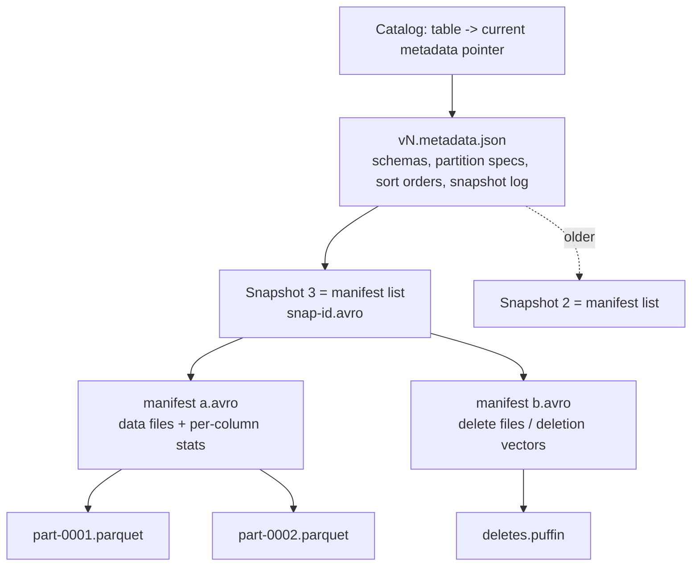

# Iceberg Table Lab

Learn Apache Iceberg the only way that sticks — **write a table, then read its own metadata files** —
following the teach-by-doing principles in [`AGENTS.md`](../../../AGENTS.md). Design context comes from
[`lakehouse-designer`](../lakehouse-designer/SKILL.md); the Delta counterpart is
[`delta-lake-lab`](../delta-lake-lab/SKILL.md).

## When to use

- The learner has heard "Iceberg gives ACID on object storage" and wants to *see* the mechanism, not trust it.
- They keep confusing snapshots, manifest lists, and manifests — or think Iceberg partitions like Hive.
- They need a free, offline reproduction before touching a real catalog (Glue, Nessie, Polaris, REST).
- They are choosing between partitioning, sort order, and compaction to fix slow scans or small files.

## First principles: Iceberg is a pointer swap

An Iceberg table is a **tree of immutable files plus one mutable pointer**. A commit writes new metadata,
then atomically swaps that pointer in the catalog. The single atomic swap is where ACID comes from — object
storage never has to support anything harder than "put a new file".



Read planning walks **down** this tree and prunes at every level using stored stats — the manifest list
prunes whole manifests by partition range, manifests prune files by column min/max. No directory listing.

| Layer | File | Holds | Why you care |
| --- | --- | --- | --- |
| Catalog | (external) | name → current metadata location | The atomic compare-and-swap; the ACID boundary |
| Table metadata | `vN.metadata.json` | schemas, partition **specs**, sort orders, snapshot log | Schema and partition **evolution** live here, not in the data |
| Snapshot | `snap-<id>-*.avro` (manifest list) | one row per manifest + partition ranges | First pruning pass; the unit of time travel |
| Manifest | `*.avro` | one row per data/delete file + column stats | Second pruning pass; rewritten by compaction |
| Data | `*.parquet` | the actual rows | Never rewritten by a metadata-only operation |

**Hidden partitioning** is the headline trade-off. In Hive you partition by a *derived column* (`dt`) and
every query must filter on it. Iceberg stores a **partition transform** (`identity`, `bucket[N]`,
`truncate[W]`, `year`, `month`, `day`, `hour`) in the spec, so a filter on `ts` prunes `day(ts)` partitions
automatically — and the layout can change later via **partition evolution** without rewriting old data,
because every manifest records the spec it was written with (Apache Iceberg docs, *Partitioning* and
*Table Spec*, iceberg.apache.org).

## Procedure

1. **Set up locally, free.** Either path works offline:
   - `pip install "pyiceberg[sql-sqlite,pyarrow]" pyarrow` — a SQLite-backed catalog and a local warehouse dir; or
   - Spark local with the Iceberg runtime jar and
     `spark.sql.catalog.local=org.apache.iceberg.spark.SparkCatalog`, `type=hadoop`, `warehouse=./warehouse`
     (Apache Iceberg docs, *Spark Getting Started*).
   Run every snippet with **`#run` (`learningos_runcode`)** and teach from the real output, never an assumed one.
2. **Create a partitioned table.** Define the schema, then a partition spec using a **transform**
   (`day(event_ts)` or `bucket(16, user_id)`) — not a hand-derived string column. Say out loud why.
3. **Append twice.** Two separate writes → two snapshots. That is the setup for everything below.
4. **Open the metadata tree by hand.** `ls -R warehouse/`, then pretty-print the newest `vN.metadata.json`
   and find `current-snapshot-id`, `snapshots[]`, `partition-specs[]`, `schemas[]`. Follow `manifest-list`
   → the `snap-*.avro` → the manifests it names → the Parquet files.
5. **Query the metadata tables instead.** Spark: `SELECT * FROM local.db.t.snapshots`, `.history`,
   `.manifests`, `.files`, `.partitions`. pyiceberg: `table.inspect.snapshots()`, `.manifests()`, `.files()`.
   Verify the counts match what you read by hand in step 4.
6. **Time travel.** Read an earlier snapshot — Spark `SELECT * FROM local.db.t VERSION AS OF <snapshot_id>`
   (or `TIMESTAMP AS OF`), pyiceberg `table.scan(snapshot_id=...)`. Then **roll back** and confirm the
   pointer moved while no data file was deleted.
7. **Prove hidden partitioning.** Filter on the **raw** timestamp column, then inspect the plan or the
   scanned-file count: partitions were pruned without you ever naming a partition column.
8. **Evolve.** Add a column, then change the spec (`day` → `hour`, or add a `bucket`). Re-read old
   snapshots: they still work and old files were **not** rewritten. Explain why (spec-id per manifest).
9. **Maintain.** Write many tiny files on purpose, then compact:
   `CALL local.system.rewrite_data_files(table => 'db.t')`, `rewrite_manifests`,
   `expire_snapshots(older_than => …)`, `remove_orphan_files`. Measure file count before and after.
10. **Name the v2 → v3 delta.** v2 introduced **positional and equality delete files** (merge-on-read).
    Spec **v3** adds **deletion vectors** (stored in Puffin, replacing positional delete files),
    **row lineage**, **default column values**, **multi-argument transforms**, and new types including
    **variant** and geometry/geography (Apache Iceberg docs, *Table Spec*). Check `format-version` in your
    metadata.json and state which of these your engine version actually supports.
11. **Close on the trade-off** the learner must own: copy-on-write (fast reads, slow writes) vs
    merge-on-read (fast writes, read amplification until compaction).

## Output shape

```
Iceberg lab — <dataset> · engine: pyiceberg+SQLite | Spark local · warehouse: ./warehouse

Setup:   pip install "pyiceberg[sql-sqlite,pyarrow]"    (free, offline)
Table:   db.t  format-version=<2|3>  spec: day(event_ts), bucket(16, user_id)
Writes:  append #1 -> snapshot <id1> | append #2 -> snapshot <id2>

Metadata tree walked:
  vN.metadata.json  current-snapshot-id=<id2>  specs=<n>  schemas=<n>
  -> snap-<id2>-*.avro (manifest list)  manifests=<n>
     -> <manifest>.avro  data files=<n>  delete files=<n>
        -> part-*.parquet  rows=<n>

Metadata tables:  .snapshots=<n> .history=<n> .manifests=<n> .files=<n>
Time travel:      VERSION AS OF <id1> -> rows=<n>  |  rollback -> pointer moved, 0 files deleted
Hidden partition: filter on event_ts -> files scanned <before> -> <after> (no dt column named)
Evolution:        day -> hour ; old snapshots readable, 0 files rewritten
Maintenance:      rewrite_data_files <n> -> <m> files | expire_snapshots -> <k> snapshots kept

#run checks: <command -> real output -> PASS/FAIL>
Trade-off:   CoW <read-fast/write-slow> vs MoR <write-fast/read-amplified>
Next: lakehouse-designer | delta-lake-lab | spark-job-coach
```

## Tips

- The catalog is the ACID boundary. Concurrent writers race to swap the same pointer and the loser retries;
  a filesystem/`hadoop` catalog is fine for this lab and **not** safe for concurrent production writers.
- Never invent a `dt` string column to partition by — use a transform and let filters on the real column prune.
- `expire_snapshots` is what actually deletes data files. Until then "deleted" rows are still on disk and
  still time-travelable; set retention to cover your replay window, then reclaim.
- Compaction rewrites **data**; `rewrite_manifests` rewrites **metadata**. Slow *planning* usually means too
  many manifests, slow *scanning* means too many small files. Diagnose before you fix.
- Read `format-version` before quoting a feature: deletion vectors, row lineage and variant are **v3** —
  don't promise them on a v2 table.
- Route onward: [`lakehouse-designer`](../lakehouse-designer/SKILL.md) for the design decision,
  [`spark-job-coach`](../spark-job-coach/SKILL.md) for the write jobs,
  [`data-warehouse-modeling`](../data-warehouse-modeling/SKILL.md) for the gold layer, and
  [`data-contract-designer`](../data-contract-designer/SKILL.md) for schema-evolution rules.
- End with the **Learning Footer** (`AGENTS.md`) — one metadata file the learner must open unaided, and one
  maintenance procedure to run on their own table.
