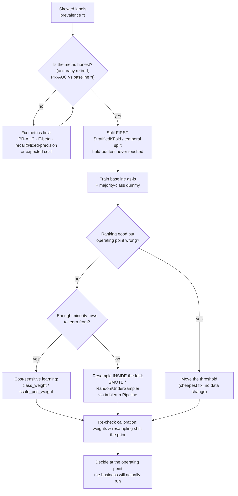

# Imbalanced Data Coach

Rare-class problems fail in a very specific way: the model is fine, the *metric* lied — following the
measure-honestly and source-discipline rules in [`AGENTS.md`](../../../AGENTS.md). This skill fixes the
evaluation first, and only then touches the data.

## When to use

- The positive class is 0.1–10% of rows (fraud, churn, defects, rare disease, click-through, anomaly labels).
- Accuracy is high, the confusion matrix has an empty column, and nobody noticed for a week.
- Someone reaches for SMOTE as the first move, before there is a metric that can even tell whether it helped.
- Cross-validated scores look great, but production recall collapses — usually resampling before the split.
- ROC-AUC is 0.94 and stakeholders are delighted; precision at the operating point is 4%.
- **Don't use it for** genuinely balanced problems, multi-label ranking, or *label noise* (a different
  disease — a rare class is not the same as a wrong class). And don't use it to "fix" a class that is rare
  because you under-collected it: the right fix there is data collection, via
  [data-labeling-planner](../data-labeling-planner/SKILL.md).

## First principles: skew breaks the metric before it breaks the model

Let $\pi$ be the prevalence of the positive class. A classifier that always predicts *negative* scores
accuracy $1-\pi$. At $\pi = 0.01$ that is **99% accuracy with zero utility** — the accuracy paradox.

Two curves are commonly used, and only one is sensitive to skew:

- **ROC** plots TPR against FPR. FPR $= FP/(FP+TN)$ has the *large* negative count in its denominator, so
  thousands of false positives barely move it. ROC-AUC's baseline is $0.5$ **whatever** $\pi$ is.
- **Precision–Recall** plots $P = TP/(TP+FP)$ against $R = TP/(TP+FN)$. Precision has no $TN$ term at all,
  so it reacts to every false positive. A random classifier's PR-AUC baseline **is** $\pi$.

That asymmetry is the documented reason to prefer PR curves under class skew (Davis & Goadrich, *The
Relationship Between Precision-Recall and ROC Curves*, ICML 2006; Saito & Rehmsmeier, *The Precision-Recall
Plot Is More Informative than the ROC Plot…*, PLOS ONE, 2015-03-04). Always report PR-AUC **next to its
baseline $\pi$** — "PR-AUC 0.18" is meaningless until you know whether $\pi$ was 0.01 or 0.30.

When precision and recall must be traded deliberately, use F-beta, where $\beta$ is *how many times more
you care about recall than precision*:

$$F_\beta = (1+\beta^2)\,\frac{P \cdot R}{\beta^2 P + R}$$

At $P=0.30$, $R=0.80$: $F_1 = 2(0.24)/1.10 = 0.436$, while $F_2 = 5(0.24)/(4(0.30)+0.80) = 1.2/2.0 = 0.600$.
Same model, different question. Pick $\beta$ from the *cost ratio*, before you look at any scores.


*Caption: fix the metric, then the split, then the threshold — resampling is the last lever, not the first.*

| Lever | What it changes | Costs you | Use when |
| --- | --- | --- | --- |
| **Threshold moving** | only the decision cut on $\hat{p}$ | nothing — no retraining | ranking (PR-AUC) is already decent; you just need a different P/R point |
| **Class weights** (`class_weight="balanced"`, XGBoost `scale_pos_weight`) | the loss, not the data | miscalibrated probabilities | minority rows are sufficient but the loss ignores them |
| **Random undersampling** | drops majority rows | throws away real information; higher variance | huge majority class, training too slow, or you need a fast baseline |
| **Random oversampling** | duplicates minority rows | overfits exact duplicates | very small data, tree models, as a control against SMOTE |
| **SMOTE** | synthesises minority points between $k$ nearest minority neighbours (Chawla et al., *SMOTE*, JAIR 16, 2002) | invents points that may cross the true class boundary; degrades in high dimensions and with categorical features | continuous features, moderate dimensionality, and only after it beats class weights |
| **Collect / label more positives** | the actual problem | time and money | always the best option when available |

`class_weight="balanced"` is not magic — scikit-learn defines it as
$w_c = n_{\text{samples}} / (n_{\text{classes}} \cdot n_c)$. For 9 900 negatives and 100 positives:
$w_{-} = 10000/(2\cdot 9900) = 0.505$ and $w_{+} = 10000/(2\cdot 100) = 50.0$, a 99:1 ratio — exactly the
inverse of the imbalance.

**The uncomfortable finding:** imbalance corrections often do not help and reliably *hurt calibration*
(van den Goorbergh et al., *The harm of class imbalance corrections for risk prediction models*, JAMIA,
2022). If your downstream consumer needs a probability — expected loss, triage ranking, pricing — prefer
threshold moving on a well-calibrated model over resampling. Undersampling in particular shifts the
predicted probability upward in a known, correctable way; Dal Pozzolo et al. (*Calibrating Probability with
Undersampling for Unbalanced Classification*, IEEE SSCI 2015) give
$p = \frac{\beta p_s}{\beta p_s - p_s + 1}$, where $p_s$ is the model's probability on the undersampled data
and $\beta$ is the fraction of negatives kept. Sanity-check it: $\beta = 1$ gives $p = p_s$ (no correction),
and $\beta \to 0$ drives $p \to 0$ (heavy undersampling had inflated it).

## Procedure

1. **Write the cost ratio down before anything else.** "A missed fraud costs €400, a false alert costs 3
   minutes of an analyst's time." That single sentence chooses $\beta$, chooses the threshold, and settles
   most arguments later.
2. **Measure prevalence and absolute counts.** `y.value_counts(normalize=True)` *and* `y.value_counts()`.
   Ratio alone is misleading: 1% of 10 million is 100 000 positives (easy); 1% of 800 is 8 (hopeless — say
   so, and go collect data).
3. **Split before you touch a single row.** Stratify, and for anything time-ordered use a temporal split:

   ```python
   from sklearn.model_selection import StratifiedKFold, train_test_split
   X_tr, X_te, y_tr, y_te = train_test_split(X, y, test_size=0.2, stratify=y, random_state=0)
   cv = StratifiedKFold(n_splits=5, shuffle=True, random_state=0)
   ```

   Check the fold budget: with $n_+$ positives and $k$ folds you get $n_+/k$ positives per validation fold.
   Below roughly 20–30 the fold estimate is mostly noise — reduce $k$ or use repeated stratified CV.
4. **Establish two floors.** `DummyClassifier(strategy="most_frequent")` for accuracy (to kill it), and the
   PR-AUC baseline $\pi$. Any model that does not clear $\pi$ by a wide margin has learned nothing.
5. **Train the plain model first, with no correction at all.** This is the control. Half the time it wins
   after step 7 and you have saved yourself a pipeline.
6. **Score with skew-aware metrics only.**

   ```python
   from sklearn.metrics import average_precision_score, precision_recall_curve, fbeta_score
   ap = average_precision_score(y_te, p_hat)          # PR-AUC; compare against pi
   ```

   `average_precision_score` is the step-wise summary of the PR curve and does **not** use the
   trapezoidal interpolation that inflates `auc(recall, precision)` — prefer it.
7. **Tune the threshold on validation data, never on test.** Sweep `precision_recall_curve` thresholds and
   pick the one that maximises your $F_\beta$ or minimises expected cost
   $\mathbb{E}[\text{cost}] = c_{FN}\!\cdot\!FN + c_{FP}\!\cdot\!FP$. Report the chosen threshold as part of
   the model — a classifier without its operating point is not deployable.
8. **Only now consider resampling — and put it inside the fold.** scikit-learn's `Pipeline` cannot hold a
   sampler; use `imblearn.pipeline.Pipeline`, which applies samplers on `fit` and skips them on
   `predict`/`transform`:

   ```python
   from imblearn.pipeline import Pipeline
   from imblearn.over_sampling import SMOTE
   from sklearn.preprocessing import StandardScaler
   from sklearn.linear_model import LogisticRegression
   pipe = Pipeline([("sc", StandardScaler()), ("smote", SMOTE(random_state=0)),
                    ("clf", LogisticRegression(max_iter=2000))])
   ```

   This is the leakage fix: SMOTE runs on 4 folds, the 5th is scored untouched and keeps its real prevalence.
9. **Re-check calibration** with `sklearn.calibration.calibration_curve` and Brier score. If weights or
   resampling flattened the reliability diagram, wrap the *inner* estimator in `CalibratedClassifierCV`
   (fitted on data the sampler never saw) or apply the undersampling correction above.
10. **Verify by running it** — measure PR-AUC and $F_\beta$ for: baseline, class-weighted, SMOTE-in-pipeline,
    and the deliberately-wrong SMOTE-before-split. Report all four. Close with the **Learning Footer**.

## Output shape

```
Task: <positive class> · n=<rows> · positives=<n_+> · prevalence π=<..>
Costs: FN=<..> FP=<..>  ⇒ beta=<..>  (or expected-cost objective)
Split: <stratified k-fold | temporal>   folds=<k>   positives per val fold=<n_+/k>
Floors: dummy accuracy=<1-π>   PR-AUC baseline=<π>

| variant                    | PR-AUC | ROC-AUC | P@thr | R@thr | F_beta | Brier |
|----------------------------|--------|---------|-------|-------|--------|-------|
| baseline (no correction)   | <..>   | <..>    | <..>  | <..>  | <..>   | <..>  |
| class_weight=balanced      | <..>   | <..>    | <..>  | <..>  | <..>   | <..>  |
| SMOTE inside CV fold       | <..>   | <..>    | <..>  | <..>  | <..>   | <..>  |
| [leaky control] SMOTE      | <..>   | <..>    | <..>  | <..>  | <..>   | <..>  |
|   before the split         |        |         |       |       |        |       |

Chosen threshold: <t> (tuned on validation, tested once)  ⇒ P=<..> R=<..> alerts/day=<..>
Leakage check: sampler inside imblearn Pipeline ✓ · scaler fitted per fold ✓ · test touched once ✓
Calibration: reliability <ok|flattened> · correction applied=<none|isotonic|β-formula>
Decision: ship <variant> because <clears floor AND meets cost objective>
Rejected: <variant> — <the number that failed>
Next: <model-monitoring-coach | model-explainability-lab | feature-engineering-coach>
Learning Footer
```

## Worked example — prove that resampling before the split lies to you

Fully local, free, CPU-only. `pip install scikit-learn imbalanced-learn`.

```python
import numpy as np
from sklearn.datasets import make_classification
from sklearn.model_selection import StratifiedKFold, cross_val_score, train_test_split
from sklearn.linear_model import LogisticRegression
from sklearn.preprocessing import StandardScaler
from sklearn.metrics import average_precision_score
from imblearn.over_sampling import SMOTE
from imblearn.pipeline import Pipeline as ImbPipeline

X, y = make_classification(n_samples=10_000, n_features=20, n_informative=5,
                           weights=[0.99, 0.01], flip_y=0.01, random_state=0)
print("prevalence:", y.mean())                 # ≈ 0.01  → PR-AUC baseline ≈ 0.01
cv = StratifiedKFold(n_splits=5, shuffle=True, random_state=0)

# --- WRONG: resample the whole dataset, then cross-validate -------------------
Xr, yr = SMOTE(random_state=0).fit_resample(X, y)
leaky = cross_val_score(
    ImbPipeline([("sc", StandardScaler()), ("clf", LogisticRegression(max_iter=2000))]),
    Xr, yr, cv=cv, scoring="average_precision")
print("LEAKY  PR-AUC:", leaky.mean().round(3))   # scored on a 50/50 set → baseline is 0.5, not 0.01

# --- RIGHT: sampler lives inside the pipeline, so it runs per training fold ----
honest = cross_val_score(
    ImbPipeline([("sc", StandardScaler()), ("smote", SMOTE(random_state=0)),
                 ("clf", LogisticRegression(max_iter=2000))]),
    X, y, cv=cv, scoring="average_precision")
print("HONEST PR-AUC:", honest.mean().round(3))  # scored at the real prevalence
```

**Trace it.** Two independent things go wrong in the leaky version, and it is worth separating them:

1. **Synthetic twins straddle the split.** SMOTE creates a point on the segment between a real minority
   sample and one of its $k$ nearest minority neighbours. After a global resample, the parent can land in
   the training fold while its near-duplicate child lands in validation — the model is graded on data it has
   effectively memorised.
2. **The denominator moved.** After `fit_resample`, `yr.mean()` is ≈ 0.5, so the PR-AUC baseline is 0.5
   rather than 0.01. The leaky number is not merely optimistic, it is *not on the same scale* as the honest
   one — a chance classifier would score ≈ 0.5 there and ≈ 0.01 here.

Which is exactly why the leaky number is unusable even as a rough guide: it is high for two reasons at once,
and neither of them is skill. The `ImbPipeline` version is correct because `imblearn`'s pipeline calls
`fit_resample` **only during `fit`**; at scoring time the sampler is a no-op, so every validation fold keeps
its real 1% prevalence.

Now the cheap fix that people skip. Take the honest model's probabilities and just move the threshold:

```python
from sklearn.metrics import precision_recall_curve, fbeta_score
X_tr, X_te, y_tr, y_te = train_test_split(X, y, test_size=0.2, stratify=y, random_state=0)
clf = ImbPipeline([("sc", StandardScaler()),
                   ("clf", LogisticRegression(max_iter=2000, class_weight="balanced"))]).fit(X_tr, y_tr)
p = clf.predict_proba(X_te)[:, 1]
prec, rec, thr = precision_recall_curve(y_te, p)
beta = 2                                              # recall matters 2x more than precision
f = (1 + beta**2) * prec * rec / np.maximum(beta**2 * prec + rec, 1e-12)
best = int(np.nanargmax(f[:-1]))                      # prec/rec have one more element than thr
print("best threshold:", round(float(thr[best]), 3), "P:", prec[best].round(3), "R:", rec[best].round(3))
print("F2 @0.5 :", round(fbeta_score(y_te, (p >= 0.5).astype(int), beta=2), 3))
print("F2 @best:", round(fbeta_score(y_te, (p >= thr[best]).astype(int), beta=2), 3))
```

Two details that are easy to get wrong and are worth pointing at explicitly: `precision_recall_curve`
returns arrays of length `n_thresholds + 1` (the final point is the degenerate recall-0 corner), so slicing
`f[:-1]` before `argmax` is required to keep indices aligned with `thr`; and the `np.maximum(..., 1e-12)`
guard stops a $0/0$ warning at the end of the curve where both $P$ and $R$ hit zero. Expect the tuned
threshold to sit well below 0.5 for a recall-weighted $\beta$ — and note that `class_weight="balanced"`
already pushed probabilities up, which is precisely the calibration distortion step 9 exists to catch.

## Tips

- **Retire accuracy in the first five minutes.** Print `DummyClassifier` accuracy next to the model's; the
  argument ends immediately.
- Always quote PR-AUC **with its baseline $\pi$**. A number without its null model is a story, not a result.
- ROC-AUC is not wrong, it is *insensitive*: it answers "does the model rank a random positive above a random
  negative?", which is not the question when you can only act on 200 alerts a day.
- Prefer `average_precision_score` to `auc(recall, precision)` — the latter's linear interpolation between
  PR points is not achievable and inflates the score.
- Resampling and class weights change the *prior*, so predicted probabilities stop meaning what they say;
  if anything downstream consumes probabilities, check calibration and correct it.
- Never resample the test set, ever. The test set exists to represent production, and production is imbalanced.
- SMOTE degrades with high dimensionality, categorical features, and noisy labels — try `class_weight` and
  threshold moving first, and keep the plain baseline as a control.
- Related: [sklearn-model-selection-lab](../sklearn-model-selection-lab/SKILL.md) for the CV machinery,
  [sklearn-classification-lab](../sklearn-classification-lab/SKILL.md) and
  [sklearn-pipelines-lab](../sklearn-pipelines-lab/SKILL.md) for leak-proof pipelines,
  [feature-engineering-coach](../feature-engineering-coach/SKILL.md) for signal that beats any resampler,
  [confidence-calibration-coach](../confidence-calibration-coach/SKILL.md) for reliability diagrams,
  [model-monitoring-coach](../model-monitoring-coach/SKILL.md) for prevalence drift after launch, and
  [hyperparameter-tuning-lab](../hyperparameter-tuning-lab/SKILL.md) to tune under the right metric.
  End with the **Learning Footer** (`AGENTS.md`).
