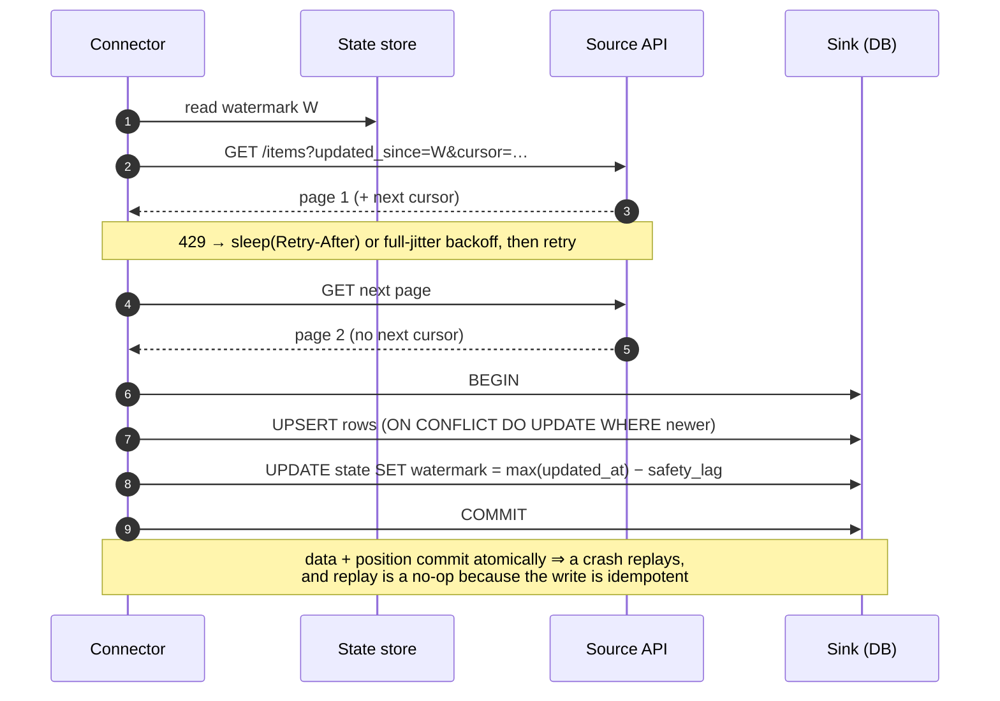

# Ingestion Connector Lab

Every ingestion connector is the same three-line contract: **read since a durable position, write
idempotently, advance the position only after the write is durable.** Get the order wrong and you lose rows
silently; get the comparison operator wrong and you lose them permanently. This lab builds one from
scratch, traces its state by hand, and then breaks it on purpose — in the run-it-and-read-the-output spirit
of [`AGENTS.md`](../../../AGENTS.md).

## When to use

- You must pull from a REST API, a SaaS export, or a source table that you cannot attach a log reader to.
- A nightly sync "mostly works" but the counts drift, or a retry produced duplicate rows.
- Deletes in the source never reach the warehouse and nobody noticed for a quarter.
- The source added a field and the loader crashed — or worse, silently dropped it.
- **Don't use it for** log-based capture from a database you control (that is
  [`debezium-cdc-lab`](../debezium-cdc-lab/SKILL.md) and
  [`cdc-pipeline-coach`](../cdc-pipeline-coach/SKILL.md)), for transforming what you landed
  ([`dbt-model-coach`](../dbt-model-coach/SKILL.md)), or for orchestration and scheduling
  ([`airflow-dag-coach`](../airflow-dag-coach/SKILL.md)).

## First principles: position, idempotence, ordering

A connector is a **resumable cursor over a remote dataset**. Three properties decide whether it is correct:

1. **The position must be durable and monotone.** A watermark you keep in memory is not a watermark. A
   watermark derived from a field the source can move *backwards* (a mutable `updated_at` reset by a bulk
   job) is not monotone, and no operator choice will save it.
2. **The write must be idempotent on the primary key.** Because networks fail between "wrote rows" and
   "recorded position", every honest connector is **at-least-once**. An upsert keyed on the source primary
   key converts at-least-once delivery into effectively-once *state*.
3. **State must commit with (or after) the data, never before.** Commit the watermark first and a crash
   loses every row in flight — permanently, because the next run starts after them.



*Figure: the only ordering that is safe. Moving the state write before the data write turns a crash into
silent, permanent data loss.*

### Full refresh vs incremental

| Mode | Reads | Cost | Handles deletes | Use when |
| --- | --- | --- | --- | --- |
| **Full refresh + replace** | everything, every run | O(table) per run | **yes** (the snapshot is the truth) | small/slow-changing dimensions; the source has no cursor |
| **Full refresh + upsert** | everything, every run | O(table) per run | **no** (nothing tells you a row vanished) | rare; usually a mistake |
| **Incremental + upsert** | rows since the watermark | O(changes) | **no** | large fact-like data with a reliable cursor |
| **Incremental + periodic reconcile** | incremental daily, full weekly | O(changes) + O(table)/week | **yes**, with a lag | the honest default for cursor-based sources |
| **Log-based CDC** | the database's own log | O(changes) | **yes**, immediately | you own the database → [`debezium-cdc-lab`](../debezium-cdc-lab/SKILL.md) |

### Choosing the cursor — and the operator

| Cursor candidate | Safe? | Why |
| --- | --- | --- |
| Monotonically increasing surrogate id | for **inserts only** | never sees updates |
| `updated_at` maintained by the source | usually | must be updated on *every* write, including bulk jobs |
| Source-provided opaque sync token | best when offered | the source owns correctness |
| `created_at` | **no** | invisible to updates |
| Client clock / "now minus a day" | **no** | clock skew and long transactions silently drop rows |

Then the operator, which is where connectors actually break:

- **`updated_at > W` is lossy.** Timestamps are not unique. If ten rows share the watermark instant and you
  only read three before the page ended, the other seven are excluded forever on the next run.
- **`updated_at >= W` is safe** — it re-reads the boundary rows, and re-reading is free when the write is
  idempotent. Duplicates are a *performance* concern; skipped rows are a *correctness* one.
- **Subtract a safety lag** (`W = max(updated_at) − few minutes`). A row whose transaction began before your
  read but committed after it carries an `updated_at` *earlier* than your new watermark; without the lag it
  is never picked up. The lag must exceed your source's longest write transaction plus clock skew.

### Rate limits and backoff

Honour `Retry-After` when the server sends it — per **RFC 9110 §10.2.3 (published 2022-06)** it is either
delay-seconds or an HTTP-date, so parse both. When it is absent, use **exponential backoff with full
jitter**: `sleep = random_between(0, min(cap, base × 2^attempt))` (AWS Architecture Blog, *Exponential
Backoff And Jitter*, Marc Brooker, **2015-03-04**). Full jitter is what prevents a fleet of workers from
retrying in a synchronised thundering herd.

| Status | Retry? | Note |
| --- | --- | --- |
| 408, 425, 429 | yes | 429 ⇒ obey `Retry-After` first |
| 500, 502, 503, 504 | yes | 503 often carries `Retry-After` too |
| connection reset / timeout | yes | only if the request is safe to repeat |
| 400, 401, 403, 404, 422 | **no** | retrying a bad request just burns quota — fail loudly |

Deepen with [`retry-backoff-coach`](../retry-backoff-coach/SKILL.md) and
[`idempotency-coach`](../idempotency-coach/SKILL.md).

## Procedure

1. **Interrogate the source before writing code**: is there a cursor field, is it updated on *every* write,
   is ordering guaranteed, how is pagination expressed (offset, page token, link header), what are the rate
   limits, and are deletes observable at all? Write the answers down — most connector defects are answers
   nobody checked.
2. **Choose the sync mode** from the table above and state the delete strategy explicitly. "We'll deal with
   deletes later" is a decision to have wrong data.
3. **Design the sink schema first**: the source primary key as the sink primary key (so upsert has a
   conflict target), the cursor column, an ingestion timestamp, and a `raw` JSON column holding the
   untouched payload — that column is what lets you replay history after a modelling mistake.
4. **Create the state table** keyed by stream name, in the **same database as the sink**, so data and
   position can commit in one transaction.
5. **Implement paging as a generator** that yields records until the source stops returning a next cursor.
   Cap pages per run and make the cap a config value so a first backfill cannot run for a day.
6. **Wrap every request in the retry policy**: retryable statuses only, `Retry-After` honoured, full jitter
   otherwise, a maximum attempt count, and a hard ceiling on total run time.
7. **Write with `INSERT … ON CONFLICT DO UPDATE … WHERE excluded.updated_at > target.updated_at`.** The
   `WHERE` makes the upsert both idempotent *and* out-of-order-safe: a stale replay cannot overwrite a newer
   row.
8. **Advance the watermark inside the same transaction**, to `max(updated_at) − safety_lag`, and never
   advance it when zero rows were fetched.
9. **Handle schema drift**: compare incoming keys against the sink's columns. New field → `ALTER TABLE ADD
   COLUMN` (additive, safe). Type change or removed field → route the record to a quarantine table and
   alert; never coerce silently. Agree the rules up front with
   [`schema-evolution-coach`](../schema-evolution-coach/SKILL.md) and
   [`data-contract-designer`](../data-contract-designer/SKILL.md).
10. **Test the failure modes deliberately**: kill the process mid-write, re-run and assert row counts are
    unchanged; replay an old page and assert nothing regresses; run twice back to back and assert the second
    run applies zero changes.
11. **Reconcile on a schedule**: a periodic full key-set comparison that detects hard deletes and drift.
    Emit `source_count`, `sink_count`, and the symmetric difference as metrics, and alert on them with
    [`data-observability-coach`](../data-observability-coach/SKILL.md).
12. **Make the run observable**: rows fetched, rows applied, pages, retries, watermark before/after,
    duration. A connector that reports only "success" cannot be debugged.
13. Close with the **Learning Footer**.

## Output shape

```
Connector: <stream name>  source: <API/table>  sink: <table>  mode: <full replace | incremental upsert>

Source facts: cursor=<field> monotone=<y/n> updated on every write=<y/n> pagination=<offset|token|link>
              rate limit=<n/min> deletes observable=<no | soft-delete flag | tombstone endpoint>
Cursor policy: operator=<'>=' (required)> safety_lag=<n min> reason=<max write txn + clock skew>

Run:
  watermark before : <ts>
  pages fetched    : <n>   records fetched: <n>   retries: <n> (429=<n> 5xx=<n>) total backoff: <s>
  rows applied     : inserted=<n> updated=<n> skipped-as-stale=<n>
  watermark after  : <ts>  = max(updated_at) − <lag>
  transaction      : data + state committed together = <yes>

Idempotence proof:
  run twice back-to-back -> second run: fetched=<n> applied=<0>  PASS/FAIL
  replay an old page     -> applied=<0> (WHERE excluded.updated_at > target)  PASS/FAIL
  kill mid-write, re-run -> sink rows unchanged=<n>  PASS/FAIL

Schema drift: new fields=<[...] -> ADD COLUMN> · type changes=<[...] -> quarantined n rows> · alerted=<y/n>
Deletes: strategy=<full reconcile weekly | soft-delete flag | none ⚠> last reconcile=<date> diff=<n keys>
Next: cdc-pipeline-coach | retry-backoff-coach | data-observability-coach
Learning Footer
```

## Worked example — a correct connector in the standard library, then broken on purpose

Zero dependencies, zero cost: SQLite as the sink (`sqlite3` is in the Python standard library; **UPSERT has
been supported since SQLite 3.24.0, 2018-06-04**) and an in-process function standing in for the API.

```python
# connector.py  —  python connector.py   (run it repeatedly; that's the point)
import json, random, sqlite3, time
from datetime import datetime, timedelta, timezone

FMT = "%Y-%m-%dT%H:%M:%SZ"
SAFETY_LAG_MIN = 5
PAGE_SIZE = 2

# ---------- the "remote API" (mutable, paginated, rate limited) ----------
SOURCE = [
    {"id": 1, "name": "alpha",   "updated_at": "2026-01-01T00:00:00Z"},
    {"id": 2, "name": "bravo",   "updated_at": "2026-01-01T00:00:00Z"},
    {"id": 3, "name": "charlie", "updated_at": "2026-01-02T00:00:00Z"},
]

class RateLimited(Exception):
    def __init__(self, retry_after=None): self.retry_after = retry_after

def api_get(since: str, cursor: int = 0):
    if random.random() < 0.15:                       # simulate HTTP 429
        raise RateLimited(retry_after=1)
    rows = sorted((r for r in SOURCE if r["updated_at"] >= since),   # NOTE: >= not >
                  key=lambda r: (r["updated_at"], r["id"]))          # stable total order
    page = rows[cursor:cursor + PAGE_SIZE]
    nxt = cursor + PAGE_SIZE if cursor + PAGE_SIZE < len(rows) else None
    return page, nxt

# ---------- retry policy ----------
def with_retry(fn, *args, attempts=6, base=0.5, cap=30.0):
    for attempt in range(attempts):
        try:
            return fn(*args)
        except RateLimited as e:
            if attempt == attempts - 1:
                raise
            # honour Retry-After exactly when given (RFC 9110 §10.2.3);
            # otherwise exponential backoff with FULL JITTER
            delay = e.retry_after if e.retry_after is not None \
                    else random.uniform(0, min(cap, base * 2 ** attempt))
            time.sleep(delay)

# ---------- sink ----------
def connect(path="sink.db"):
    c = sqlite3.connect(path)
    c.isolation_level = None                          # explicit BEGIN/COMMIT
    c.executescript("""
        CREATE TABLE IF NOT EXISTS items (
          id          INTEGER PRIMARY KEY,            -- source PK == conflict target
          name        TEXT NOT NULL,
          updated_at  TEXT NOT NULL,
          raw         TEXT NOT NULL,                  -- untouched payload, for replay
          ingested_at TEXT NOT NULL
        );
        CREATE TABLE IF NOT EXISTS sync_state (
          stream    TEXT PRIMARY KEY,
          watermark TEXT NOT NULL
        );
    """)
    return c

UPSERT = """
INSERT INTO items (id, name, updated_at, raw, ingested_at)
VALUES (?, ?, ?, ?, ?)
ON CONFLICT(id) DO UPDATE SET
  name        = excluded.name,
  updated_at  = excluded.updated_at,
  raw         = excluded.raw,
  ingested_at = excluded.ingested_at
WHERE excluded.updated_at > items.updated_at;          -- stale replays are a no-op
"""

def minus_lag(ts: str, minutes: int) -> str:
    t = datetime.strptime(ts, FMT).replace(tzinfo=timezone.utc)
    return (t - timedelta(minutes=minutes)).strftime(FMT)

def sync(conn, stream="items"):
    row = conn.execute("SELECT watermark FROM sync_state WHERE stream = ?", (stream,)).fetchone()
    watermark = row[0] if row else "1970-01-01T00:00:00Z"

    fetched, cursor = [], 0
    while True:                                        # pagination
        page, cursor = with_retry(api_get, watermark, cursor)
        fetched.extend(page)
        if cursor is None:
            break

    if not fetched:                                    # never advance on an empty run
        return {"fetched": 0, "applied": 0, "watermark": watermark}

    now = datetime.now(timezone.utc).strftime(FMT)
    conn.execute("BEGIN")                              # data + state in ONE transaction
    before = conn.total_changes                        # count item rows only, not the state write
    conn.executemany(UPSERT, [(r["id"], r["name"], r["updated_at"], json.dumps(r), now)
                              for r in fetched])
    applied = conn.total_changes - before
    new_wm = minus_lag(max(r["updated_at"] for r in fetched), SAFETY_LAG_MIN)
    conn.execute("INSERT INTO sync_state (stream, watermark) VALUES (?, ?) "
                 "ON CONFLICT(stream) DO UPDATE SET watermark = excluded.watermark",
                 (stream, new_wm))
    conn.commit()
    return {"fetched": len(fetched), "applied": applied, "watermark": new_wm}

if __name__ == "__main__":
    conn = connect()
    print(sync(conn))
    print("rows in sink:", conn.execute("SELECT count(*) FROM items").fetchone()[0])
```

**Trace run 1** (watermark `1970-01-01T00:00:00Z`). All three source rows satisfy `>=`. Sorted by
`(updated_at, id)`: `[1, 2, 3]`. `PAGE_SIZE = 2`, so page 1 = ids 1, 2 with `nxt = 2`; page 2 = id 3 with
`nxt = None` (since `2 + 2 = 4` is not `< 3`). Fetched = 3, all inserted.
`max(updated_at) = 2026-01-02T00:00:00Z`, minus 5 minutes → watermark `2026-01-01T23:55:00Z`.

```
{'fetched': 3, 'applied': 3, 'watermark': '2026-01-01T23:55:00Z'}
rows in sink: 3
```

**Trace run 2**, immediately, with nothing changed at the source. Only row 3 satisfies
`updated_at >= '2026-01-01T23:55:00Z'`. It is fetched — the safety lag *deliberately* re-reads it. The
upsert's `WHERE excluded.updated_at > items.updated_at` compares `'2026-01-02T00:00:00Z' >
'2026-01-02T00:00:00Z'` → **false**, so SQLite performs the `DO UPDATE` as a no-op:

```
{'fetched': 1, 'applied': 0, 'watermark': '2026-01-01T23:55:00Z'}
rows in sink: 3
```

**`fetched = 1, applied = 0` is the whole design.** At-least-once delivery met an idempotent write, and the
sink did not move. Re-running the connector ten more times changes nothing.

**Trace run 3** after the source mutates row 2:

```python
SOURCE[1] = {"id": 2, "name": "bravo-v2", "updated_at": "2026-01-03T09:00:00Z"}
```

Rows with `updated_at >= '2026-01-01T23:55:00Z'`: ids 3 (`01-02`) and 2 (`01-03`), sorted to `[3, 2]`, both
in one page. Row 3 is stale → no-op. Row 2's `'2026-01-03T09:00:00Z' > '2026-01-01T00:00:00Z'` → **true** →
updated. New watermark = `2026-01-03T09:00:00Z` − 5 min = `2026-01-03T08:55:00Z`.

```
{'fetched': 2, 'applied': 1, 'watermark': '2026-01-03T08:55:00Z'}
rows in sink: 3          # still 3 rows; one of them now reads 'bravo-v2'
```

**Now break it on purpose — the strict-`>` defect.** Change the source filter to
`r["updated_at"] > since` and drop the safety lag. After run 1, the watermark is exactly
`2026-01-02T00:00:00Z`. Suppose a row 4 with `updated_at = "2026-01-02T00:00:00Z"` (same instant, a long
transaction that committed a second later) appears at the source. Run 2 asks for
`updated_at > '2026-01-02T00:00:00Z'` — row 4 fails the comparison, and it will fail it on **every future
run**. The connector reports success forever while one row is permanently missing. This is the single most
common ingestion bug in production, and `>=` plus an idempotent upsert is the entire fix.

**And the ordering defect.** Move the `sync_state` update *before* `executemany` and kill the process
between them: the watermark advanced past rows that were never written. Because the next run starts after
them, they are gone. Keeping both writes inside one `BEGIN … COMMIT` makes a crash produce a replay, and a
replay is a no-op.

**Schema drift**, additive and safe:

```python
def reconcile_schema(conn, record):
    have = {r[1] for r in conn.execute("PRAGMA table_info(items)")}   # r[1] is the column name
    for key in record:
        if key not in have:
            conn.execute(f'ALTER TABLE items ADD COLUMN "{key}" TEXT')   # additive: never destructive
            print("schema drift: added column", key)
```

New field → a nullable column appears and history stays valid. A *type* change or a disappeared field is
**not** additive: quarantine those records into a `items_quarantine` table with the raw payload and alert.
Because every row already stores its untouched `raw` JSON, you can replay the whole stream after fixing the
mapping — without going back to the API and without burning your rate limit.

**Deletes**: nothing above can ever see a hard delete, because a deleted row has no `updated_at` to exceed
the watermark. Pick one and write it down — a soft-delete flag in the source, a deletions endpoint, a weekly
full key-set reconcile (`SELECT id FROM sink` minus the source key list), or log-based CDC via
[`debezium-cdc-lab`](../debezium-cdc-lab/SKILL.md).

## Tips

- **`>=`, always.** Duplicates cost CPU; skipped rows cost trust. The upsert makes duplicates free, so the
  strict inequality has no upside.
- Subtract a **safety lag** larger than the source's longest write transaction plus clock skew. Watermarks
  fail on commit-time-versus-timestamp skew far more often than on logic.
- **Commit data and state together**, or state after data. State-first is silent, permanent loss.
- Store the **raw payload** on every row. It is the cheapest insurance in data engineering: every modelling
  mistake becomes replayable without re-hitting the source.
- Retry only retryable statuses, obey `Retry-After` before your own math, and use **full jitter** so a fleet
  of workers does not synchronise into a thundering herd.
- A cursor-based connector **cannot see hard deletes**. Choose soft deletes, a tombstone feed, periodic
  reconciliation, or CDC — silence is not a strategy.
- Additive schema changes are safe to automate; type changes and field removals must quarantine and alert,
  never coerce. Coercion turns a loud failure into a quiet corruption.
- Emit rows-fetched, rows-applied and both watermarks per run. `applied = 0` on an unchanged re-run is the
  metric that proves idempotence in production, not just in the test suite.
- Related: [`cdc-pipeline-coach`](../cdc-pipeline-coach/SKILL.md),
  [`debezium-cdc-lab`](../debezium-cdc-lab/SKILL.md),
  [`retry-backoff-coach`](../retry-backoff-coach/SKILL.md),
  [`idempotency-coach`](../idempotency-coach/SKILL.md),
  [`api-pagination-coach`](../api-pagination-coach/SKILL.md),
  [`rate-limiter-designer`](../rate-limiter-designer/SKILL.md),
  [`schema-evolution-coach`](../schema-evolution-coach/SKILL.md),
  [`backfill-and-reprocessing-coach`](../backfill-and-reprocessing-coach/SKILL.md), and
  [`data-pipeline-designer`](../data-pipeline-designer/SKILL.md).
  End with the **Learning Footer** (`AGENTS.md`).
