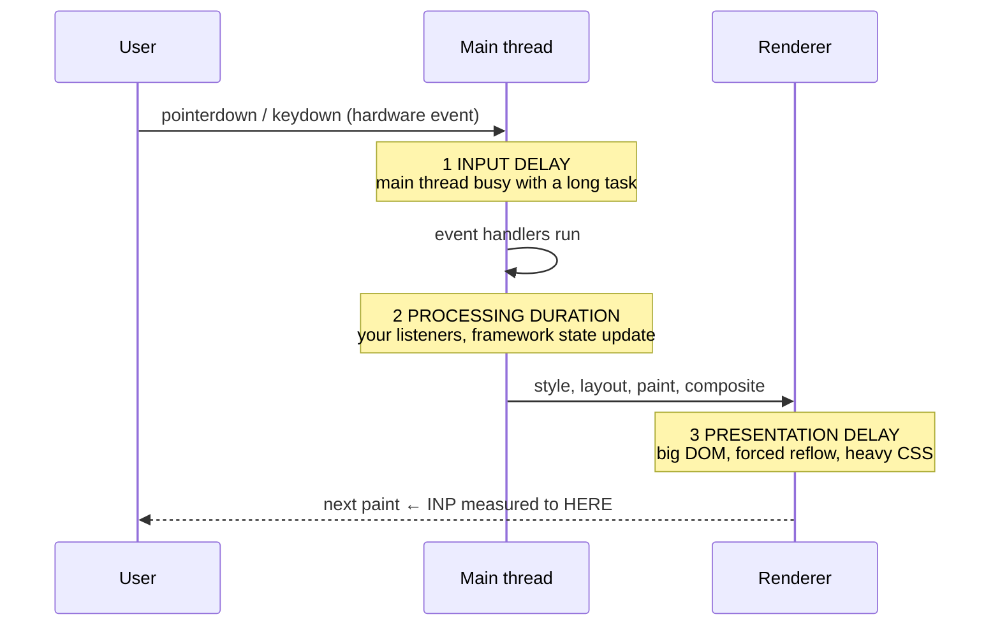

# INP Optimization Lab

A measurement-first lab for the responsiveness Core Web Vital: **measure the interaction → attribute it to
one of three phases → fix that phase → re-measure**. Guessing is banned; every fix is justified by an entry
from a `PerformanceObserver`. Follows the verify-before-you-teach rule in
[`AGENTS.md`](../../../AGENTS.md).

## When to use

- Your field data (CrUX, RUM, PageSpeed Insights) shows p75 INP above the 200 ms "good" threshold.
- A button, filter or keystroke *feels* laggy and you need to know which third of the interaction is at
  fault before touching code.
- You are about to sprinkle `setTimeout(…, 0)` everywhere and want to learn `scheduler.yield()` properly.
- **Don't use it for** load-time metrics (LCP, CLS, TTFB) or bundle size — that is
  [web-perf-audit](../web-perf-audit/SKILL.md).

## First principles: INP is three latencies, not one

Per the Chrome team's Core Web Vitals documentation, **INP replaced FID as a Core Web Vital in March 2024**.
It observes every qualifying interaction on the page — click, tap, and keypress only (scroll and hover are
excluded) — and reports a high percentile of their latencies: the worst interaction for short sessions,
discarding roughly one outlier per 50 interactions on long-lived pages. Latency is measured from the raw
input event to the **next paint that reflects it**, which is why work *after* your handler still counts.



| Phase | What it measures | Usual cause | Fix |
| --- | --- | --- | --- |
| Input delay | input event → first handler starts | a long task already running (hydration, analytics, 3rd party) | break long tasks; `await scheduler.yield()` inside loops; defer non-critical scripts |
| Processing duration | all listeners for that interaction | doing everything in the handler; `O(n)` re-render | do only the visual update; move the rest after paint or to a Worker |
| Presentation delay | handlers end → next paint | huge DOM, forced synchronous layout, expensive CSS | shrink the DOM, `content-visibility: auto`, avoid read-after-write layout thrash |

| Threshold (p75, field data) | INP | Meaning |
| --- | --- | --- |
| Good | ≤ 200 ms | ship it |
| Needs improvement | 200–500 ms | attribute and fix the dominant phase |
| Poor | > 500 ms | treat as a bug, not a polish item |

**Trade-off to say out loud:** yielding makes each *task* short but makes the total work slightly *longer*
(scheduling overhead) and introduces interleaving bugs if your loop mutates shared state. `scheduler.yield()`
resumes at the **front** of the queue, so it preserves ordering far better than `setTimeout(…, 0)`, which
sends your continuation to the back behind every other pending task. `isInputPending()` avoids yielding when
nobody is waiting, but is Chromium-only — feature-detect it and fall back to unconditional yielding.

## Procedure

1. **Get field data first.** Lab tools cannot see real users' devices. Read p75 INP from CrUX/RUM, or add
   the `web-vitals` library (`onINP` from the *attribution* build) and report to your analytics.
2. **Reproduce with throttling**: DevTools → Performance → CPU 4× or 6× slowdown. An interaction that is
   fine on your laptop is the one shipping the 500 ms p75.
3. **Attribute the phases** with the Event Timing API (code below). Compute
   `inputDelay = processingStart − startTime`, `processing = processingEnd − processingStart`,
   `presentation = startTime + duration − processingEnd`. Whichever is largest is the only one you fix.
4. **Find the blocking script** with the Long Animation Frames API (`type: 'long-animation-frame'`); each
   entry lists `blockingDuration` plus the `scripts[]` that caused it, including third parties.
5. **Fix input delay** by breaking long tasks: inside any loop over more than a few dozen items,
   `await scheduler.yield()` (Chromium 129+) with a `setTimeout` fallback, or schedule with
   `scheduler.postTask({ priority: 'background' })`.
6. **Fix processing duration** by splitting the handler: update *only* what the user must see, then yield
   once so the browser can paint, then run analytics/persistence/derived recomputation.
7. **Fix presentation delay** by reducing what must be styled and laid out — `content-visibility: auto` on
   offscreen sections, virtualised lists, and never reading `offsetHeight` after a write in the same frame.
8. **Re-measure the same interaction** under the same throttling and record the before/after per phase.
9. Close with the **Learning Footer**.

## Output shape

```
Interaction: <selector + event>        Device profile: <CPU 4x | real device>
Field p75 INP: <before> ms  ->  <after> ms      Target: <= 200 ms
Attribution (ms):  inputDelay=<..>  processing=<..>  presentation=<..>   Dominant: <phase>
LoAF: blockingDuration=<..> ms  caused by <script/url>
Fix applied: <yield in loop | paint-then-work split | content-visibility | worker | defer 3P>
Trade-off accepted: <extra scheduling overhead | interleaving risk | stale frame>
Code: <runnable diff or snippet>
Verify: same interaction, same throttling, PerformanceObserver rerun
Next: <web-perf-audit | animation-coach | e2e-testing-coach>
Learning Footer
```

## Worked example — attribute, then fix, a 600 ms filter click

Save as `inp-lab.html`, serve it (`npx serve .`), throttle the CPU to 4×, and click **Filter** in both
modes. The observer prints the three phases so you can see *which* number the fix moved.

```html
<!doctype html>
<meta charset="utf-8"><title>INP lab</title>
<style>
  #rows { content-visibility: auto; contain-intrinsic-size: auto 20px; } /* cuts presentation delay */
  pre { background: #f4f4f4; padding: .5rem; }
</style>
<label><input type="checkbox" id="fixed"> use the fixed version</label>
<button id="filter">Filter 20 000 rows</button>
<div id="rows"></div><pre id="log"></pre>
<script type="module">
const log = (m) => document.getElementById('log').textContent += m + '\n';
const items = Array.from({ length: 20_000 }, (_, i) => ({ id: i, score: Math.random() }));

// --- 1. Attribution: Event Timing gives all three phases of a real interaction. -------------
new PerformanceObserver((list) => {
  for (const e of list.getEntries()) {
    if (!e.interactionId) continue;                 // interactionId != 0 => it counts toward INP
    const inputDelay   = e.processingStart - e.startTime;
    const processing   = e.processingEnd - e.processingStart;
    const presentation = (e.startTime + e.duration) - e.processingEnd;
    log(`${e.name}: total ${e.duration.toFixed(0)}ms = delay ${inputDelay.toFixed(0)} + ` +
        `processing ${processing.toFixed(0)} + presentation ${presentation.toFixed(0)}`);
  }
}).observe({ type: 'event', buffered: true, durationThreshold: 16 });

// --- 2. Which script blocked the frame? Long Animation Frames names names. -------------------
try {
  new PerformanceObserver((list) => {
    for (const e of list.getEntries())
      log(`LoAF ${e.duration.toFixed(0)}ms blocking ${e.blockingDuration.toFixed(0)}ms ` +
          `<- ${e.scripts?.[0]?.sourceURL ?? 'unknown'}`);
  }).observe({ type: 'long-animation-frame', buffered: true });
} catch { log('LoAF not supported in this browser'); }

// --- 3. Yield helper: prefer scheduler.yield (front of queue), fall back to a macrotask. -----
const yieldToMain = () =>
  globalThis.scheduler?.yield?.() ?? new Promise(r => setTimeout(r, 0));

const score = (it) => { let x = it.score; for (let i = 0; i < 300; i++) x = Math.sqrt(x + i); return x; };

// SLOW: one uninterrupted task -> huge processing duration, and it blocks the NEXT click too.
function slow() {
  const keep = items.filter(it => score(it) > 1);
  document.getElementById('rows').textContent = `${keep.length} rows`;
}

// FAST: paint the acknowledgement first, then chunk the work with a yield between chunks.
async function fast() {
  const rows = document.getElementById('rows');
  rows.textContent = 'Filtering…';        // visual feedback lands in the NEXT paint
  await yieldToMain();                    // <- INP stops counting here; the rest is off the hook
  const keep = [];
  for (let i = 0; i < items.length; i += 1000) {
    for (const it of items.slice(i, i + 1000)) if (score(it) > 1) keep.push(it);
    // isInputPending() is Chromium-only: undefined (unsupported) or true => yield anyway.
    const pending = globalThis.navigator?.scheduling?.isInputPending?.();
    if (pending !== false) await yieldToMain();
  }
  rows.textContent = `${keep.length} rows`;
}

document.getElementById('filter').addEventListener('click', () =>
  document.getElementById('fixed').checked ? fast() : slow());
</script>
```

Reason it through: in the slow path the whole scoring loop sits between `processingStart` and
`processingEnd`, so **processing duration** dominates and INP is roughly the full loop. In the fast path the
handler writes one string and yields, so the browser paints "Filtering…" almost immediately — INP stops at
that paint, and the remaining chunks are separate tasks that no longer block the *next* click. The total CPU
time is marginally higher; the perceived latency is an order of magnitude lower. `content-visibility: auto`
attacks the third phase by letting the browser skip style and layout for offscreen rows.

## Tips

- **Attribute before you optimise.** Chunking a handler does nothing if the problem was input delay caused
  by a third-party script — LoAF's `scripts[]` will tell you whose script it is.
- `setTimeout(fn, 0)` puts your continuation at the **back** of the task queue; `scheduler.yield()` resumes
  at the front. Use the yield-with-fallback helper above rather than raw timeouts.
- Yielding *after* you have written the visual update is the whole trick: INP is measured to the next paint,
  so acknowledge first, compute second.
- `requestAnimationFrame` alone does **not** yield — its callback runs in the same frame, before paint, and
  will lengthen presentation delay. Use `rAF` + `setTimeout` if you must run strictly after paint.
- Move pure computation (parsing, scoring, diffing) into a Web Worker; the main thread only needs the result.
- Avoid layout thrash: batch all DOM reads, then all writes. A single `offsetTop` read after a write forces
  a synchronous layout inside your handler.
- INP is a *field* metric — a green Lighthouse run proves nothing. Ship RUM.
- Pair with [web-perf-audit](../web-perf-audit/SKILL.md) for load metrics,
  [animation-coach](../animation-coach/SKILL.md) for compositor-friendly motion,
  [view-transitions-lab](../view-transitions-lab/SKILL.md) (transitions cost presentation time too),
  [browser-storage-lab](../browser-storage-lab/SKILL.md) to get synchronous `localStorage` off the main
  thread, and [debugging-coach](../debugging-coach/SKILL.md) for profile reading. Verify thresholds and API
  availability against web.dev and MDN (`AGENTS.md` §2), then end with the **Learning Footer**
  (`AGENTS.md`).
