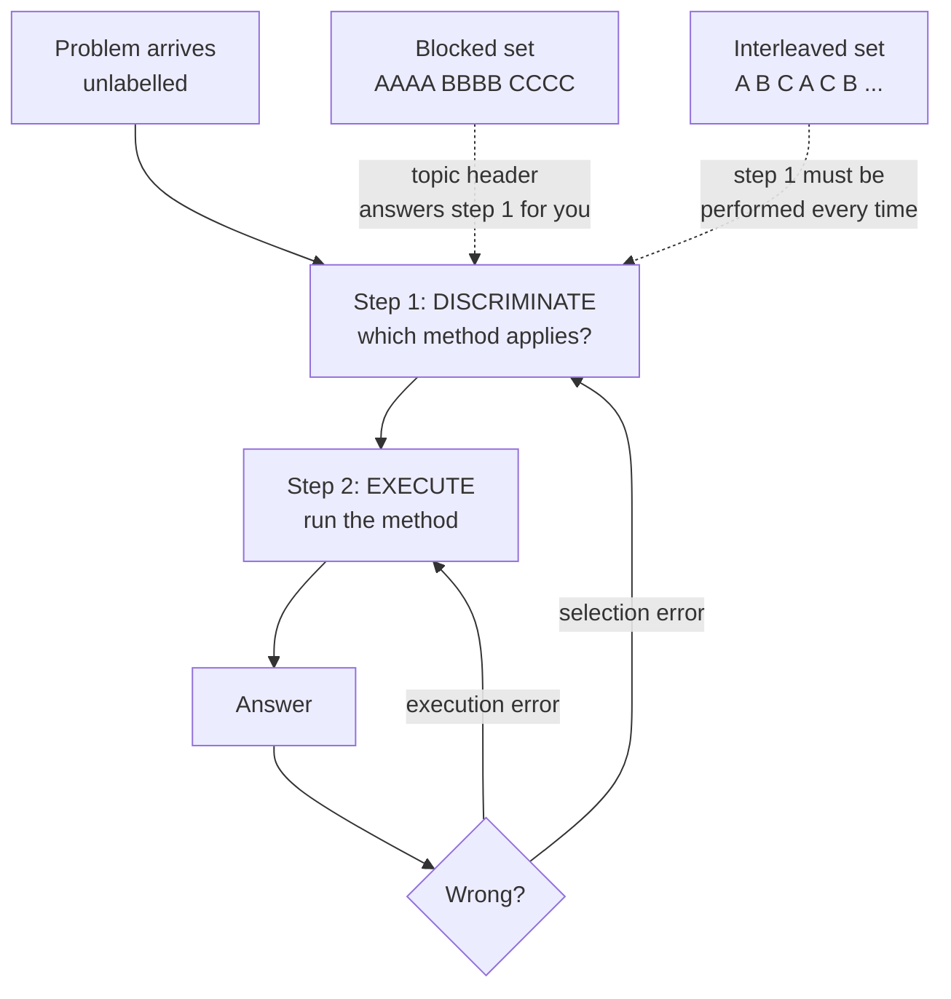

# Interleaving Planner

Blocked practice teaches you to *execute* a method; interleaved practice teaches you to *choose* it —
and exams, interviews, and real work only ever ask you to choose. Built on the teaching-first stance in
[`AGENTS.md`](../../../AGENTS.md).

## When to use

- The learner solves everything inside chapter 7 but freezes on a mixed exam where nothing is labelled.
- Several methods look similar and get confused (t-test vs z-test, `useMemo` vs `useCallback`, joins).
- Practice sets are organised by topic and accuracy during practice is suspiciously high.
- Don't use it for a brand-new skill with zero fluency — interleaving too early adds load with no
  discrimination to train; block first, then mix (see the crossover rule below).

## First principles: discrimination is a separate skill

Rohrer & Taylor (2007) taught four volume formulas to students under blocked or interleaved practice.
Blocked practice won *during* practice (≈ 89 % vs 60 %) and lost catastrophically on a delayed test
(≈ 20 % vs 63 %). Their 2015 classroom replication with mixed geometry review found the same reversal.
The mechanism is that a blocked set silently gives away the answer: inside chapter 7 every problem is a
chapter-7 problem, so the learner never practises the *selection* step. Interleaving also spaces each
type by construction, so it inherits the spacing effect.

This is a canonical **desirable difficulty** (Bjork): performance during practice drops while learning
rises — which means learners and instructors both reliably mis-rate it.



| Dimension | Blocked (AAAA BBBB) | Interleaved (ABCACB) |
| --- | --- | --- |
| Accuracy during practice | high — feels great | lower — feels inefficient |
| Delayed test performance | poor | markedly better (Rohrer & Taylor 2007) |
| What it trains | execution fluency of one method | selection + execution |
| Cognitive load | lower | higher (extra retrieval of "which method") |
| Best when | the method is brand new; motor/muscle-memory drills | ≥ 2 confusable methods, fluency already exists |
| Failure mode | can't choose a method on a mixed exam | flails because no method is yet fluent |

**Trade-off to say out loud:** interleaving trades visible short-term performance for invisible
long-term retention. Learners will report the blocked set as "better". Show them the delayed-test
numbers before they judge, and pre-commit to the schedule.

## Procedure

1. **List the confusable set** — 3–5 types that share surface features but need different methods.
   Types that are *not* confusable gain little from mixing.
2. **Check the fluency gate**: can the learner execute each type correctly at least once, unaided? If
   not, block that type for 4–8 reps first, then admit it to the mix.
3. **Strip the labels.** Every problem in the mixed set must arrive without its topic heading — the
   header is the answer to step 1.
4. **Shuffle so no type repeats back-to-back** where possible; adjacent repeats reintroduce blocking.
5. **Force an explicit selection step**: the learner writes *which* method and *why* (the discriminating
   cue) before solving. This is where the learning is.
6. **Classify every error** as a **selection** error or an **execution** error — they need opposite
   fixes and different follow-up sets.
7. **Weight the next set** toward the confusion pairs that produced selection errors; keep execution
   errors in a separate blocked mini-drill.
8. **Re-mix on a spaced cadence** and only judge success on a delayed mixed test, then close with the
   **Learning Footer**.

## Output shape

```
Types: A=<...> B=<...> C=<...> D=<...>   Confusable because: <shared surface feature>
Fluency gate: A ok · B ok · C BLOCK FIRST (<n> reps) · D ok
Session <n>  <YYYY-MM-DD>  <n> problems, labels stripped
Sequence: A B D A C B D C A B   (no adjacent repeats)
  P1 [type ?] <problem stem>
     select: <method> because <discriminating cue>   solve: <answer>
Discrimination cues:
  A vs B -> <the cue that separates them>
  B vs C -> <...>
Error ledger: selection <n> | execution <n>
Next set weighting: <pair> x<n> (selection errors) + blocked drill on <type>
Delayed mixed test: <YYYY-MM-DD>
Next: <retrieval-practice-coach | mistake-log-coach | mock-exam>
Learning Footer
```

## Worked example — statistical test selection, 10-problem mixed set

Types: **A** one-sample t-test · **B** paired t-test · **C** two-sample t-test · **D** chi-square test of
independence. All four arrive as "compare these groups" prose, which is exactly the confusion.

| # | Type | Stem (label stripped) | Correct selection cue |
| --- | --- | --- | --- |
| 1 | A | Mean latency of 30 servers vs the 200 ms SLA | one sample vs a *fixed constant* |
| 2 | B | Same 25 users' scores before and after onboarding | measurements are *paired within subject* |
| 3 | D | Plan tier (free/pro) × churned (y/n) counts | both variables *categorical*, counts not means |
| 4 | A | Mean build time of this repo vs the org target 9 min | constant benchmark again, different surface |
| 5 | C | 40 users on layout X vs 40 *different* users on layout Y | two *independent* groups |
| 6 | B | Same servers' p95 before and after a kernel patch | paired, despite sounding like #5 |
| 7 | D | Browser × conversion counts | categorical × categorical |
| 8 | C | Region A users vs region B users, independent samples | independent, unequal n allowed (Welch) |
| 9 | A | Defect rate of one line vs the historical 2 % | one sample vs constant |
| 10 | B | Same students, quiz 1 vs quiz 2 | paired |

Discrimination cues, written *before* solving: **A vs C** — is the comparison against a fixed number or
against another sample? **B vs C** — are the two measurements from the *same* units? **D vs all** — are
you counting categories or averaging a quantity?

Session result: 7/10 correct, all 3 misses were **selection** errors on the B-vs-C boundary (#6, #10)
and one execution slip (#8, used pooled variance instead of Welch). Next set: 6 fresh B/C pairs plus a
short blocked Welch drill — a targeted fix, not "do more problems".

## Tips

- If practice accuracy is above ~90 %, the set is probably blocked in disguise — check for topic labels
  and adjacent repeats.
- **Write the method choice down before solving.** Verbally "just knowing" it skips the trained step.
- Interleaving without fluency is thrashing; interleaving without confusability is just shuffling.
- Judge only on a *delayed, mixed* test — same-day accuracy will always flatter blocked practice.
- Selection errors and execution errors are different diseases; log them separately in
  [mistake-log-coach](../mistake-log-coach/SKILL.md).
- Pair with [retrieval-practice-coach](../retrieval-practice-coach/SKILL.md) for the review schedule,
  [spaced-repetition-scheduler](../spaced-repetition-scheduler/SKILL.md) for intervals,
  [cognitive-load-coach](../cognitive-load-coach/SKILL.md) if the mix overwhelms,
  [misconception-buster](../misconception-buster/SKILL.md) for stubborn confusion pairs, and
  [mock-exam](../mock-exam/SKILL.md) for the delayed test.
  End with the **Learning Footer** (`AGENTS.md`).
