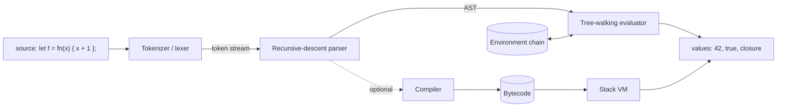

# Interpreter Build Lab

Build a real, running language in one sitting — **source text → tokens → AST → values** — teaching every
stage from first principles, following [`AGENTS.md`](../../../AGENTS.md). Concepts follow the canonical
treatment in Nystrom's *Crafting Interpreters* and Aho et al.'s *Compilers: Principles, Techniques, and
Tools* ("the Dragon Book"); all code here is written fresh in the learner's language.

## When to use

- The learner wants to understand how *any* language works — parsing, scope, closures — by building one.
- They hit a wall on operator precedence, recursion in grammars, or "why does my `if` parse wrong?".
- They want to know what a **bytecode VM** buys over a tree-walker before rewriting anything.
- They are learning ASTs for a linter, formatter, template engine, query language, or DSL at work.

## The pipeline



## Stage-by-stage design table

| Stage | Input → Output | Core idea (first principles) | Classic bug it prevents |
| --- | --- | --- | --- |
| **Tokenizer** | chars → tokens | One pass, longest-match; keep `line`/`col` on every token | `==` lexed as two `=`; unterminated strings |
| **Parser** | tokens → AST | One function per precedence level; recursion mirrors the grammar | `1 + 2 * 3` grouping wrongly |
| **AST** | nodes | Data, not behaviour — plain records/structs per node type | Logic smeared across parsing |
| **Evaluator** | AST + env → value | Structural recursion: one `case` per node kind | Evaluating both branches of `if` |
| **Environment** | name → value, with `parent` | Lexical scope = a chain of maps resolved outward | Dynamic scoping by accident |
| **Closure** | fn + *defining* env | Capture the env where the function was **defined** | Loop-variable capture bugs |

### Parsing strategies — pick one and know why

| Strategy | Handles precedence by | Strength | Weakness |
| --- | --- | --- | --- |
| **Recursive descent** | One function per level (`expr → term → factor`) | Readable, great errors, easy to debug | Verbose; no left recursion |
| **Pratt / precedence climbing** | Binding-power table per token | Compact, extensible operators | Table indirection is less obvious |
| **Parser generator** (yacc/ANTLR) | Declared grammar | Handles big grammars | Opaque errors, extra build step |
| **Parser combinators** | Composed functions — see [functional-programming-coach](../functional-programming-coach/SKILL.md) | Elegant in FP languages | Backtracking can hide O(n²) blowups |

## Procedure

1. **Pick the language** the learner writes in (Python/TS/Go/Rust/Java all work) and fix a **minimal
   grammar** first: integers, `+ - * /`, parentheses, comparison, `let`, `if/else`, `fn`, call. Write the
   grammar in EBNF before any code — the grammar *is* the parser's shape.
2. **Tokenizer.** A loop over characters with a cursor: skip whitespace, longest-match operators
   (`==` before `=`), read numbers and identifiers, classify keywords from a map. Emit
   `Token(kind, lexeme, line)`. **Run it with `#run` (`learningos_runcode`)** and print the token stream.
3. **AST nodes.** Define plain data: `Num`, `Str`, `Bool`, `Var`, `Unary`, `Binary`, `If`, `Let`, `Fn`,
   `Call`, `Block`. No methods yet — behaviour lives in the evaluator.
4. **Recursive-descent parser.** One function per precedence level, lowest first:
   `equality → comparison → term → factor → unary → primary`. Left-associativity falls out of a `while`
   loop inside each level; right-associativity falls out of recursing on the right. Give the parser
   `peek()`, `match()`, `expect()`, and make `expect` raise an error carrying the token's line.
5. **Tree-walking evaluator.** One `switch`/`match` arm per node kind, structural recursion. Teach that
   `if` must evaluate *only* the taken branch — this is exactly why evaluation cannot be a plain map over
   nodes.
6. **Environments.** `Env { vars: Map, parent: Env | null }`; `get` walks up the chain, `define` writes
   locally, `assign` walks up to the owner. That chain **is** lexical scope.
7. **Closures.** A function value stores `(params, body, defining_env)`. Calling it creates a *new* env
   whose parent is the **defining** env (not the caller's) — that single choice is the whole difference
   between lexical and dynamic scope. Demo a counter factory to prove capture is by environment.
8. **Verify with `#run` on real inputs, including edge cases**: `2 + 3 * 4` (=14), `(2 + 3) * 4` (=20),
   `1 - 2 - 3` (=-4, left-assoc), unknown variable, calling a non-function, wrong arity, deep recursion
   (stack depth), empty input, unterminated string, division by zero. Read the **actual output**; never
   assume it.
9. **Then the VM contrast.** Compile the same AST to a flat instruction array (`OP_CONST`, `OP_ADD`,
   `OP_JUMP_IF_FALSE`, `OP_CALL`) executed by a loop over a value stack. Explain the win: no pointer
   chasing per node, better cache locality, and a serializable program — at the cost of a compiler pass
   and much harder debugging.
10. **Route onward**: recursion cost and stack depth → [complexity-analyzer](../complexity-analyzer/SKILL.md);
    tree recursion and immutability → [functional-programming-coach](../functional-programming-coach/SKILL.md);
    recursion patterns → [dsa-patterns-coach](../dsa-patterns-coach/SKILL.md); a failing parse →
    [debugging-coach](../debugging-coach/SKILL.md); more reps → [practice-generator](../practice-generator/SKILL.md).

## Output shape

```
Interpreter lab — <language>, stage <n>/6

Grammar (EBNF):
  expr     -> equality
  equality -> comparison ( ("==" | "!=") comparison )*
  term     -> factor ( ("+" | "-") factor )*

Code for this stage:
  <tokenizer | parser level | eval arm | Env | closure>

#run: input  `2 + 3 * 4`
      tokens [NUM 2][PLUS][NUM 3][STAR][NUM 4][EOF]
      AST    (+ 2 (* 3 4))
      value  14                                   -> PASS

Edge cases run: 1-2-3 -> -4 | (2+3)*4 -> 20 | undefined var -> error@line 1
                arity mismatch -> error | deep recursion -> <real result>

Why it works: precedence = call depth; scope = env chain; closure = defining env
A bytecode VM would change: flat ops + value stack, cache locality, harder debugging
Next stage: <...>
```

## Tips

- **Precedence is call depth.** Lower precedence calls higher precedence; the grammar's shape is the
  parser's shape. If `1 + 2 * 3` groups wrongly, your levels are ordered wrongly — not your arithmetic.
- Keep `line`/`col` on tokens from minute one; error messages are the difference between a toy and a tool.
- A parser must never evaluate, and an evaluator must never re-parse — that separation is what makes the
  AST worth having, and it is what every string-hacked "interpreter" eventually rediscovers.
- Closures capture the **environment**, not values; loop-variable capture surprises in JS, Python and Go
  come straight from this and can be reproduced in your own language in ten lines.
- Interpreting untrusted source is arbitrary code execution: never delegate to the host language's `eval`,
  cap recursion depth and loop iterations, and read
  [secure-code-review](../secure-code-review/SKILL.md) before exposing one.
- Grow the language only after every stage runs green: strings → arrays/maps → `while` → error values →
  a resolver pass for static scope, and only then a bytecode VM.
- Verify each stage with `#run` before writing the next; a broken tokenizer produces "impossible" parser
  bugs. End with the **Learning Footer** (`AGENTS.md`).
