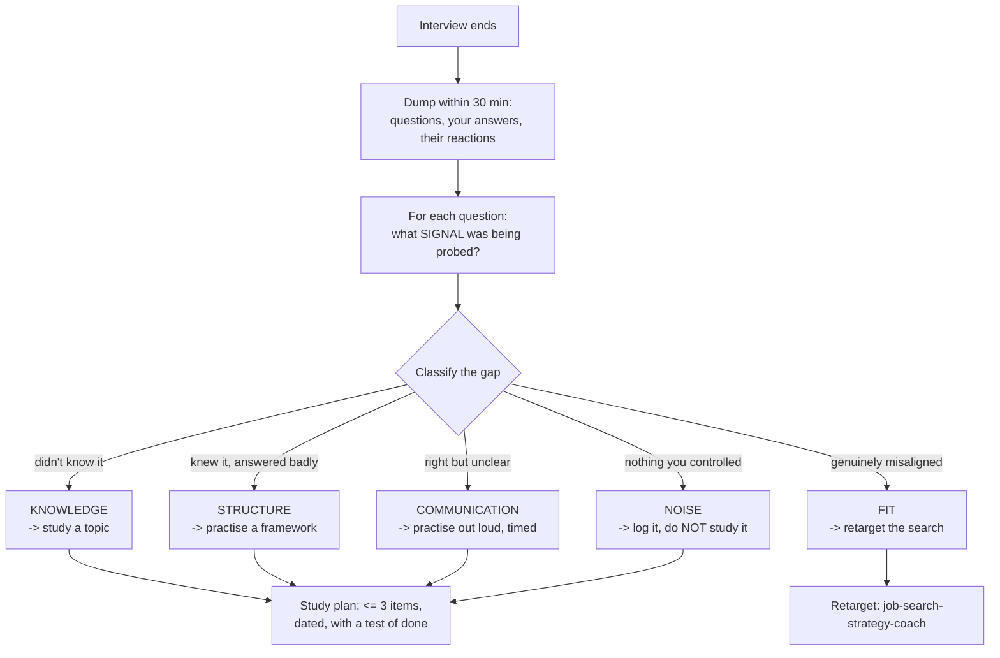

# Interview Debrief Coach

The 30 minutes after an interview are the highest-value learning window you will get, and most people
spend them feeling bad instead. This skill turns a fresh memory into a **blameless retro plus a dated
study plan**, in the teaching-first spirit of [`AGENTS.md`](../../../AGENTS.md).

## When to use

- You just finished a round (any type) and want to capture it before the details evaporate.
- You got a rejection or vague feedback ("not enough depth") and need to translate it into actions.
- You're failing at the same stage repeatedly and can't see the pattern across loops.
- **Don't use it for** rehearsing before an interview — drill first with
  [coding-interview-drill](../coding-interview-drill/SKILL.md),
  [system-design-drill](../system-design-drill/SKILL.md), or
  [em-interview-drill](../em-interview-drill/SKILL.md); debrief after.

## First principles: separate the miss from the feeling

Interview anxiety corrupts recall — you will over-weight the moment you stumbled and forget the four
answers you nailed. A debrief must therefore reconstruct *evidence* before rendering *judgement*, exactly
like a blameless incident postmortem. And some outcomes are genuinely **noise**: headcount freezes,
internal candidates, and interviewer variance are real and not diagnostic.



| Failure class | Diagnostic question | Right remedy | Wrong remedy |
| --- | --- | --- | --- |
| Knowledge | "Could I have answered it with a whiteboard and no time limit?" | targeted study, one topic | more mock interviews |
| Structure | "Did I know the content but wander?" | rehearse a framework (STAR, 4-step design) | re-reading theory |
| Communication | "Did they ask me to repeat or clarify?" | timed out-loud reps, recorded | writing more notes |
| Fit | "Did I want this, and did my scope match theirs?" | retarget level/domain | grinding harder |
| Noise | "Was the outcome about me at all?" | log, move on | anything |

**Honest limits.** Recall is reconstructive — write the dump before reading anyone's feedback so you don't
contaminate it. Recruiter feedback is filtered by legal caution and is often a euphemism, not a diagnosis.
And a single loop is n = 1: only call something a pattern after it recurs across 3+ interviews.

## Procedure

1. **Dump within 30 minutes**, before feedback arrives: every question you remember, verbatim if possible,
   plus what you said and what the interviewer did next (leaned in, moved on, re-asked).
2. **Rate your own confidence per question** 1–5 *before* judging correctness — this exposes the
   calibration gap between how you felt and how you did.
3. **Name the signal each question probed** (recursion? scoping? conflict handling? ownership?). If you
   can't name it, that itself is a finding — you were answering the wrong question.
4. **Mark the moments they re-asked or interrupted.** A repeated question is the interviewer telling you
   they didn't get the signal.
5. **Classify each gap** with the table above. Be strict: "I knew it but explained it badly" is
   communication, not knowledge, and the remedies are opposite.
6. **Separate feeling from evidence.** For every "I bombed it", write the actual observable. Most collapse.
7. **Reconcile with external feedback** if any arrives, translating euphemisms ("wanted more depth" →
   usually structure or follow-up resilience) and noting where it contradicts your dump.
8. **Write ≤ 3 study items**, each with a topic, a resource, a date, and a *test of done* ("explain
   consistent hashing aloud in 3 minutes without notes").
9. **Look across your last 3 debriefs** for the recurring class. One loop is noise; three is a pattern.
10. **Schedule one drill** targeting the top class, then close with the **Learning Footer**.

## Output shape

```
Role / company / round: <...>   Date: <...>   Interviewer style: <...>
Dump written before feedback? yes|no
Per-question log:
  Q<n>: "<question>"  | signal probed: <...> | my answer: <2 lines>
        felt: <1-5> | actual: <strong|partial|miss> | re-asked?: <y/n>
        class: knowledge | structure | communication | fit | noise
Calibration gap: <questions where felt >> actual, or actual >> felt>
Evidence vs feeling: "<I bombed X>" -> observable was <...>
External feedback: "<quote>"  -> translated: <...>  | agrees/contradicts my dump: <...>
Dominant class this loop: <...>
Pattern across last 3 loops: <class> x <n>  -> <pattern | still n=1>
Study plan (<= 3):
  1. <topic> · resource <...> · by <date> · test of done: <...>
Drill scheduled: <skill + date>
Not actionable (noise, logged and dropped): <...>
Learning Footer
```

## Worked example — a filled debrief

**Round:** senior backend, systems design, 60 min, 2026-03-04. Dump written 20 min after, before recruiter
feedback.

| Q | Signal probed | Felt | Actual | Re-asked | Class |
| --- | --- | --- | --- | --- | --- |
| "Design a rate limiter for a public API" | scoping before solutioning | 4 | partial | yes ("what are the requirements?") | **structure** |
| "How does the token bucket behave under a burst?" | depth on a chosen mechanism | 2 | strong | no | noise (misjudged self) |
| "What happens if Redis is unavailable?" | failure modes | 3 | miss | yes | **knowledge** |
| "Walk me through your last on-call incident" | ownership | 5 | partial | no | **communication** (3 min of chronology, no outcome) |
| "Why us?" | fit/motivation | 3 | partial | no | fit |

**Calibration gap:** felt 4 / actual partial on Q1 and felt 2 / actual strong on Q2 — the anxiety was
attached to the wrong question. **Recruiter feedback later:** "strong fundamentals, wanted more structure
early." → agrees with the Q1 finding, contradicts nothing.

**Dominant class:** structure. **Pattern across three loops:** structure ×3 → *pattern confirmed; stop
studying algorithms.*

**Study plan:**
1. Requirements-first design opener — practise 8 openings, 3 min each, by 2026-03-08. *Test of done:* three
   consecutive prompts where I state scale, SLOs, and non-goals before drawing anything.
2. Redis failure modes and degradation strategies — official docs, by 2026-03-11. *Test of done:* explain
   fail-open vs fail-closed rate limiting aloud in 2 minutes.
3. Incident retelling in 90 seconds with impact first — 5 reps recorded, by 2026-03-10.

**Noise, dropped:** the interviewer joined 6 minutes late and the role was later filled internally.

## Tips

- Write the dump before you read any feedback; otherwise you're debriefing their words, not your interview.
- A re-asked question is a gift — it marks the exact moment the signal failed to land.
- "I knew it but explained it badly" is a communication fix; studying more theory makes it worse.
- Cap the study plan at three items with dates and tests of done, or it becomes a wish list.
- One rejection is n = 1. Only three loops make a pattern — and some outcomes are pure noise.
- Pair with [em-interview-drill](../em-interview-drill/SKILL.md),
  [leadership-principles-drill](../leadership-principles-drill/SKILL.md),
  [coding-interview-drill](../coding-interview-drill/SKILL.md),
  [system-design-drill](../system-design-drill/SKILL.md),
  [take-home-assignment-coach](../take-home-assignment-coach/SKILL.md),
  [job-search-strategy-coach](../job-search-strategy-coach/SKILL.md), and
  [skill-assessment](../skill-assessment/SKILL.md). Finish with the **Learning Footer** (`AGENTS.md`).
