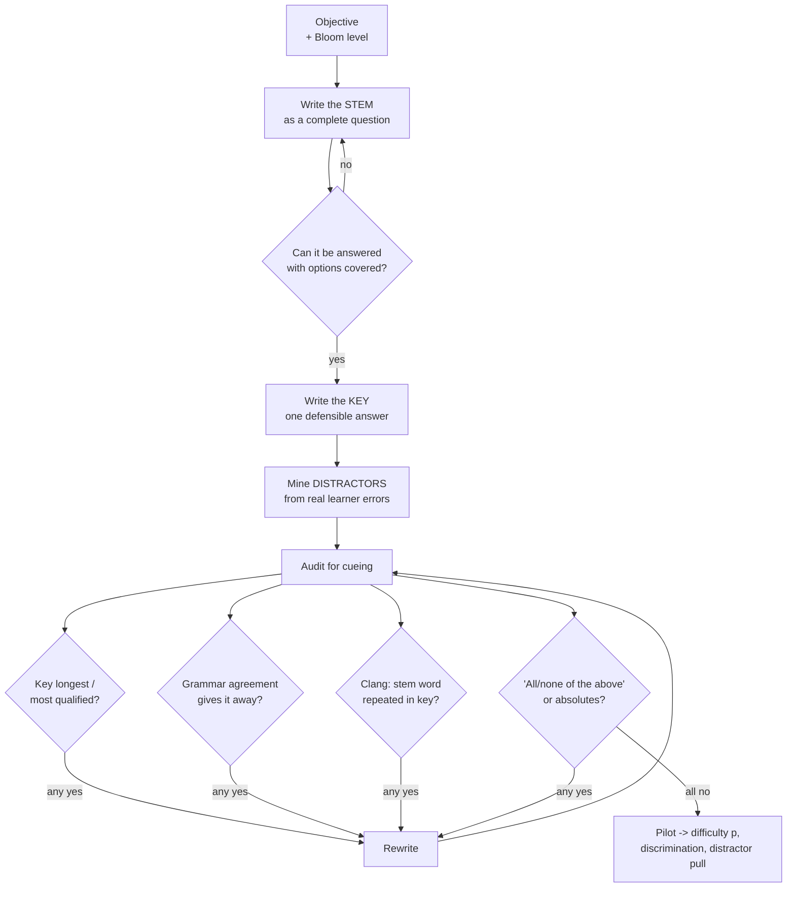

# Item Writing Coach

A bad item measures test-wiseness; a good item measures the objective. This skill applies published
item-writing rules to draft and audit questions, in the source-disciplined spirit of
[`AGENTS.md`](../../../AGENTS.md).

## When to use

- Quiz scores don't match observed ability — strong learners miss items, weak learners guess them right.
- Distractors are obviously wrong, so the item is really a 2-option question wearing a 4-option costume.
- Every question asks "what is the definition of…" and nothing above Bloom's *Remember*.
- Don't use it to decide *what* to assess or how many items per topic — that is a blueprinting job for
  [exam-blueprint](../exam-blueprint/SKILL.md); this skill writes the items the blueprint asks for.

## First principles: the anatomy of a defensible item

Haladyna, Downing & Rodriguez's revised taxonomy of multiple-choice item-writing guidelines (2002,
*Applied Measurement in Education*), synthesising decades of studies, gives the working rules. Three
structural ideas drive nearly all of them:

1. **The stem carries the question.** A reader should be able to answer before seeing the options.
2. **Distractors must be plausible *to someone who holds a misconception*** — a distractor nobody picks
   contributes nothing and effectively shrinks the option set.
3. **Nothing but content may distinguish the key** — not length, not grammar, not specificity.



| Rule | Why (Haladyna et al., 2002) | Violation looks like |
| --- | --- | --- |
| Stem is a complete question | reduces reading load; testable without options | "TCP…" as a fragment stem |
| One defensible key | multiple defensible answers = an appeal you will lose | "best practice" with no criterion |
| Distractors from real errors | plausibility is what makes the item discriminate | a joke option |
| Homogeneous options | heterogeneous options cue by category | 3 protocols + 1 file format |
| Similar option length | test-wise learners pick the longest | key is 18 words, distractors are 4 |
| No grammatical cueing | "an ___" eliminates consonant-initial options | article/plural agreement leaks |
| Avoid "all/none of the above" | rewards partial knowledge and logic tricks | classic filler option |
| Avoid absolutes (always/never) | recognisably false, so they're never the key | "TCP always guarantees…" |
| No negative stems (or bold the NOT) | double negatives measure reading, not content | "Which is not un-ordered?" |
| Independent items | one item must not answer another | item 4 defines the term item 7 tests |
| 3 good options ≥ 4 weak ones | Rodriguez (2005) meta-analysis supports 3-option MCQs | padding to four with filler |

**Trade-off to say out loud:** MCQs are cheap to score and scale, but they measure *recognition*.
Anything the learner must **produce** under pressure needs a constructed-response item — see the format
table in [retrieval-practice-coach](../retrieval-practice-coach/SKILL.md).

## Procedure

1. **Start from one objective and its Bloom verb** — the item's cognitive demand must match the verb, or
   the assessment is misaligned ([learning-objective-writer](../learning-objective-writer/SKILL.md)).
2. **Write the stem as a full question**, front-loading the scenario. Cover the options and check that
   an expert can answer it.
3. **Write the key first**, and record *why* it is defensible in one line — that line becomes the
   rationale shown in feedback.
4. **Mine distractors from real errors**: past learner mistakes, common misconceptions, off-by-one and
   scope confusions. Never invent filler.
5. **Run the cueing audit** (the flowchart's four checks) plus length, grammar, and homogeneity.
6. **Tag Bloom level and difficulty estimate** per item, and confirm the mix matches the blueprint.
7. **Pilot and compute statistics**: difficulty $p$ (proportion correct; ~0.30–0.90 usable), and a
   discrimination index — top-third minus bottom-third correct rate; **negative discrimination means the
   item is broken or the key is wrong.**
8. **Retire or rewrite** any distractor chosen by < 5 % of learners, then close with the
   **Learning Footer**.

## Output shape

```
Objective: <measurable objective>        Bloom: <Remember|Understand|Apply|Analyze|Evaluate|Create>
Item <n>  [format: MCQ | short answer | scenario]   Est. difficulty: <easy|med|hard>
Stem: <complete question, answerable with options covered>
  A) <option>
  B) <option>   * KEY
  C) <option>
Key rationale: <one line: why B is defensible>
Distractor rationale:
  A -> misconception: <the specific wrong belief this catches>
  C -> misconception: <...>
Audit: stem-complete ✓ · homogeneous ✓ · equal length ✓ · no grammar cue ✓ · no absolutes ✓ ·
       no all/none-of-the-above ✓ · independent of other items ✓ · Bloom match ✓
Pilot stats (after use): p = <0.00-1.00>   discrimination = <+/-0.00>   distractor pull: A <n>% C <n>%
Verdict: <keep | rewrite <what> | retire>
Next: <exam-blueprint | quiz-generator | mock-exam>
Learning Footer
```

## Worked example — rewriting one broken item

**Before** (objective: *Apply* — choose an index for a query):

> Indexes… (Which of the following is not always false about database indexes?)
> A) They are good B) An index is a data structure that speeds up row lookup by maintaining a sorted
> copy of one or more columns, at the cost of write amplification C) They never help D) All of the above

| Flaw | Rule violated | Effect |
| --- | --- | --- |
| Fragment stem + double negative | complete-question stem; no negative stems | measures reading, not indexing |
| Key is 26 words vs 3-word distractors | similar option length | test-wise learners pick B blind |
| "always", "never" absolutes | avoid absolutes | A and C self-eliminate |
| "All of the above" | avoid A/N-of-the-above | logically impossible given C |
| Bloom mismatch | objective says *Apply*, item tests *Remember* | misaligned assessment |

**After** (*Apply*, scenario-based, homogeneous, no cueing):

> A 50 M-row `orders` table serves `WHERE customer_id = ? ORDER BY created_at DESC LIMIT 20`. Reads are
> 100× writes. Which index best serves this query?
> A) `(created_at)` B) `(customer_id)` C) `(customer_id, created_at)` ← **KEY** D) `(created_at, customer_id)`

Key rationale: equality column first, then the sort column, lets the engine seek then read in order —
no filesort. Distractors: **A** = "index the ORDER BY column" misconception; **B** = "index the filter
only", leaving a sort of all of a customer's rows; **D** = column-order confusion, the classic
leftmost-prefix error. Pilot: $p = 0.55$, discrimination $+0.41$, pull A 12 % / B 18 % / D 15 % — every
distractor earns its place.

## Tips

- Cover the options and read the stem aloud; if you can't answer it, neither can a well-prepared learner.
- A distractor nobody picks is dead weight — three live options beat four with one corpse.
- **Negative discrimination is an emergency**: your best learners are missing it, so the key is probably
  wrong or the stem is ambiguous. Fix before reuse.
- Write the rationale for every option; it doubles as feedback and forces you to justify plausibility.
- Pair with [exam-blueprint](../exam-blueprint/SKILL.md) for coverage,
  [learning-objective-writer](../learning-objective-writer/SKILL.md) for alignment,
  [quiz-generator](../quiz-generator/SKILL.md) for volume,
  [misconception-buster](../misconception-buster/SKILL.md) to source distractors, and
  [confidence-calibration-coach](../confidence-calibration-coach/SKILL.md) to score confidence per item.
  End with the **Learning Footer** (`AGENTS.md`).
