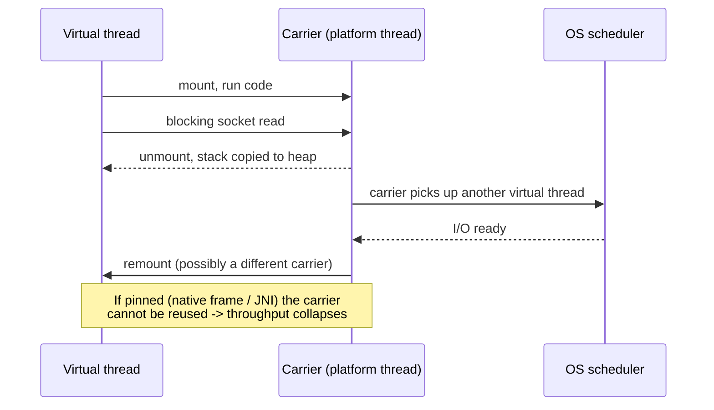

# Java Virtual Threads Lab

A hands-on Loom lab: run thousands of blocking tasks, watch the platform-thread model fall over, then fix it,
following the teaching principles and Learning Footer in [`AGENTS.md`](../../../AGENTS.md). Ground every
claim in the [Oracle JDK documentation](https://docs.oracle.com/en/java/javase/) and the OpenJDK JEPs
(JEP 444 virtual threads, final in Java 21 LTS; JEP 491 removed `synchronized` pinning in Java 24;
JEP 506 finalized Scoped Values in Java 25 LTS; JEP 505 kept Structured Concurrency in preview in Java 25).
**Check the JEP before quoting an API** — the `StructuredTaskScope` shape changed across previews.

## When to use

- The learner has a thread-pool-shaped app and asks "how do I handle 10,000 concurrent requests?".
- They were taught "never block a thread" and now need to unlearn it — carefully.
- They see `synchronized`, `ThreadLocal`, or pooling advice that predates Loom.
- They want structured fan-out/fan-in instead of a bag of `Future`s.
- For pre-Loom fundamentals (`ExecutorService`, `synchronized`, `CompletableFuture`, the memory model) do
  [`java-concurrency-lab`](../java-concurrency-lab/SKILL.md) first — it is still the foundation.

## First principles: who parks, the thread or the stack?

A platform thread is a thin wrapper over an OS thread: ~1 MB of reserved stack and a kernel scheduling entity,
so blocking one wastes an expensive resource. A **virtual thread** is a `Thread` whose stack lives on the heap;
when it blocks on a JDK-managed operation, the JVM *unmounts* it from its **carrier** (a ForkJoinPool platform
thread) and mounts another. Blocking becomes cheap, so **the simple blocking style is correct again** — no
callbacks, no reactive operators, and stack traces you can actually read.



| Concern | Platform threads + pool | Virtual threads | Reactive / async |
| --- | --- | --- | --- |
| Cost per task | ~1 MB stack, kernel object | a few hundred bytes on the heap | one object, no stack |
| Practical count | thousands | millions | millions |
| Programming style | blocking, but pooled | **blocking, unpooled** | callbacks / operators |
| Stack traces & debugging | good | good | poor, fragmented |
| Should you pool them? | yes — they are scarce | **no** — they are cheap; pool the *resource* instead | n/a |
| Context propagation | `ThreadLocal` (leaks in pools) | `ScopedValue` (immutable, scoped) | explicit context object |
| CPU-bound work | fine | **no benefit** — use a sized pool | no benefit |
| Best for | CPU-bound, fixed parallelism | I/O-bound, high fan-out | legacy async stacks |

## Procedure

1. **Establish the ceiling.** With `Executors.newFixedThreadPool(200)`, run N tasks that each `Thread.sleep`
   for 100 ms. `#run` (`learningos_runcode`) it for N = 200, 2 000, 20 000 and record wall-clock time — the
   learner should *see* the queueing, not be told about it.
2. **Switch one line.** Replace the executor with `Executors.newVirtualThreadPerTaskExecutor()` and re-run the
   same N values. Have the learner predict the times first, then compare with the real output.
3. **Confirm identity.** Print `Thread.currentThread()` and `isVirtual()`; note that a virtual thread is
   unnamed by default and reports its carrier in the `ForkJoinPool` worker name.
4. **Prove blocking is fine.** Swap `Thread.sleep` for a real blocking call (`HttpClient.send`, a file read, a
   JDBC query against a local DB). Show the code stays plain and sequential per task.
5. **Break it on purpose.** Reproduce pinning: run a blocking call inside a `synchronized` block, and again
   from a native/JNI or `Object.wait`-style path. Run with `-Djdk.tracePinnedThreads=full` (or the JFR
   `jdk.VirtualThreadPinned` event) and read the real stack. On Java 24+ note that JEP 491 removed
   `synchronized` pinning — so the *same* code behaves differently across releases. Fix by switching to
   `ReentrantLock` and re-run.
6. **Kill the ThreadLocal habit.** Show a `ThreadLocal` request context; explain that with a thread per task
   the "reuse across tasks" leak disappears but per-thread copies now multiply by the millions and are
   mutable. Replace with a `ScopedValue` (`ScopedValue.where(CTX, ctx).run(...)`), which is immutable,
   bounded by the dynamic scope, and inherited by forked tasks.
7. **Structure the fan-out.** Replace two independent `Future`s with a `StructuredTaskScope`: fork both
   subtasks, `join()`, and let one failure cancel the sibling automatically. Contrast with the leaked-thread
   failure mode of unstructured `Future`s. Flag that this API is still **preview** (`--enable-preview`).
8. **Verify on real inputs and edge cases.** `#run` each variant and check: N = 0 tasks, one task that throws,
   a task that is interrupted mid-block, a cancelled scope, N large enough to exhaust a *connection pool*
   (the real limit once threads are free), and CPU-bound tasks where virtual threads win nothing.
9. **Route onward.** Locks, races, and happens-before → [`concurrency-coach`](../concurrency-coach/SKILL.md);
   pre-Loom Java APIs → [`java-concurrency-lab`](../java-concurrency-lab/SKILL.md); why context switches and
   stacks cost what they cost → [`os-internals-coach`](../os-internals-coach/SKILL.md).

## Output shape

```
Lab: Java virtual threads — <workload>

Env: java <version from `java -version`>  | preview flags: <--enable-preview or none>

Step 1 platform pool(200): N=200 -> <t>ms | N=2000 -> <t>ms | N=20000 -> <t>ms
Step 2 virtual per task  : N=200 -> <t>ms | N=2000 -> <t>ms | N=20000 -> <t>ms
        predicted <t> vs actual <t> => <what the gap taught us>
Step 3 identity : isVirtual()=true, carrier=<ForkJoinPool-1-worker-N>
Step 5 pinning  : synchronized+block -> jdk.tracePinnedThreads output: <real stack or "none on JDK 24+">
                  ReentrantLock version -> <no pinning> => throughput <t>ms
Step 6 context  : ThreadLocal -> ScopedValue.where(CTX, v).run(...)  => immutable, scope-bounded
Step 7 structure: StructuredTaskScope fork/join -> sibling cancelled on failure (preview API)

Edge cases run  : 0 tasks | task throws | interrupt mid-block | scope cancelled | CPU-bound (no win)
Real bottleneck : <connection pool / DB / rate limit> — threads were never the limit

Rule of thumb   : virtual threads for I/O-bound fan-out; sized platform pool for CPU-bound work; never pool
                  virtual threads; pool the scarce resource instead.
Next: <concurrency-coach | java-concurrency-lab | os-internals-coach>
```

## Tips

- **Do not pool virtual threads.** A pool exists to ration an expensive resource; virtual threads are cheap.
  Limit the *database connections, file handles, or API quota* with a `Semaphore` instead.
- Virtual threads give **scalability, not speed** — a single task is not faster, and CPU-bound work gains
  nothing. Say this out loud before showing benchmarks.
- Once threads stop being the bottleneck, the next bottleneck appears immediately (connection pool, downstream
  rate limit). Teach the learner to look for it.
- Pinning behaviour is **version-dependent**: always print `java -version` in the lab output, because JEP 491
  (Java 24) changed the `synchronized` story. Never assume; measure.
- `ThreadLocal` still compiles and still works — `ScopedValue` wins because it is immutable and its lifetime is
  the dynamic scope, so nothing leaks and nothing needs a `remove()` in a `finally`.
- `StructuredTaskScope` is preview; pin the JDK version in any exercise and require `--enable-preview`.
- Benchmark honestly: warm up the JVM, run more than once, and report the real numbers the learner saw —
  never a plausible-looking table you made up.
- Cross-link: [`concurrency-coach`](../concurrency-coach/SKILL.md) for the patterns,
  [`os-internals-coach`](../os-internals-coach/SKILL.md) for scheduler and context-switch cost,
  [`memory-management-coach`](../memory-management-coach/SKILL.md) for stacks vs heap, and
  [`complexity-analyzer`](../complexity-analyzer/SKILL.md) before blaming the runtime for an O(n²) algorithm.
  End with the **Learning Footer** (`AGENTS.md`).
