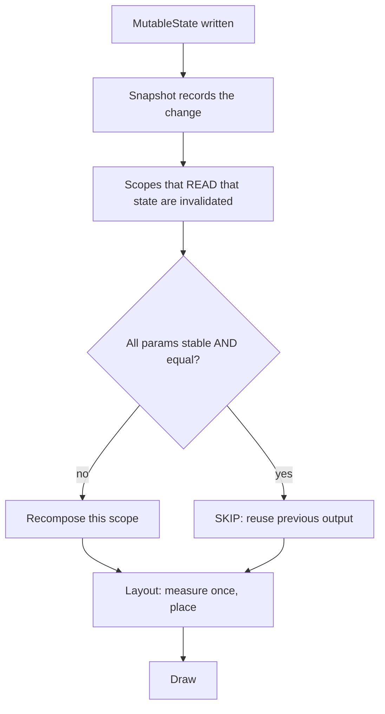

# Jetpack Compose Lab

Build one Compose screen in six commits, each designed to make an invisible runtime rule visible — taught
from first principles with trade-offs and the **Learning Footer**, per [`AGENTS.md`](../../../AGENTS.md).
Pairs with [android-lifecycle-coach](../android-lifecycle-coach/SKILL.md) and
[mobile-state-management-coach](../mobile-state-management-coach/SKILL.md).

## When to use

- The learner is coming from XML Views and still thinks in terms of "find the widget and set text on it".
- A composable recomposes far too often (or not at all) and they are guessing at `remember`.
- A `LazyColumn` loses scroll position or animates the wrong item after an insert.
- A coroutine launched from UI leaks, restarts on every recomposition, or captures a stale value.

## First principles

Compose is a **runtime, not a view tree builder**. `@Composable` functions do not return widgets; they emit
into a *composition* — a tree of "slots" the runtime can revisit. When a snapshot state object that a
composable *read* changes, the runtime marks that reading scope invalid and **recomposes only that scope**.
So the three things that matter are: what you read, whether the runtime can prove your inputs are unchanged
(**stability**), and whether the slot keeps the same **identity** (`key`).



Recomposition is **optimistic and can be cancelled or run out of order**, so a composable must be a *pure*
function of its parameters and the state it reads — no side effects in the body (developer.android.com,
*Thinking in Compose* / *Lifecycle of composables*).

## The state and effect toolbox

| API | Survives | Use it for | Pitfall |
| --- | --- | --- | --- |
| `remember { }` | recomposition | expensive objects, non-UI scratch values | lost on configuration change / process death |
| `rememberSaveable { }` | recomposition + config change + process death | small UI state (query text, selection) | putting large or non-`Parcelable` objects in it |
| `mutableStateOf` | — | observable state the runtime tracks | mutating a plain `var` and wondering why nothing updates |
| hoisted `value` + `onValueChange` | — | making a composable stateless, testable, reusable | hoisting *everything* to the top and re-rendering the world |
| `LaunchedEffect(key)` | until key changes / leaves composition | starting a coroutine tied to composition | passing `Unit` when it should restart, or a changing key when it should not |
| `DisposableEffect(key)` | until key changes / leaves composition | register + **must** unregister (listeners, callbacks) | forgetting `onDispose`, i.e. a leak |
| `rememberUpdatedState(x)` | — | a long-lived effect that must see the *latest* lambda/value | re-keying the effect instead, restarting the work |
| `derivedStateOf { }` | — | deriving a value that changes far less often than its inputs | using it for cheap 1:1 derivations (pure overhead) |
| `produceState` / `collectAsStateWithLifecycle` | — | turning async sources / flows into state | plain `collectAsState()` keeps collecting while backgrounded |

**Stability rule:** Compose skips a composable only when **every parameter is stable and `equals` the
previous value**. Stable = `@Immutable`/`@Stable`, primitives, functions, or a class the compiler can prove
has only stable, `val` public properties. A `List<T>` parameter is *unstable* (the interface allows mutation)
— prefer `ImmutableList` from kotlinx.collections.immutable, or a `@Immutable`-annotated wrapper. Recent
Compose compiler releases add **strong skipping**, which relaxes this for unstable parameters compared by
instance equality — check what your Kotlin/Compose compiler version enables before relying on it.

## Procedure

1. **Set up the loop.** Android Studio → Empty Compose Activity. Keep `@Preview` composables open and use
   Live Edit / interactive preview; the emulator is for gestures, rotation and process-death tests only.
2. **Commit 1 — state and recomposition.** Write a counter with
   `var count by remember { mutableStateOf(0) }`. Log inside the body and inside a child. Increment: which
   scopes recompose? Now rotate the device — the count resets. Swap in `rememberSaveable` and rotate again.
3. **Commit 2 — hoist it.** Split into a stateless `Counter(count: Int, onIncrement: () -> Unit)` and a
   stateful `CounterRoute` that owns the state. The stateless one is now previewable and unit-testable —
   this is **unidirectional data flow**: state down, events up.
4. **Commit 3 — modifier order.** Render the same box twice:
   `Modifier.padding(16.dp).background(Blue)` vs `Modifier.background(Blue).padding(16.dp)`, then
   `.clickable{}.padding()` vs `.padding().clickable{}`. Modifiers wrap left-to-right, so order changes both
   the painted area and the touch target. Screenshot both and explain the difference.
5. **Commit 4 — lists and keys.** Build `LazyColumn { items(notes, key = { it.id }) { … } }`. Delete the
   first item with keys, then remove the `key` lambda and delete again: without keys, item state and
   animations follow the *index* instead of the item. Restore keys.
6. **Commit 5 — effects.** Add a snackbar on first display with `LaunchedEffect(noteId)`; register a
   listener with `DisposableEffect(lifecycleOwner) { … onDispose { … } }`; make a long-running effect see the
   newest callback with `rememberUpdatedState`. Collect a `StateFlow` with `collectAsStateWithLifecycle` and
   explain why it beats `collectAsState` on Android.
7. **Commit 6 — measure skipping.** Add the Compose compiler metrics/reports flags to your Gradle config and
   inspect which composables are `restartable`/`skippable` and which parameters are unstable. Fix one
   unstable parameter (wrap a `List` or annotate a model `@Immutable`) and re-generate the report to prove
   the composable became skippable. Cross-check at runtime with the Layout Inspector's recomposition counts.
8. **Verify — record observed values, not expectations:** recomposition count of the row before/after the
   stability fix; scroll position preserved across rotation; no listener leak after navigating away (Logcat);
   the previously misbehaving item animation now correct.
9. **Run the pure logic with `#run`.** UI needs Gradle and an emulator, but your filtering/sorting/formatting
   should be plain Kotlin: execute it with `#run` (`learningos_runcode`) on real inputs **including edge
   cases** — empty list, one item, duplicate titles, blank query, emoji/RTL text, 10 000 items — and teach
   from the actual output. Test coroutine/flow logic in [kotlin-coroutines-flow-lab](../kotlin-coroutines-flow-lab/SKILL.md).

## Output shape

```
Compose lab — <screen> (Compose BOM <x>, Kotlin <y>)

Commit 1 state        -> increment recomposed <scopes>; rotate lost state; rememberSaveable kept it
Commit 2 hoisting     -> Counter(count, onIncrement) is stateless + previewable; route owns state
Commit 3 modifier ord -> padding→background = <observed>, background→padding = <observed>
Commit 4 keys         -> without key: <wrong item animated>; with key = it.id: <correct>
Commit 5 effects      -> LaunchedEffect(<key>) ran <n>x; DisposableEffect onDispose fired: <y/n>
Commit 6 stability    -> report: <Composable> skippable=<false→true>; unstable param <p> fixed by <fix>

Verification (observed):
  recomposition count <before> -> <after>
  scroll position across rotation: <PASS/FAIL>
  listener unregistered on exit : <PASS/FAIL>

#run (pure Kotlin): filter("") -> <output> | [] -> <output> | duplicates -> <output>
                    emoji/RTL -> <output> | 10k items -> <timing/output>

Takeaway: <what makes Compose skip, in one sentence>
Next: <linked skill>
```

## Tips

- Composable bodies must be side-effect free and idempotent: recomposition may be cancelled, re-run, or run
  on a different thread than you expect. Side effects belong in the effect APIs.
- "It doesn't update" is almost always a plain `var` instead of `mutableStateOf`, or state read outside the
  scope you expected. "It updates too much" is almost always an unstable parameter or state read too high.
- Hoist state *just* high enough for every reader and writer — hoisting to the top of the screen turns every
  keystroke into a full-screen recomposition.
- Always pass a stable `key` in `items(...)`; without it, Compose falls back to position and item state and
  animations follow the index.
- `derivedStateOf` pays off only when the derived value changes far less often than its inputs; otherwise it
  is pure overhead.
- Prefer `collectAsStateWithLifecycle` over `collectAsState` so collection stops when the UI is not visible.
- Trust the compiler report and the Layout Inspector over intuition — measure before optimising.
- Close with the **Learning Footer** (`AGENTS.md`): recap, pitfalls, next topic, one exercise, level, time.
