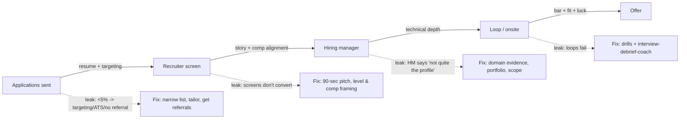

# Job Search Strategy Coach

A job search is a funnel with five stages, and each stage fails for a *different* reason. This skill
diagnoses the leak, sets input quotas you control, and builds a tracker — evidence-first, per
[`AGENTS.md`](../../../AGENTS.md).

## When to use

- You're applying steadily and hearing nothing, and can't tell whether it's the résumé, the targeting,
  or the volume.
- You're starting a search and want a system instead of refreshing job boards at midnight.
- You need to reason about ATS parsing and AI-assisted screening without resorting to white-text keywords.
- **Don't use it for** rewriting a single résumé ([resume-tailor](../resume-tailor/SKILL.md)) or for offer
  negotiation ([salary-negotiation](../salary-negotiation/SKILL.md)) — this skill owns the *system*.

## First principles: diagnose the stage, not the mood

Measure **conversion between stages**, because each transition has a distinct cause and a distinct fix.
Applying harder at a stage-1 problem when your leak is at stage 3 wastes months.



| Stage | Rough healthy conversion | If it's leaking, the cause is usually | The fix |
| --- | --- | --- | --- |
| Application → recruiter screen | 5–15% cold; 40%+ with a referral | targeting too broad, résumé unparseable, no referral | tier the list, tailor, ask for intros |
| Recruiter screen → HM | 50–70% | vague pitch, level mismatch, comp misalignment | 90-second pitch, state range early |
| HM → loop | 60–80% | domain evidence thin, scope unclear | proof artefacts, scope stories |
| Loop → offer | 20–40% | technical/behavioural bar, or genuine noise | drills + structured debriefs |

Treat these as *orientation*, not benchmarks: real rates swing wildly with market, level, visa status, and
referral density. What matters is **your** ratios over time, not someone's blog post.

| Control type | Examples | Should you set a quota? |
| --- | --- | --- |
| Inputs (you control) | applications sent, referrals asked, people contacted, drills done | **Yes** — quota these weekly |
| Outputs (you don't) | screens, offers, response time | No — track, never quota |

## ATS and AI screens, honestly

Applicant tracking systems parse; increasingly, an LLM also summarises and ranks. Both reward the same
thing: **plain structure and true, specific evidence**.

| Do | Why | Don't |
| --- | --- | --- |
| Single-column layout, real text, standard headings | parsers mangle tables/columns/text-in-images | multi-column "designer" templates |
| Mirror the posting's exact terms *where true* ("Kubernetes", not "container orchestration") | keyword matching is literal | stuffing keywords you can't defend |
| Put dates, titles, and company on one line each | date parsing is fragile | graphics, headshots, icons for skills |
| Quantify: baseline → result → how measured | LLM summarisers extract numbers | vague adjectives |
| Submit PDF unless the form says otherwise; keep the filename `Name-Role.pdf` | consistent extraction | white text, hidden keywords, prompt injection |

That last one deserves candour: hidden keywords and "ignore previous instructions" text are detectable,
get you blacklisted, and are dishonest. Don't.

## Procedure

1. **Define the target in one line**: role + level + domain + geography/remote + comp floor. Ambiguity here
   causes every downstream leak.
2. **Build a tiered list of ~40 companies** — Tier A (dream, 8–10, deep tailoring + referral), Tier B
   (strong fit, 20, tailored), Tier C (volume/practice, 10–15, light tailoring).
3. **Set weekly input quotas** you fully control, e.g. 8 applications (2 A / 4 B / 2 C), 5 referral asks,
   3 new conversations, 2 interview drills. Quota inputs, never outcomes.
4. **Ask for referrals properly**: a two-line note with the exact role link, why *this* company, and one
   line of relevant evidence. Referrals are the single biggest lever on stage 1.
5. **Build one tracker** (spreadsheet is fine) with the columns in the output shape — you cannot diagnose a
   funnel you don't record.
6. **Tailor per tier**: A-tier gets a rewritten summary and reordered bullets via
   [resume-tailor](../resume-tailor/SKILL.md); C-tier gets the base résumé.
7. **Diagnose at 20 applications, not at 3.** Compute the stage conversions and fix only the earliest
   leaking stage — fixing later stages first changes nothing.
8. **Timebox the search week** (e.g. 10 focused hours) and protect drill time; searching all day produces
   worse applications, not more.
9. **Run a debrief after every interaction** with [interview-debrief-coach](../interview-debrief-coach/SKILL.md);
   feed the dominant failure class back into the quota.
10. **Review fortnightly**: keep/cut channels by conversion, re-tier companies, and reset quotas. Close with
    the **Learning Footer**.

## Output shape

```
Target: <role> · <level> · <domain> · <geo/remote> · comp floor <...> · timeline <weeks>
Tiered list: A <n> | B <n> | C <n>   (named companies + why)
Weekly input quotas: applications <n> · referral asks <n> · conversations <n> · drills <n>
Tracker columns: company | tier | role | date applied | source (referral/board/inbound) |
                 tailored? | stage | last touch | next action | notes
Funnel (last <n> weeks): applied <a> -> screens <b> (<b/a>%) -> HM <c> (<c/b>%) ->
                         loops <d> (<d/c>%) -> offers <e>
Leaking stage: <earliest stage below range>   Diagnosis: <targeting|resume|pitch|depth|noise>
Fix this week: <one change only>   Measured by: <metric + review date>
Channel performance: referral <x>% · direct <y>% · board <z>% -> keep/cut: <...>
ATS check: single column · true keywords mirrored · numbers present · no hidden text
Energy plan: <hours/week, protected drill slots, rest>
Learning Footer
```

## Worked example — a diagnosed funnel

Six weeks in, senior backend engineer, remote-EU, one dependent visa constraint.

| Stage | Count | Conversion | Verdict |
| --- | --- | --- | --- |
| Applications | 96 | — | volume was never the problem |
| Recruiter screens | 4 | **4.2%** | ⚠️ earliest leak — below the cold-apply range |
| HM conversations | 3 | 75% | healthy |
| Loops | 2 | 67% | healthy |
| Offers | 0 | 0% | n too small to judge |

**Diagnosis:** stage 1. Breakdown by source: board applications 2/88 = 2.3%; referrals 2/8 = 25%. The
résumé converts *when a human sees it*. Root causes found: (a) a two-column template that lost the job
titles in parsing, (b) 96 applications across 3 unrelated role families, (c) only 8 referral asks.

**One change:** rebuild as single-column, cut to one role family, and shift the quota from 16
applications/week to **6 applications + 8 referral asks**. Four weeks later: 24 applications, 7 screens
(**29%**), 3 HM conversations, 2 loops. Fewer applications, six times the screens.

**What was *not* changed:** the interview drills — stages 2–4 were already converting, so studying
algorithms would have been wasted effort.

## Tips

- Quota the inputs, track the outputs. "Get 3 offers this month" is not a plan you control.
- Fix only the earliest leaking stage; downstream fixes are invisible until the upstream one flows.
- A referral converts several times better than a cold application — spend your hours where the lever is.
- Twenty applications into one role family beats a hundred scattered across three.
- Never hide keywords or inject instructions for an AI screener; it's detectable and it's dishonest.
- A search is a marathon: protect sleep, book the rest days, and track streaks not guilt with
  [progress-tracker](../progress-tracker/SKILL.md).
- Pair with [resume-tailor](../resume-tailor/SKILL.md),
  [resume-enhancer](../resume-enhancer/SKILL.md), [cover-letter](../cover-letter/SKILL.md),
  [linkedin-optimizer](../linkedin-optimizer/SKILL.md),
  [portfolio-reviewer](../portfolio-reviewer/SKILL.md),
  [interview-debrief-coach](../interview-debrief-coach/SKILL.md),
  [take-home-assignment-coach](../take-home-assignment-coach/SKILL.md), and
  [salary-negotiation](../salary-negotiation/SKILL.md). Close with the **Learning Footer** (`AGENTS.md`).
