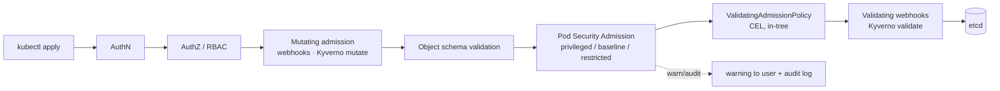

# Kubernetes Admission Policy Lab

Admission control is the **last gate before an object reaches etcd** — per [`AGENTS.md`](../../../AGENTS.md),
learn it by rolling one policy from warn to enforce yourself. It is the only place a rule binds everyone,
including the person holding `kubectl`. Everything runs on a **free local cluster** (kind or k3d).

## When to use

- "How do we stop privileged pods / missing limits / `:latest` images cluster-wide?"
- Migrating off the removed PodSecurityPolicy to Pod Security Admission plus a policy engine.
- Preparing for CKS, or adding policy tests to a CI pipeline.

## First principles

A request passes authentication → authorization (RBAC) → **admission**: mutating webhooks first, then
validating admission (built-in PSA, `ValidatingAdmissionPolicy`, validating webhooks), then persistence.
RBAC answers *may this identity act?*; admission answers *is this object acceptable?* You need both.



| Mechanism | Where it runs | Expressiveness | Failure mode | Use it for |
| --- | --- | --- | --- | --- |
| **Pod Security Admission** (namespace labels) | in-tree, no add-on | the 3 fixed Pod Security Standards | none — cannot break the API server | Baseline pod hardening, day one |
| **ValidatingAdmissionPolicy** (CEL, `admissionregistration.k8s.io/v1`) | in-tree | arbitrary CEL over the object | no extra pod to fail | Cheap custom validation, no webhook ops |
| **Kyverno** `ClusterPolicy` | webhook pod | validate, **mutate**, generate, verifyImages | webhook down = configurable fail-open/closed | Rich policy, defaults, image signing |
| Mutating webhook / Kyverno `mutate` | webhook pod | rewrites the object | silent surprises | Injecting defaults (labels, limits) |
| CI-side checks (`kyverno apply`, `kubectl --dry-run=server`) | pipeline | same rules, earlier | none | Fast feedback before merge |

PSA is applied with namespace **labels**: `pod-security.kubernetes.io/<mode>=<profile>` where mode is
`enforce`, `audit` or `warn` and profile is `privileged`, `baseline` or `restricted`, plus optional
`<mode>-version` pinning (Kubernetes docs, *Pod Security Admission*, kubernetes.io).

## Procedure

1. **Cluster**: `kind create cluster --name policy`; verify `kubectl get nodes`.
2. **Start in observe mode** — never enforce first:
   `kubectl create ns team-a` then
   `kubectl label ns team-a pod-security.kubernetes.io/warn=restricted pod-security.kubernetes.io/audit=restricted`.
3. **Feel the warning**: apply a pod with `securityContext.privileged: true`. It is admitted, but kubectl
   prints a PSA warning naming the violated controls — read them; they are the exact remediation list.
4. **Fix the workload** (drop capabilities, `runAsNonRoot: true`, `allowPrivilegeEscalation: false`,
   `seccompProfile.type: RuntimeDefault`) until the warning disappears.
5. **Flip to enforce**:
   `kubectl label --overwrite ns team-a pod-security.kubernetes.io/enforce=restricted pod-security.kubernetes.io/enforce-version=v1.31`.
   Re-apply the bad pod → it must now be **rejected**. That rejection is your verification.
6. **Write a custom rule PSA cannot express** — e.g. "every container must set resource limits". Do it twice:
   - **CEL, in-tree**: a `ValidatingAdmissionPolicy` with `spec.matchConstraints.resourceRules` and
     `spec.validations[].expression` over `object.spec.containers`, bound by a
     `ValidatingAdmissionPolicyBinding` whose `validationActions` you set to `[Warn]`, then `[Audit]`,
     then `[Deny]` (Kubernetes docs, *Validating Admission Policy*).
   - **Kyverno**: install per the Kyverno docs (kyverno.io), then a `ClusterPolicy` with
     `spec.validationFailureAction: Audit` and a rule using `match.any.resources.kinds` plus
     `validate.message` and `validate.pattern`. Promote to `Enforce` only after the audit run is clean.
7. **Check who is already violating** before enforcing: `kubectl get policyreport -A` (Kyverno) or the
   apiserver audit log / PSA `audit` annotations. Enforcing blind breaks other people's namespaces.
8. **Grant a narrow exception** instead of disabling the policy: a Kyverno `PolicyException` scoped to one
   namespace/name, or `spec.matchConstraints` exclusions / a binding with a narrower namespace selector for
   CEL policies. Record why and when it expires.
9. **Shift left into CI**: run `kyverno apply <policy.yaml> --resource <manifest.yaml>` (and
   `kyverno test <dir>` for the test-case format) so a bad manifest fails the pipeline; keep a
   `kubectl apply --dry-run=server` smoke test against a kind cluster in the job.
10. **Verification step (all four)**: compliant pod admitted; violating pod rejected with a readable message;
    the exception namespace still works; the CI test fails on the violating fixture.
11. **Clean up**: `kubectl delete ns team-a`; `kind delete cluster --name policy`.

## Output shape

```
Admission policy rollout — <rule>  | cluster: kind/k3d

Layer chosen: PSA | ValidatingAdmissionPolicy (CEL) | Kyverno   Reason: <expressiveness vs ops cost>
Namespace labels: pod-security.kubernetes.io/{warn,audit,enforce}=<profile> (+ -version)
Custom rule: <policy name>  action: Warn -> Audit -> Deny/Enforce   date promoted: <...>

Baseline before enforce:
  violating workloads found: <n>  (policyreport / audit annotations)
Exceptions: <name> scope=<ns/workload> reason=<...> expires=<date>

Verification (real output):
  compliant pod   -> created                       ✔
  violating pod   -> Error from server: <message>  ✔
  excepted ns     -> still admitted                ✔
  CI: kyverno apply/test on fixtures -> fails bad manifest ✔
```

## Tips

- **warn → audit → enforce**, always in that order; enforcing on day one is how policy programmes get
  reverted after the first outage.
- Write the `validate.message` / CEL `message` for the human who will be blocked at 2am: name the field and
  the fix, not the rule ID.
- Webhook-based engines sit in the request path — understand fail-open vs fail-closed and exclude
  `kube-system` so a broken webhook cannot brick the cluster.
- Prefer in-tree CEL `ValidatingAdmissionPolicy` for simple field checks (no extra pod, no availability
  risk); reach for Kyverno when you need mutation, generation or image verification.
- Mutating policies that inject defaults are convenient but make manifests lie about what runs — keep them few
  and documented.
- Admission complements, never replaces, [k8s-rbac-lab](../k8s-rbac-lab/SKILL.md) and
  [k8s-network-policy-lab](../k8s-network-policy-lab/SKILL.md). Fix the manifests it rejects with
  [kubernetes-manifest-coach](../kubernetes-manifest-coach/SKILL.md); ship policies as code via
  [gitops-coach](../gitops-coach/SKILL.md) and [argocd-local-lab](../argocd-local-lab/SKILL.md); make sure
  [progressive-delivery-lab](../progressive-delivery-lab/SKILL.md) Rollout templates also pass the gate.
- End with the **Learning Footer** (`AGENTS.md`) — one policy the learner should promote to enforce themselves.
