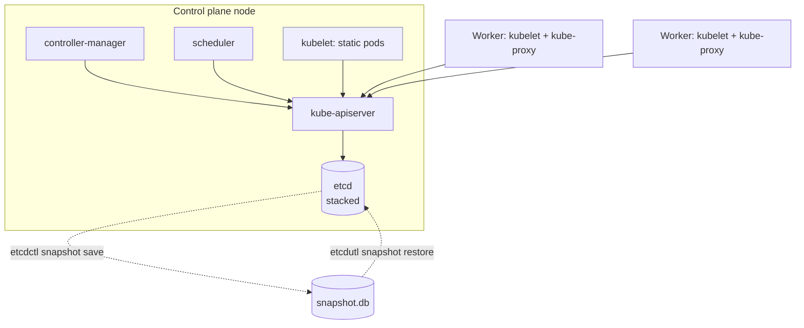

# Kubernetes Cluster Lifecycle Lab

A cluster is a **distributed state machine backed by etcd**; operating it means changing versions and nodes
without losing that state — rehearse it on throwaway VMs, per [`AGENTS.md`](../../../AGENTS.md).
`kubeadm` needs real Linux nodes, so use **free local VMs** (multipass, Vagrant/VirtualBox, or two small
Linux hosts); use kind/k3d only for the kubectl-level drills (drain, PDB).

## When to use

- Preparing for CKA, or owning a self-managed cluster for the first time.
- Before a production upgrade — rehearse the exact sequence somewhere disposable.
- After an outage caused by expired certificates or a lost etcd member.

## First principles

`kubeadm` bootstraps a conforming control plane: it generates a PKI, writes static pod manifests to
`/etc/kubernetes/manifests`, and starts etcd + apiserver + controller-manager + scheduler; the kubelet runs
them. Every durable object lives in **etcd** — restoring etcd restores the cluster; losing it loses everything
that is not in Git (Kubernetes docs, *Bootstrapping clusters with kubeadm*, kubernetes.io).



| Operation | Command spine | Order that matters | Pitfall |
| --- | --- | --- | --- |
| Bootstrap | `kubeadm init --pod-network-cidr=<cidr>` then install a CNI | CNI before workloads schedule | Nodes stay `NotReady` until a CNI is installed |
| Join | `kubeadm join <ep> --token ... --discovery-token-ca-cert-hash sha256:<h>` | Tokens expire (default 24h) | Re-mint with `kubeadm token create --print-join-command` |
| Upgrade control plane | `kubeadm upgrade plan` → `kubeadm upgrade apply v1.X.Y` → upgrade kubelet+kubectl | **One minor version at a time** | Skipping a minor version is unsupported |
| Upgrade other nodes | drain → `kubeadm upgrade node` → kubelet → `uncordon` | Never all nodes at once | Draining without a PDB can take an app to zero |
| etcd backup | `etcdctl snapshot save` with CA/cert/key flags | Before every upgrade | A snapshot you have never restored is a hope, not a backup |
| etcd restore | stop static pods → `etcdutl snapshot restore` → point etcd at the new data dir | Cluster must be quiet | Restoring into a live cluster splits state |
| Certificates | `kubeadm certs check-expiration` → `kubeadm certs renew all` → restart control-plane pods | Yearly, before expiry | Renewal does **not** rotate the kubelet client cert automatically in every path |

**Version skew** (Kubernetes docs, *Version Skew Policy*): `kubelet` may be older than `kube-apiserver` by a
bounded number of minor versions and must never be newer; `kubectl` is supported within one minor version
either side; in HA, apiservers may differ by at most one minor version during the upgrade window. Check the
policy page for the exact numbers of your release rather than trusting memory.

## Procedure

1. **Provision two Linux VMs** (e.g. `multipass launch --name cp --cpus 2 --memory 2G` and `--name w1`),
   install a container runtime and the `kubeadm`/`kubelet`/`kubectl` packages pinned to one minor version.
2. **Bootstrap**: on `cp`, `sudo kubeadm init --pod-network-cidr=192.168.0.0/16`; copy the admin kubeconfig to
   `~/.kube/config`; install a CNI. Verify `kubectl get nodes` → `Ready`, `kubectl -n kube-system get pods`.
3. **Join the worker** with the printed `kubeadm join` command; verify both nodes are `Ready`.
4. **Back up etcd before touching anything**:
   `sudo ETCDCTL_API=3 etcdctl --endpoints=https://127.0.0.1:2379 --cacert=/etc/kubernetes/pki/etcd/ca.crt --cert=/etc/kubernetes/pki/etcd/server.crt --key=/etc/kubernetes/pki/etcd/server.key snapshot save snapshot.db`,
   then `etcdutl snapshot status snapshot.db --write-out=table`.
5. **Restore drill**: create a marker (`kubectl create ns canary-before-restore`), take a snapshot, delete the
   namespace, then restore with `etcdutl snapshot restore snapshot.db --data-dir=/var/lib/etcd-restore`,
   point the etcd static pod's `hostPath` at that directory and let the kubelet restart it.
   **Verification**: the namespace is back.
6. **Drain drill**: `kubectl cordon w1`, then `kubectl drain w1 --ignore-daemonsets --delete-emptydir-data`.
   Add a `PodDisruptionBudget` (`minAvailable: 1`) first and watch the drain block instead of taking the app
   to zero. Finish with `kubectl uncordon w1`.
7. **Upgrade drill (one minor version)**: on `cp` — upgrade the `kubeadm` package,
   `sudo kubeadm upgrade plan`, `sudo kubeadm upgrade apply v1.X.Y`, then drain the node, upgrade `kubelet`
   and `kubectl`, `systemctl restart kubelet`, `uncordon`. On `w1` — drain, upgrade `kubeadm`,
   `sudo kubeadm upgrade node`, upgrade kubelet, restart, uncordon.
8. **Verification step**: `kubectl get nodes -o wide` shows the new version on every node, all
   `kube-system` pods are `Running`, and a test Deployment still serves traffic.
9. **Certificates**: `sudo kubeadm certs check-expiration`; renew with `sudo kubeadm certs renew all` and
   restart the control-plane static pods. Re-run the check and confirm the new dates.
10. **HA topology (read + plan, build if you have a third VM)**: 3 control-plane nodes behind a load balancer,
    stacked etcd (etcd on each control-plane node) or external etcd. Quorum is `(n/2)+1`, so 3 members
    tolerate 1 loss — an even number of members buys nothing.
11. **Clean up**: `multipass delete --purge cp w1` (or destroy the VMs).

## Output shape

```
Cluster lifecycle run — <operation>  | nodes: <cp + n workers>  | version: v1.X.Y -> v1.X+1.Z

Pre-flight:
  etcd snapshot: <path>  status: <hash/size/revision>   restore rehearsed: yes/no
  PDBs present: <list>   drain-safe: yes/no
  certs expiry: <soonest date>
Sequence executed:
  1. kubeadm upgrade plan/apply on control plane
  2. drain -> kubelet upgrade -> uncordon (per node)
Verification:
  kubectl get nodes -o wide -> all v1.X+1.Z, Ready   ✔
  kube-system pods Running                            ✔
  test workload still serving                         ✔
Skew check: kubelet <= apiserver by <n> minor  |  kubectl within 1 minor
Rollback plan: <etcd restore point, previous packages>
```

## Tips

- **A backup is only real once restored** — do the restore drill before you ever need it.
- Upgrade **one minor version at a time**, control plane first, workers after; never the reverse.
- `drain` respects PodDisruptionBudgets — without one, "safe" drains still cause outages; with a badly
  written one, drains hang forever. Both failure modes are worth feeling.
- Certificates issued by `kubeadm` are short-lived by default; put `kubeadm certs check-expiration` on a
  calendar, because an expired apiserver cert looks exactly like a total outage.
- Trade-off: stacked etcd is simpler and cheaper; external etcd isolates failure domains and is easier to
  restore independently.
- Node-level symptoms belong to [k8s-troubleshooting-lab](../k8s-troubleshooting-lab/SKILL.md); cluster access
  control to [k8s-rbac-lab](../k8s-rbac-lab/SKILL.md); redeploying the workloads afterwards to
  [argocd-local-lab](../argocd-local-lab/SKILL.md) and [gitops-coach](../gitops-coach/SKILL.md); the
  availability targets that justify HA to [slo-designer](../slo-designer/SKILL.md).
- End with the **Learning Footer** (`AGENTS.md`) — one drill (restore or upgrade) to repeat unaided.
